GSM Association
Official Document TS.43 - Service Entitlement Configuration
Non-confidential


GSMA™

# Service Entitlement Configuration
## Version 12.0
## 07 February 2025

### Security Classification: Non-confidential
Access to and distribution of this document is restricted to the persons permitted by the security classification. This document is subject to copyright protection. This document is to be used only for the purposes for which it has been supplied and information contained in it must not be disclosed or in any other way made available, in whole or in part, to persons other than those permitted under the security classification without the prior written approval of the Association.

### Copyright Notice
Copyright © 2025 GSM Association

### Disclaimer
The GSMA makes no representation, warranty or undertaking (express or implied) with respect to and does not accept any responsibility for, and hereby disclaims liability for the accuracy or completeness or timeliness of the information contained in this document. The information contained in this document may be subject to change without prior notice.

### Compliance Notice
The information contain herein is in full compliance with the GSMA Antitrust Compliance Policy.

This Permanent Reference Document is classified by GSMA as an Industry Specification, as such it has been developed and is maintained by GSMA in accordance with the provisions set out GSMA AA.35 - Procedures for Industry Specifications.

.


TS.43 v12.0
Page 1 of 248

GSM Association
Non-confidential
Official Document TS.43 - Service Entitlement Configuration


# Table of Contents

**1 Introduction** **8**
1.1 Overview 8
1.2 In Scope 8
1.3 Interactions with Other GSMA Specifications 9
1.3.1 Positioning of VoWiFi, VoLTE and SMSoIP entitlements with respect to TAD and MNO Provisioning 9
1.3.2 Relationship with TS.32, IR.51 and IR.92 VoWiFi/VoLTE/SMSoIP Parameters 10
1.3.3 Controlling Access to Network and PS Data for Entitlement Configuration 12
1.4 Abbreviations 12
1.5 Definitions 14
1.6 References 14
1.7 Conventions 15
**2 Entitlement Configuration Procedures** **16**
2.1 Default Entitlement Configuration Server 16
2.1.1 eSIM metadata containing the Entitlement Configuration Server parameters 16
2.2 HTTP Headers 16
2.2.1 User-Agent HTTP header 16
2.2.2 Accept-Language HTTP header 17
2.3 HTTP GET method Parameters. 17
2.4 HTTP POST Method 20
2.5 Protocol version control 21
2.6 Network Requested Entitlement Configuration 21
2.6.1 SMS-Based Notifications 22
2.6.2 Messaging Infrastructure-Based Notifications 22
2.7 Roaming Conditions 23
2.8 Authentication Mechanism 23
2.8.1 Embedded EAP-AKA Authentication by Entitlement Configuration Server 24
2.8.2 Authentication with OAuth 2.0 / OpenID Connect Procedure 26
2.8.3 Server to Server Authentication using OAuth 2.0 server and JWT. 29
2.8.4 Error processing 31
2.8.5 Fast Authentication and Token Management 33
2.8.6 Token Management for Temporary Tokens 33
2.9 Configuration Document for Entitlements 34
2.9.1 General 34
2.9.2 New Characteristics for XML-Based Document 34
2.9.3 Inclusion in the Complete XML document 35
2.9.4 JSON-Based Configuration Document 36
2.9.5 Result of Notification Registration 37
2.9.6 Additional Details on TOKEN 38
2.10 HTTP Response Codes 38
**3 VoWiFi Entitlement Configuration** **40**
3.1 VoWiFi Entitlement Parameters 40
3.1.1 VoWiFi Entitlement Status 40
3.1.2 VoWiFi Client's Web Views Parameters 40
3.1.3 VoWiFi Address Parameters 41
3.1.4 VoWiFi T&C Status 42
3.1.5 VoWiFi Provisioning Status 43


TS.43 v12.0
Page 2 of 248

GSM Association Non-confidential
Official Document TS.43 - Service Entitlement Configuration


3.1.6 VoWiFi Message for Incompatible Status 43
3.2 Client Behaviour for VoWiFi Entitlement Configuration 44
3.3 Entitlement Modes of VoWiFi Client 44
3.3.1 VoWiFi Entitlement Mode - Cannot be offered. 45
3.3.2 VoWiFi Entitlement Mode - Can be activated. 45
3.3.3 VoWiFi Entitlement Mode - Service Data Missing 45
3.3.4 VoWiFi Entitlement Mode - Service Data Being Updated 45
3.3.5 VoWiFi Entitlement Mode - Service Being Provisioned 45
3.4 VoWiFi Client Considerations around Web View Callbacks 46
3.4.1 entitlementChanged() Callback function 46
3.4.2 dismissFlow() callback function 47
**4 Voice-over-Cellular Entitlement Configuration 49**
4.1 Voice-over-Cellular Entitlement Parameters 49
4.1.1 Voice-over-Cellular Entitlement Parameter Definition 49
4.1.2 Voice-over-Cellular Entitlement Response Example 51
**5 SMSoIP Entitlement Configuration 54**
5.1 SMSoIP Entitlement Parameters 54
5.1.1 SMSoIP Entitlement Status 54
5.2 Client Behaviour to SMSoIP Entitlement Configuration 54
**6 On-Device Service Activation (ODSA) Entitlement and Configuration 56**
6.1 ODSA Architecture and Operations 56
6.2 ODSA Request Parameters 58
6.3 Devices Identifiers used for Request Parameters 63
6.4 Examples of ODSA Requests 66
6.4.1 CheckEligibility Request Example 66
6.4.2 ManageSubscription Request Example 67
6.4.3 ManageService Request Example 67
6.4.4 AcquireConfiguration Request Example 68
6.4.5 AcquirePlan Request Example 68
6.4.6 AcquireTemporaryToken Request Example 69
6.4.7 GetPhoneNumber Request Example 69
6.4.8 VerifyPhoneNumber Request Example 70
6.4.9 GetSubscriberInfo Request Example 71
6.5 ODSA Configuration Parameters 71
6.5.1 General / Always-Present Configuration Parameters 71
6.5.2 CheckEligibility Operation Configuration Parameters 72
6.5.3 ManageSubscription Operation Configuration Parameters 74
6.5.4 ManageService Operation Configuration Parameters 77
6.5.5 AcquireConfiguration Operation Configuration Parameters 78
6.5.6 AcquirePlan Operation Configuration Parameters 83
6.5.7 AcquireTemporaryToken Operation Configuration Parameters 84
6.5.8 GetPhoneNumber Operation Configuration Parameters 85
6.5.9 Client Processing of Parameters Associated with SP Web Portal 86
6.5.10 VerifyPhoneNumber Operation Configuration Parameters 88
6.5.11 GetSubscriberInfo Operation Configuration Parameters 88
6.6 Examples of ODSA Responses 89
6.6.1 CheckEligibility Response Example 89
6.6.2 ManageService Response Example 90
6.6.3 ManageSubscription Response Example 91
6.6.4 AcquireConfiguration Response Example 93
6.6.5 AcquirePlan Response Example 95


TS.43 v12.0 Page 3 of 248

GSM Association
Non-confidential
Official Document TS.43 - Service Entitlement Configuration


<table>
    <tr>
        <td>6.6.6</td>
        <td>AcquireTemporaryToken Response Example</td>
        <td>97</td>
    </tr>
    <tr>
        <td>6.6.7</td>
        <td>GetPhoneNumber Response Example</td>
        <td>97</td>
    </tr>
    <tr>
        <td>6.6.8</td>
        <td>VerifyPhoneNumber Response Example</td>
        <td>97</td>
    </tr>
    <tr>
        <td>6.6.9</td>
        <td>GetSubscriberInfo Response Example</td>
        <td>98</td>
    </tr>
    <tr>
        <td>**6.7**</td>
        <td>**ODSA Application Considerations around Web View Callback**</td>
        <td>**98**</td>
    </tr>
    <tr>
        <td>6.7.1</td>
        <td>profileReadyWithActivationCode(activationCode)</td>
        <td>100</td>
    </tr>
    <tr>
        <td>6.7.2</td>
        <td>profileReadyWithDefaultSmdp(defaultSmdpAddress, iccid)</td>
        <td>100</td>
    </tr>
    <tr>
        <td>6.7.3</td>
        <td>SelectionCompleted(iccid, imei) callback function</td>
        <td>100</td>
    </tr>
    <tr>
        <td>6.7.4</td>
        <td>dismissFlow() callback function</td>
        <td>100</td>
    </tr>
    <tr>
        <td>6.7.5</td>
        <td>finishFlow(next_action(optional))</td>
        <td>102</td>
    </tr>
    <tr>
        <td>6.7.6</td>
        <td>deleteToken()</td>
        <td>102</td>
    </tr>
    <tr>
        <td>6.7.7</td>
        <td>checkProfileServiceStatus()</td>
        <td>102</td>
    </tr>
    <tr>
        <td>6.7.8</td>
        <td>deleteProfileInUse(iccid, msisdn (optional))</td>
        <td>103</td>
    </tr>
    <tr>
        <td>**6.8**</td>
        <td>**Device Information Representation for Subscription Transfer**</td>
        <td>**103**</td>
    </tr>
    <tr>
        <td>**7**</td>
        <td>**Companion ODSA Procedure Call Flows**</td>
        <td>**105**</td>
    </tr>
    <tr>
        <td>7.1</td>
        <td>Subscription Activation via ODSA Portal – Initial Steps</td>
        <td>105</td>
    </tr>
    <tr>
        <td>7.2</td>
        <td>ODSA Portal with Immediate Download Info – Final Steps</td>
        <td>106</td>
    </tr>
    <tr>
        <td>7.3</td>
        <td>ODSA Portal with Delayed Download Info – Final Steps</td>
        <td>108</td>
    </tr>
    <tr>
        <td>7.3.1</td>
        <td>ODSA Portal with Delayed Download Info – Final Steps - Push</td>
        <td>109</td>
    </tr>
    <tr>
        <td>7.3.2</td>
        <td>ODSA Portal with Delayed Download Info – Final Steps - Polling</td>
        <td>111</td>
    </tr>
    <tr>
        <td>7.4</td>
        <td>Subscription Activation without ODSA Portal</td>
        <td>115</td>
    </tr>
    <tr>
        <td>7.5</td>
        <td>Subscription Pre-activation via another Channel</td>
        <td>116</td>
    </tr>
    <tr>
        <td>7.6</td>
        <td>Multiple companion device Management without webview</td>
        <td>117</td>
    </tr>
    <tr>
        <td>7.7</td>
        <td>Early eligibility check with OIDC and web portal</td>
        <td>119</td>
    </tr>
    <tr>
        <td>**8**</td>
        <td>**Primary ODSA Procedure Call Flows**</td>
        <td>**121**</td>
    </tr>
    <tr>
        <td>8.1</td>
        <td>New eSIM Subscription Activation via ODSA Portal</td>
        <td>121</td>
    </tr>
    <tr>
        <td>8.2</td>
        <td>Additional eSIM Subscription Activation via ODSA Portal</td>
        <td>124</td>
    </tr>
    <tr>
        <td>8.3</td>
        <td>Subscription Transfer with OTP – initial steps</td>
        <td>126</td>
    </tr>
    <tr>
        <td>8.4</td>
        <td>Subscription Transfer with OAuth/OpenID – initial steps</td>
        <td>127</td>
    </tr>
    <tr>
        <td>8.5</td>
        <td>Subscription Transfer with OTP or OAuth/OpenID– final steps</td>
        <td>128</td>
    </tr>
    <tr>
        <td>8.6</td>
        <td>Using Websheet in eSIM Transfer</td>
        <td>130</td>
    </tr>
    <tr>
        <td>8.7</td>
        <td>Subscription Transfer with EAP-AKA</td>
        <td>131</td>
    </tr>
    <tr>
        <td>8.8</td>
        <td>Primary ODSA service without ODSA Portal</td>
        <td>133</td>
    </tr>
    <tr>
        <td>8.9</td>
        <td>Subscription Transfer with TemporaryToken</td>
        <td>139</td>
    </tr>
    <tr>
        <td>8.10</td>
        <td>VOID</td>
        <td>145</td>
    </tr>
    <tr>
        <td>8.11</td>
        <td>Subscription Transfer and Deleting Subscription in Old Device</td>
        <td>145</td>
    </tr>
    <tr>
        <td>8.11.1</td>
        <td>Subscription Transfer starting from Old Device without ODSA Portal</td>
        <td>145</td>
    </tr>
    <tr>
        <td>8.11.2</td>
        <td>Subscription Transfer starting from New Device via ODSA Portal</td>
        <td>147</td>
    </tr>
    <tr>
        <td>8.12</td>
        <td>Primary ODSA service requiring user input prior to download on the Default SM-DP+</td>
        <td>150</td>
    </tr>
    <tr>
        <td>8.12.1</td>
        <td>User verification with ODSA portal</td>
        <td>150</td>
    </tr>
    <tr>
        <td>8.12.2</td>
        <td>User verification without an ODSA portal</td>
        <td>154</td>
    </tr>
    <tr>
        <td>8.13</td>
        <td>Active Subscription Recovery</td>
        <td>156</td>
    </tr>
    <tr>
        <td>**9**</td>
        <td>**Data Plan Related Information Entitlement Configuration**</td>
        <td>**163**</td>
    </tr>
    <tr>
        <td>9.1</td>
        <td>Data Plan Related Configuration Parameters</td>
        <td>164</td>
    </tr>
    <tr>
        <td>9.1.1</td>
        <td>Data Plan Information Configuration Parameters</td>
        <td>164</td>
    </tr>
    <tr>
        <td>9.1.2</td>
        <td>Data Boost Information Configuration Parameters</td>
        <td>165</td>
    </tr>
    <tr>
        <td>9.1.3</td>
        <td>Data Usage Information Configuration Parameters</td>
        <td>167</td>
    </tr>
</table>
TS.43 v12.0
Page 4 of 248

GSM Association
Non-confidential
Official Document TS.43 - Service Entitlement Configuration


9.1.4 5G SA Information Configuration Parameters 168
9.2 Data Plan Related Information Response Example 169
9.3 Data Plan Related Information Call Flow 173
9.4 Data Boost real-time request 174
9.5 Data Boost Web View Parameters 174
9.6 Data Boost Web View JavaScript Callbacks 176
9.6.1 notifyPurchaseSuccessful(duration) 176
9.6.2 notifyPurchaseFailed(code, reason) 176
9.6.3 dismissFlow() 176
9.7 Data Boost Real-time Request Parameters 177
9.8 Data Boost Real-time Request Example 177
9.9 Data Boost Real-Time Response Parameters 177
9.10 Data Boost Real-time Response Example 178
9.11 Data Boost Real-time Request Call Flow with webview 179
# 10 Server-initiated ODSA Procedure Call Flows 181
10.1 Initial considerations 181
10.2 Subscription Activation initiated by the server. 182
10.2.1 Subscription Activation for Delayed Activations 185
# 11 Direct Carrier Billing Entitlement Configuration 186
11.1 DCB Entitlement Parameters 186
11.1.1 DCB Entitlement Status 187
11.1.2 DCB T&C Status 187
11.1.3 DCB Service Parameters 188
11.1.4 DCB Message for Incompatible Status 190
11.2 Client Behavior for DCB Entitlement Configuration 191
11.3 Entitlement Modes of DCB Client 191
11.3.1 DCB Entitlement Mode – Cannot purchase. 192
11.3.2 DCB Entitlement Mode – Service Being Provisioned 192
11.3.3 DCB Entitlement Mode – Service Data Missing 192
11.3.4 DCB Entitlement Mode – Can purchase. 192
11.4 DCB Flows 193
11.4.1 DCB Entitlement Request and Notifications 193
11.4.2 DCB Entitlement Request with user Interaction 193
11.5 DCB Request/Responses examples 196
11.5.1 Initial Requests 196
11.5.2 Initial Responses 196
11.6 DCB Client Considerations around Web View Callbacks 201
11.6.1 entitlementChanged() Callback function 201
11.6.2 dismissFlow() Callback function 201
# 12 Private User Identity 202
12.1 Private UserID entitlement parameters 202
12.1.1 Private UserID Entitlement Status 202
12.1.2 Private UserID Data 203
12.2 Private UserID Flows 204
12.3 Private UserID Request/Responses examples 206
12.3.1 Initial Requests 206
12.3.2 Initial Responses 207
12.4 Private UserID - Special considerations 208


TS.43 v12.0 Page 5 of 248

GSM Association
Non-confidential
Official Document TS.43 - Service Entitlement Configuration


# 13 Device and User Information 210
## 13.1 Phone Number Information 210
### 13.1.1 Phone Number Information from device 210
### 13.1.2 Phone Number Information through Application Server 211
## 13.2 Phone Number Verification 212
## 13.3 Subscriber Information 213
### 13.3.1 Subscriber Information through Application Server 214
# 14 Device App authentication 216
## 14.1 Operator Token use case 216
### 14.1.1 Device App authentication Request Parameters 216
### 14.1.2 AcquireOperatorToken Operation Configuration Parameters 217
### 14.1.3 AcquireOperatorToken Request Example 218
### 14.1.4 AcquireOperatorToken Response Example 219
### 14.1.5 Device App authentication with OperatorToken call flow. 219
### 14.1.6 Operator Token Consumption 221
### 14.1.7 Phone Number Verification 225
## 14.2 App token use case 226
### 14.2.1 App Token consumption 227
### 14.2.2 Discovering 3rd party application information callflow 228
# 15 SatMode Entitlement and Provisioning 230
## 15.1 SatMode Entitlement Parameters 230
### 15.1.1 SatMode Entitlement Status 230
### 15.1.2 SatMode Entitlement Request Example 230
### 15.1.3 SatMode Entitlement Response Example 231
### 15.1.4 SatMode Activation Web Views Parameters 232
### 15.1.5 SatMode Message for Incompatible Status 233
## 15.2 SatMode Config Parameters 233
### 15.2.1 SatMode Config Request example 234
### 15.2.2 SatModeConfig Response Example 235
## 15.3 SatMode Config retrieval frequency 236
## 15.4 SatMode Client Considerations around Web View Callbacks 236
### 15.4.1 entitlementChanged() Callback function 237
### 15.4.2 dismissFlow() callback function 238
# Annex A Feature mapping 240
## A.1 Feature and procedure lists 240
## A.2 VoWiFi feature 241
## A.3 Voice over Cellular feature 241
## A.4 SMSoIP feature 241
## A.5 Companion ODSA feature 242
## A.6 Primary ODSA feature 243
## A.7 Data Plan and Data Boost Information feature 244
## A.8 Server Initiated ODSA feature 244
## A.9 Direct Carrier Billing Entitlement feature 245
## A.10 Private User Identity feature 245
## A.11 User and Device Information feature 245
## A.12 Device App authentication features 246
## A.13 SatMode Entitlement feature 246
# Annex B Document Management 247


TS.43 v12.0
Page 6 of 248

GSM Association  Non-confidential
Official Document TS.43 - Service Entitlement Configuration


<table>
  <tbody>
    <tr>
        <td>B.1</td>
        <td>Document History</td>
        <td>247</td>
    </tr>
    <tr>
        <td>B.2</td>
        <td>Other Information</td>
        <td>248</td>
    </tr>
  </tbody>
</table>


TS.43 v12.0  Page 7 of 248

GSM Association Non-confidential
Official Document TS.43 - Service Entitlement Configuration


# 1 Introduction

## 1.1 Overview

This document describes the procedure for configuration of a device-based service performed during the entitlement verification step of the service or during the activation of that service.

The device services covered in this document are Voice-over-Wi-Fi (VoWiFi), Voice-over-Cellular (4G VoLTE and 5G VoNR), SMS over IP (SMSoIP) and On-Device Service Activation (ODSA) of Companion devices (associated with a requesting device) and Primary devices.

The specification leverages the protocol and document presentation described in GSMA PRD RCC.14 [5]. In this context, the term “entitlement” refers to the applicability, availability, and status of that service (or feature) on a device.

The entitlement configuration is exchanged between a VoWiFi, Voice-over-Cellular, SMSoIP, Companion ODSA or Primary ODSA client on a device and a Service Provider’s Entitlement Configuration Server. It is independent from the service configuration procedure between clients and the Service Provider’s configuration server described in GSMA PRD RCC.14 [5].

Entitlement configuration defines a mechanism for a Service Provider to inform mobile devices of the status of IP Multimedia Subsystem (IMS) network services like VoWiFi, Voice-over-Cellular and SMSoIP.

In the ODSA context it defines the interaction between an ODSA client, a client application on a device that entitles and activates a companion or primary device’s subscription, and the Service Provider.

This procedure leverages the subscription profile of the end-user, identified by the SIM card, and the network’s readiness in supporting the service. The entitlement client can then dynamically activate (or deactivate) the service according to the activation (respectively deactivation) status retrieved from the Service Provider’s Entitlement Configuration Server.

When required by the service, entitlement configuration also covers on-device service activation flow, for example to display a web page describing the service or to get end-user consent on the service’s Terms and Conditions.

Service configuration in this document deals with the configuration parameters controlling the entitlement of a service. Those parameters come in addition to the ones defined in GSMA PRD IR.51 [2] and GSMA PRD IR.92 [3] that relate to the internal settings and configuration of IMS services. IMS service configuration as defined in GSMA PRD IR.51 [2] and GSMA PRD IR.92 [3] are out of scope.

## 1.2 In Scope

This document covers both the device and network aspects of the entitlement configuration for VoWiFi, Voice-over-Cellular and SMSoIP services as well as for On-Device Service Activation (ODSA) of Companion and Primary devices. Service-specific aspects need to be


TS.43 v12.0 Page 8 of 248

GSM Association
Non-confidential
Official Document TS.43 - Service Entitlement Configuration


described in documents relating to those services as in GSMA PRDs IR.51 [2] and IR.92 [3] for IMS services.

The entitlement configuration can be obtained via either cellular or Wi-Fi data connectivity. In case Wi-Fi data connection is used, this document assumes that a Wi-Fi bearer is available to the device and the requirements of that Wi-Fi bearer conform to GSMA PRD TS.22 [7]. Configuration and provisioning of the Wi-Fi bearer is described in GSMA PRD TS.22 [7] Section 3.

### 1.3 Interactions with Other GSMA Specifications
Entitlement configuration is an optional mechanism between applications/services on devices (like VoWiFi and Voice-over-Cellular) and the SP’s core network that occurs during service activation. The procedure requires both end-user’s subscription data and network readiness information from the SP.

To support that exchange, an entitlement configuration server leverages the GSMA PRD RCC.14 [5] protocol to carry the required entitlement data between devices’ applications and the network. The entitlement configuration procedure is separate from the service configuration procedure specified in GSMA PRD RCC.14 [5]. A device or application shall not query for both entitlement and service configurations in the same request.

The result of entitlement configuration for a service offers the assurance that the end-user’s associated subscription and the core network’s readiness have been verified, allowing the service to be offered to the end-user.

Note: in the following sub-sections of 1.3, Voice-over-Cellular (VoLTE Only) is used to compare with other GSMA specifications.

#### 1.3.1 Positioning of VoWiFi, VoLTE and SMSoIP entitlements with respect to TAD and MNO Provisioning
The positioning of VoWiFi, VoLTE and SMSoIP entitlement configuration with respect to existing GSMA device configuration procedures (GSMA PRD TS.32 [8], GSMA PRD IR.51 [2] and GSMA PRD IR.92 [3]) is presented in Figure 1. It shows the typical timeline and triggers that would induce the procedures (note that the horizontal axis represents Time).


TS.43 v12.0
Page 9 of 248

GSM Association Non-confidential
Official Document TS.43 - Service Entitlement Configuration


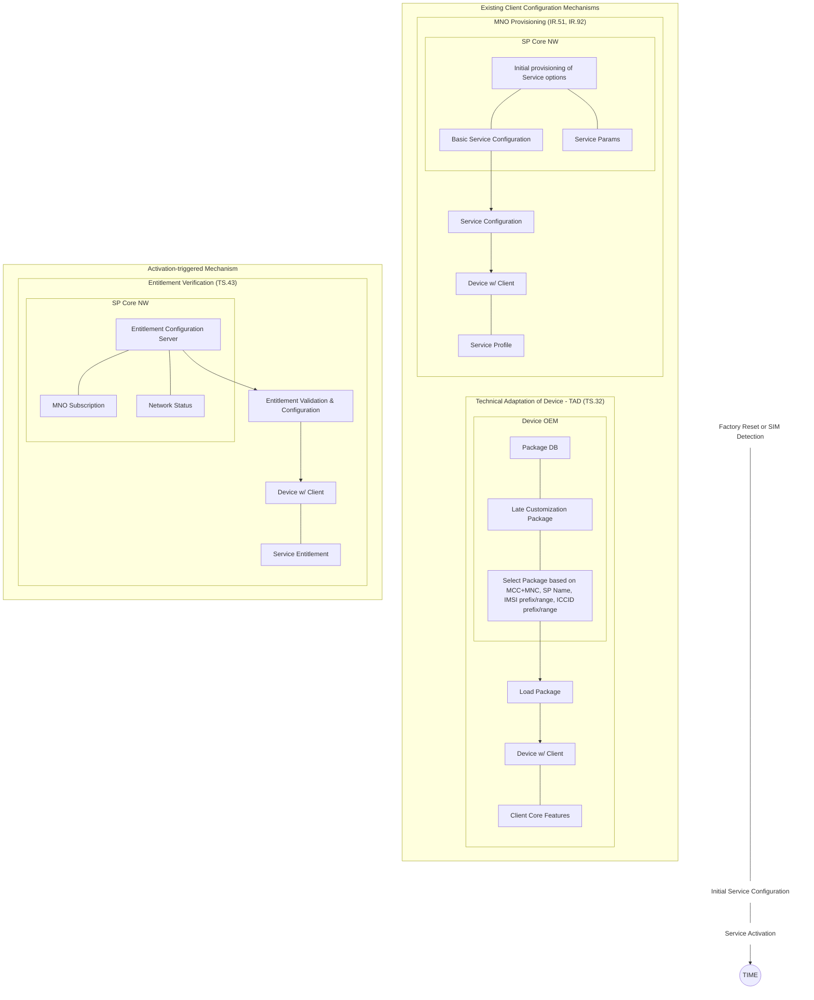

Figure 1. TS.43 VoWiFi, VoLTE and SMSoIP entitlement procedure with respect to TS.32, IR.51 and IR.92

The GSMA PRD TS.32 [8] procedure of Technical Adaptation of Device (TAD) is implemented by device OEMs on an MNO-wide basis (or a range of IMSI) due to the device’s factory reset or SIM detection. General IMS, VoLTE and VoWiFi parameter values are set without taking into account end-user subscription or network related information.

The MNO provisioning procedure of GSMA PRD IR.51 [2] and IR.92 [3] also offers the possibility of setting general IMS, VoLTE and VoWiFi parameters on the device during initial service configuration. However, it is not associated with user-triggered service activation or the verification of the services’ entitlement / applicability.

The entitlement-level configuration for VoLTE and VoWiFi specified in the GSMA PRD TS.43 takes place after or outside the aforementioned GSMA’s device and service configuration procedures. It is also triggered by events not associated with GSMA PRD TS.32 [8], GSMA PRD IR.51 [2] and GSMA PRD IR.92 [3]:

*   when the service needs to verify its entitlement status (during service initiation),
*   when the end-user wishes to activate the service (via the service’s settings menu)

### 1.3.2 Relationship with TS.32, IR.51 and IR.92 VoWiFi/VoLTE/SMSoIP Parameters

The VoWiFi, VoLTE and SMSoIP configuration parameters of this PRD complement the ones from GSMA PRD TS.32 [8], GSMA PRD IR.51 [2] and GSMA PRD IR.92 [3].

While those specifications define general-purpose VoWiFi, VoLTE and SMSoIP parameters to enable or disable those services on the device, the GSMA PRD TS.43 defines parameters that relate to service initiation and end-user activation (capture of Terms & Conditions, capture of physical address).


TS.43 v12.0 Page 10 of 248

GSM Association Non-confidential
Official Document TS.43 - Service Entitlement Configuration


The parameters in this PRD are also based on end-user subscription's data and on the network readiness for those services.

In case the VoWiFi, VoLTE or SMSoIP service has not been allowed and activated on the device due to a Technical Adaptation of Device (TAD) or MNO provisioning procedure, the client performing the entitlement configuration should be disabled.

> The VoLTE, SMSoIP and VoWiFi configuration parameters defined in each specification are presented in Table 1.

Table 1. VoLTE, SMSoIP and VoWiFi Configuration Parameters in GSMA Specifications

<table>
  <thead>
    <tr>
        <th>GSMA PRD</th>
        <th></th>
        <th>VoLTE Status Parameters</th>
        <th></th>
        <th>SMSoIP Status Parameters</th>
        <th></th>
        <th>VoWiFi Status Parameters</th>
        <th></th>
    </tr>
  </thead>
  <tbody>
    <tr>
        <td>GSMA PRD TS.32[8]</td>
        <td>* **VxLTE 1.27**<br/>Voice/Video over LTE allowed when roaming.<br/>* **VxLTE 1.28**<br/>Voice/Video over LTE allowed</td>
        <td>* **VxLTE 1.07**<br/>SMSoIP Networks Indications (not used or preferred)</td>
        <td>* **VoWiFi 3.01**<br/>Voice and Video / Voice enabled over Wi-Fi</td>
        <td colspan="4"></td>
    </tr>
    <tr>
        <td>GSMA PRD IR.92 [3]</td>
        <td>As a Media_type_restriction_policy<br/>* Voice and/or Video over LTE allowed.<br/>* Voice and/or Video over LTE allowed while roaming</td>
        <td>SMSoIP_usage_policy (When to use SMSoIP)</td>
        <td>N/A</td>
        <td colspan="4"></td>
    </tr>
    <tr>
        <td>GSMA PRD IR.51[2]</td>
        <td>N/A</td>
        <td>N/A</td>
        <td>As a Media_type_restriction_policy<br/>* Voice and/or Video over Wi-Fi enabled</td>
        <td colspan="4"></td>
    </tr>
    <tr>
        <td>TS.43 (this document)</td>
        <td>* VoLTE entitlement status</td>
        <td>* SMSoIP entitlement status</td>
        <td>* VoWiFi entitlement status<br/>* VoWiFi T&amp;Cs capture status<br/>* VoWiFi address capture status<br/>* VoWiFi provisioning status</td>
        <td colspan="4"></td>
    </tr>
  </tbody>
</table>

<center>Table 1. VoLTE, SMSoIP and VoWiFi Configuration Parameters in GSMA Specifications</center>

Note: That the configuration parameter VxLTE 1.21 - IMS Enabled (Yes/No) from TS.32 [8] and "IMS Status" from IR.92 [3] is not impacted by the GSMA PRD TS.43. The overall IMS function on the device can still be controlled by this parameter.


TS.43 v12.0 Page 11 of 248

GSM Association
Non-confidential
Official Document TS.43 - Service Entitlement Configuration


### 1.3.3 Controlling Access to Network and PS Data for Entitlement Configuration

GSMA PRD IR.92 [3] defines parameters to allow device and client services to be exempt of the 3GPP PS Data Off feature. When one such parameter, **Device_management_over_PS**, is set, it indicates that device management over PS is a 3GPP PS data off exempt service.

GSMA PRD TS.43 extends the **Device_management_over_PS** parameter to include Entitlement Configuration as a type of "device management" service that can be exempt of 3GPP PS Data Off.

The home operator can also configure a policy on the Entitlement Client around the access type used during entitlement configuration. This is done with the `AccessForEntitlement` parameter with values listed in Table 2.

<table>
  <thead>
    <tr>
        <th>0</th>
        <th>any access type</th>
    </tr>
  </thead>
  <tbody>
    <tr>
        <td>AccessForEntitlement Value</td>
        <td>Description</td>
    </tr>
    <tr>
        <td>1</td>
        <td>3GPP accesses only</td>
    </tr>
    <tr>
        <td>2</td>
        <td>WLAN/Wi-Fi only</td>
    </tr>
    <tr>
        <td>3</td>
        <td>3GPP accesses preferred, WLAN/Wi-Fi as secondary</td>
    </tr>
    <tr>
        <td>4</td>
        <td>WLAN/Wi-Fi preferred, 3GPP accesses as secondary</td>
    </tr>
    <tr>
        <td>5-255</td>
        <td>not assigned</td>
    </tr>
  </tbody>
</table>
<center>Table 2. AccessForEntitlement Parameter</center>

A "not assigned" value is interpreted as "any access type" value.

When not preconfigured by the home operator with the `AccessForEntitlement` parameter, the Entitlement Client shall perform entitlement configuration requests over Wi-Fi if available. When there is no Wi-Fi connectivity, the Entitlement Client shall perform requests over cellular if it is not forbidden (i.e. PS data off and not exempt).

### 1.4 Abbreviations

<table>
  <thead>
    <tr>
        <th>APNS</th>
        <th>Apple Push Notification Service</th>
    </tr>
  </thead>
  <tbody>
    <tr>
        <td>Abbreviation</td>
        <td>Definition</td>
    </tr>
    <tr>
        <td>CP AC</td>
        <td>Client Provisioning Application Characteristic</td>
    </tr>
    <tr>
        <td>DNS</td>
        <td>Domain Name Server</td>
    </tr>
    <tr>
        <td>EAP-AKA</td>
        <td>Extensible Authentication Protocol for 3rd Generation Authentication and Key Agreement</td>
    </tr>
    <tr>
        <td>EID</td>
        <td>eUICC Identifier</td>
    </tr>
    <tr>
        <td>eUICC</td>
        <td>Embedded Universal Integrated Circuit Card</td>
    </tr>
    <tr>
        <td>FCM</td>
        <td>Firebase Cloud Messaging</td>
    </tr>
    <tr>
        <td>FQDN</td>
        <td>Fully Qualified Domain Name</td>
    </tr>
    <tr>
        <td>GCM</td>
        <td>Google Cloud Messaging</td>
    </tr>
    <tr>
        <td>GID1</td>
        <td>Group Identifier 1 as defined in TS 31.102</td>
    </tr>
  </tbody>
</table>


TS.43 v12.0
Page 12 of 248

GSM Association Non-confidential
Official Document TS.43 - Service Entitlement Configuration


<table>
  <thead>
    <tr>
        <th>Abbreviation</th>
        <th></th>
        <th>Definition</th>
        <th></th>
    </tr>
  </thead>
  <tbody>
    <tr>
        <td>GID2</td>
        <td>Group Identifier 2 as defined in TS 31.102</td>
        <td colspan="2"></td>
    </tr>
    <tr>
        <td>HTTP</td>
        <td>Hyper-Text Transfer Protocol</td>
        <td colspan="2"></td>
    </tr>
    <tr>
        <td>HTTPS</td>
        <td>Hyper-Text Transfer Protocol Secure</td>
        <td colspan="2"></td>
    </tr>
    <tr>
        <td>ICCID</td>
        <td>Integrated Circuit Card Identifier</td>
        <td colspan="2"></td>
    </tr>
    <tr>
        <td>IMEI</td>
        <td>International Mobile Equipment Identity</td>
        <td colspan="2"></td>
    </tr>
    <tr>
        <td>IMS</td>
        <td>IP Multimedia Subsystem</td>
        <td colspan="2"></td>
    </tr>
    <tr>
        <td>IMSI</td>
        <td>International Mobile Subscriber Identity</td>
        <td colspan="2"></td>
    </tr>
    <tr>
        <td>JSON</td>
        <td>JavaScript Object Notation</td>
        <td colspan="2"></td>
    </tr>
    <tr>
        <td>JWT</td>
        <td>JSON Web Token</td>
        <td colspan="2"></td>
    </tr>
    <tr>
        <td>LPA</td>
        <td>Local Profile Assistant</td>
        <td colspan="2"></td>
    </tr>
    <tr>
        <td>LTE</td>
        <td>Long-Term Evolution</td>
        <td colspan="2"></td>
    </tr>
    <tr>
        <td>MCC</td>
        <td>Mobile Country Code (As defined in E.212)</td>
        <td colspan="2"></td>
    </tr>
    <tr>
        <td>MDM</td>
        <td>Mobile Device Management</td>
        <td colspan="2"></td>
    </tr>
    <tr>
        <td>MNC</td>
        <td>Mobile Network Code (As defined in E.212)</td>
        <td colspan="2"></td>
    </tr>
    <tr>
        <td>MO</td>
        <td>Management Object</td>
        <td colspan="2"></td>
    </tr>
    <tr>
        <td>MSISDN</td>
        <td>Mobile Subscriber Integrated Services Digital Network Number</td>
        <td colspan="2"></td>
    </tr>
    <tr>
        <td>ODSA</td>
        <td>On-Device Service Activation</td>
        <td colspan="2"></td>
    </tr>
    <tr>
        <td>OIDC</td>
        <td>OpenID Connect</td>
        <td colspan="2"></td>
    </tr>
    <tr>
        <td>OMNA</td>
        <td>Open Mobile Naming Authority, registry available at:<br/>http://www.openmobilealliance.org</td>
        <td colspan="2"></td>
    </tr>
    <tr>
        <td>OTP</td>
        <td>One-Time Password</td>
        <td colspan="2"></td>
    </tr>
    <tr>
        <td>PRD</td>
        <td>Permanent Reference Document</td>
        <td colspan="2"></td>
    </tr>
    <tr>
        <td>RCS</td>
        <td>Rich Communication Services</td>
        <td colspan="2"></td>
    </tr>
    <tr>
        <td>SIM</td>
        <td>Subscriber Identity Module</td>
        <td colspan="2"></td>
    </tr>
    <tr>
        <td>SMS</td>
        <td>Short Message Service</td>
        <td colspan="2"></td>
    </tr>
    <tr>
        <td>SMSoIP</td>
        <td>SMS Over IP</td>
        <td colspan="2"></td>
    </tr>
    <tr>
        <td>SP</td>
        <td>Service Provider</td>
        <td colspan="2"></td>
    </tr>
    <tr>
        <td>TAD</td>
        <td>Technical Adaptation of Devices</td>
        <td colspan="2"></td>
    </tr>
    <tr>
        <td>TLS</td>
        <td>Transport Layer Security</td>
        <td colspan="2"></td>
    </tr>
    <tr>
        <td>T&amp;C</td>
        <td>Terms &amp; Conditions</td>
        <td colspan="2"></td>
    </tr>
    <tr>
        <td>UDH</td>
        <td>User Data Header</td>
        <td colspan="2"></td>
    </tr>
    <tr>
        <td>URL</td>
        <td>Uniform Resource Locator</td>
        <td colspan="2"></td>
    </tr>
    <tr>
        <td>VoWiFi</td>
        <td>Voice-over-WiFi</td>
        <td colspan="2"></td>
    </tr>
    <tr>
        <td>VoLTE</td>
        <td>Voice-over-LTE</td>
        <td colspan="2"></td>
    </tr>
    <tr>
        <td>VoNR</td>
        <td>Voice-over-New-Radio</td>
        <td colspan="2"></td>
    </tr>
    <tr>
        <td>WNS</td>
        <td>Windows Push Notification Service</td>
        <td colspan="2"></td>
    </tr>
    <tr>
        <td>XML</td>
        <td>Extensible Markup Language</td>
        <td colspan="2"></td>
    </tr>
  </tbody>
</table>


TS.43 v12.0 Page 13 of 248

GSM Association Non-confidential
Official Document TS.43 - Service Entitlement Configuration


<table>
  <thead>
    <tr>
        <th>Abbreviation</th>
        <th></th>
        <th>Definition</th>
        <th></th>
    </tr>
  </thead>
  <tbody>
    <tr>
        <td>XSD</td>
        <td>Extensible Markup Language Schema Definition</td>
        <td colspan="2"></td>
    </tr>
  </tbody>
</table>

## 1.5 Definitions

<table>
  <thead>
    <tr>
        <th>Definition</th>
        <th></th>
        <th>Meaning</th>
        <th></th>
    </tr>
  </thead>
  <tbody>
    <tr>
        <td>Client</td>
        <td>Component/module on a device that provides the Voice-over-Cellular or VoWiFi service. A client verifies with the network’s Entitlement Configuration Server if it is entitled or not to offer that service to end-users.</td>
        <td colspan="2"></td>
    </tr>
    <tr>
        <td>Entitlement</td>
        <td>The applicability, availability, and status of a service, needed by the client before offering that service to end-users.</td>
        <td colspan="2"></td>
    </tr>
    <tr>
        <td>Entitlement Configuration</td>
        <td>Information returned to the client by the network, providing entitlement information on a service.</td>
        <td colspan="2"></td>
    </tr>
    <tr>
        <td>Entitlement Configuration Server</td>
        <td>The network element that provides entitlement configuration for different services to clients.</td>
        <td colspan="2"></td>
    </tr>
  </tbody>
</table>

## 1.6 References

<table>
  <thead>
    <tr>
        <th>Ref</th>
        <th></th>
        <th>Document Number</th>
        <th></th>
        <th>Title</th>
        <th></th>
    </tr>
  </thead>
  <tbody>
    <tr>
        <td>[1]</td>
        <td>OMA-APPIDREG</td>
        <td>OMA Registry of Application Identifiers (AppID)<br/>http://www.openmobilealliance.org/wp/OMNA/dm/dm_ac_registry.html</td>
        <td colspan="3"></td>
    </tr>
    <tr>
        <td>[2]</td>
        <td>IR.51</td>
        <td>GSMA PRD IR.51 - “IMS Profile for Voice, Video and SMS over untrusted Wi-Fi access” Version 5.0, 23 May 2017. http://www.gsma.com</td>
        <td colspan="3"></td>
    </tr>
    <tr>
        <td>[3]</td>
        <td>IR.92</td>
        <td>GSMA PRD IR.92 - “IMS Profile for Voice and SMS” Version 15.0, 14 May 2020. http://www.gsma.com</td>
        <td colspan="3"></td>
    </tr>
    <tr>
        <td>[4]</td>
        <td>NG.102</td>
        <td>GSMA PRD NG.102 - “IMS Profile for Converged IP Communications” Version 6.0, 13 April 2019. http://www.gsma.com</td>
        <td colspan="3"></td>
    </tr>
    <tr>
        <td>[5]</td>
        <td>RCC.14</td>
        <td>GSMA PRD RCC.14 “Service Provider Device Configuration”, Version 10.0, 04 June 2024. http://www.gsma.com</td>
        <td colspan="3"></td>
    </tr>
    <tr>
        <td>[6]</td>
        <td>RFC2119</td>
        <td>“Key words for use in RFCs to Indicate Requirement Levels”, S. Bradner, March 1997. http://www.ietf.org/rfc/rfc2119.txt</td>
        <td colspan="3"></td>
    </tr>
    <tr>
        <td>[7]</td>
        <td>TS.22</td>
        <td>Recommendations for Minimum Wi-Fi Capabilities of Terminals, Version 6.0, 14 December 2018. http://www.gsma.com</td>
        <td colspan="3"></td>
    </tr>
    <tr>
        <td>[8]</td>
        <td>TS.32</td>
        <td>Technical Adaptation of Devices through Late Customisation, Version 7.0, 20 April 2020. http://www.gsma.com</td>
        <td colspan="3"></td>
    </tr>
    <tr>
        <td>[9]</td>
        <td>E.212</td>
        <td>Mobile network codes (MNC) for the international Identification plan for public networks and subscriptions (according to recommendation ITU-T E.212 (05/2008))</td>
        <td colspan="3"></td>
    </tr>
    <tr>
        <td>[10]</td>
        <td>SGP.21</td>
        <td>Remote SIM Provisioning Architecture. http://www.gsma.com</td>
        <td colspan="3"></td>
    </tr>
    <tr>
        <td>[11]</td>
        <td>SGP.22</td>
        <td>Remote SIM Provisioning Technical Specification. http://www.gsma.com</td>
        <td colspan="3"></td>
    </tr>
    <tr>
        <td>[12]</td>
        <td>RFC2616</td>
        <td>Hypertext Transfer Protocol HTTP/1.1 IETF RFC, http://tools.ietf.org/html/rfc2616</td>
        <td colspan="3"></td>
    </tr>
  </tbody>
</table>


TS.43 v12.0 Page 14 of 248

GSM Association Non-confidential
Official Document TS.43 - Service Entitlement Configuration


<table>
  <tbody>
    <tr>
        <td>[13]</td>
        <td>RCC.07</td>
        <td>GSMA PRD RCC.07 “Rich Communication Suite - Advanced Communications<br/>Services and Client Specification”, Version 11.0, 16 October 2019.<br/>http://www.gsma.com</td>
    </tr>
    <tr>
        <td>[14]</td>
        <td>OpenID Connect</td>
        <td>OpenID Connect Core; OpenID Foundation<br/>http://openid.net/connect/</td>
    </tr>
    <tr>
        <td>[15]</td>
        <td>RFC6749</td>
        <td>The OAuth 2.0 Authorization Framework. https://tools.ietf.org/html/rfc6749</td>
    </tr>
    <tr>
        <td>[16]</td>
        <td>RFC7521</td>
        <td>Assertion Framework for OAuth 2.0 Client Authentication and Authorization Grants. https://tools.ietf.org/html/rfc7521</td>
    </tr>
    <tr>
        <td>[17]</td>
        <td>RFC7523</td>
        <td>JSON Web Token (JWT) Profile for OAuth 2.0 Client Authentication and Authorization Grants. https://tools.ietf.org/html/rfc7523</td>
    </tr>
    <tr>
        <td>[18]</td>
        <td>RFC4187</td>
        <td>Extensible Authentication Protocol Method for 3rd Generation Authentication and Key Agreement (EAP-AKA).<br/>https://tools.ietf.org/html/rfc4187</td>
    </tr>
    <tr>
        <td>[19]</td>
        <td>3GPP TS 23.503</td>
        <td>Policy and Charging Control Framework for the 5G System.<br/>http://www.3gpp.org</td>
    </tr>
    <tr>
        <td>[20]</td>
        <td>3GPP TS 24.526</td>
        <td>User Equipment (UE) policies for 5G System (5GS)<br/>http://www.3gpp.org</td>
    </tr>
    <tr>
        <td>[21]</td>
        <td>3GPP TS 31.102</td>
        <td>Characteristics of the USIM Application<br/>http://www.3gpp.org</td>
    </tr>
    <tr>
        <td>[22]</td>
        <td>RFC3986</td>
        <td>Uniform Resource Identifier (URI): Generic Syntax.<br/>https://tools.ietf.org/html/rfc3986</td>
    </tr>
    <tr>
        <td>[23]</td>
        <td>ISO/IEC 18004:2015</td>
        <td>Information technology -- Automatic identification and data capture techniques -- QR Code bar code symbology specification</td>
    </tr>
    <tr>
        <td>[24]</td>
        <td>IEEE 1003.1-2017</td>
        <td>IEEE Standard for Information Technology--Portable Operating System Interface (POSIX(R)) Base Specifications, Issue 7</td>
    </tr>
  </tbody>
</table>

## 1.7 Conventions

“The key words “must”, “must not”, “required”, “shall”, “shall not”, “should”, “should not”, “recommended”, “may”, and “optional” in this document are to be interpreted as described in [6].”

Any parameter defined as **String** type along this document must be considered as **case insensitive** for any comparation operation.


TS.43 v12.0 Page 15 of 248

GSM Association
Official Document TS.43 - Service Entitlement Configuration
Non-confidential


# 2 Entitlement Configuration Procedures

## 2.1 Default Entitlement Configuration Server
The client may follow a discovery procedure to obtain the address of the entitlement configuration server. The resulting FQDN may be based on the following format:

* aes.mnc\<MNC\>.mcc\<MCC\>.pub.3gppnetwork.org

Whereby \<MNC\> (Mobile Network Code) and \<MCC\> (Mobile Country Code) shall be replaced by the respective values of the home network in decimal format and with a 2-digit MNC padded out to 3 digits by inserting a 0 at the beginning.

The details of the discovery procedure and resulting address are part of the agreements between carriers and Entitlement Client providers and are out of scope of this specification.

### 2.1.1 eSIM metadata containing the Entitlement Configuration Server parameters
The eSIM profile metadata may contain a `VendorSpecificExtension` in `serviceSpecificDataStoredInEuicc` defined in SGP.22 [11]. The structure of this object is defined as follows:

```
vendorOid gsmaTs43Oid OBJECT IDENTIFIER

ServiceProviderTs43Config ::= SEQUENCE{ -- Tag 'xxxx'
serviceProviderTs43Capabilities [x] ServiceProviderTs43Capabilities, - Tag 'xxxx'
}
ServiceProviderTs43Capabilities ::= SEQUENCE of SEQUENCE{ -- Tag 'xxxx'
           entitlementServerFqdn [x] UTF8String (SIZE(0..64)), -- Tag 'xxxx'
}
```

The `ServiceTs43ProviderCapabilities` object will contain the following:

<table>
  <thead>
    <tr>
        <th>SGP.22 Object Name</th>
        <th>Type</th>
        <th>Description</th>
    </tr>
  </thead>
  <tbody>
    <tr>
        <td>entitlementServerFqdn</td>
        <td>UTF8String</td>
        <td>The FQDN of the ECS the client application can send requests to.</td>
    </tr>
  </tbody>
</table>
*Table 3. Objects contained in the ServiceTs43ProviderCapabilities*

The client application may use this information in order to configure its ECS parameters associated with the eSIM profile.

## 2.2 HTTP Headers

### 2.2.1 User-Agent HTTP header
The client shall include the `User-Agent` header in all HTTP requests. The `User-Agent` header should be compiled as defined in RCC.07 [13] section C.4.1 "User-Agent and Server Header Extensions" including the following amendment:

```
product-list =/ enabler *(LWS enabler)
                          [LWS terminal]
                          [LWS client]
```


TS.43 v12.0
Page 16 of 248

GSM Association
Non-confidential
Official Document TS.43 - Service Entitlement Configuration


`[LWS OS]`

The rule “enabler” is defined in RCC.07 [13] and extended as:

```
enabler =/ GSMA-PRD-TS43 ; GSMA PRD reference
GSMA-PRD-TS43 = "PRD-TS43"
```

The rule “client” is defined in RCC.07 [13] and extended as:

```
client =/ "client-" client-ts43 SLASH client-ts43-version
client-ts43 = "IMS-Entitlement" / "Companion-ODSA" / "Primary-ODSA" / "Server-ODSA"
client-ts43-version = alphanum *15(alphanum / "." / "-");version identifying the
client,
```

The rules “terminal” and “OS” are those defined in RCC.07 [13] section C.4.1

\- Examples:

`User-Agent: PRD-TS43 term-Vendor1/Model1-XXXX client-IMS-Entitlement/1.0 OS-Android/8.0`

`User-Agent: PRD-TS43 term-Vendor1/Model1-XXXX client-Companion-ODSA/1.55B.devkey-20 OS-Android/10.0`

`User-Agent: PRD-TS43 term-Vendor1/Model1-XXXX client-Primary-ODSA/dev20200812 OS-Other/0.4`

Where `XXXX` is a 20 characters max string identifying the model.

### 2.2.2 Accept-Language HTTP header
The client application and ECS shall support Accept-Language for local language support as defined in RCC.14 [5]. This is to make certain that any user readable messages sent to the client can be localized to the language set in the header.

### 2.3 HTTP GET method Parameters.
A client supporting service entitlement configuration shall indicate the support by inclusion of an "app" HTTP GET request parameter as defined in RCC.14 [5] with the proper identifiers for the targeted entitlement.

The Open Mobile Naming Authority (OMNA) maintains a registry of values for Application Characteristic Identifier (AppID) and the range ap2001-ap5999 is used for externally defined Application entities. The following AppIDs<sup>1</sup> are used for VoWiFi, Voice-over-Cellular, SMSoIP and Direct Carrier Billing entitlement applications, and for the ODSA for Companions, Primaries and Server to Server applications:

*   Voice-over-Cellular Entitlement - AppID of “ap2003”
*   VoWiFi Entitlement - AppID of “ap2004”
*   SMSoIP Entitlement – AppID of “ap2005”
*   ODSA for Companion device, Entitlement and Activation – AppID of “ap2006”
*   ODSA for Primary device, Entitlement and Activation – AppID of “ap2009"

***

<sup>1</sup> AppIDs are obtained from OMA by contacting mailto:helpdesk@omaorg.org and supplying the information requested here https://www.openmobilealliance.org/wp/OMNA/dm/dm_ac_registry.html


TS.43 v12.0
Page 17 of 248

GSM Association Non-confidential
Official Document TS.43 - Service Entitlement Configuration


* Data Plan Related Information Entitlement Configuration - AppID of "ap2010"
* ODSA for Server Initiated Requests, Entitlement and Activation – AppID of "ap2011"
* Direct Carrier Billing – AppID of "ap2012"
* Private User Identity – AppID of "ap2013"
* Device and User Information – AppID of "ap2014"
* App authentication – AppID of "ap2015"
* SatMode Entitlement – AppID of "ap2016"

The parameters from RCC.14 [5] ("IMSI", "token", "vers", "app", "GID1", "GID2", "terminal_vendor", "terminal_model", "terminal_sw_version") are used for entitlement configuration requests but some have been specifically redefined in Table 4 in order to remove the length limits imposed in that spec. In addition, new parameters are introduced specific for entitlement purposes, as described in Table 4.

<table>
  <thead>
    <tr>
        <th>HTTP GET parameter</th>
        <th></th>
        <th>Type</th>
        <th></th>
        <th>Description</th>
        <th></th>
        <th>Usage</th>
        <th></th>
    </tr>
  </thead>
  <tbody>
    <tr>
        <td>terminal_id</td>
        <td>String</td>
        <td>This value shall be a unique and persistent identifier of the device. This identifier may be an IMEI (preferred) or a UUID.</td>
        <td>Required.</td>
        <td colspan="4"></td>
    </tr>
    <tr>
        <td>requestor_id</td>
        <td>String</td>
        <td>This value shall be a unique and persistent identifier of the system interacting with ECS. If the requestor_id is present in the request, the terminal_id will become optional.</td>
        <td>Required in those scenarios where the system triggering the request acts on behalf of the primary device. Examples of these systems are MDM or Application Server.</td>
        <td colspan="4"></td>
    </tr>
    <tr>
        <td>entitlement_version</td>
        <td>String</td>
        <td>GSMA PRD version implemented by the client. Set to this current version, or earlier one (see section 2.5). entitlement_version parameter will map with any existing document history version (without 'V' if there were any). This version number is expected to be defined as the following ABNF rule:<br/>1*DIGIT.1*DIGIT. Some valid entitlement versions are: 6.0 ; 6.1 ; 10.0 or 11.10</td>
        <td>Required.</td>
        <td colspan="4"></td>
    </tr>
    <tr>
        <td>app_name</td>
        <td>String</td>
        <td>The name of the device application making the request.</td>
        <td>Optional.<br/>(see section 2.8.5 for recommended values)</td>
        <td colspan="4"></td>
    </tr>
    <tr>
        <td>app_version</td>
        <td>String</td>
        <td>The version of the device application making the request.</td>
        <td>Optional.</td>
        <td colspan="4"></td>
    </tr>
  </tbody>
</table>


TS.43 v12.0 Page 18 of 248

GSM Association
Non-confidential
Official Document TS.43 - Service Entitlement Configuration


<table>
  <thead>
    <tr>
        <th>HTTP GET parameter</th>
        <th></th>
        <th>Type</th>
        <th></th>
        <th>Description</th>
        <th></th>
        <th>Usage</th>
        <th></th>
    </tr>
  </thead>
  <tbody>
    <tr>
        <td>notif_token</td>
        <td>String</td>
        <td>The registration token to be used when notifications are transmitted to the device over a cloud-based messaging infrastructure (refer to 2.6).</td>
        <td>Optional, required each time the device obtains or disables a registration token from the notification service.<br/>Sent at the same time as “notif_action” parameter.</td>
        <td colspan="4"></td>
    </tr>
    <tr>
        <td>notif_action</td>
        <td>Integer</td>
        <td>The action associated with the registration token “notif_token” parameter.<br/>Possible values are:<br/>* 0 - disable notification token<br/>* 1 - enable GCM notification token<br/>* 2 - enable FCM notification token<br/>* 3 - enable WNS push notification<br/>* 4 - enable APNS notification token</td>
        <td>Optional, required if the “notif_token” parameter is present.</td>
        <td colspan="4"></td>
    </tr>
    <tr>
        <td>temporary_token</td>
        <td>String</td>
        <td>A token to be use instead of the TOKEN if available to the client application.</td>
        <td>Conditional to the client application not having TOKEN to authenticate with the ECS.</td>
        <td colspan="4"></td>
    </tr>
    <tr>
        <td>operator_token</td>
        <td>String</td>
        <td>A token to be use instead of the TOKEN if available to the client application.</td>
        <td>Conditional to the client application not having TOKEN to authenticate with the ECS.</td>
        <td colspan="4"></td>
    </tr>
    <tr>
        <td>terminal_vendor</td>
        <td>String</td>
        <td>This field identifies the terminal OEM.</td>
        <td>Required.</td>
        <td colspan="4"></td>
    </tr>
    <tr>
        <td>terminal_model</td>
        <td>String</td>
        <td>This field identifies the terminal model.</td>
        <td>Required.</td>
        <td colspan="4"></td>
    </tr>
    <tr>
        <td>terminal_sw_version</td>
        <td>String</td>
        <td>This field identifies the terminal software version.</td>
        <td>Required.</td>
        <td colspan="4"></td>
    </tr>
  </tbody>
</table>

Table 4. GET Parameters for Entitlement Configuration Request

Entitlement use cases can also define its own set of request parameters. Refer to 6.2 for the parameters associated with the Companion and Primary ODSA use cases.

Table 5 presents a sample HTTP GET request for VoWiFi entitlement with the parameters located in the HTTP query string.


TS.43 v12.0
Page 19 of 248

GSM Association
Non-confidential
Official Document TS.43 - Service Entitlement Configuration


```http
GET ? terminal_id = 013787006099944&
token = es7w1erXjh%2FEC%2FP8BV44SBmVipg&
terminal_vendor = TVENDOR&
terminal_model = TMODEL&
terminal_sw_version = TSWVERS&
entitlement_version = ENTVERS&
app = ap2004&
GID1 = 123D&
vers = 1 HTTP/1.1

Host: entitlement.telco.net:9014
User-Agent: PRD-TS43 TVENDOR/TMODEL IMS-Entitlement/TSWVERS OS-Android/8.0
Accept: text/html,application/xhtml+xml,application/xml;q=0.9,*/*;q=0.8
Accept-Language: en-US,en;q=0.5
Accept-Encoding: gzip, deflate
Connection: keep-alive
```

*Table 5. Example of an HTTP GET Entitlement Configuration Request*

## 2.4 HTTP POST Method

In addition to the HTTP GET, the HTTP POST method can be used by the client for entitlement configuration request. In this case, the parameters are located in the HTTP message body and should follow the JSON object value format. The same parameters defined in section 2.3 are used for the POST request.

If a client supports the POST method, it shall use it instead of the GET method for entitlement configuration requests. The Entitlement Configuration Server should be able to process both GET and POST methods. In case the server does not support POST, it shall return an HTTP response with 405 "Method Not Allowed". In that case, the client should resend the request using the GET method.

The message body of the HTTP POST request follows the content type of "`application/json`" and is provided as a JSON object value (it is not encoded). The resulting HTTP response can be encoded as described in 2.9.1.

Table 6 presents a sample HTTP POST request for VoWiFi entitlement with the parameters located in the HTTP message body.


TS.43 v12.0
Page 20 of 248

GSM Association
Non-confidential
Official Document TS.43 - Service Entitlement Configuration


```http
POST / HTTP/1.1
Host: entitlement.telco.net:9014
User-Agent: PRD-TS43 TVENDOR/TMODEL IMS-Entitlement/TSWVERS OS-Android/8.0Accept:
text/html,application/xhtml+xml,application/xml;q=0.9,*/*;q=0.8
Accept-Language: en-US,en;q=0.5
Accept-Encoding: gzip, deflate
Connection: keep-alive
Content-Type: application/json

{
        "terminal_id" : "013787006099944",
        "entitlement_version" : "ENTVERS",
        "token" : "es7w1erXjh%2FEC%2FP8BV44SBmVipg",
        "terminal_vendor" : "TVENDOR",
        "terminal_model" : "TMODEL",
        "terminal_sw_version" : "TSWVERS",
        "app" : "ap2004",
        "vers" : "1"
}
```

*Table 6. Example of an HTTP POST Entitlement Configuration Request*

As described in reference [5] app parameter could be multi-valued. Unlike how this multi-valued parameter is sent when using GET method (and string concatenating app=appID with '&' character), in case of POST method, `AppID` values will be sent as an array of strings.

Example: `"app" : ["ap2003", "ap2004", "ap2005"]`.

In case of a single AppID value, a single string value (instead of an array with a single string) will be expected.

Example: `"app" : "ap2003"`

### 2.5 Protocol version control

As clients and servers may support different versions of the same protocol, a control phase is required. The main rules for this check are:

*   The client indicates the supported protocol version in the parameter `"entitlement_version"`.
*   The server shall answer accordingly to the request if it supports the version indicated in the parameter, or it shall return a 406 "Not Acceptable" response when it does not, including a Reason-Phrase set to "protocol not supported".

### 2.6 Network Requested Entitlement Configuration

Two mechanisms are available to operators to trigger an entitlement configuration request from a device application, either:

*   by sending a Short Message Service (SMS) message to the target device, or
*   by sending a notification message to the device over a cloud-based messaging infrastructure (APNS, FCM, GCM or WNS)

When an application is notified in this manner, it shall generate the proper Service Entitlement request to the entitlement configuration server:


TS.43 v12.0 Page 21 of 248

GSM Association Non-confidential
Official Document TS.43 - Service Entitlement Configuration


*   For applications `“ap2003”`, `“ap2004”`, `“ap2005”`, `“ap2010”` and `“ap2016”` (Voice-over-Cellular, VoWiFi or SMSoIP entitlement, DataPlan, SatMode entitlement) a GET or POST HTTP request for the corresponding `app` is generated.
*   For applications `“ap2006”` or `"ap2009"` (ODSA for Companion or Primary device), a GET or POST HTTP request for the corresponding `app` and the `operation` of `AcquireConfiguration` is generated.

### 2.6.1 SMS-Based Notifications

To notify the target device of a change in the entitlement configuration, the entitlement configuration server can use the same method described in Chapter 3 of RCC.14 [5] and generate a Short Message Service (SMS) message towards the target device via application-port addressed SMS with a User Data Header (UDH).

The User Data Header (UDH) contains the following Information Elements:

*   **UDH length:** 6 (six octets)
*   **Information-Element-Identifier** (IEI): x05, message is using "application port addressing scheme, 16-bit address”.
*   **Destination application port:** by default, set to 8095 or 0x1F9F
*   **Source application port:** set to 0

The content of the message is different from RCC.14 [5], in order to differentiate a network-triggered notification coming from a configuration server and one coming from an entitlement configuration server:

*   Instead of the SMS user-data set to: `user-id “-rcscfg” [ “,” param ]`
*   The following is used: `user-id “-aescfg” [ “,” param ]`

The `“parm”` parameter contains the application(s) notified with this SMS. An example of the SMS content is:

`214011001388741-aescfg,ap2003`

This message would trigger (or wake up) the Voice-over-Cellular application on the device to create and send a request (HTTP GET with service parameters) to the Entitlement Configuration Server. If several applications are targeted, they would appear as a comma-separated list, for example:

`214011001388741-aescfg,ap2003,ap2004,ap2005`

### 2.6.2 Messaging Infrastructure-Based Notifications

A notification message can also be sent by the Entitlement Configuration Server to the device over a cloud-based messaging infrastructure that devices registered with in order to receive network-initiated messages. The device’s application is reached and identified via the `notif_token` present in the original GET request received by the entitlement configuration server.

The details of the cloud-based messaging technology, including the contained values in the payload, are implementation dependent and not covered in this specification. The payload of


TS.43 v12.0 Page 22 of 248

GSM Association
Non-confidential
Official Document TS.43 - Service Entitlement Configuration


the notification message is a JSON object value that should contain a "**data**" element with at least two key-value pairs:

*   "**app**": the application targeted for re-configuration, with value of either "`ap2003`", "`ap2004`","`ap2005`" or "`ap2006`".
    If multiple applications are targeted, the value is a JSON array of strings.
*   "**timestamp**": the time of the notification, in ISO 8601 format, of the form `YYYY-MM-DDThh:mm:ssTZD`, where `TZD` is time zone designator (Z or `+hh:mm` or `-hh:mm`).
*   An example of the notification payload for Voice-over-Cellular follows:

    ```json
    "data":
    {
      "app": "ap2003",
      "timestamp": "2019-01-29T13:15:31-08:00"
    }
    ```

*   An example of the notification payload for multiple applications follows:

    ```json
    "data":
    {
      "app": ["ap2003", "ap2004", "ap2005"],
      "timestamp": "2019-01-29T13:15:31-08:00"
    }
    ```

## 2.7 Roaming Conditions

The fact that the device is roaming does not impact the ability of a client to request an entitlement configuration. The client can send the HTTP-based entitlement configuration request over an available data connection, either Wi-Fi or a cellular data APN. Refer to NG.102 [4] for the configuration and usage of those connections as related to operator traffic.

The device can therefore be in a roaming situation when requesting for an entitlement configuration on Voice-over-Cellular and/or VoWiFi.

## 2.8 Authentication Mechanism

The different authentication procedures described in of RCC.14 [5] shall be followed during the entitlement configuration exchange.

Entitlement configuration is usually triggered by the device or client and the user is not aware of an entitlement configuration process taking place. It is then preferable for the entitlement configuration server to rely on authentication mechanisms like "User Authentication via HTTP Embedded EAP-AKA" which does not involve user interactions.

In case access to the device's SIM data is not possible (which would prevent authentication based on EAP-AKA) or the client encounters a failure at the ECS, authentication following the OpenID or OAuth 2.0 procedure is the preferred alternative.

Both authentication methods are detailed in the following two sections.


TS.43 v12.0 Page 23 of 248

GSM Association
Non-confidential
Official Document TS.43 - Service Entitlement Configuration


### 2.8.1 Embedded EAP-AKA Authentication by Entitlement Configuration Server

The Embedded EAP-AKA procedure of RCC.14 [5] involves a separate authentication server included in the flow as part of an HTTP Redirect response (as per OpenID Connect). In case an operator does not carry such OpenID Connect authentication server with EAP relay capabilities and its entitlement configuration server supports the EAP relay function, it is possible for the server to omit the HTTP Redirect and exchange the EAP payloads directly with the client.

This flow is shown in Figure 2. Note that the EAP payload specification along with the GET and POST headers and parameters defined in RCC.14 [5] for the HTTP Embedded EAP-AKA procedure of RCC.14 [5] are kept. The only difference is the omission of the HTTP 302 Found responses (HTTP redirects).

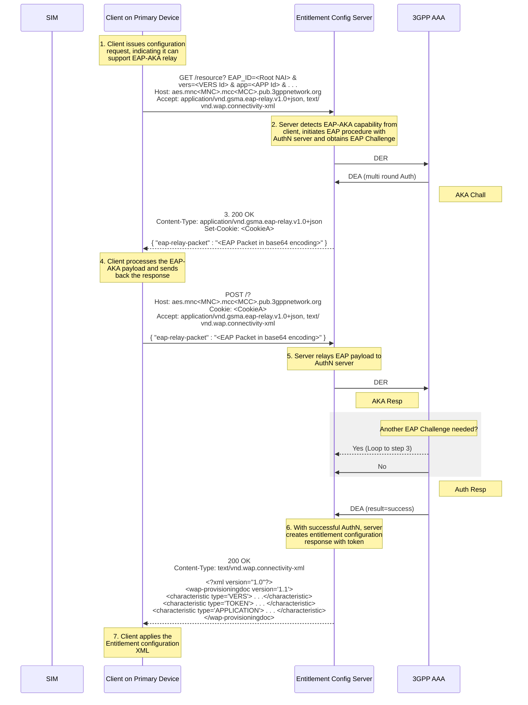

**Figure 2. Embedded EAP-AKA Authentication Flow with Entitlement Configuration Server Supporting EAP Relay Function**


TS.43 v12.0 Page 24 of 248

GSM Association Non-confidential
Official Document TS.43 - Service Entitlement Configuration


If the Entitlement Configuration Server is handling the EAP-AKA relay to an operator’s Authentication server (a 3GPP AAA for example), Table 7 shows the mapping between the response codes from the 3GPP AAA and the corresponding HTTP GET response. The response code is coming from AVP « Result-Code » or AVP « Experimental-Result » sent by the 3GPP AAA in the Diameter EAP Response (DER).

<table>
  <thead>
    <tr>
        <th>DER Result Code</th>
        <th></th>
        <th>HTTP GET Response</th>
        <th></th>
        <th>Reason</th>
        <th></th>
    </tr>
  </thead>
  <tbody>
    <tr>
        <td>1001</td>
        <td>200 OK</td>
        <td>Waiting for AKA challenge response from device</td>
        <td colspan="3"></td>
    </tr>
    <tr>
        <td>2001</td>
        <td>200 OK</td>
        <td>Successfully authenticated by AAA</td>
        <td colspan="3"></td>
    </tr>
    <tr>
        <td>3001-3010, 5002, 5004-5017<br/><br/>Connection failure to 3GPP AAA</td>
        <td>**If ECS and the application supports alternate forms of authentication, and the client did not include a TOKEN in the original request:**<br/>511 Network Authentication Required<br/><br/>**Otherwise:**<br/>503 Retry After / Service Unavailable</td>
        <td>Connectivity, protocol errors and miscellaneous AAA errors, which could be transient, can be resolved by retrying (503) or by indicating to the client that an alternate form of authentication is available (511).</td>
        <td colspan="3"></td>
    </tr>
    <tr>
        <td>4001, 5001, 5003</td>
        <td>**403 Forbidden**</td>
        <td>As the Identity is unknown to the AAA ( 4001 DIAMETER_AUTHENTICATION_REJECTED, 5001 DIAMETER_ERROR_USER_UNKNOWN, and 5003 DIAMETER_ERROR_IDENTITY_NOT_REGISTERED) the failure is permanent and requires some action on either the device (to change identities) or on AAA to populate said identities.</td>
        <td colspan="3"></td>
    </tr>
  </tbody>
</table>
<center>Table 7. Mapping Between 3GPP AAA’s DER Result Code and HTTP Response Code</center>

The way the Entitlement Configuration Server manages the calls to the AAA is out of scope of this document. It is possible for the client on the device to perform a request with EAP_ID parameter as shown in Figure 2 along with a valid token parameter. In this case, the Entitlement Configuration Server may either:

*   perform a full EAP AKA authorization based upon the EAP_ID parameter only.
*   check the token validity and avoid requesting the AAA.


TS.43 v12.0 Page 25 of 248

GSM Association
Non-confidential
Official Document TS.43 - Service Entitlement Configuration


### 2.8.2 Authentication with OAuth 2.0 / OpenID Connect Procedure

The OpenID Connect (OIDC) authentication method is available for clients that cannot access the AKA function of the SIM on the device and the Service Provider decides not to use other Authentication methods like SMS-OTP. The end-user must instead go through an authentication procedure managed by the Service Provider’s OAuth 2.0 / OIDC authentication server. The invocation of OIDC-based authentication by the entitlement configuration server follows the procedure defined in section 2.8 of RCC.14 [5].

Figure 3 presents an overview of the steps for the OIDC-based authentication procedure, shown here for informational purposes.

*   After deciding that OIDC procedure is needed (lack of `token` or invalid `token`, no `EAP_ID` in GET request, other authentication methods such as EAP-AKA not supported), the entitlement configuration server redirects (with 302 Found) the GET request from the device’s client to the Service Provider’s OIDC authentication endpoint.
*   The OIDC authentication endpoint can offer different types of authenticators, some of which involve actual user actions.
*   When the end-user is authenticated, the entitlement configuration server will receive an OAuth 2.0 “auth code” from the authentication server (via the client or user agent on the device, again using a 302 Found).
*   The entitlement configuration server requests for both an access token and an ID Token from the Service Provider’s OIDC Token endpoint.
*   After validating the OAuth 2.0 access token and the OpenID token, the entitlement configuration server can identify the end-user subscription and resumes processing of the original GET resource request.


TS.43 v12.0
Page 26 of 248

GSM Association
Non-confidential
Official Document TS.43 - Service Entitlement Configuration


```mermaid
sequenceDiagram
    participant Client as Client on Primary Device
    participant Server as Entitlement Config Server
    participant OIDC as Service Provider OAuth 2.0 / OIDC Server

    Note over Client: 1. Client makes a GET request w/o token and EAP_ID
    Client->>Server: GET ?<br/>terminal_id=&lt;TERMID&gt; &<br/>app=&lt;APP Id&gt; & &lt;app parameters&gt;<br/>Host: aes.mnc&lt;MNC&gt;.mcc&lt;MCC&gt;.pub.3gppnetwork.org
    
    Note over Server: 2. Server recognizes client requires OIDC AuthN and redirects GET to OIDC server
    Server-->>Client: 302 Found<br/>Location: &lt;OIDC_URL&gt;/authorize?<br/>response_type=code&<br/>scope=openid&<br/>client_id=&lt;CLIENT_ID&gt;&<br/>redirect_uri=&lt;AES_URL&gt;&<br/>state=&lt;STATE_VAL&gt;&<br/>nonce=&lt;NONCE_VAL&gt;

    Note over Client: 3. Client redirects GET to OIDC Server
    Client->>OIDC: GET /authorize?<br/>response_type=code&<br/>scope=openid&<br/>client_id=&lt;CLIENT_ID&gt;&<br/>redirect_uri=&lt;AES_URL&gt;&<br/>state=&lt;STATE_VAL&gt;&<br/>nonce=&lt;NONCE_VAL&gt;

    Note over OIDC: 4. OIDC server goes through an AuthN with the user, may ask for MSISDN
    Note right of OIDC: User goes through AuthN Procedure
    
    Note over OIDC: 6. Generate OIDC Auth Code back to requester
    OIDC-->>Client: 302 Found<br/>Location: &lt;AES_URL&gt;?<br/>code=&lt;OIDC_AUTH_CODE&gt;&<br/>state=&lt;STATE_VAL&gt;

    Note over Client: 7. Client redirects GET back to server, now with OIDC Auth Code
    Client->>Server: GET ?<br/>code=&lt;OIDC_AUTH_CODE&gt;&<br/>state=&lt;STATE_VAL&gt;

    Note over Server: 8. Server requests for the OIDC access token using auth code
    Server->>OIDC: POST /token<br/>grant_type=authorization_code&<br/>code=&lt;OIDC_AUTH_CODE&gt;&<br/>redirect_uri=&lt;AES_URI&gt;

    Note over OIDC: 9. Generate access and ID Tokens back to client
    OIDC-->>Server: 200 OK<br/>{ "access_token":"&lt;ACC_TOKEN&gt;",<br/>"token_type": "Bearer",<br/>"id_token":"&lt;ID_TOKEN&gt;" }

    Note over Server: 10. Server extracts sub id from ID Token, obtains service data and generates Token
    Server-->>Client: 200 OK<br/>Content-Type: text/vnd.wap.connectivity-xml<br/><br/>&lt;?xml version="1.0"?&gt;<br/>&lt;wap-provisioningdoc version="1.1"&gt;<br/>&lt;characteristic type="VERS"&gt; . . .<br/>&lt;characteristic type="TOKEN"&gt; . . .<br/>&lt;characteristic type="APPLICATION"&gt; . . .<br/>&lt;/wap-provisioningdoc&gt;
```

Figure 3. OAuth 2.0 / OpenID Authentication Flow with Entitlement Configuration Server

### 2.8.2.1 Authentication with OAuth 2.0/OpenID Connect and SMS-OTP as second authentication factor.

This extension of the authentication described in the previous section 2.8.2 describes a way to use SMS-OTP to provide a second authentication factor. This may be useful when a single factor OIDC authentication does not provide enough guarantees (e.g.: a login/password does not assure that the associated mobile device is the one performing the TS43 requests). In this example, it is assumed the client expects an xml format. The SMS-OTP method described in this section is an example and may be replaced with any other method as long as it brings enough guarantees.


TS.43 v12.0 Page 27 of 248

GSM Association
Non-confidential
Official Document TS.43 - Service Entitlement Configuration


```mermaid
sequenceDiagram
    participant Client as Client on Primary Device
    participant ECS as Entitlement Config Server
    participant OIDC as Service Provider OAuth 2.0 / OIDC Server

    Note over Client: 1. Client makes a GET request w/o token and EAP_ID
    Client->>ECS: GET? terminal_id=<TERMID> & app=<APP Id> & <app parameters><br/>Host: aes.mnc<MNC>.mcc<MCC>.pub.3gppnetwork.org
    
    Note over ECS: 2. Server recognizes client requires OIDC AuthN and redirects GET to OIDC server
    ECS-->>Client: 302 Found<br/>Location: <OIDC_URL>/authorize?<br/>response_type=code&<br/>scope=openid&<br/>client_id=<CLIENT_ID>&<br/>redirect_uri=<AES_URL>&<br/>state=<STATE_VAL>&<br/>nonce=<NONCE_VAL>

    Note over Client: 3. Client redirects GET to OIDC Server
    Client->>OIDC: GET /authorize?<br/>response_type=code&<br/>scope=openid&<br/>client_id=<CLIENT_ID>&<br/>redirect_uri=<AES_URL>&<br/>state=<STATE_VAL>&<br/>nonce=<NONCE_VAL>
    
    Note right of OIDC: 4. OIDC server goes through an AuthN with the user, may ask for MSISDN
    Note right of OIDC: 5. User goes through AuthN Procedure
    
    Note over OIDC: 6. Generate OIDC Auth Code back to requester
    OIDC-->>Client: 302 Found<br/>Location: <AES_URL>?code=<OIDC_AUTH_CODE>&state=<STATE_VAL>

    Note over Client: 7. Client redirects GET back to server, now with OIDC Auth Code
    Client->>ECS: GET? code=<OIDC_AUTH_CODE>&state=<STATE_VAL>

    Note over ECS: 8. Server requests for the OIDC access token using auth code
    ECS->>OIDC: POST /token<br/>grant_type=authorization_code&<br/>code=<OIDC_AUTH_CODE>&<br/>redirect_uri=<AES_URI>
    
    Note over OIDC: 9. Generate access and ID Tokens back to client
    OIDC-->>ECS: 200 OK<br/>{"access_token":"<ACC_TOKEN>", "token_type": "Bearer", "id_token":"<ID_TOKEN>"}

    Note over ECS: 10. Server extracts sub id from ID Token, obtains service data and generates a Token. This later is held until 2FA is validated
    ECS-->>Client: 302 Found<br/>Location: <OTP_URL>?Other_params

    Note over Client: 11. Client redirects GET back to SMS OTP server
    Client->>OIDC: GET? Other_params
    
    Note right of OIDC: 12. Returns a form, send a SMS to the MSISDN acquired during OIDC process and checks submit code
    OIDC-->>Client: SMS OTP server sends a code by SMS to be submitted by the user in a form
    OIDC-->>Client: 302 Found<br/>Location: <AES_URL>?Other_params

    Note over Client: 13. Client follows redirect with some params asserting 2FA is validated
    Client->>ECS: GET? Other_Params

    Note over ECS: 14. Server is notified 2FA is validated and release the Token in xml document
    ECS-->>Client: 200 OK<br/>Content-Type: text/vnd.wap.connectivity-xml<br/><br/>&lt;?xml version="1.0"?&gt;<br/>&lt;wap-provisioningdoc version="1.1"&gt;<br/>  &lt;characteristic type="VERS"&gt;...<br/>  &lt;characteristic type="TOKEN"&gt;...<br/>  &lt;characteristic type="APPLICATION"&gt;...<br/>&lt;/wap-provisioningdoc&gt;
```

Figure 4. – OAuth 2.0 / OpenID Authentication Flow and SMS-OTP with Entitlement Configuration Server


TS.43 v12.0
Page 28 of 248

GSM Association Non-confidential
Official Document TS.43 - Service Entitlement Configuration


Steps 1 to 9 are identical to section 2.8.2. Next steps are:

10. The ECS returns another HTTP 302 redirection towards the SMS-OTP server.
11. The client redirects GET back to the SMS-OTP server which generates a code and returns a form. The exchanges between the client and OTP endpoint are not described in this example. The objective is to exchange a code to check the user has the mobile from which the OIDC authentication is performed.
12. Once second authentication factor is checked, the SMS-OTP server returns a 302 redirection towards the ECS to resume the sequence in section 2.8.2.
13. The client follows the redirection with some params allowing the ECS to return the Token. The final step 14 is identical to step 10 of the previous section 2.8.2.

In this example, it is important to note that in the client perspective, the steps 7 & 13 look very similar as the input is a 302 redirect towards the ECS (though with different parameters), but the outcome is very different (webview vs xml document).

### 2.8.3 Server to Server Authentication using OAuth 2.0 server and JWT.
The server-to-server authentication using OAuth2.0 is available for server applications (client) that needs to access a service without any user interaction.

The authentication flow described in this section follows the architecture described in Figure 5 where (as defined in reference [15] – *1.1 Roles*) the different roles are (between brackets how it is mapped to the systems involved in this TS.43 spec):

*   **Resource Owner** [*server managing devices – aka MDM –*]. An entity capable of granting access to a protected resource. In the scope of this
*   **Client** [*server ODSA App*]. An application making protected resource requests on behalf of the resource owner and with its authorization.
*   **Resource Server** [*ODSA Device GW – Entitlement Configuration Server*]. The server hosting the protected resources, capable of accepting and responding to protected resource requests using access tokens.
*   **Authorization server** [*Service Provider’s OAuth2.0 server*]. The server issuing access tokens to the client after successfully authenticating the resource owner and obtaining authorization.


TS.43 v12.0 Page 29 of 248

GSM Association
Non-confidential
Official Document TS.43 - Service Entitlement Configuration


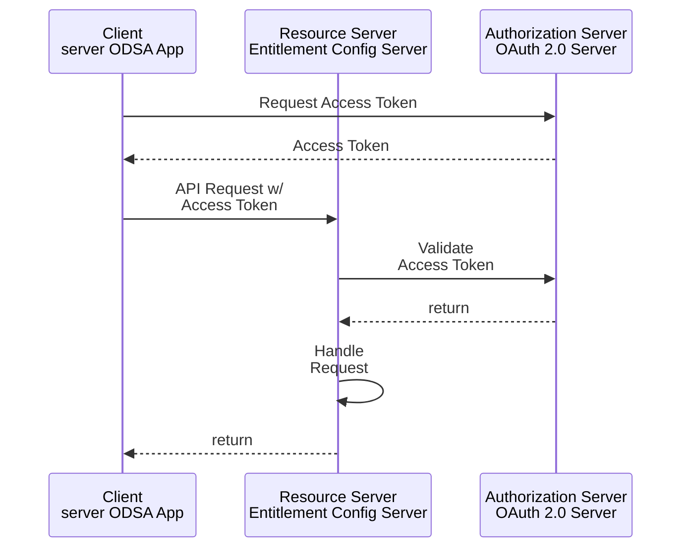

<center>Figure 5. Client Authentication Flow (server to server AuthN using OAuth2.0)</center>

Previously to send and Access Token Request, it is necessary that the Client gets `client_id` and `client_secret` from the Authorization Server. The process to obtain these two parameters are not covered in this specification.

Client applications have an attribute named `client_type` (see reference [15] – *2.1 Client Types*) and when this `client_type` is confidential (as it is in our case) the client authentication is required to get the access token.

Among the different method to perform the Client Authentication, the one using JSON Web Token (JWT) is the selected one for this specification (see reference [17] for additional info). This method does not require the `client_secret` to be sent in the request at all but it is used to sign the JWT.

In the context of client authentication, the JWT is called client assertion. The access token request requires (as defined in reference [16] - *4.2 Using Assertions for Client Authentication*) `client_assertion_type` (the value is the following fixed string, `urn:ietf:params:oauth:client-assertion-type:jwt-bearer`) and `client_assertion` (the JWT containing the information for client authentication).

The JWT (as defined in reference [17] - *3 JWT Format and Processing Requirements*) payload must contain (at least):

*   **iss** (issuer). It contains a unique identifier for the entity that issued the JWT. It should be the `client_id`.
*   **sub** (subject). It identifies the principal that is the subject of the JWT. It should be the `client_id`.
*   **aud** (audience). It contains a value that identifies the authorization server as an intended audience. It should be the URL of the authorization server.
*   **exp** (expiration time). It indicates the time window during which the JWT can be used.


TS.43 v12.0
Page 30 of 248

GSM Association
Non-confidential
Official Document TS.43 - Service Entitlement Configuration


Figure 6 presents an overview of the steps for the Client authentication (server to server) procedure to get the access token. The validation of this access token is described in each process where this authentication takes place.

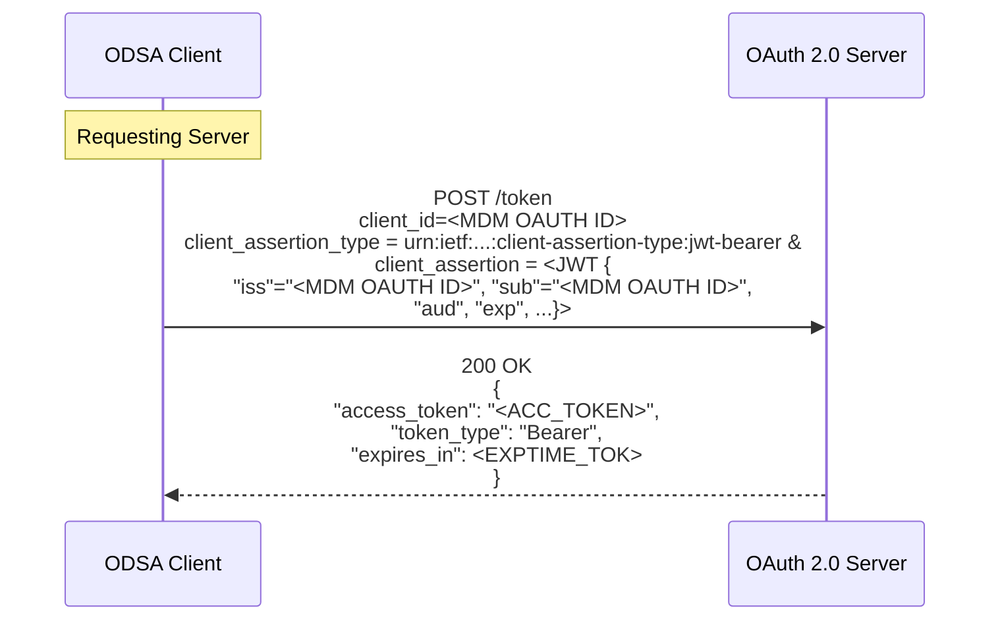

<p align="center">Figure 6. Getting Access Token in Client Authentication Flow</p>

### 2.8.4 Error processing

Some errors might occur during the OIDC user authentication procedure, see OpenID Connect [14] section Authentication Error Response. For example, the user could decline a consent screen, or the Open Id Connect server could get a technical issue (e.g. invalid request).

For the user to be presented an ad-hoc explanation page related to an authentication error, the ODSA entitlement parameters **GeneralErrorURL** and **GeneralErrorUserData** are defined in section 6.5.1 allowing the client application to interact with the Service Provider's portal web server.

The Figure 7 presents an overview of the steps for the OIDC-based authentication procedure in case of error, shown here for informational purposes.

Steps 1-4 are similar to those described in previous section. In the next steps:

5. The user does not succeed to complete the OIDC-based authentication procedure.
6. The Service Provider's OIDC authentication endpoint returns to the Client the redirection URI specified in the Authorization Request with the appropriate error and state parameters.
7. The client on primary device redirects the error URL to the Entitlement Server.
8. The Entitlement Server generates an XML document as a 200 OK answer. This document does not embed a token, as the opposite of the successful case, but an


TS.43 v12.0
Page 31 of 248

GSM Association
Non-confidential
Official Document TS.43 - Service Entitlement Configuration


URL and data to be used by the client (parameters `GeneralErrorURL` and `GeneralErrorUserData`).

9. The client is notified of the error thanks to the presence of these parameters in the document and displays the error webview referenced by the `GeneralErrorURL`, using the `GeneralErrorUserData` in the query string.

10. The end user closes the webview, activating the `dismissFlow` callback.

```mermaid
sequenceDiagram
    participant Client as Client on Primary Device
    participant Server as Entitlement Config Server
    participant OIDC as Service Provider OAuth 2.0 / OIDC Server
    participant Portal as ODSA Auth Error Portal

    Note over Client: Client makes a GET request w/o token and EAP_ID
    Client->>Server: 1. GET ? terminal_id=<TERMID> & app=<APP Id> & <app parameters> Host: aes.mnc<MNC>.mcc<MCC>.pub.3gppnetwork.org
    Note over Server: 2. Server recognizes client requires OIDC AuthN and redirects GET to OIDC server
    Server-->>Client: 302 Found Location: <OIDC_URL>/authorize? response_type=code& scope=openid& client_id=<CLIENT_ID>& redirect_uri=<AES_URL>& state=<STATE_VAL>& nonce=<NONCE_VAL>
    Note over Client: 3. Client redirects GET to OIDC Server
    Client->>OIDC: 4. GET /authorize? response_type=code& scope=openid& client_id=<CLIENT_ID>& redirect_uri=<AES_URL>& state=<STATE_VAL>& nonce=<NONCE_VAL>
    Note right of OIDC: OIDC server goes through an AuthN with the user, may ask for MSISDN
    Note right of OIDC: 5. User goes through AuthN procedure, but ends with error
    Note right of OIDC: 6. Redirect to error page
    OIDC-->>Client: 302 Found Location: <AES_URL>? state=<STATE_VAL>& error=<ERROR_VAL>& error_description=<ERROR_DESCRIPTION_VAL>
    Note over Client: 7. Client redirects GET back to server
    Client->>Server: GET ? state=<STATE_VAL>
    Note over Server: 8. Server generates and ad hoc answer with auth error URL & data
    Server-->>Client: 200 OK Content-Type: text/vnd.wap.connectivity-xml<br/><br/>&lt;?xml version="1.0"?&gt;<br/>&lt;wap-provisioningdoc version="1.1"&gt;<br/>  &lt;characteristic type="VERS"&gt;<br/>    &lt;characteristic type="APPLICATION"&gt;<br/>      &lt;param name="AuthenticationErrorURL"&gt;<br/>      &lt;param name="AuthenticationErrorUserData"&gt;<br/>    &lt;/characteristic&gt;<br/>  &lt;/characteristic&gt;<br/>&lt;/wap-provisioningdoc&gt;
    Note over Client: 9. Client extracts Auth error URL and data and displays the Webview
    Client->>Portal: GET ? AuthenticationErrorUserData Host: AuthenticationErrorURL
    Note right of Portal: 10. User close the Webview, Calling the dismissFlow Callback
    Portal-->>Client: 200 OK dismissFlow() Callback
```

**Figure 7. OAuth 2.0 / OpenID Authentication Error Flow with Entitlement Configuration Server**


TS.43 v12.0
Page 32 of 248

GSM Association
Non-confidential
Official Document TS.43 - Service Entitlement Configuration


### 2.8.5 Fast Authentication and Token Management

Authentication is one of the key pillars in the service entitlement configuration protocol and requires that any system/device interacting with ECS performs this authentication. There are different ways to authenticate the device as defined in the sections 2.8.1 (EAP-AKA), 2.8.2 (OAuth 2.0 / OIDC) and 2.8.3 (server to server authentication using OAuth 2.0). All these authentication mechanisms require to interact with additional elements in the network as it could be AAA and/or OAuth 2.0 / OIDC server. To avoid an extra load in each authentication request, ECS shall implement a fast authentication method using an internal token that is managed between device and ECS. If device includes in the request a valid AuthN Token generated by ECS in the previous request, it should not be necessary to perform a full authentication (through AAA and/or OAuth 2.0 / OIDC). Device will be authenticated by AuthN Token.

Authentication Token generated by ECS shall have an expiration time (at this point device will need to perform a full authentication) and token could be regenerated in each device request/interaction.

ECS should implement the logic to avoid, as far as possible, that different clients in the same device, using the same AppID, could overwrite each other the AuthN token generated for the other client. As a recommendation, ECS could use the following parameters to identify the client in a device using a specific app: `terminal_id`, `app` and `app_name`.

Note- Due to `app_name` is an optional attribute in the request, and is not standardized, it is recommended that the AppID client tries to define an `app_name` as unique identifier, including some code (characters) that could be considered specifically for that AppID developer (vendor identifier, carrier identifier, ...).

### 2.8.6 Token Management for Temporary Tokens

Temporary Tokens are used when the established trust between ECS and the client should be extended to a third party by creating a temporary token for a specific action. When a temporary token is used, the token handling procedures differ from the regular used `auth_token`.

A temporary token is handed out by the ECS to the client, passed on to a third party (e.g. Application Server) and used by that third party for authentication on the ECS. This implies that error messages will be exchanged between the third party and the ECS.

The communication between the client and the third party is outside of the scope of TS.43.

The communication between the third party and the ECS using temporary Token should follow the Error Handling cases described in Table 8:

For implementations running automated retries, a backoff mechanism should be used.

<table>
  <thead>
    <tr>
        <th>Invalid or missing parameters or wrong format in Request</th>
        <th>400 Bad Request</th>
        <th>Retry on next user invocation/ after restart of client</th>
    </tr>
  </thead>
  <tbody>
    <tr>
        <td>Scenario</td>
        <td>GET/ POST Response Code from ECS</td>
        <td>3<sup>rd</sup> Party Server Action</td>
    </tr>
  </tbody>
</table>


TS.43 v12.0
Page 33 of 248

GSM Association Non-confidential
Official Document TS.43 - Service Entitlement Configuration


<table>
  <thead>
    <tr>
        <th>Invalid or expired Temporary Token in Request</th>
        <th>401 Unauthorized</th>
        <th>If possible, trigger device to acquire a (new) valid temporary token from the ECS</th>
    </tr>
    <tr>
        <th>Invalid operation in combination with temporary token</th>
        <th>403 Forbidden</th>
        <th>Retry on next user invocation/ after restart of client</th>
    </tr>
    <tr>
        <th>Requested resource not found</th>
        <th>404 Not found</th>
        <th>Retry on next user invocation/ after restart of client</th>
    </tr>
    <tr>
        <th>ECS runs into an internal error during procession of request</th>
        <th>500 Internal Server Error</th>
        <th>Retry on next user invocation/ after restart of client</th>
    </tr>
  </thead>
  <tbody>
    <tr>
        <td>Scenario</td>
        <td>GET/ POST Response Code from ECS</td>
        <td>3<sup>rd</sup> Party Server Action</td>
    </tr>
  </tbody>
</table>
*Table 8. Error scenarios for Temporary Tokens*

## 2.9 Configuration Document for Entitlements

### 2.9.1 General
The attributes for the entitlement of VoWiFi, Voice-over-Cellular or SMSoIP and the result of operation requests from Companion and Primary ODSA applications are conveyed between the entitlement configuration server and the client via a configuration document. This document is located in the returned 200 OK response message and can follow two formats:

* An XML document similar to the one defined in section 4 of RCC.14 [5], composed of a set of characteristic types, each with a number of parameters.
* A JSON object composed of a number of structured values (a set of fields presented as name-value pairs) corresponding to the characteristic types of the XML document.

The configuration entitlement server may apply a content encoding mechanism supported by the client.

The client should indicate supported content decoding mechanisms via the Accept-Encoding HTTP header as defined in RFC2616 [12]. The server shall in turn indicate the applied content encoding mechanism in the Content-Encoding HTTP header in accordance with RFC2616 [12].

It is recommended that clients and entitlement configuration servers support the encoding format "gzip".

### 2.9.2 New Characteristics for XML-Based Document
Extending the XML definition from RCC.14 [5], new APPLICATION characteristics are defined for the entitlements of VoWiFi, Voice-over-Cellular, SMSoIP and for the operation results of the Companion and Primary ODSA applications, with a unique Application Identifier (AppID) assigned to each.

Refer to 2.3 for the AppID assigned to the entitlement applications for VoWiFi, Voice-over-Cellular, SMSoIP and to the Companion and Primary ODSA applications.

An example configuration document containing the combined entitlement parameters for the VoWiFi, Voice-over-Cellular and SMSoIP services is shown in Table 9. This is an example


TS.43 v12.0 Page 34 of 248

GSM Association Non-confidential
Official Document TS.43 - Service Entitlement Configuration


and as such non-normative. The example presents all those entitlements, but only the requested service entitlements shall be included in the document (based on the received "app" request parameter).

For the Companion and Primary ODSA applications, refer to 6.6 for the XML document examples defined for each operation of those applications.

```xml
<characteristic type="APPLICATION">
      <parm name="AppID" value="ap2004"/>
      <parm name="EntitlementStatus" value="X"/>
      <parm name="ServiceFlow_URL" value="X"/>
      <parm name="ServiceFlow_UserData" value="X"/>
      <parm name="MessageForIncompatible" value="X"/>
      <parm name="AddrStatus" value="X"/>
      <parm name="TC_Status" value="X"/>
      <parm name="ProvStatus" value="X"/>
</characteristic>
<characteristic type="APPLICATION">
      <parm name="AppID" value="ap2003"/>
      <characteristic type="VoiceOverCellularEntitleInfo">
            <characteristic type="RATVoiceEntitleInfoDetails">
                  <parm name="AccessType" value="1"/> //4G
                  <parm name="HomeRoamingNWType" value="1"/> //Home&Roaming network
                  <parm name="EntitlementStatus" value="1"/> //Enabled
            </characteristic>
            <characteristic type="RATVoiceEntitleInfoDetails">
                  <parm name="AccessType" value="2"/> //5G
                  <parm name="HomeRoamingNWType" value="2"/> //Home network
                  <parm name="EntitlementStatus" value="1"/> //Enabled
                  <parm name="NetworkVoiceIRATCapablity" value="EPS-Fallback"/>
            </characteristic>
            <characteristic type="RATVoiceEntitleInfoDetails">
                  <parm name="AccessType" value="2"/> //5G
                  <parm name="HomeRoamingNWType" value="3"/> //Roaming network
                  <parm name="EntitlementStatus" value="2"/> //Incompatible
                  <parm name="MessageForIncompatible" value="Z"/>
            </characteristic>
      </characteristic>
</characteristic>
<characteristic type="APPLICATION">
      <parm name="AppID" value="ap2005"/>
      <parm name="EntitlementStatus" value="X"/>
</characteristic>
```

*Table 9. VoWiFi, Voice-over-Cellular and SMSoIP entitlement document structure (non-normative)*

### 2.9.3 Inclusion in the Complete XML document

The complete XML document with combined VoWiFi, Voice-over-Cellular and SMSoIP entitlement configurations is illustrated in Table 10. This is an example and as such non-normative. The example presents all those entitlements, but only the requested service entitlements shall be included in the document (based on the received "app" request parameter).


TS.43 v12.0 Page 35 of 248

GSM Association Non-confidential
Official Document TS.43 - Service Entitlement Configuration


```xml
<?xml version="1.0"?>
<wap-provisioningdoc version="1.1">
      <characteristic type="VERS">
       <parm name="version" value="X"/>
       <parm name="validity" value="Y"/>
      </characteristic>
      <characteristic type="TOKEN">         <!-- This section is OPTIONAL -->
       <parm name="token" value="U"/>
       <parm name="validity" value="V"/>    <!-- Optional parameter -->
      </characteristic>

<!-- Potentially additional optional characteristics such as MSG, User and Access
Control -->
<!-- see [PRD-RCC.14] -->

      <characteristic type="APPLICATION">
       <parm name="AppID" value="ap2004"/>
       <parm name="EntitlementStatus" value="X"/>
       <parm name="ServiceFlow_URL" value="X"/>
       <parm name="ServiceFlow_UserData" value="X"/>
       <parm name="MessageForIncompatible" value="X"/>
       <parm name="AddrStatus" value="X"/>
       <parm name="TC_Status" value="X"/>
       <parm name="ProvStatus" value="X"/>
      </characteristic>
      <characteristic type="APPLICATION">
       <parm name="AppID" value="ap2003"/>
       <characteristic type="VoiceOverCellularEntitleInfo">
           <characteristic type="RATVoiceEntitleInfoDetails">
                 <parm name="AccessType" value="1"/> //4G
                 <parm name="HomeRoamingNWType" value="1"/> //Home&Roaming
                 <parm name="EntitlementStatus" value="1"/> //Enabled
           </characteristic>
           <characteristic type="RATVoiceEntitleInfoDetails">
                 <parm name="AccessType" value="2"/> //5G
                 <parm name="HomeRoamingNWType" value="2"/> //Home network
                 <parm name="EntitlementStatus" value="1"/> //Enabled
                 <parm name="NetworkVoiceIRATCapablity" value="EPS-Fallback"/>
             </characteristic>
           <characteristic type="RATVoiceEntitleInfoDetails">
                 <parm name="AccessType" value="2"/> //5G
                 <parm name="HomeRoamingNWType" value="3"/> //Roaming network
                 <parm name="EntitlementStatus" value="2"/> //Incompatible
                 <parm name="MessageForIncompatible" value="Z"/>
           </characteristic>
       </characteristic>
      </characteristic>
      <characteristic type="APPLICATION">
       <parm name="AppID" value="ap2005"/>
       <parm name="EntitlementStatus" value="X"/>
      </characteristic>
</wap-provisioningdoc>
```

*Table 10. Complete XML-based entitlement document structure (non-normative)*

### 2.9.4 JSON-Based Configuration Document

The JSON object value returned as part of an entitlement configuration request for the entitlements of VoWiFi, Voice-over-Cellular and SMSoIP is presented in Table 11. Each characteristic type of the XML document is mapped to the JSON document as a structured object with several fields.


TS.43 v12.0 Page 36 of 248

GSM Association Non-confidential
Official Document TS.43 - Service Entitlement Configuration


For the Companion and Primary ODSA applications, refer to 6.6 for a description of the JSON-based document defined for each operation of those applications.

```json
{
  "Vers" : {
    "version" : "X",
    "validity" : "Y"
  },
  "Token" : {                 // Optional
    "token" : "U",
    "validity" : "V"
  },
  "ap2004": {                 // VoWiFi Entitlement settings
    "EntitlementStatus" : "X",
    "ServiceFlow_URL" : "X",
    "ServiceFlow_UserData" : "X",
    "MessageForIncompatible" : "X",
    "AddrStatus" : "X",
    "TC_Status" : "X",
    "ProvStatus" : "X"
  },
  "ap2003" : {                // Voice-over-Cellular Entitlement settings
    "VoiceOverCellularEntitleInfo" : [{
        "RATVoiceEntitleInfoDetails" : {
          "AccessType" : "1", //4G
          "HomeRoamingNWType" : "1", //Home & Roaming networks
          "EntitlementStatus" : "1" //Enabled
        }
      },{
        "RATVoiceEntitleInfoDetails" : {
          "AccessType" : "2", //5G
          "HomeRoamingNWType" : "2", //Home Network
          "EntitlementStatus" : "1", //Enabled
          "NetworkVoiceIRATCapablity" : "EPS-Fallback"
        }
      },{
        "RATVoiceEntitleInfoDetails" : {
          "AccessType" : "2", //5G
          "HomeRoamingNWType" : "3", //Roaming Network
          "EntitlementStatus" : "2", //Incompatible
          "MessageForIncompatible" : "Z"
        }
    }]
  },
  "ap2005" : {                // SMSoIP Entitlement settings
    "EntitlementStatus" : "X"
  }
}
```

*Table 11. JSON-based entitlement document for VoWiFi, Voice-over-Cellular and SMSoIP (non-normative)*

### 2.9.5 Result of Notification Registration

An application can request to receive entitlement notifications from the network by including the `notif_action` and `notif_token` parameters in a configuration request (refer to Table 4 for details on the parameters).

The Entitlement Configuration Server shall provide the result of registering the application in the configuration document using the `RegisterNotifStatus` configuration parameter as defined in Table 12.


TS.43 v12.0 Page 37 of 248

GSM Association Non-confidential
Official Document TS.43 - Service Entitlement Configuration


<table>
  <thead>
    <tr>
        <th>General Entitlement parameter</th>
        <th></th>
        <th>Type</th>
        <th></th>
        <th>Values</th>
        <th></th>
        <th>Description</th>
        <th></th>
    </tr>
  </thead>
  <tbody>
    <tr>
        <td>RegisterNotifStatus (Conditional)</td>
        <td rowspan="3">Integer</td>
        <td>0 - SUCCESS</td>
        <td>Registration of the notification was successful</td>
        <td colspan="4"></td>
    </tr>
    <tr>
        <td></td>
        <td>1 – INVALID TOKEN</td>
        <td>The provided notif_token was invalid</td>
        <td colspan="4"></td>
    </tr>
    <tr>
        <td></td>
        <td>2 – DUPLICATE TOKEN</td>
        <td>The provided notif_token is a duplicate</td>
        <td colspan="4"></td>
    </tr>
  </tbody>
</table>
*Table 12. Entitlement Parameter - Notification Registration Status*

### 2.9.6 Additional Details on TOKEN
As seen in Table 10 and Table 11, the document for entitlement configuration contains the VERS and TOKEN attributes, as defined by RCC.14 [5]. In addition to the definition of TOKEN from RCC.14, the following rules apply to the entitlement configuration’s TOKEN:

*   TOKEN is not restricted to entitlement configuration requests made from non-3GPP access networks access types.
*   A "`validity`" attribute is allowed and indicates the lifetime of the provided token.
*   The token shall be kept by clients during reboot cycles.
*   The token is of variable length.

### 2.10 HTTP Response Codes
Table 13 presents the possible entitlement configuration server response codes (including associated reasons) at the HTTP level.

<table>
  <thead>
    <tr>
        <th>GET Response Code</th>
        <th></th>
        <th>Reason</th>
        <th></th>
        <th>Device’s Action</th>
        <th></th>
    </tr>
  </thead>
  <tbody>
    <tr>
        <td>200 OK + with application data</td>
        <td>New or updated application data sent to the device, including ODSA responses with error indication<br/>`OperationResult!=0`</td>
        <td>Process the returned application data</td>
        <td colspan="3"></td>
    </tr>
    <tr>
        <td>302 Found</td>
        <td>OAuth 2.0 / OpenID Connect authentication should be followed. Refer to Section 2.8.2 for details on the procedure and its initiation.</td>
        <td>Redirect the GET request to the OIDC AuthN endpoint specified by the Location: field of the 302 Found response</td>
        <td colspan="3"></td>
    </tr>
    <tr>
        <td>400 Bad Request</td>
        <td>Invalid or missing GET parameters or wrong format</td>
        <td>Retry on next reboot/the next time the client app starts</td>
        <td colspan="3"></td>
    </tr>
    <tr>
        <td>403 Forbidden</td>
        <td>Invalid identities (device id, primary or companion) or the operation is supported but is not allowed by the ECS for this `requestor_id`.</td>
        <td>Retry on next reboot/the next time the client app starts</td>
        <td colspan="3"></td>
    </tr>
    <tr>
        <td>405 Method not Allowed</td>
        <td>Operation is known by the server but is not supported.</td>
        <td>Retry on next reboot/the next time the client app starts.</td>
        <td colspan="3"></td>
    </tr>
  </tbody>
</table>


TS.43 v12.0 Page 38 of 248

GSM Association
Non-confidential
Official Document TS.43 - Service Entitlement Configuration


<table>
  <thead>
    <tr>
        <th>GET Response Code</th>
        <th></th>
        <th>Reason</th>
        <th></th>
        <th>Device’s Action</th>
        <th></th>
    </tr>
  </thead>
  <tbody>
    <tr>
        <td>406 Not Acceptable</td>
        <td>The server does not support the `entitlement_version` used by the client, or the server doesn’t support device transfer functionality using `old_companion_terminal_iccid` and `old_companion_terminal_id`</td>
        <td>Apply the procedure defined by the Service Provider for the case of no configuration data is available (for example silent abort or error message)</td>
        <td colspan="3"></td>
    </tr>
    <tr>
        <td>500 Internal Server error</td>
        <td>Internal error during processing of GET request</td>
        <td>Retry on next reboot/the next time the client app starts</td>
        <td colspan="3"></td>
    </tr>
    <tr>
        <td>501 Not implemented</td>
        <td>The server does not support the HTTP POST method used by the client</td>
        <td>Retry the request using GET method</td>
        <td colspan="3"></td>
    </tr>
    <tr>
        <td>503 Retry after / Service Unavailable</td>
        <td>The server does not have access to external resources (temporary error)</td>
        <td>Retry after the time specified in the “**Retry-After**” header</td>
        <td colspan="3"></td>
    </tr>
    <tr>
        <td>511 Network Authentication Required</td>
        <td>To initiate authentication with the server, when proper AuthN parameters are missing, the `OTP` is invalid, or the `token` obtained through a previous authentication exercise expired</td>
        <td>Client app should go through an authentication procedure with the entitlement configuration server and get a new `token`<br/><br/>**<u>Alternate Authentication fall-back:</u>**<br/>If the client fails to obtain a new `token` using EAP-AKA authentication (the EAP_ID parameter present) and receives a 511 response it shall initiate authentication with the ECS without including the EAP_ID parameter.</td>
        <td colspan="3"></td>
    </tr>
    <tr>
        <td>The server is unreachable</td>
        <td>Entitlement configuration server is missing or down</td>
        <td>Retry on next reboot, the next time the client starts</td>
        <td colspan="3"></td>
    </tr>
  </tbody>
</table>

Table 13. HTTP Response Codes from Entitlement Configuration Server


TS.43 v12.0
Page 39 of 248

GSM Association
Non-confidential
Official Document TS.43 - Service Entitlement Configuration


# 3 VoWiFi Entitlement Configuration

The following sections describe the different configuration parameters associated with the VoWiFi entitlement as well as the expected behaviour of the VoWiFi client based on the entitlement configuration document received by the client.

## 3.1 VoWiFi Entitlement Parameters

Parameters for the VoWiFi entitlement provide the overall status of the VoWiFi service to the client, as well as the different sub-status associated with the activation procedure of the service.

The VoWiFi entitlement parameters also include information associated with the web views presented to users by the VoWiFi client during activation and management of the service.

### 3.1.1 VoWiFi Entitlement Status

*   Parameter Name: `EntitlementStatus`
*   Presence: Mandatory

This parameter indicates the overall status of the VoWiFi entitlement, stating if the service can be offered on the device, and if it can be activated or not by the end-user.

The different values for the VoWiFi entitlement status are provided in Table 14.

<table>
  <thead>
    <tr>
        <th>EntitlementStatus (Mandatory)</th>
        <th rowspan="4">Integer</th>
        <th>0 - DISABLED</th>
        <th>VoWiFi service allowed, but not yet provisioned and activated on the network side</th>
    </tr>
    <tr>
        <th></th>
        <th>1 - ENABLED</th>
        <th>VoWiFi service allowed, provisioned, and activated on the network side</th>
    </tr>
    <tr>
        <th></th>
        <th>2 - INCOMPATIBLE</th>
        <th>VoWiFi service cannot be offered</th>
    </tr>
    <tr>
        <th></th>
        <th>3 - PROVISIONING</th>
        <th>VoWiFi service being provisioned on the network side</th>
    </tr>
  </thead>
  <tbody>
    <tr>
        <td>VoWiFi Entitlement parameter</td>
        <td>Type</td>
        <td>Values</td>
        <td>Description</td>
    </tr>
  </tbody>
</table>
<center>Table 14. Entitlement Parameter - VoWiFi Overall Status</center>

### 3.1.2 VoWiFi Client’s Web Views Parameters

*   Parameter Names: `ServiceFlow_URL` and `ServiceFlow_UserData`
*   Presence: Mandatory

During the activation procedure of the VoWiFi service, end-users can be presented with web views specific to the Service Provider. VoWiFi web views allow end-users to change user-specific attributes of the VoWiFi service, like the acceptance of the service’s Terms and Conditions (T&C) and the end-user’s physical address (needed in some regions for VoWiFi emergency calling purposes).


TS.43 v12.0
Page 40 of 248

GSM Association
Non-confidential
Official Document TS.43 - Service Entitlement Configuration


The entitlement parameters associated with the VoWiFi service’s web views are described in Table 15.

<table>
  <thead>
    <tr>
        <th>VoWiFi Entitlement parameter</th>
        <th></th>
        <th>Type</th>
        <th></th>
        <th>Description</th>
        <th></th>
    </tr>
  </thead>
  <tbody>
    <tr>
        <td>ServiceFlow_URL<br/>(Mandatory)</td>
        <td>String</td>
        <td>The URL of web views to be used by VoWiFi client to present the user with VoWiFi service activation and service management options, which may include entering physical address and agreeing to the T&amp;C of the VoWiFi service.</td>
        <td colspan="3"></td>
    </tr>
    <tr>
        <td>ServiceFlow_UserData<br/>(Mandatory)</td>
        <td>String</td>
        <td>User data associated with the HTTP web request towards the ServiceFlow URL. It can contain user-specific attributes to ease the flow of VoWiFi service activation and management. See below for details on the content.</td>
        <td colspan="3"></td>
    </tr>
  </tbody>
</table>
<center>Table 15. Entitlement Parameters - VoWiFi Web Views Information</center>

The content of the `ServiceFlow_UserData` parameter is defined by the requirements of the Service Provider’s VoWiFi web views. In a typical case, the web view is presented when VoWiFi service is activated by the end-user. At such time the VoWiFi client connects the user to the `ServiceFlow_URL` and includes the `ServiceFlow_UserData` in the HTTP web request.

In order to improve user experience, this parameter should include user and service-specific information that would allow the VoWiFi’s web views to identify the requestor and be aware of the latest VoWiFi entitlement status values.

An example of the `ServiceFlow_UserData` string is:

> `"imsi=XXXXXXXXX&amp;msisdn=XXXXXXXX&amp;tnc=X&amp;addr=X&amp;prov=X&amp;device_id=XXXXXXXX&amp;entitlement_name=VoWiFi&amp;signature=Xl%2F1tT23C0dNI32hiVZZS"`

This example contains elements associated with the device and user identities as well as service-related information like the current T&C, address, and provisioning status of the VoWiFi service. Note the use of `&amp;` is required to allow the '&' character to be used in a string value within an XML document.

### 3.1.3 VoWiFi Address Parameters
* Parameter Name: `AddrStatus`, `AddrExpiry`, `AddrIdentifier`
* Presence:
    - `AddrStatus`: Mandatory
    - `AddrExpiry`, `AddrIdentifier`: Optional

In some regions, end-users must provide their static physical address before being allowed to use the VoWiFi service. Those entitlement parameters indicates if that condition must be met before offering the VoWiFi service and provide additional information on the captured location (expiration and identifier).


TS.43 v12.0 Page 41 of 248

GSM Association
Non-confidential
Official Document TS.43 - Service Entitlement Configuration


Also, if a physical address from the end-user is indeed needed for the VoWiFi service, this parameter indicates the state of the "address capture" process.

The different values for the VoWiFi address status are provided in Table 16.

<table>
  <thead>
    <tr>
        <th>AddrStatus<br/>(Mandatory)</th>
        <th rowspan="4">Integer</th>
        <th>0 - NOT AVAILABLE</th>
        <th>Address has not yet been captured from the end-user</th>
    </tr>
    <tr>
        <th></th>
        <th>1 - AVAILABLE</th>
        <th>Address has been entered by the end-user</th>
    </tr>
    <tr>
        <th></th>
        <th>2 - NOT REQUIRED</th>
        <th>Address is not required to offer VoWiFi service</th>
    </tr>
    <tr>
        <th></th>
        <th>3 - IN PROGRESS</th>
        <th>Address capture from end-user is on-going</th>
    </tr>
    <tr>
        <th>AddrExpiry<br/>(Optional)</th>
        <th>Time</th>
        <th>in ISO 8601 format, of the form YYYY-MM-DDThh:mm:ssTZD</th>
        <th>The time/date when the address expires and should be recaptured from the user</th>
    </tr>
    <tr>
        <th>AddrIdentifier<br/>(Optional)</th>
        <th>String</th>
        <th>Generated by emergency system</th>
        <th>Associated identifier of the location, to be used during an IMS emergency session by the device, as defined in 3.1.3.</th>
    </tr>
  </thead>
  <tbody>
    <tr>
        <td>VoWiFi Entitlement parameter</td>
        <td>Type</td>
        <td>Values</td>
        <td>Description</td>
    </tr>
  </tbody>
</table>
<center>Table 16. Entitlement Parameters - VoWiFi Address</center>

The absence of the `AddrExpiry` parameter indicates that there is no expiration date for the address.

### 3.1.4 VoWiFi T&C Status
* Parameter Name: `TC_Status`
* Presence: Mandatory

In some regions, end-users must agree to the Terms and Conditions (T&C) of the VoWiFi service before being allowed to use it. This entitlement parameter indicates if that condition must be met before offering the VoWiFi service.

Also, if acceptance of the VoWiFi's T&C is indeed needed from the end-user, this parameter indicates the state of the "T&C acceptance" process.

The different values for the VoWiFi T&C status are provided in Table 17.

<table>
  <thead>
    <tr>
        <th>TC_Status<br/>(Mandatory)</th>
        <th rowspan="3">Integer</th>
        <th>0 - NOT AVAILABLE</th>
        <th>T&amp;C have not yet been accepted by the end-user</th>
    </tr>
    <tr>
        <th></th>
        <th>1 - AVAILABLE</th>
        <th>T&amp;C have been accepted by the end-user</th>
    </tr>
    <tr>
        <th></th>
        <th>2 - NOT REQUIRED</th>
        <th>T&amp;C acceptance is not required to offer VoWiFi service</th>
    </tr>
  </thead>
  <tbody>
    <tr>
        <td>VoWiFi Entitlement parameter</td>
        <td>Type</td>
        <td>Values</td>
        <td>Description</td>
    </tr>
  </tbody>
</table>
<center>Table 17. Entitlement Parameters - VoWiFi T&C Status</center>


TS.43 v12.0
Page 42 of 248

GSM Association
Non-confidential
Official Document TS.43 - Service Entitlement Configuration


<table>
  <thead>
    <tr>
        <th>VoWiFi Entitlement parameter</th>
        <th>Type</th>
        <th>Values</th>
        <th>Description</th>
    </tr>
  </thead>
  <tbody>
    <tr>
        <td></td>
        <td></td>
        <td>3 - IN PROGRESS</td>
        <td>T&amp;C capture and acceptance is on-going</td>
    </tr>
  </tbody>
</table>
Table 17. Entitlement Parameter - VoWiFi T&C Status

### 3.1.5 VoWiFi Provisioning Status
* Parameter Name: `ProvStatus`
* Presence: Mandatory

In some cases, the network is not provisioned by default to support VoWiFi service for all end-users. Some type of network-side provisioning must then take place before offering the VoWiFi service to the end-user. This entitlement parameter indicates the progress of VoWiFi provisioning on the network for the requesting client.

The different values for the VoWiFi provisioning status are provided in Table 18.

<table>
  <thead>
    <tr>
        <th>VoWiFi Entitlement parameter</th>
        <th>Type</th>
        <th>Values</th>
        <th>Description</th>
    </tr>
  </thead>
  <tbody>
    <tr>
        <td rowspan="4">ProvStatus<br/>(Mandatory)</td>
        <td rowspan="4">Integer</td>
        <td>0 - NOT PROVISIONED</td>
        <td>VoWiFi service not provisioned yet on network side</td>
    </tr>
    <tr>
        <td>1 - PROVISIONED</td>
        <td>VoWiFi service fully provisioned on network</td>
    </tr>
    <tr>
        <td>2 - NOT REQUIRED</td>
        <td>Provisioning progress of VoWiFi is not tracked / not required</td>
    </tr>
    <tr>
        <td>3 - IN PROGRESS</td>
        <td>VoWiFi provisioning is still in progress</td>
    </tr>
  </tbody>
</table>
Table 18. Entitlement Parameter - VoWiFi Provisioning Status

### 3.1.6 VoWiFi Message for Incompatible Status
* Parameter Name: `MessageForIncompatible`
* Presence: Mandatory

When the status for the VoWiFi entitlement is INCOMPATIBLE (see 3.1.1) and the end-user tries to activate VoWiFi, the VoWiFi client should show a message to the end-user indicating why activation was refused.

This entitlement parameter provides the content of that message, as decided by the Service Provider. Table 19 describes this VoWiFi entitlement parameter.

<table>
  <thead>
    <tr>
        <th>VoWiFi Entitlement parameter</th>
        <th>Type</th>
        <th>Description</th>
    </tr>
  </thead>
  <tbody>
    <tr>
        <td>MessageForIncompatible<br/>(Mandatory)</td>
        <td>String</td>
        <td>A message to be displayed to the end-user when activation fails due to an incompatible VoWiFi Entitlement Status</td>
    </tr>
  </tbody>
</table>
Table 19. Entitlement Parameter - VoWiFi Message for Incompatible Status


TS.43 v12.0
Page 43 of 248

GSM Association
Non-confidential
Official Document TS.43 - Service Entitlement Configuration


## 3.2 Client Behaviour for VoWiFi Entitlement Configuration

The entitlement parameters for VoWiFi provides an overall status for the service as well as additional information associated with the activation procedure and provisioning of the service.

As such, the entitlement configuration for VoWiFi carries information that impacts the behaviour of the VoWiFi client.

The client shall then activate (or deactivate) the VoWiFi service according to the combination of the VoWiFi's general setting on the device (controlled by the end-user) and the received VoWiFi entitlement configuration.

The client shall also use the VoWiFi entitlement parameters to decide if VoWiFi web views for activation and service management should be presented to the end-user. This includes country-specific details on the need for VoWiFi's Terms & Conditions acceptance and the requirement to capture or not the user's physical address - a country's regulations may require users to enter their physical address as well as agree to the Terms & Conditions of the service when activating VoWiFi.

## 3.3 Entitlement Modes of VoWiFi Client

To simplify the description of the client's behaviour with respect to the VoWiFi entitlement configuration, a set of "VoWiFi entitlement modes" for the client is defined, each with specific expectations on the client side.

The relationship between the values of the VoWiFi entitlement parameters and the VoWiFi entitlement modes are shown in Table 20.

<table>
  <thead>
    <tr>
        <th colspan="4">VoWiFi Entitlement Parameters</th>
        <th rowspan="2">VoWiFi Entitlement mode</th>
        <th></th>
    </tr>
    <tr>
        <th>Entitlement Status</th>
        <th>ProvStatus</th>
        <th>TC_Status</th>
        <th>AddrStatus</th>
        <th></th>
    </tr>
  </thead>
  <tbody>
    <tr>
        <td>INCOMPATIBLE</td>
        <td colspan="3">Any</td>
        <td>Cannot be offered</td>
        <td></td>
    </tr>
    <tr>
        <td rowspan="2">DISABLED</td>
        <td rowspan="2">Any</td>
        <td colspan="2">At least one is NOT AVAILABLE</td>
        <td>Service Data Missing</td>
        <td></td>
    </tr>
    <tr>
        <td colspan="2">At least one is IN PROGRESS</td>
        <td>Service Data being Updated</td>
        <td></td>
    </tr>
    <tr>
        <td>DISABLED</td>
        <td>NOT PROVISIONED, IN PROGRESS</td>
        <td colspan="2">AVAILABLE or NOT REQUIRED</td>
        <td>Service being Provisioned</td>
        <td></td>
    </tr>
    <tr>
        <td>PROVISIONING</td>
        <td colspan="3">Any</td>
        <td></td>
        <td></td>
    </tr>
    <tr>
        <td>ENABLED</td>
        <td>PROVISIONED or NOT REQUIRED</td>
        <td colspan="2">AVAILABLE or NOT REQUIRED</td>
        <td>Can be activated</td>
        <td></td>
    </tr>
  </tbody>
</table>
<center>Table 20. VoWiFi Entitlement Modes</center>

The description of each VoWiFi entitlement mode follows.


TS.43 v12.0
Page 44 of 248

GSM Association
Non-confidential
Official Document TS.43 - Service Entitlement Configuration


### 3.3.1 VoWiFi Entitlement Mode - Cannot be offered.
The Client shall stay in this mode when:

* `EntitlementStatus` is INCOMPATIBLE

The Client shall not activate the VoWiFi service.

Due to end-user’s action, the client may send a request to the Entitlement Configuration Server to refresh the VoWiFi entitlement status. If the received status is still INCOMPATIBLE, the device shall either display `MessageForIncompatible` when it is not void, or the default device error message (if any).

### 3.3.2 VoWiFi Entitlement Mode - Can be activated.
The Client shall stay in this mode when all the following conditions are met:

* `EntitlementStatus` is ENABLED
* `ProvStatus` is PROVISIONED or NOT REQUIRED
* `TC_status` and `AddrStatus` are AVAILABLE or NOT REQUIRED

When entering this mode, the client shall activate the VoWiFi service if the VoWiFi’s service setting on the device is equivalent to ON (may require end-user action).

### 3.3.3 VoWiFi Entitlement Mode - Service Data Missing
The Client shall stay in this mode when all the following conditions are met:

* `EntitlementStatus` is DISABLED
* `ProvStatus` is any values.
* Either `TC_status` or `AddrStatus` is NOT AVAILABLE

In that mode the Client shall not activate the VoWiFi service.

Due to end-user’s action, the Client may send a request to the Entitlement Configuration Server to refresh the VoWiFi entitlement status. If the received status leads to the same mode, the Client shall open a web view and instruct the end-user to enter the required missing VoWiFi service information (T&C or static physical address).

### 3.3.4 VoWiFi Entitlement Mode - Service Data Being Updated
The Client shall stay in this mode when all the following conditions are met:

* `EntitlementStatus` is DISABLED
* `ProvStatus` is any values.
* Either `TC_status`, or `AddrStatus` is set to IN PROGRESS

In that mode the Client shall not activate the VoWiFi service.

### 3.3.5 VoWiFi Entitlement Mode - Service Being Provisioned
The Client shall stay in this mode when all the following conditions are met:


TS.43 v12.0
Page 45 of 248

GSM Association
Non-confidential
Official Document TS.43 - Service Entitlement Configuration


*   `EntitlementStatus` is DISABLED
*   `TC_status` and `AddrStatus` are set to AVAILABLE or NOT REQUIRED
*   `ProvStatus` is set to NOT PROVISIONED or IN PROGRESS

Or

*   `EntitlementStatus` is PROVISIONING
*   `ProvStatus`, `TC_status` and `AddrStatus` are set to any values.

The Client shall not activate the VoWiFi service. After an end-user action (going into VoWiFi service settings for example), the client shall show that the service is pending or being provisioned.

### 3.4 VoWiFi Client Considerations around Web View Callbacks

During the activation procedure of the VoWiFi service, end-users can be presented with web views specific to the Service Provider (hosted by a VoWiFi portal web server). To support this feature, the VoWiFi entitlement parameters `ServiceFlow_URL` and `ServiceFlow_UserData` associated with the invocation of VoWiFi service's web views by the VoWiFi client are defined in section 3.1.2.

At the completion of the web service flow by the VoWiFi portal web server, the web page shall invoke a specific JavaScript (JS) callback function associated with the VoWiFi client. The callback functions shall provide the overall state of the web flow to the VoWiFi client and indicate that the VoWiFi web view on the device needs to be closed.

The object associated with the callback functions is `VoWiFiWebServiceFlow` and two different callback functions are defined to reflect the state of the web logic.

#### 3.4.1 entitlementChanged() Callback function

The `entitlementChanged()` callback function indicates that the VoWiFi service flow ended properly between the device and VoWiFi portal web server.

The web view to the end-user should be closed and the VoWiFi client shall make a request for the latest VoWiFi entitlement configuration status, via the proper TS.43 entitlement configuration request.

Based on the returned set of status parameters, the VoWiFi client shall behave as specified in 3.3.

The following call flow presents how the `entitlementChanged()` callback function fits into the typical steps involved with VoWiFi entitlement configuration. At the end of the VoWiFi service flow the callback function (step 7) is invoked by the web server and the VoWiFi client acts accordingly by requesting for the latest VoWiFi entitlement configuration.


TS.43 v12.0
Page 46 of 248

GSM Association
Non-confidential
Official Document TS.43 - Service Entitlement Configuration


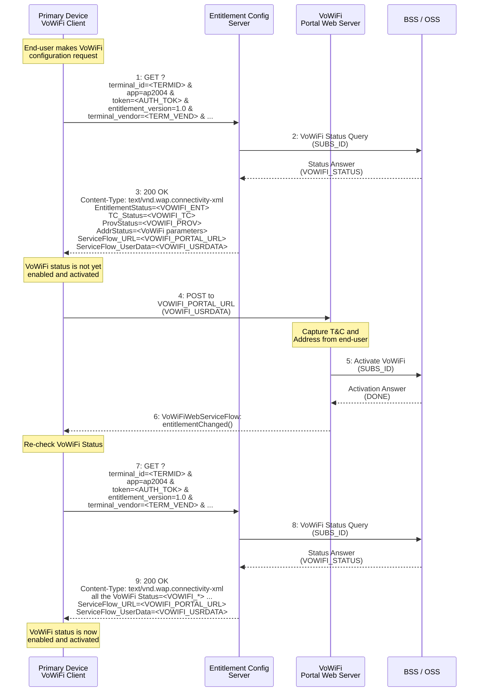

<center>Figure 8. VoWiFi Entitlement Configuration Flow with entitlementChanged() Callback</center>

### 3.4.2 dismissFlow() callback function

The `dismissFlow()` callback function indicates that the VoWiFi service flow ends prematurely, either caused by user action (DISMISS button for example) or by an error in the web sheet logic or from the network side.

As a result of the dismissal of the service flow, the VoWiFi entitlement status has not been updated by the VoWiFi portal.

The web view to the end-user should be closed and the VoWiFi client should not make a request for the latest VoWiFi entitlement configuration status.

The call flow in Figure 9 presents how the `dismissFlow()` callback function fits into the typical steps involved with VoWiFi Entitlement Configuration. Due to an error or user action


TS.43 v12.0 Page 47 of 248

GSM Association
Non-confidential
Official Document TS.43 - Service Entitlement Configuration


the callback function (step 6) is invoked by the web server and the VoWiFi client acts accordingly.

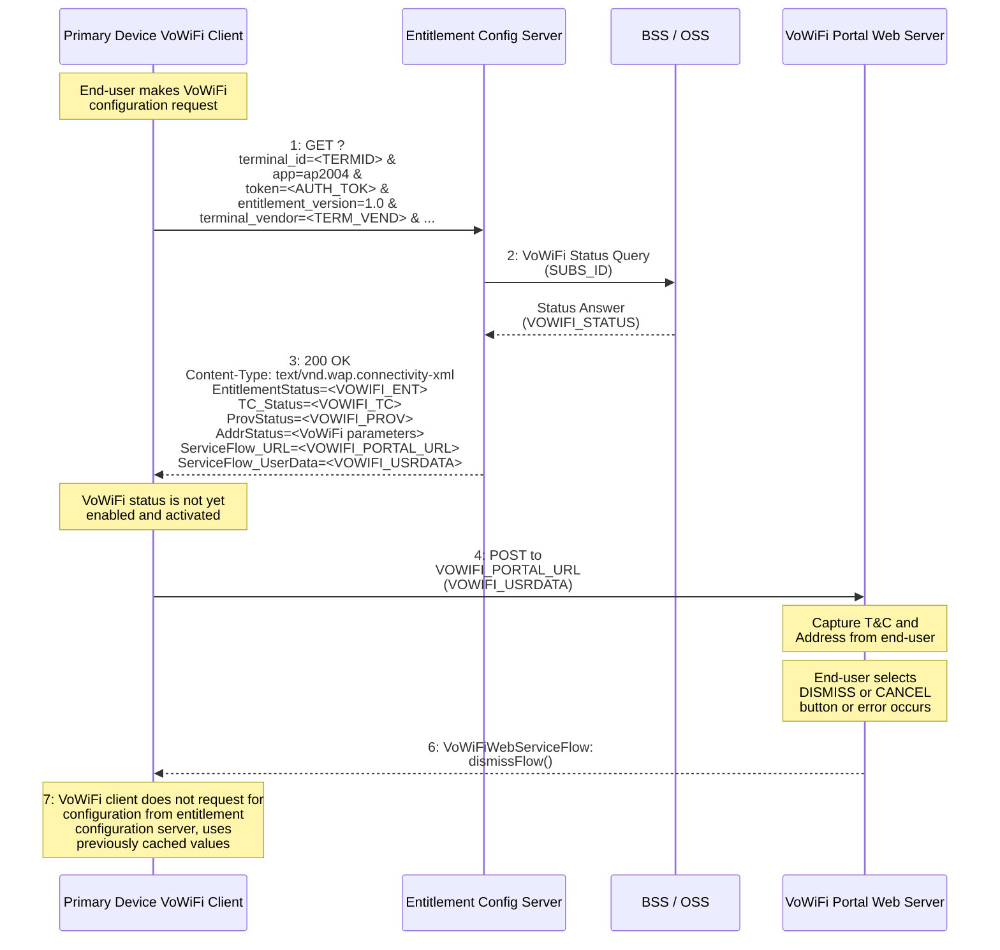

Figure 9. VoWiFi Entitlement Configuration Flow with dismissFlow() Callback


TS.43 v12.0
Page 48 of 248

GSM Association
Non-confidential
Official Document TS.43 - Service Entitlement Configuration


# 4 Voice-over-Cellular Entitlement Configuration

The following sections describe the different configuration parameters associated with the Voice-over-Cellular entitlement.

Note: For TS.43 version earlier than 7.0, AppID "ap2003" is only used for VoLTE entitlement. If Entitlement Configuration Server or device plans to support VoLTE entitlement only and use version 6.0 or earlier, please refer to the section 4, *VoLTE Entitlement Configuration*, of TS.43 version 6.0 or earlier. From TS.43 version 7.0 onwards, AppID "ap2003" is extended to be used for Voice-over-Cellular entitlement configuration for different cellular Radio Access Types (RATs). That is, after a device passes EAP-AKA authentication with Entitlement Configuration Sever, Entitlement Configuration Server can share voice configuration parameters of different cellular RATs to the device, such as 4G VoLTE and 5G Voice over New Radio (VoNR) entitlement configurations.

## 4.1 Voice-over-Cellular Entitlement Parameters

Parameters for Voice-over-Cellular entitlement provide the overall voice entitlement status of different cellular RATs to the device or client.

### 4.1.1 Voice-over-Cellular Entitlement Parameter Definition

The following 2 parameters are defined for Voice over Cellular Entitlement:

*   `VoiceOverCellularEntitleInfo`: Top level, list of cellular voice entitlement info associated with the device's client.
*   `RATVoiceEntitleInfoDetails`: Each `RATVoiceEntitleInfoDetails` provides the voice entitlement parameters for a specific RAT in home and/or roaming conditions. Within `VoiceOverCellularEntitleInfo`, it can have one or more `RATVoiceEntitleInfoDetails` parameters for each supported RAT type.

`RATVoiceEntitleInfoDetails` is a multi-parameter structure. The `RATVoiceEntitleInfoDetails` structure has the parameters listed in Table 21 below.

<table>
  <thead>
    <tr>
        <th>AccessType<br/>(mandatory)</th>
        <th>Integer</th>
        <th>1 - LTE</th>
        <th>RAT of type LTE (4G)</th>
    </tr>
    <tr>
        <th></th>
        <th></th>
        <th>2 – 5G NG-RAN</th>
        <th>RAT of type NG-RAN (5G)</th>
    </tr>
    <tr>
        <th>HomeRoamingNWType<br/>(mandatory)</th>
        <th>Integer</th>
        <th>1 - All (include both home and roaming networks)</th>
        <th>Voice service entitlement configurations for both home and roaming networks.</th>
    </tr>
    <tr>
        <th></th>
        <th></th>
        <th>2 – Home network type</th>
        <th>Voice service entitlement configurations for home network.</th>
    </tr>
    <tr>
        <th></th>
        <th></th>
        <th>3 -Roaming network type</th>
        <th>Voice service entitlement configurations for roaming network.</th>
    </tr>
  </thead>
  <tbody>
    <tr>
        <td>RATVoiceEntiltmenetInfoDetails configuration parameters</td>
        <td>Type</td>
        <td>Value</td>
        <td>Description</td>
    </tr>
  </tbody>
</table>


TS.43 v12.0
Page 49 of 248

GSM Association
Non-confidential
Official Document TS.43 - Service Entitlement Configuration


<table>
  <thead>
    <tr>
        <th>“RATVoiceEntiltmenetInfoDetails” configuration parameters</th>
        <th></th>
        <th>Type</th>
        <th></th>
        <th>Value</th>
        <th></th>
        <th>Description</th>
        <th></th>
    </tr>
  </thead>
  <tbody>
    <tr>
        <td>EntitlementStatus<br/>(mandatory)</td>
        <td rowspan="4">Integer</td>
        <td>0 - DISABLED</td>
        <td>Voice service allowed, but not yet provisioned and activated on the network.</td>
        <td colspan="4"></td>
    </tr>
    <tr>
        <td></td>
        <td>1 - ENABLED</td>
        <td>Voice service allowed, provisioned, and activated on the network</td>
        <td colspan="4"></td>
    </tr>
    <tr>
        <td></td>
        <td>2 - INCOMPATIBLE</td>
        <td>Voice service cannot be offered for network</td>
        <td colspan="4"></td>
    </tr>
    <tr>
        <td></td>
        <td>3 - PROVISIONING</td>
        <td>Voice service being provisioned on the network</td>
        <td colspan="4"></td>
    </tr>
    <tr>
        <td>MessageForIncompatible<br/>(conditional)</td>
        <td>String</td>
        <td>The content of the message is decided by the Service Provider.</td>
        <td>A message to be displayed to the end-user when activation fails due to an incompatible voice Entitlement Status for this RAT.<br/><br/>When the status for the voice entitlement is INCOMPATIBLE and the end-user tries to activate voice entitlement for this RAT, the client should show a message to the end-user indicating why activation was refused.<br/><br/>This parameter is defined as conditional type, which means Entitlement Configuration Server sends `MessageForIncompatible` parameter to device only when its `EntitlementStatus` is INCOMPATIBLE.</td>
        <td colspan="4"></td>
    </tr>
  </tbody>
</table>


TS.43 v12.0
Page 50 of 248

GSM Association
Non-confidential
Official Document TS.43 - Service Entitlement Configuration


<table>
  <thead>
    <tr>
        <th>“RATVoiceEntiltmenetInfoDetails” configuration parameters</th>
        <th></th>
        <th>Type</th>
        <th></th>
        <th>Value</th>
        <th></th>
        <th>Description</th>
        <th></th>
    </tr>
  </thead>
  <tbody>
    <tr>
        <td>NetworkVoiceIRATCapability (optional)</td>
        <td>String</td>
        <td>One of the following defined string values for a given RAT<br/>• “EPS-Fallback” (5G only)<br/>• “5G-SRVCC” (5G only)<br/>• “4G-SRVCC” (4G only)</td>
        <td>`NetworkVoiceIRATCapability` can be used by network to share network supported Inter-RAT voice service capabilities to device for a given RAT.<br/><br/>An example of `NetworkVoiceIRATCapability` for 5G RAT is shown as below:<br/>• “EPS-Fallback”<br/>It means 5G network supports EPS Fallback for voice call.<br/>Entitlement Configuration Server shall include this optional parameter when EPS-Fallback is the only possible procedure for voice services i.e. UE will perform a fallback from 5G/NR to 4G/LTE in order to establish a voice call.</td>
        <td colspan="4"></td>
    </tr>
  </tbody>
</table>

Table 21: RATVoiceEntitleInfoDetails - Cellular Voice Entitlement Details of a Given RAT

### 4.1.2 Voice-over-Cellular Entitlement Response Example

Table 22 represents an example for a returned Voice-over-Cellular entitlement configuration in XML format for VoLTE and VoNR.


TS.43 v12.0
Page 51 of 248

GSM Association
Non-confidential
Official Document TS.43 - Service Entitlement Configuration


```xml
<?xml version="1.0"?>
<wap-provisioningdoc version="1.1">
    <characteristic type="VERS">
        <parm name="version" value="X"/>
        <parm name="validity" value="Y"/>
    </characteristic>

    <characteristic type="TOKEN">
        <parm name="token" value="U"/>
    </characteristic>

    <characteristic type="APPLICATION">
        <parm name="AppID" value="ap2003"/>
        <characteristic type="VoiceOverCellularEntitleInfo">
            <characteristic type="RATVoiceEntitleInfoDetails">
                <parm name="AccessType" value="1"/> //4G
                <parm name="HomeRoamingNWType" value="1"/> //Home&Roaming
                <parm name="EntitlementStatus" value="1"/> //Enabled
            </characteristic>
            <characteristic type="RATVoiceEntitleInfoDetails">
                <parm name="AccessType" value="2"/> //5G
                <parm name="HomeRoamingNWType" value="2"/> //Home network
                <parm name="EntitlementStatus" value="1"/> //Enabled
                <parm name="NetworkVoiceIRATCapablity" value="EPS-Fallback"/>
            </characteristic>
            <characteristic type="RATVoiceEntitleInfoDetails">
                <parm name="AccessType" value="2"/> //5G
                <parm name="HomeRoamingNWType" value="3"/> //Roaming network
                <parm name="EntitlementStatus" value="2"/> //Incompatible
                <parm name="MessageForIncompatible" value="Z"/>
            </characteristic>
        </characteristic>
    </characteristic>
</wap-provisioningdoc>
```

Table 22: Example of Voice over Cellular Entitlement response in XML format

Table 23 represents an example for a returned Voice-over-Cellular entitlement configuration in JSON format for VoLTE and VoNR.


TS.43 v12.0
Page 52 of 248

GSM Association Non-confidential
Official Document TS.43 - Service Entitlement Configuration


```json
{
  "Vers" : {
    "version" : "X",
    "validity" : "Y"
  },
  "Token" : {                      // Optional
    "token" : "U"
  },
  "ap2003" : {                     // Voice over Cellular
    "VoiceOverCellularEntitleInfo" : [{
        "RATVoiceEntitleInfoDetails" : {
          "AccessType" : "1", //4G
          "HomeRoamingNWType" : "1", //Home & Roaming network
          "EntitlementStatus" : "1" //Enabled
        }
      },{
        "RATVoiceEntitleInfoDetails" : {
          "AccessType" : "2", //5G
          "HomeRoamingNWType" : "2", //Home Network
          "EntitlementStatus" : "1", //Enabled
          "NetworkVoiceIRATCapablity" : "EPS-Fallback"
        }
      },{
        "RATVoiceEntitleInfoDetails" : {
          "AccessType" : "2", //5G
          "HomeRoamingNWType" : "3", //Roaming Netowrk
          "EntitlementStatus" : "2", //Incompatible
          "MessageForIncompatible" : "Z"
        }
    }]
  }
}
```

Table 23: Example of Voice over Cellular Entitlement response in JSON format


TS.43 v12.0 Page 53 of 248

GSM Association
Non-confidential
Official Document TS.43 - Service Entitlement Configuration


# 5 SMSoIP Entitlement Configuration

The following sections describe the different configuration parameters associated with the SMSoIP entitlement as well as the expected behaviour of the SMSoIP client based on the entitlement configuration document received by the client.

## 5.1 SMSoIP Entitlement Parameters

Parameters for the SMSoIP entitlement provide the overall status of the SMSoIP service to the client and other client-related information.

### 5.1.1 SMSoIP Entitlement Status

*   Parameter Name: `EntitlementStatus`
*   Presence: Mandatory

This parameter indicates the overall status of the SMSoIP entitlement, stating if the service can be offered on the device, and if it can be activated or not by the end-user.

The different values for the SMSoIP entitlement status are provided in Table 24.

<table>
  <thead>
    <tr>
        <th>SMSoIP Entitlement parameter</th>
        <th></th>
        <th>Type</th>
        <th></th>
        <th>Values</th>
        <th></th>
        <th>Description</th>
        <th></th>
    </tr>
  </thead>
  <tbody>
    <tr>
        <td rowspan="4">EntitlementStatus<br/>(Mandatory)</td>
        <td rowspan="4">Integer</td>
        <td>0 - DISABLED</td>
        <td>SMSoIP service allowed, but not yet provisioned and activated on the network side</td>
        <td colspan="4"></td>
    </tr>
    <tr>
        <td>1 - ENABLED</td>
        <td>SMSoIP service allowed, provisioned, and activated on the network side</td>
        <td colspan="4"></td>
    </tr>
    <tr>
        <td>2 - INCOMPATIBLE</td>
        <td>SMSoIP service cannot be offered</td>
        <td colspan="4"></td>
    </tr>
    <tr>
        <td>3 - PROVISIONING</td>
        <td>SMSoIP service being provisioned on the network side</td>
        <td colspan="4"></td>
    </tr>
  </tbody>
</table>
Table 24. Entitlement Parameter - SMSoIP Overall Status

## 5.2 Client Behaviour to SMSoIP Entitlement Configuration

The client shall activate (or deactivate) the SMSoIP service according to the combination of the SMSoIP settings on the device (controlled by the end-user) and the received SMSoIP Entitlement status described in this document. This is presented in Table 25

<table>
  <thead>
    <tr>
        <th>SMSoIP Entitlement Status</th>
        <th></th>
        <th>SMSoIP Client Behavior</th>
        <th></th>
    </tr>
  </thead>
  <tbody>
    <tr>
        <td>INCOMPATIBLE</td>
        <td>The Client shall not activate the SMSoIP service.<br/>The client may send a request to the Entitlement Configuration Server to refresh the SMSoIP entitlement status.</td>
        <td colspan="2"></td>
    </tr>
  </tbody>
</table>


TS.43 v12.0
Page 54 of 248

GSM Association
Non-confidential
Official Document TS.43 - Service Entitlement Configuration


<table>
  <thead>
    <tr>
        <th>SMSoIP Entitlement Status</th>
        <th>SMSoIP Client Behavior</th>
    </tr>
  </thead>
  <tbody>
    <tr>
        <td>DISABLED</td>
        <td>The Client shall not activate the SMSoIP service.<br/>After an end-user action (going into SMSoIP’s service settings for example), the client may send a request to the Entitlement Configuration Server to refresh the SMSoIP entitlement status.</td>
    </tr>
    <tr>
        <td>PROVISIONING</td>
        <td>The Client shall not activate the SMSoIP service.<br/>After an end-user action (going into SMSoIP’s service settings for example), the client shall show that the service is pending or being provisioned.</td>
    </tr>
    <tr>
        <td>ENABLED</td>
        <td>The client shall activate the SMSoIP service if the SMSoIP’s service setting on the device is equivalent to ON (may require end-user action).</td>
    </tr>
  </tbody>
</table>

*Table 25. SMSoIP Client Behaviour*


TS.43 v12.0
Page 55 of 248

GSM Association
Non-confidential
Official Document TS.43 - Service Entitlement Configuration


# 6 On-Device Service Activation (ODSA) Entitlement and Configuration

The ODSA procedure for eSIM-based devices is initiated by a client application on a requesting or primary device. The ODSA application requires entitlement and configuration information from the Service Provider in order to complete the procedure. The following sections present the different operations associated with ODSA of eSIM devices and the resulting configuration documents.

## 6.1 ODSA Architecture and Operations

The ODSA client application runs on a requesting or primary device and allows the end-user to perform a seamless activation of the subscription and associated services on the eSIM of either a companion device or the primary device, without involvement of Service Provider’s customer or support personnel.

In order to have access to the eSIM, the ODSA client application shall be invoked at the request of the end-user and shall capture proper interactions (e.g. user consent) as described in SGP.21 [10] and SGP.22 [11].

The architecture for the companion ODSA use case is shown in Figure 10. The Entitlement Configuration Server acts as the Service Provider’s ODSA Gateway for the ODSA procedure (labelled as the “ODSA GW” in Figure 10), providing entitlement and configuration data to the “ODSA for Companion devices” application.

The device hosting the ODSA client is the "requesting" device. It may or may not have access to a SIM with an active profile from the Service Provider. The interface between the ODSA client on the requesting device and the companion device is out-of-scope of this specification.

```mermaid
graph LR
    subgraph "Telco Engagement Management"
        OIDC[Operator OIDC Server]
        Portal[Operator Portal]
        ODSAGW[ODSA GW<br/>Entitlement Config Server]
        Connectors[Connectors]
        OIDC <--> Connectors
        Portal <--> Connectors
        ODSAGW <--> Connectors
    end

    subgraph "Telco Back-End"
        Party[Party]
        Commerce[Commerce]
        Production[Production]
        BackEndAPIs[Back-End APIs (e.g. TMF APIs)]
        AAA[3GPP AAA]
        SMDP[SM-DP+]
        
        BackEndAPIs <--> Party
        BackEndAPIs <--> Commerce
        BackEndAPIs <--> Production
    end

    subgraph "Requesting Device"
        ODSAClient[ODSA Client]
        SIM[optional SIM]
    end

    subgraph "Companion Device"
        eSIM[eSIM]
    end

    ODSAClient -- "OpenID Connect" --> OIDC
    ODSAClient -- "Web / HTML" --> Portal
    ODSAClient -- "TS.43 - ODSA Protocol" --> ODSAGW
    ODSAGW -- "-EAP-AKA Auth" --> AAA
    Connectors <--> BackEndAPIs
    ODSAClient -- "ES9+" --> SMDP
    ODSAClient -.-> eSIM
```

<center>Figure 10. ODSA for Companion eSIM devices, architecture, and TS.43 positioning</center>

The architecture for primary ODSA use case is shown in Figure 11. The device is "primary" as it has direct access to the eSIM being activated through the ODSA procedure. As in the


TS.43 v12.0 Page 56 of 248

GSM Association
Non-confidential
Official Document TS.43 - Service Entitlement Configuration


companion ODSA use case, the ODSA may or may not have access to a SIM with an active profile from the Service Provider. The interface between the ODSA client and the eSIM is out-of-scope of this specification.

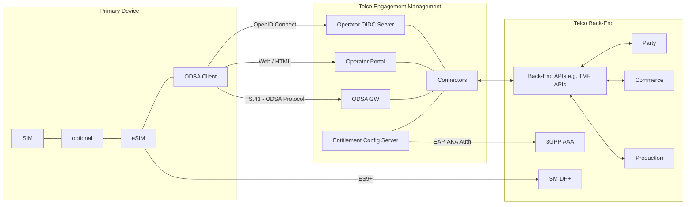

Figure 11. ODSA for Primary eSIM devices, architecture, and TS.43 positioning

This specification does not cover the HTML-based interactions between the ODSA application and the Service Provider’s portal web server (labelled as the “Operator Portal” in Figure 10 and Figure 11). The ODSA web server can be used to present different subscription options to the end-user and capture Terms & Conditions agreements.

The product implementations for the Entitlement Configuration Server and the Service Provider’s portal web server shall protect the privacy of the subscriber and of the end-user on all data that could be used for tracking such as ICCID, MSISDN, EID.

Instead of just one entitlement configuration request, the ODSA application requires several exchanges with the Entitlement Configuration Server. Each exchange is associated with an operation, resulting in the need of a new string-based `operation` request parameter.

Table 26 presents the allowed operations for the eSIM ODSA procedure.

<table>
  <thead>
    <tr>
        <th>ODSA Operation</th>
        <th></th>
        <th>Description</th>
        <th></th>
    </tr>
  </thead>
  <tbody>
    <tr>
        <td>CheckEligibility</td>
        <td>To verify if end-user is allowed to invoke the ODSA application</td>
        <td colspan="2"></td>
    </tr>
    <tr>
        <td>ManageSubscription</td>
        <td>To request for subscription-related action on a primary or companion device.</td>
        <td colspan="2"></td>
    </tr>
    <tr>
        <td>ManageService</td>
        <td>To activate / deactivate the service on the primary or companion device. This is an optional operation.</td>
        <td colspan="2"></td>
    </tr>
    <tr>
        <td>AcquireConfiguration</td>
        <td>To provide service-related data about a primary or companion device.</td>
        <td colspan="2"></td>
    </tr>
  </tbody>
</table>


TS.43 v12.0
Page 57 of 248

GSM Association Non-confidential
Official Document TS.43 - Service Entitlement Configuration


<table>
  <thead>
    <tr>
        <th>ODSA Operation</th>
        <th></th>
        <th>Description</th>
        <th></th>
    </tr>
  </thead>
  <tbody>
    <tr>
        <td>AcquirePlan</td>
        <td>To request available plans to be offered by the MNO to a specific user or MDM</td>
        <td colspan="2"></td>
    </tr>
    <tr>
        <td>AcquireTemporaryToken</td>
        <td>To request a Temporary Token from the ECS, to allow authentication for a device that may not have the means to acquire the TOKEN</td>
        <td colspan="2"></td>
    </tr>
  </tbody>
</table>
<center>Table 26. ODSA Operations</center>

## 6.2 ODSA Request Parameters

The ODSA procedure for Primary and Companion devices requires additional parameters in the HTTP requests, outside of the ones described in 2.2. Table 27 presents the new parameters and their associated ODSA operations.

<table>
  <thead>
    <tr>
        <th>New GET parameters for ODSA application</th>
        <th></th>
        <th>Type</th>
        <th></th>
        <th>Values</th>
        <th></th>
        <th>Description</th>
        <th></th>
    </tr>
  </thead>
  <tbody>
    <tr>
        <td>operation</td>
        <td>String</td>
        <td>CheckEligibility ,<br/>ManageSubscription,<br/>ManageService,<br/>AcquireConfiguration,<br/>AcquirePlan,<br/>AcquireTemporaryToken,<br/>GetPhoneNumber,<br/>VerifyPhoneNumber,<br/>GetSubscriberInfo</td>
        <td>Indicates the operation requested by the “ODSA for eSIM device” application</td>
        <td colspan="4"></td>
    </tr>
    <tr>
        <td>operation_type</td>
        <td>Integer</td>
        <td colspan="2">Used by the ManageSubscription operation.</td>
        <td colspan="4"></td>
    </tr>
    <tr>
        <td rowspan="7"></td>
        <td rowspan="7"></td>
        <td>0 - SUBSCRIBE</td>
        <td>to activate a subscription for the eSIM device.</td>
        <td colspan="4"></td>
    </tr>
    <tr>
        <td>1 - UNSUBSCRIBE</td>
        <td>to cancel a subscription for the eSIM device.</td>
        <td colspan="4"></td>
    </tr>
    <tr>
        <td>2 – CHANGE SUBSCRIPTION</td>
        <td>to manage an existing subscription on the eSIM device.</td>
        <td colspan="4"></td>
    </tr>
    <tr>
        <td>3 – TRANSFER SUBSCRIPTION</td>
        <td>to transfer a subscription from an existing device (with physical SIM or eSIM) to the eSIM device</td>
        <td colspan="4"></td>
    </tr>
    <tr>
        <td>4 – UPDATE SUBSCRIPTION</td>
        <td>to inform the network of a subscription update on the eSIM device</td>
        <td colspan="4"></td>
    </tr>
    <tr>
        <td>5 – ACTIVATE TERMINAL ICCID</td>
        <td>to inform the network that the terminal_iccid or companion_terminal_iccid which is in a ServiceStatus DEACTIVATED state can be moved to an ACTIVATED state</td>
        <td colspan="4"></td>
    </tr>
    <tr>
        <td>6 – DEACTIVATE TERMINAL ICCID</td>
        <td>to inform the network that the terminal_iccid or companion_terminal_iccid which is in a ServiceStatus ACTIVATED state can be moved to a DEACTIVATED state</td>
        <td colspan="4"></td>
    </tr>
  </tbody>
</table>


TS.43 v12.0 Page 58 of 248

GSM Association
Non-confidential
Official Document TS.43 - Service Entitlement Configuration


<table>
  <tbody>
    <tr>
        <td>New GET parameters for ODSA application</td>
        <td>Type</td>
        <td>Values</td>
        <td>Description</td>
    </tr>
    <tr>
        <td rowspan="4"></td>
        <td rowspan="4"></td>
        <td>7 – ACTIVE SUBSCRIPTION RECOVER</td>
        <td>to inform the network that the eSIM profile represented by the terminal_iccid has been removed by the end user via factory reset or other operations, the end user would like to recover the active subscription associated to it.</td>
    </tr>
    <tr>
        <td colspan="2">Used by the `ManageService` operation.</td>
    </tr>
    <tr>
        <td>10 – ACTIVATE SERVICE</td>
        <td>Indicates this is a request to activate a service on the eSIM device.</td>
    </tr>
    <tr>
        <td>11 – DEACTIVATE SERVICE</td>
        <td>Indicates this is a request to deactivate a service on the eSIM device.</td>
    </tr>
    <tr>
        <td rowspan="2">operation_targets</td>
        <td rowspan="2">String</td>
        <td colspan="2">Used by the `AcquireTemporaryToken` operation.</td>
    </tr>
    <tr>
        <td>Comma separated list of the operation field found in this table</td>
        <td>To acquire a temporary token associated with the ODSA operation(s) and AppID.</td>
    </tr>
    <tr>
        <td rowspan="2">companion_terminal_id</td>
        <td rowspan="2">String</td>
        <td colspan="2">Used by **all** the Companion ODSA operations.</td>
    </tr>
    <tr>
        <td>Any string value</td>
        <td>This value shall be a unique and persistent identifier of the device. This identifier may be an IMEI (preferred) or a UUID.</td>
    </tr>
    <tr>
        <td rowspan="2">companion_terminal_vendor<br/>(Conditional)</td>
        <td rowspan="2">String</td>
        <td colspan="2">Used by the operations `CheckEligibility`, `ManageSubscription` and `ManageService` for Companion ODSA. It shall be present in a `ManageSubscription` request.</td>
    </tr>
    <tr>
        <td>Any string value</td>
        <td>Manufacturer of the companion device.</td>
    </tr>
    <tr>
        <td rowspan="2">companion_terminal_model<br/>(Optional)</td>
        <td rowspan="2">String</td>
        <td colspan="2">Used by the operations `CheckEligibility`, `ManageSubscription` and `ManageService` for Companion ODSA.</td>
    </tr>
    <tr>
        <td>Any string value</td>
        <td>Model of the companion device.</td>
    </tr>
    <tr>
        <td rowspan="2">companion_terminal_sw_version<br/>(Optional)</td>
        <td rowspan="2">String</td>
        <td colspan="2">Used by the operations `CheckEligibility`, `ManageSubscription` and `ManageService` for Companion ODSA.</td>
    </tr>
    <tr>
        <td>Any string value</td>
        <td>Software version of the companion device.</td>
    </tr>
    <tr>
        <td rowspan="2">companion_terminal_friendly_name<br/>(Conditional)</td>
        <td rowspan="2">String</td>
        <td colspan="2">Used by the operations `CheckEligibility`, `ManageSubscription` and `ManageService` for Companion ODSA. It shall be present in a `ManageSubscription` request during the device activation flow.</td>
    </tr>
    <tr>
        <td>Any string value</td>
        <td>User-friendly identification for the companion device which can be used by the Service Provider in Web Views.</td>
    </tr>
    <tr>
        <td>companion_terminal_service</td>
        <td>String</td>
        <td colspan="2">Used by the `ManageSubscription` and `ManageService` operation for Companion ODSA.</td>
    </tr>
  </tbody>
</table>


TS.43 v12.0 Page 59 of 248

GSM Association
Non-confidential
Official Document TS.43 - Service Entitlement Configuration


<table>
  <thead>
    <tr>
        <th>(Conditional)</th>
        <th rowspan="3"></th>
        <th>`SharedNumber`</th>
        <th>Indicates that the service being managed is “Shared Number”, where the companion device carries the same MSISDN as the primary device.<br/>This parameter shall be included as part of the ManageService operation in order to indicate which service is being managed. It is optional to include as part of the ManageSubscription operation.</th>
        <th></th>
    </tr>
    <tr>
        <th></th>
        <th>`DiffNumber`</th>
        <th>Indicates that the service being managed is “Different Number”, where the companion device carries a different MSISDN from the primary device but is assigned to the same subscriber.<br/>This parameter shall be included as part of the ManageService operation in order to indicate which service is being managed. It is optional to include as part of the ManageSubscription operation.</th>
        <th></th>
    </tr>
    <tr>
        <th></th>
        <th>`FamilyNumber`</th>
        <th>Indicates that the service being managed is “Family Number”, where the companion device carries a different MSISDN from the primary device and the MSISDN can be assigned to another individual or subscriber.<br/><br/>This parameter shall be included as part of the ManageService operation in order to indicate which service is being managed. It is optional to include as part of the ManageSubscription operation.</th>
        <th></th>
    </tr>
  </thead>
  <tbody>
    <tr>
        <td>New GET parameters for ODSA application</td>
        <td>Type</td>
        <td>Values</td>
        <td>Description</td>
        <td></td>
    </tr>
    <tr>
        <td>companion_terminal_iccid<br/>(Conditional)</td>
        <td>String</td>
        <td colspan="2">Used by the `ManageSubscription`, `ManageService` and `AcquireConfiguration` operations for Companion ODSA.</td>
        <td></td>
    </tr>
    <tr>
        <td></td>
        <td></td>
        <td>Value following the ICCID format</td>
        <td>The ICCID of the companion device being managed, provided only if there is an eSIM profile on the companion’s eUICC.<br/>This parameter shall be included in the ManageService operation to indicate which ICCID is being managed. It is optional to include this parameter as part of the ManageSubscription and AcquireConfiguration operations.</td>
        <td></td>
    </tr>
    <tr>
        <td>companion_terminal_eid<br/>(Conditional)</td>
        <td>String</td>
        <td colspan="2">Used by the `ManageSubscription` and `AcquireConfiguration` operations for Companion ODSA. It shall be present in a `ManageSubscription` request.</td>
        <td></td>
    </tr>
    <tr>
        <td></td>
        <td></td>
        <td>Value following eUICC format</td>
        <td>eUICC identifier (EID) of the companion device being managed</td>
        <td></td>
    </tr>
  </tbody>
</table>


TS.43 v12.0
Page 60 of 248

GSM Association
Non-confidential
Official Document TS.43 - Service Entitlement Configuration


<table>
  <thead>
    <tr>
        <th>New GET parameters for ODSA application</th>
        <th></th>
        <th>Type</th>
        <th></th>
        <th>Values</th>
        <th></th>
        <th>Description</th>
        <th></th>
    </tr>
  </thead>
  <tbody>
    <tr>
        <td>old_companion_terminal_id<br/>(Conditional)</td>
        <td>String</td>
        <td colspan="2">Used by the `ManageSubscription` operation for Companion ODSA when the user selected an `old_companion_terminal_id` using a Companion ODSA client that's supports a standalone eSIM management MMI.</td>
        <td colspan="4"></td>
    </tr>
    <tr>
        <td></td>
        <td></td>
        <td>Any string value</td>
        <td>A unique identifier for the companion device. Suggested source is the IMEI of the device.</td>
        <td colspan="4"></td>
    </tr>
    <tr>
        <td>old_companion_terminal_iccid<br/>(Conditional)</td>
        <td>String</td>
        <td colspan="2">Used by the `ManageSubscription` operation for Companion ODSA when the user selected an `old_companion_terminal_iccid` using a Companion ODSA client that's supports a standalone eSIM management MMI.</td>
        <td colspan="4"></td>
    </tr>
    <tr>
        <td></td>
        <td></td>
        <td>Any string value</td>
        <td>The old ICCID of the companion device being managed, provided only if there is an eSIM profile on the companion's eUICC</td>
        <td colspan="4"></td>
    </tr>
    <tr>
        <td></td>
        <td colspan="3"></td>
        <td></td>
        <td colspan="3"></td>
    </tr>
    <tr>
        <td>terminal_iccid<br/>(Optional)</td>
        <td>String</td>
        <td colspan="2">Used by the `ManageSubscription` and `AcquireConfiguration` operations for Primary ODSA, in case a primary SIM is not accessible (or not present). `terminal_id` is associated with the device or eSIM being managed.</td>
        <td colspan="4"></td>
    </tr>
    <tr>
        <td></td>
        <td></td>
        <td>Any string value</td>
        <td>The ICCID of the primary eSIM being managed</td>
        <td colspan="4"></td>
    </tr>
    <tr>
        <td>terminal_eid<br/>(Optional)</td>
        <td>String</td>
        <td colspan="2">Used by the `ManageSubscription` and `AcquireConfiguration` operations for Primary ODSA, in case a primary SIM is not accessible (or not present). `terminal_id` is associated with the device or eSIM being managed.</td>
        <td colspan="4"></td>
    </tr>
    <tr>
        <td></td>
        <td></td>
        <td>Value following eUICC format</td>
        <td>eUICC identifier (EID) of the primary eSIM being managed</td>
        <td colspan="4"></td>
    </tr>
    <tr>
        <td></td>
        <td colspan="3"></td>
        <td></td>
        <td colspan="3"></td>
    </tr>
    <tr>
        <td>target_terminal_id<br/>(Conditional)</td>
        <td>String</td>
        <td colspan="2">Used by the `CheckEligibility`, `ManageSubscription` and `AcquireConfiguration` operations for Primary ODSA. This parameter provides the identity of the eSIM being managed.<br/>For the transfer subscription use case, this parameter (ID) is expected to be the **IMEI** of the new/targeted device.</td>
        <td colspan="4"></td>
    </tr>
    <tr>
        <td></td>
        <td></td>
        <td>Any string value</td>
        <td>This value shall be a unique and persistent identifier of the eUICC being managed. This identifier may be an IMEI associated with the eUICC.</td>
        <td colspan="4"></td>
    </tr>
    <tr>
        <td>target_terminal_iccid<br/>(Optional)</td>
        <td>String</td>
        <td colspan="2">Used by the `ManageSubscription` and `AcquireConfiguration` operations for Primary ODSA</td>
        <td colspan="4"></td>
    </tr>
    <tr>
        <td></td>
        <td></td>
        <td>Value following the ICCID format</td>
        <td>The ICCID of the primary eSIM being managed</td>
        <td colspan="4"></td>
    </tr>
    <tr>
        <td>target_terminal_eid<br/>(Optional)</td>
        <td>String</td>
        <td colspan="2">Used by the `ManageSubscription` and `AcquireConfiguration` operations for Primary ODSA.<br/>For the transfer subscription use case, this parameter (EID) is expected to be the **EID** of the new/target device.</td>
        <td colspan="4"></td>
    </tr>
    <tr>
        <td></td>
        <td></td>
        <td>Value following eUICC format</td>
        <td>eUICC identifier (EID) of the primary eSIM being managed</td>
        <td colspan="4"></td>
    </tr>
  </tbody>
</table>


TS.43 v12.0
Page 61 of 248

GSM Association
Non-confidential
Official Document TS.43 - Service Entitlement Configuration


<table>
  <thead>
    <tr>
        <th>New GET parameters for ODSA application</th>
        <th></th>
        <th>Type</th>
        <th></th>
        <th>Values</th>
        <th></th>
        <th>Description</th>
        <th></th>
    </tr>
  </thead>
  <tbody>
    <tr>
        <td>old_terminal_id<br/>(Optional)</td>
        <td>String</td>
        <td rowspan="2">Used by the `ManageSubscription/Transfer Subscription` for Primary ODSA in case the request is created by an old primary device.</td>
        <td colspan="5"></td>
    </tr>
    <tr>
        <td>[empty]</td>
        <td>[empty]</td>
        <td>Value following `terminal_id` format</td>
        <td>The unique identifier, for example IMEI (preferred) or a UUID for the old primary device.</td>
        <td colspan="3"></td>
    </tr>
    <tr>
        <td>old_terminal_iccid<br/>(Optional)</td>
        <td>String</td>
        <td rowspan="2">Used by the `ManageSubscription/Transfer Subscription` for Primary ODSA in case the request is created by an old primary device.</td>
        <td colspan="5"></td>
    </tr>
    <tr>
        <td>[empty]</td>
        <td>[empty]</td>
        <td>Value following the ICCID format</td>
        <td>The Profile’s ICCID of an old primary device to be selected by an end-user for subscription transfer to a new primary device.</td>
        <td colspan="3"></td>
    </tr>
    <tr>
        <td>redownloadable_profile<br/>(Optional)</td>
        <td>Integer</td>
        <td rowspan="3">Used by the `ManageSubscription/Transfer Subscription` for Primary ODSA to identify if the device supports eSIM Transfer with redownloadable profile.</td>
        <td colspan="5"></td>
    </tr>
    <tr>
        <td>[empty]</td>
        <td>[empty]</td>
        <td>0 – NOT SUPPORTED</td>
        <td>Device doesn’t support redownloadable profile flow</td>
        <td colspan="3"></td>
    </tr>
    <tr>
        <td>[empty]</td>
        <td>[empty]</td>
        <td>1 – SUPPORTED</td>
        <td>Device supports redownloadable profile flow</td>
        <td colspan="3"></td>
    </tr>
    <tr>
        <td colspan="4"></td>
        <td colspan="4"></td>
    </tr>
    <tr>
        <td>enterprise_id<br/>(Optional)</td>
        <td>String</td>
        <td rowspan="2">Used by the operations `CheckEligibility` for server-initiated ODSA</td>
        <td colspan="5"></td>
    </tr>
    <tr>
        <td>[empty]</td>
        <td>[empty]</td>
        <td>Any string value</td>
        <td>Identifier provided by the MNO to identify the enterprise</td>
        <td colspan="3"></td>
    </tr>
    <tr>
        <td>enterprise_terminal_id<br/>(Optional)</td>
        <td>String</td>
        <td rowspan="2">Used by the `ManageSubscription` and `AcquireConfiguration` operations for server-initiated ODSA.</td>
        <td colspan="5"></td>
    </tr>
    <tr>
        <td>[empty]</td>
        <td>[empty]</td>
        <td>Any string value</td>
        <td>This value shall be a unique and persistent identifier of the enterprise device. This identifier may be an IMEI (preferred).</td>
        <td colspan="3"></td>
    </tr>
    <tr>
        <td>enterprise_terminal_eid<br/>(Optional)</td>
        <td>String</td>
        <td rowspan="2">Used by the `ManageSubscription` and `AcquireConfiguration` operations for server-initiated ODSA.</td>
        <td colspan="5"></td>
    </tr>
    <tr>
        <td>[empty]</td>
        <td>[empty]</td>
        <td>Any string value</td>
        <td>eUICC identifier (EID) of the device being managed</td>
        <td colspan="3"></td>
    </tr>
    <tr>
        <td>plan_id<br/>(Optional)</td>
        <td>String</td>
        <td rowspan="2">Used by the operations `ManageSubscription` for server-initiated ODSA to identify the selected plan for a specific subscriber identified by `enterprise_terminal_id` and `enterprise_terminal_eid`</td>
        <td colspan="5"></td>
    </tr>
    <tr>
        <td>[empty]</td>
        <td>[empty]</td>
        <td>Any string value</td>
        <td>Identifier of the specific plan offered by an MNO</td>
        <td colspan="3"></td>
    </tr>
    <tr>
        <td colspan="4"></td>
        <td colspan="4"></td>
    </tr>
    <tr>
        <td>MSG_btn<br/>(Conditional)</td>
        <td>Integer</td>
        <td rowspan="3">Used by the `ManageSubscription` operation for Primary ODSA. This indicates either “Accept” or “Reject” button has been pressed on the device UI.</td>
        <td colspan="5"></td>
    </tr>
    <tr>
        <td>[empty]</td>
        <td>[empty]</td>
        <td>0 – REJECTED</td>
        <td>MSG content has been rejected by the user.</td>
        <td colspan="3"></td>
    </tr>
    <tr>
        <td>[empty]</td>
        <td>[empty]</td>
        <td>1 – ACCEPTED</td>
        <td>MSG content has been accepted by the user.</td>
        <td colspan="3"></td>
    </tr>
    <tr>
        <td>MSG_response<br/>(Conditional)</td>
        <td>String</td>
        <td>Used by the `ManageSubscription` operation for Primary ODSA. This indicates the response entered by the user on the device UI. This field shall only be present if user ACCEPTED, and the user has entered a value.</td>
        <td>[empty]</td>
        <td colspan="4"></td>
    </tr>
  </tbody>
</table>


TS.43 v12.0
Page 62 of 248

GSM Association
Non-confidential
Official Document TS.43 - Service Entitlement Configuration


<table>
  <thead>
    <tr>
        <th>New GET parameters for ODSA application</th>
        <th></th>
        <th>Type</th>
        <th></th>
        <th>Values</th>
        <th></th>
        <th>Description</th>
        <th></th>
    </tr>
  </thead>
  <tbody>
    <tr>
        <td rowspan="8">MSG_character_display_limits<br/>(Optional)</td>
        <td rowspan="8">List of Integers</td>
        <td>Any string value</td>
        <td>Value entered by the user.</td>
        <td colspan="4"></td>
    </tr>
    <tr>
        <td colspan="2">Used by the `ManageSubscription` and `AcquireConfiguration` during an ODSA operation. A comma-separated ordered list of non-zero, positive integers representing of the character limits the client application can display to the user without modification. If there is no limit, the value of -1 shall be sent.</td>
        <td colspan="4"></td>
    </tr>
    <tr>
        <td>-1 or non-Zero Integer value</td>
        <td>Title character limit is in the 1st position of the list.</td>
        <td colspan="4"></td>
    </tr>
    <tr>
        <td>-1 or non-Zero Integer value</td>
        <td>Message character limit is in the 2nd position of the list.</td>
        <td colspan="4"></td>
    </tr>
    <tr>
        <td>-1 or non-Zero Integer value</td>
        <td>Accept_btn_label character limit is in the 3rd position of the list.</td>
        <td colspan="4"></td>
    </tr>
    <tr>
        <td>-1 or non-Zero Integer value</td>
        <td>Reject_btn_label character limit is in the 4th position of the list.</td>
        <td colspan="4"></td>
    </tr>
    <tr>
        <td>-1 or non-Zero Integer value</td>
        <td>Accept_freetext_hint character limit is in the 5th position of the list.</td>
        <td colspan="4"></td>
    </tr>
    <tr>
        <td>-1 or non-Zero Integer value</td>
        <td>Accept_freetext_validation_failed_error_text character limit is in the 6th position of the list.</td>
        <td colspan="4"></td>
    </tr>
    <tr>
        <td rowspan="2">msisdn<br/>(Conditional)</td>
        <td>String</td>
        <td colspan="2">Used by the `VerifyPhoneNumber` operation to compare this value with the one mapped to the token generated during the Authentication process.</td>
        <td colspan="4"></td>
    </tr>
    <tr>
        <td>MSISDN of the subscription in E.164 format.</td>
        <td>MSISDN to verify.</td>
        <td colspan="5"></td>
    </tr>
  </tbody>
</table>
<center>Table 27. New parameters for ODSA application</center>

### 6.3 Devices Identifiers used for Request Parameters

Table 4 and Table 27 present a number of identity parameters (ending with `_ID`, `_id`, `_eid` or `_iccid`) that need to be associated with an identifier on the primary or companion device. The following offers the mapping between device identifiers and identity parameters for companion and primary ODSA use cases and their different operations.

Figure 12 shows the suggested association between identity parameters $\leftrightarrow$ device identifiers for the Companion ODSA use case where a requesting device's SIM is accessible. Authentication is performed using EAP-AKA with that SIM.


TS.43 v12.0
Page 63 of 248

GSM Association
Non-confidential
Official Document TS.43 - Service Entitlement Configuration


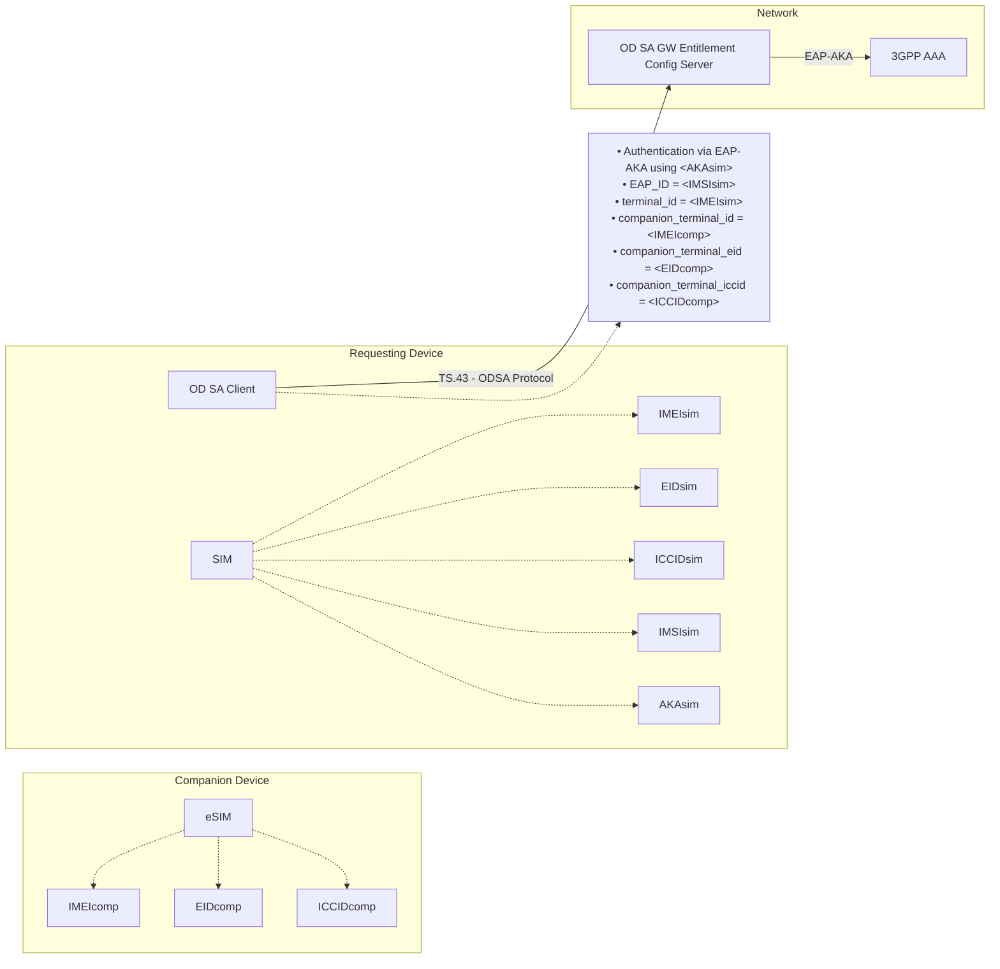

Figure 12. Identifier Mapping for Companion ODSA with access to SIM on Requesting Device

Figure 13 shows the suggested association between identity parameters $\leftrightarrow$ device identifiers for the Companion ODSA use case where a SIM on the requesting device is not accessible. Authentication is performed using OAuth 2.0 / OIDC. Note the use of the application's UUID in case the requesting device's IMEI is not known.

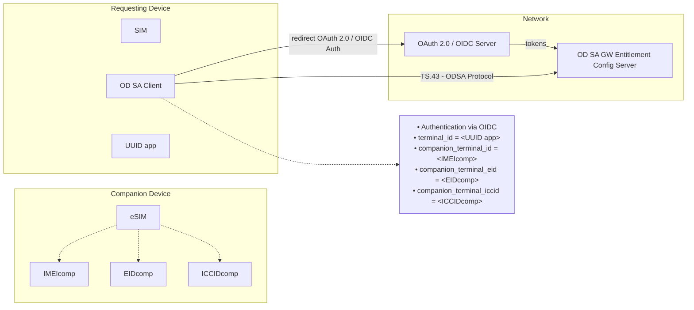

Figure 13. Identifier Mapping for Companion ODSA when Requesting Device's SIM is not present or accessible.

Figure 14 shows the suggested association between identity parameters $\leftrightarrow$ device identifiers for the Primary ODSA use case where a SIM on the device that belongs to the Service Provider is accessible. Authentication is performed using EAP-AKA with that SIM.


TS.43 v12.0
Page 64 of 248

GSM Association
Non-confidential
Official Document TS.43 - Service Entitlement Configuration


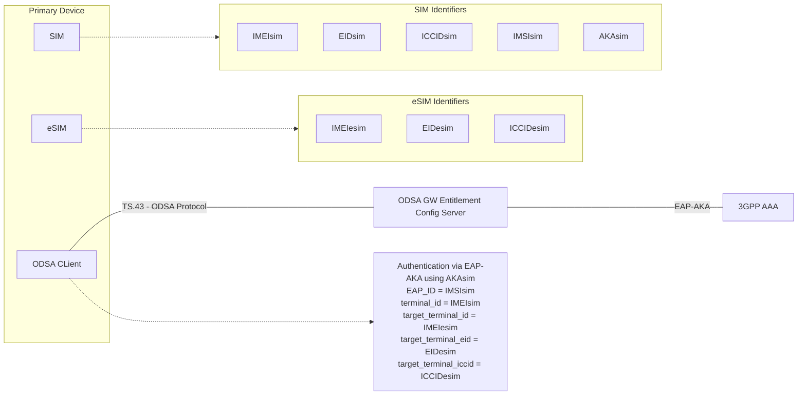

*Figure 14. Identifier Mapping for Primary ODSA with access to a SIM*

Figure 15 shows the suggested association between identity parameters $\leftrightarrow$ device identifiers for the Primary ODSA use case where the data and AKA of a primary SIM is not accessible (or not present). Authentication is performed using OAuth 2.0 / OIDC.

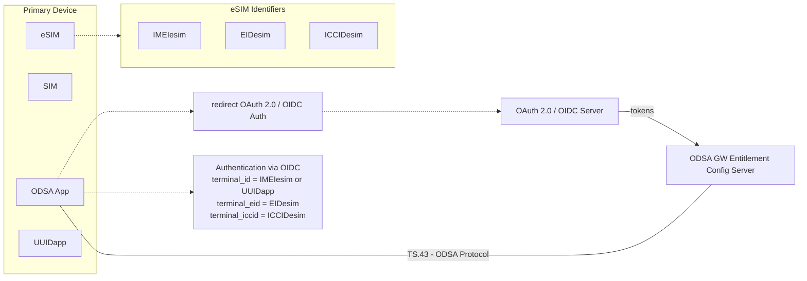

*Figure 15. Identifier Mapping for Primary ODSA when existing SIM data is not accessible or not present.*

Figure 16 shows the suggested association between identity parameters $\leftrightarrow$ device/server identifiers for the Server-Initiated ODSA use case. Authentication is performed using server-to-server OAuth 2.0 as described in section 2.8.3.


TS.43 v12.0
Page 65 of 248

GSM Association Non-confidential
Official Document TS.43 - Service Entitlement Configuration


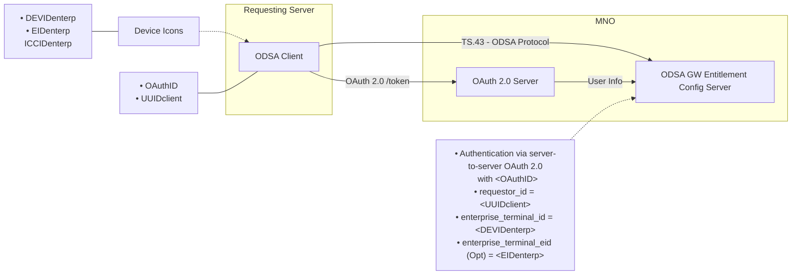

<center>Figure 16. Identifier Mapping for Server-initiated ODSA</center>

Figure 17 shows the suggested association between identity parameters $\leftrightarrow$ device identifiers for the Primary ODSA use case with Subscription Transfer where the old Primary Device’s SIM data is accessible. Authentication is performed using EAP-AKA with that SIM.

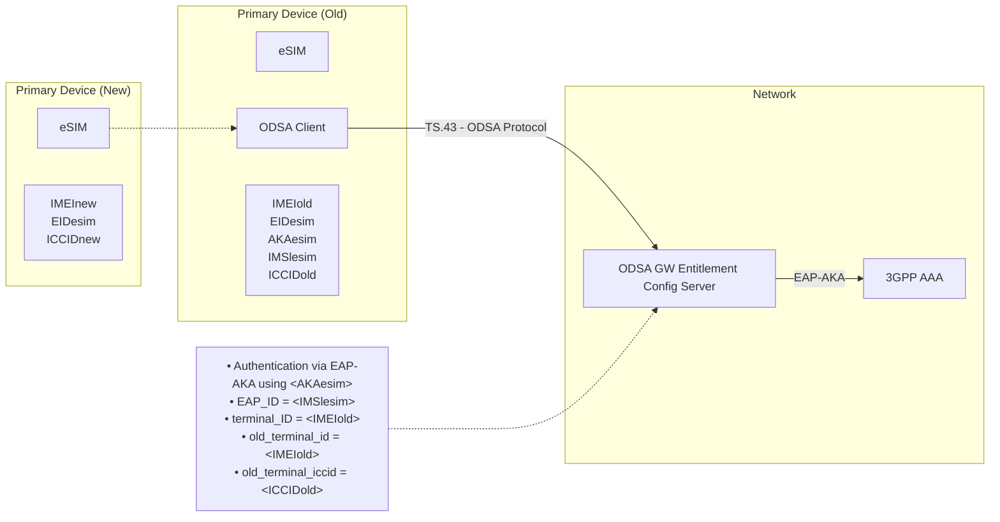

<center>Figure 17: Identifier Mapping for Primary ODSA when Requesting Device’s SIM data is accessible.</center>

### 6.4 Examples of ODSA Requests

This section presents samples of ODSA requests using the GET method. It is also possible to use the POST method as indicated in section 2.4. In the POST case, the parameters would be located in the message body as a JSON object instead of being in the HTTP query string.

#### 6.4.1 CheckEligibility Request Example

Table 28 presents an example for the CheckEligibility operation for an ODSA application.


TS.43 v12.0 Page 66 of 248

GSM Association Non-confidential
Official Document TS.43 - Service Entitlement Configuration


```http
GET ? terminal_id = 013787006099944&
token = es7w1erXjh%2FEC%2FP8BV44SBmVipg&
terminal_vendor = TVENDOR&
terminal_model = TMODEL&
terminal_sw_version = TSWVERS&
entitlement_version = ENTVERS&
app = ap2006&
operation = CheckEligibility&
companion_terminal_id = 98112687006099944&
vers = 1 HTTP/1.1

Host: entitlement.telco.net:9014
User-Agent: PRD-TS43 TVENDOR/TMODEL Primary-ODSA/TSWVERS OS-Android/8.0
Accept: text/html,application/xhtml+xml,application/xml;q=0.9,*/*;q=0.8
Accept-Language: en-US,en;q=0.5
Accept-Encoding: gzip, deflate
Connection: keep-alive
```

*Table 28. Example of a CheckEligibility ODSA Request*

### 6.4.2 ManageSubscription Request Example

Table 29 presents an example for the Manage Subscription operation for an ODSA application.

```http
GET ? terminal_id = 013787006099944&
token = es7w1erXjh%2FEC%2FP8BV44SBmVipg&
entitlement_version = ENTVERS
app = ap2006&
operation = ManageSubscription&
operation_type = 0&                        ! subscribe
companion_terminal_id = 98112687006099944&
companion_terminal_eid = JHSDHljhsdfy763hh&
vers = 1 HTTP/1.1

Host: entitlement.telco.net:9014
User-Agent: PRD-TS43 TVENDOR/TMODEL Primary-ODSA/TSWVERS OS-Android/8.0
Accept: text/html,application/xhtml+xml,application/xml;q=0.9,*/*;q=0.8
Accept-Language: en-US,en;q=0.5
Accept-Encoding: gzip, deflate
Connection: keep-alive
```

*Table 29. Example of a ManageSubscription ODSA Request*

### 6.4.3 ManageService Request Example

Table 30 presents an example for the Manage Service operation for an ODSA application.


TS.43 v12.0 Page 67 of 248

GSM Association Non-confidential
Official Document TS.43 - Service Entitlement Configuration


```
GET ? terminal_id = 013787006099944&
token = es7w1erXjh%2FEC%2FP8BV44SBmVipg&
terminal_vendor = TVENDOR&
terminal_model = TMODEL&
terminal_sw_version = TSWVERS&
entitlement_version = ENTVERS&
app = ap2006&
operation = ManageService&
operation_type = 10&                                    ! activate service
companion_terminal_id = 98112687006099944&
companion_terminal_service = DiffNumber&
companion_terminal_iccid = 89000123766789001878&
vers = 1 HTTP/1.1

Host: entitlement.telco.net:9014
User-Agent: PRD-TS43 TVENDOR/TMODEL Primary-ODSA/TSWVERS OS-Android/8.0
Accept: text/html,application/xhtml+xml,application/xml;q=0.9,*/*;q=0.8
Accept-Language: en-US,en;q=0.5
Accept-Encoding: gzip, deflate
Connection: keep-alive
```

Table 30. Example of a ManageService ODSA Request

### 6.4.4 AcquireConfiguration Request Example

Table 31 presents an example for the Acquire Configuration operation for an ODSA application.

```
GET ? terminal_id = 013787006099944&
token = es7w1erXjh%2FEC%2FP8BV44SBmVipg&
terminal_vendor = TVENDOR&
terminal_model = TMODEL&
terminal_sw_version = TSWVERS&
entitlement_version = ENTVERS&
app = ap2006&
operation = AcquireConfiguration&
companion_terminal_id = 98112687006099944&
vers = 1 HTTP/1.1
MSG_character_display_limits=55,270,20,20,40,45

Host: entitlement.telco.net:9014
User-Agent: PRD-TS43 TVENDOR/TMODEL Primary-ODSA/TSWVERS OS-Android/8.0
Accept: text/html,application/xhtml+xml,application/xml;q=0.9,*/*;q=0.8
Accept-Language: en-US,en;q=0.5
Accept-Encoding: gzip, deflate
Connection: keep-alive
```

Table 31. Example of an AcquireConfiguration ODSA Request

### 6.4.5 AcquirePlan Request Example

Table 32 presents an example for the AcquirePlan operation for a server ODSA application.


TS.43 v12.0 Page 68 of 248

GSM Association Non-confidential
Official Document TS.43 - Service Entitlement Configuration


```http
GET ? requestor_id = 06170799658&
token = es7w1erXjh%2FEC%2FP8BV44SBmVipg&
terminal_vendor = TVENDOR&
terminal_model = TMODEL&
terminal_sw_version = TSWVERS&
entitlement_version = ENTVERS&
app = ap2011&
operation = AcquirePlan&                    ! get plans
vers = 1 HTTP/1.1

Host: entitlement.telco.net:9014
User-Agent: PRD-TS43 TVENDOR/TMODEL Primary-ODSA/TSWVERS OS-Android/8.0
Accept: text/html,application/xhtml+xml,application/xml;q=0.9,*/*;q=0.8
Accept-Language: en-US,en;q=0.5
Accept-Encoding: gzip, deflate
Connection: keep-alive
```

Table 32. Example of an AcquirePlan ODSA Request

### 6.4.6 AcquireTemporaryToken Request Example

Table 33 presents an example for the `AcquireTemporaryToken` operation for a server ODSA application.

```http
GET ? terminal_id = 06170799658&
token = es7w1erXjh%2FEC%2FP8BV44SBmVipg&
terminal_vendor = TVENDOR&
terminal_model = TMODEL&
terminal_sw_version = TSWVERS&
entitlement_version = ENTVERS&
terminal_iccid = 9815151513513213513513&
operation_targets = ManageSubscription%2CAcquireConfiguration&
app = ap2009&
operation = AcquireTemporaryToken&
vers = 1 HTTP/1.1

Host: entitlement.telco.net:9014
User-Agent: PRD-TS43 TVENDOR/TMODEL Primary-ODSA/TSWVERS OS-Android/8.0
Accept: text/html,application/xhtml+xml,application/xml;q=0.9,*/*;q=0.8
Accept-Language: en-US,en;q=0.5
Accept-Encoding: gzip, deflate
Connection: keep-alive
```

Table 33. Example of an AcquireTemporaryToken ODSA Request

### 6.4.7 GetPhoneNumber Request Example

Following sections provides some examples depending on the device sending the `getPhoneNumber` request (device or application server).

#### 6.4.7.1 GetPhoneNumber request for client

Table 34 presents an example for the `GetPhoneNumber` operation for a primary client.


TS.43 v12.0 Page 69 of 248

GSM Association Non-confidential
Official Document TS.43 - Service Entitlement Configuration


```http
GET ? terminal_id = 09999799658&
token = es7w1erXjh%2FEC%2FP8BV44SBmVipg &
terminal_vendor = TVENDOR&
terminal_model = TMODEL&
terminal_sw_version = TSWVERS&
entitlement_version = ENTVERS&
app = ap2014&
operation = GetPhoneNumber&
vers = 1 HTTP/1.1

Host: entitlement.telco.net:9014
User-Agent: PRD-TS43 TVENDOR/TMODEL Primary-ODSA/TSWVERS OS-Android/8.0
Accept: text/html,application/xhtml+xml,application/xml;q=0.9,*/*;q=0.8
Accept-Language: en-US,en;q=0.5
Accept-Encoding: gzip, deflate
Connection: keep-alive
```

Table 34. Example of an GetPhoneNumber primary client Request

### 6.4.7.2 GetPhoneNumber request sent by application server.

Table 35 presents an example for the GetPhoneNumber operation for an application server.

```http
GET ? requestor_id = 06170799658&
temporary_token = es7w1erXjh%2FEC%2FP8BV44SBmVipg&
access_token = 32487234987238974& //OPTIONAL
terminal_vendor = TVENDOR&
terminal_model = TMODEL&
terminal_sw_version = TSWVERS&
entitlement_version = ENTVERS&
app = ap2014&
operation = GetPhoneNumber&
vers = 1 HTTP/1.1

Host: entitlement.telco.net:9014
User-Agent: PRD-TS43 TVENDOR/TMODEL Primary-ODSA/TSWVERS OS-Android/8.0
Accept: text/html,application/xhtml+xml,application/xml;q=0.9,*/*;q=0.8
Accept-Language: en-US,en;q=0.5
Accept-Encoding: gzip, deflate
Connection: keep-alive
```

Table 35. Example of an GetPhoneNumber application server Request

### 6.4.8 VerifyPhoneNumber Request Example

Table 36 presents an example for the VerifyPhoneNumber operation.


TS.43 v12.0 Page 70 of 248

GSM Association
Non-confidential
Official Document TS.43 - Service Entitlement Configuration


```http
GET ? terminal_id = 09999799658&
token = es7w1erXjh%2FEC%2FP8BV44SBmVipg &
terminal_vendor = TVENDOR&
terminal_model = TMODEL&
terminal_sw_version = TSWVERS&
entitlement_version = ENTVERS&
app = ap2014&
operation = VerifyPhoneNumber&
msisdn = <MSISDN>&
vers = 1 HTTP/1.1

Host: entitlement.telco.net:9014
User-Agent: PRD-TS43 TVENDOR/TMODEL Primary-ODSA/TSWVERS OS-Android/8.0
Accept: text/html,application/xhtml+xml,application/xml;q=0.9,*/*;q=0.8
Accept-Language: en-US,en;q=0.5
Accept-Encoding: gzip, deflate
Connection: keep-alive
```

Table 36. Example of an VerifyPhoneNumber Request

### 6.4.9 GetSubscriberInfo Request Example

Table 37 presents an example for the `GetSubscriberInfo` operation for an application server.

```http
GET ? requestor_id = 06170799658&
temporary_token = es7w1erXjh%2FEC%2FP8BV44SBmVipg&
access_token = 32487234987238974& //OPTIONAL
terminal_vendor = TVENDOR&
terminal_model = TMODEL&
terminal_sw_version = TSWVERS&
entitlement_version = ENTVERS&
app = ap2014&
operation = GetSubscriberInfo&
vers = 1 HTTP/1.1

Host: entitlement.telco.net:9014
User-Agent: PRD-TS43 TVENDOR/TMODEL Primary-ODSA/TSWVERS OS-Android/8.0 Accept:
text/html,application/xhtml+xml,application/xml;q=0.9,*/*;q=0.8
Accept-Language: en-US,en;q=0.5
Accept-Encoding: gzip, deflate
Connection: keep-alive
```

Table 37. Example of a GetSubscriberInfo Application Server Request

## 6.5 ODSA Configuration Parameters

### 6.5.1 General / Always-Present Configuration Parameters

* Parameter names:
    * `OperationResult`: Mandatory
    * `GeneralErrorURL`: Optional
    * `GeneralErrorUserData`: Optional
    * `GeneralErrorText`: Optional

The `OperationResult` parameter provides the result of the requested operation as described in Table 38.


TS.43 v12.0 Page 71 of 248

GSM Association Non-confidential
Official Document TS.43 - Service Entitlement Configuration


The URL and User Data parameters offer the option of using operator-specific web views when the end-user OIDC authentication process fails. If `GeneralErrorText` is present (and the URL and User Data are missing) the device presents the text to the end-user. If all fields are absent, the device presents instead an internally-generated message to the end-user.

<table>
  <thead>
    <tr>
        <th>General Configuration Parameter</th>
        <th></th>
        <th>Type</th>
        <th></th>
        <th>Values</th>
        <th></th>
        <th>Description</th>
        <th></th>
    </tr>
  </thead>
  <tbody>
    <tr>
        <td>OperationResult<br/>(Mandatory)</td>
        <td>Integer</td>
        <td>1 - SUCCESS</td>
        <td>Operation was a success</td>
        <td colspan="4"></td>
    </tr>
    <tr>
        <td rowspan="5"></td>
        <td rowspan="5"></td>
        <td>100 - ERROR, GENERAL</td>
        <td>There was a general error during processing. Device shall stop the execution of current ODSA procedure.</td>
        <td colspan="4"></td>
    </tr>
    <tr>
        <td>101 - ERROR, INVALID OPERATION</td>
        <td>An invalid operation value was provided in request. Device shall stop executing ODSA procedure.</td>
        <td colspan="4"></td>
    </tr>
    <tr>
        <td>102 - ERROR, INVALID PARAMETER</td>
        <td>An invalid parameter name or value was provided in request. Device shall stop executing ODSA procedure.</td>
        <td colspan="4"></td>
    </tr>
    <tr>
        <td>103 - WARNING, NOT SUPPORTED OPERATION</td>
        <td>The optional operation is not supported by the carrier. Device should continue with the flow. This error only applies to optional operations (for example ManageService).</td>
        <td colspan="4"></td>
    </tr>
    <tr>
        <td>104 – ERROR, INVALID MSG RESPONSE</td>
        <td>The contents of the `MSG_response` are incorrect or unexpected.</td>
        <td colspan="4"></td>
    </tr>
    <tr>
        <td>GeneralErrorURL<br/>(Optional)</td>
        <td>String</td>
        <td>URL to a Service Provider site or portal</td>
        <td>The provided URL shall present a Web view to user on the reason(s) why the authentication failed.</td>
        <td colspan="4"></td>
    </tr>
    <tr>
        <td>GeneralErrorUserData<br/>(Optional)</td>
        <td>String</td>
        <td>Parameters or content to insert when invoking URL provided in the `GeneralErrorURL` parameter</td>
        <td>User data sent to the Service Provider when requesting the `GeneralErrorURL` web view.<br/>It should contain user-specific attributes to improve user experience.</td>
        <td colspan="4"></td>
    </tr>
    <tr>
        <td>GeneralErrorText<br/>(Optional)</td>
        <td>String</td>
        <td>Any string value</td>
        <td>User-specific content string to be shown to the user.</td>
        <td colspan="4"></td>
    </tr>
  </tbody>
</table>
<center>Table 38. General Configuration Parameters for ODSA Operation</center>

### 6.5.2 CheckEligibility Operation Configuration Parameters

* Parameter names and presence:
    * `CompanionAppEligibility`: Mandatory for Companion ODSA
    * `PrimaryAppEligibility`: Mandatory for Primary ODSA
    * `EnterpriseAppEligibility`: Mandatory for server-initiated ODSA
    * `CompanionDeviceServices`: Mandatory for Companion ODSA
    * `NotEnabledURL`: Optional


TS.43 v12.0 Page 72 of 248

GSM Association
Non-confidential
Official Document TS.43 - Service Entitlement Configuration


* `NotEnabledUserData`: **Optional**
* `NotEnabledContentsType`: **Optional**

Those parameters are associated with the eligibility of offering the ODSA application on the requesting device and for the end-user. The application usually runs on the primary device (with SIM or eSIM). The eligibility value can be based on factors like the type of end-user's subscription/plans and the device details.

The `CompanionDeviceServices` parameter represents the different services that can be activated on the companion device.

The URL, User Data and Contents Type parameters offer the option of using operator-specific web views when the end-user attempts to invoke the Companion or Primary ODSA application when it is not enabled. If absent, the device presents instead an internally-generated message to the end-user.

The different values for the configuration parameters of the `CheckEligibility` operation are provided in Table 39.

<table>
  <thead>
    <tr>
        <th>Check Eligibility Configuration parameter</th>
        <th></th>
        <th>Type</th>
        <th></th>
        <th>Values</th>
        <th></th>
        <th>Description</th>
        <th></th>
    </tr>
  </thead>
  <tbody>
    <tr>
        <td rowspan="3">CompanionAppEligibility<br/>or<br/>PrimaryAppEligibility<br/>or<br/>EnterpriseAppEligbility</td>
        <td rowspan="3">Integer</td>
        <td>0 - DISABLED</td>
        <td>ODSA app cannot be offered and invoked by the end-user or server (for a specific enterprise_id)</td>
        <td colspan="4"></td>
    </tr>
    <tr>
        <td>1 - ENABLED</td>
        <td>ODSA app can be invoked by end-user or server (for a specific enterprise_id) to activate a new subscription</td>
        <td colspan="4"></td>
    </tr>
    <tr>
        <td>2 - INCOMPATIBLE</td>
        <td>ODSA app is not compatible with the device or server</td>
        <td colspan="4"></td>
    </tr>
    <tr>
        <td rowspan="4">CompanionDeviceServices<br/>(Mandatory)</td>
        <td rowspan="4">String</td>
        <td colspan="2">Comma-separated list with all services available on the companion device</td>
        <td colspan="4"></td>
    </tr>
    <tr>
        <td>SharedNumber</td>
        <td>Indicates that the Shared Number service is active on the companion device (where the device carries the same MSISDN as the primary one)</td>
        <td colspan="4"></td>
    </tr>
    <tr>
        <td>DiffNumber</td>
        <td>Indicates that the Diff Number service is active on the companion device (where the device carries a different MSISDN from the primary one but is assigned to the same subscriber.)</td>
        <td colspan="4"></td>
    </tr>
    <tr>
        <td>FamilyNumber</td>
        <td>Indicates that the configuration is for the Family Number service (where the device carries a different MSISDN from the primary one and the MSISDN can be assigned to another individual or subscriber.)</td>
        <td colspan="4"></td>
    </tr>
    <tr>
        <td>NotEnabledURL<br/>(Optional)</td>
        <td>String</td>
        <td>URL to a Service Provider site or portal</td>
        <td>The provided URL shall present a Web view to user on the reason(s) why the ODSA app cannot be used/invoked</td>
        <td colspan="4"></td>
    </tr>
  </tbody>
</table>


TS.43 v12.0
Page 73 of 248

GSM Association Non-confidential
Official Document TS.43 - Service Entitlement Configuration


<table>
  <thead>
    <tr>
        <th>Check Eligibility Configuration parameter</th>
        <th></th>
        <th>Type</th>
        <th></th>
        <th>Values</th>
        <th></th>
        <th>Description</th>
        <th></th>
    </tr>
  </thead>
  <tbody>
    <tr>
        <td>NotEnabledUserData<br/>(Optional)</td>
        <td>String</td>
        <td>Parameters or content to insert when invoking URL provided in the `NotEnabledURL` parameter</td>
        <td>User data sent to the Service Provider when requesting the `NotEnabledURL` web view. It should contain user-specific attributes to improve user experience.<br/>The format must follow the `NotEnabledContentsType` parameter.<br/>For content types of JSON and XML, it is possible to provide the base64 encoding of the value by preceding it with `encodedValue=`.</td>
        <td colspan="4"></td>
    </tr>
    <tr>
        <td>NotEnabledContentsType<br/>(Optional)</td>
        <td>String</td>
        <td rowspan="4">Specifies content and HTTP method to use when reaching out to the web server specified in `NotEnabledURL`.</td>
        <td></td>
        <td colspan="4"></td>
    </tr>
    <tr>
        <td></td>
        <td></td>
        <td>NOT present</td>
        <td>Method to `NotEnabledURL` is HTTP GET request with query parameters from `NotEnabledUserData`.</td>
        <td colspan="3"></td>
    </tr>
    <tr>
        <td></td>
        <td></td>
        <td>`json`</td>
        <td>Method to `NotEnabledURL` is HTTP POST request with JSON content from `NotEnabledUserData`.</td>
        <td colspan="3"></td>
    </tr>
    <tr>
        <td></td>
        <td></td>
        <td>`xml`</td>
        <td>Method to `NotEnabledURL` is HTTP POST request with XML content from `NotEnabledUserData`.</td>
        <td colspan="3"></td>
    </tr>
    <tr>
        <td>PollingInterval<br/>(Optional)</td>
        <td>Integer</td>
        <td>A valid positive integer number including 0 value.</td>
        <td>Specifies the minimum interval with which the client application may poll the ECS to refresh the current `PrimaryAppEligiblity` using the `CheckEligibility` request.<br/>This parameter may be present only when `PrimaryAppEligibility=0` – DISABLED. If parameter is not present or value=0, this polling procedure is not triggered and ODSA App will keep waiting for any external action to continue the flow.<br/>The maximum number of `CheckEligibilty` requests will be defined as an ECS configuration variable (`MaxRefreshRequest`)</td>
        <td colspan="4"></td>
    </tr>
    <tr>
        <td>PollingIntervalUnit<br/>(Optional)</td>
        <td>Integer</td>
        <td>0 – minutes<br/>1 – seconds<br/>2 – deciseconds</td>
        <td>Specifies the time unit for the PollingInterval parameter. If this parameter is not present, 0 – minutes will be considered as default value</td>
        <td colspan="4"></td>
    </tr>
  </tbody>
</table>
<center>Table 39. Configuration Parameters – Check Eligibility ODSA Operation</center>

### 6.5.3 ManageSubscription Operation Configuration Parameters

* Parameter names and presence:
    * `SubscriptionResult`: Mandatory


TS.43 v12.0 Page 74 of 248

GSM Association
Non-confidential
Official Document TS.43 - Service Entitlement Configuration


* `SubscriptionServiceURL`: Conditional
* `SubscriptionServiceUserData`: Conditional
* `SubscriptionServiceContentsType`: Conditional
* `DownloadInfo`: Conditional
* `MSG`: Optional for Primary ODSA

Those parameters provide the result of an ODSA subscription request, including any additional data needed to complete the subscription (URL to send users to, or eSIM profile download information for the eSIM device).

The ECS may include an `MSG` structure in order to communicate terms and conditions to the user or query information from the user without a webview.

The different values for the configuration parameters of the `ManageSubscription` operation are provided in Table 40.

<table>
  <thead>
    <tr>
        <th>“ManageSubscription” Configuration parameters</th>
        <th></th>
        <th>Type</th>
        <th></th>
        <th>Values</th>
        <th></th>
        <th>Description</th>
        <th></th>
    </tr>
  </thead>
  <tbody>
    <tr>
        <td rowspan="8">SubscriptionResult<br/>(Mandatory)</td>
        <td rowspan="8">Integer</td>
        <td>1 - CONTINUE TO WEBSHEET</td>
        <td>Indicates that end-user must go through the subscription web view procedure, using information included below.</td>
        <td colspan="4"></td>
    </tr>
    <tr>
        <td>2 - DOWNLOAD PROFILE</td>
        <td>Indicates that an eSIM profile must be downloaded by the device, with further information included in response</td>
        <td colspan="4"></td>
    </tr>
    <tr>
        <td>3 – DONE</td>
        <td>Indicates that subscription flow has ended, and the end-user has already downloaded the eSIM profile so there is no need to perform any other action.</td>
        <td colspan="4"></td>
    </tr>
    <tr>
        <td>4 - DELAYED DOWNLOAD</td>
        <td>Indicates that an eSIM profile is not ready to be downloaded when a user requests to transfer subscription or to add the new subscription through native UX on the eSIM device.</td>
        <td colspan="4"></td>
    </tr>
    <tr>
        <td>5 – DISMISS</td>
        <td>Indicates that subscription flow has ended without completing the ODSA procedure. An eSIM profile is not available.</td>
        <td colspan="4"></td>
    </tr>
    <tr>
        <td>6 - DELETE PROFILE IN USE</td>
        <td>Indicates that the profile in use needs to be deleted to complete the subscription transfer.</td>
        <td colspan="4"></td>
    </tr>
    <tr>
        <td>7 – REDOWNLOADABLE PROFILE IS MANDATORY</td>
        <td>Indicates that implementing redownloadable profile is mandatory. If device is not able to support this, it should end the process.<br/>This parameter only applies when operation_type=3 (transfer subscription)</td>
        <td colspan="4"></td>
    </tr>
    <tr>
        <td>8 – REQUIRES USER INPUT</td>
        <td>Indicates that user input without a webview is required in order to complete the operation_type requested with the information submitted to the ECS.</td>
        <td colspan="4"></td>
    </tr>
  </tbody>
</table>


TS.43 v12.0
Page 75 of 248

GSM Association
Non-confidential
Official Document TS.43 - Service Entitlement Configuration


<table>
  <thead>
    <tr>
        <th>“ManageSubscription” Configuration parameters</th>
        <th></th>
        <th>Type</th>
        <th></th>
        <th>Values</th>
        <th></th>
        <th>Description</th>
        <th></th>
    </tr>
  </thead>
  <tbody>
    <tr>
        <td>SubscriptionServiceURL<br/>(Conditional)</td>
        <td>String</td>
        <td>URL to a Service Provider site or portal</td>
        <td>Present only if `SubscriptionResult` is “1”.<br/>URL refers to web views responsible for a certain action on the eSIM device subscription.<br/>The Service Provider can provide different URL based on the `operation_type` input parameter (subscribe, unsubscribe, change subscription).</td>
        <td colspan="4"></td>
    </tr>
    <tr>
        <td>SubscriptionServiceUserData<br/>(Conditional)</td>
        <td>String</td>
        <td>Parameters to insert when invoking URL provided in `SubscriptionServiceURL`</td>
        <td>Present only if `SubscriptionResult` is “1”, and also optional.<br/>User data sent to the Service Provider when requesting the `SubscriptionServiceURL` web view.<br/>It should contain user-specific attributes to improve user experience.<br/>The format must follow `SubscriptionServiceContentsType`.<br/>For content types of JSON and XML, it is possible to provide the base64 encoding of the value by preceding it with `encodedValue=`.</td>
        <td colspan="4"></td>
    </tr>
    <tr>
        <td>SubscriptionServiceContentsType<br/>(Conditional)</td>
        <td>String</td>
        <td colspan="2">Specifies content and HTTP method to use when reaching out to the web server specified by `SubscriptionServiceURL`</td>
        <td colspan="4"></td>
    </tr>
    <tr>
        <td rowspan="3"></td>
        <td rowspan="3"></td>
        <td>NOT present</td>
        <td>Method to `SubscriptionServiceURL` is HTTP GET request with query parameters from `SubscriptionServiceUserData`.</td>
        <td colspan="4"></td>
    </tr>
    <tr>
        <td>“json”</td>
        <td>Method to `SubscriptionServiceURL` is HTTP POST request with JSON content from `SubscriptionServiceUserData`.</td>
        <td colspan="4"></td>
    </tr>
    <tr>
        <td>“xml”</td>
        <td>Method to `SubscriptionServiceURL` is HTTP POST request with XML content from `SubscriptionServiceUserData`.</td>
        <td colspan="4"></td>
    </tr>
    <tr>
        <td>DownloadInfo<br/>(Conditional)</td>
        <td>Structure</td>
        <td>multi-parameter value - see next table for details</td>
        <td>Present if `SubscriptionResult` is “2”.<br/>Specifies how and where to download the eSIM profile associated with the companion or primary device.</td>
        <td colspan="4"></td>
    </tr>
    <tr>
        <td>MSG<br/>(Optional)</td>
        <td>Structure</td>
        <td>multi-parameter value – see Table 45 for details</td>
        <td>Includes information to be communicated and displayed to the user in order to complete the `operation_type` currently being requested by the client application. Only present if `SubscriptionResult` is set to 8 – REQUIRES USER INPUT</td>
        <td colspan="4"></td>
    </tr>
  </tbody>
</table>

<center>Table 40. Configuration Parameters – Manage Subscription ODSA Operation</center>

The `DownloadInfo` configuration parameter is defined as a structure with several parameters as shown in Table 41.


TS.43 v12.0 Page 76 of 248

GSM Association
Non-confidential
Official Document TS.43 - Service Entitlement Configuration


<table>
  <thead>
    <tr>
        <th>“Download Info” parameters</th>
        <th></th>
        <th>Type</th>
        <th></th>
        <th>Values</th>
        <th></th>
        <th>Description</th>
        <th></th>
    </tr>
  </thead>
  <tbody>
    <tr>
        <td>ProfileIccid<br/>(Conditional)</td>
        <td>String</td>
        <td>ICCID of the eSIM profile to download from SM-DP+</td>
        <td>The ICCID shall be included in the case where ProfileSmdpAddress is used to trigger the profile download.<br/><br/>Can be a new ICCID or the re-usable ICCID that was provided in the request parameter `companion_terminal_iccid` or `target_terminal_iccid`</td>
        <td colspan="4"></td>
    </tr>
    <tr>
        <td>ProfileSmdpAddress<br/>(Conditional)</td>
        <td>String</td>
        <td>FQDN to SM-DP+ platform of MNO</td>
        <td>Address(es) of SM-DP+ to obtain eSIM profile. If more than one, they must be comma-separated.<br/>It is not needed if `ProfileActivationCode` is present.<br/>**Note:** for this download method to be used, the client must provide the EID of the eSIM in the request, as either `terminal_eid`, `companion_terminal_eid` or `target_terminal_eid` as defined in Table 27.</td>
        <td colspan="4"></td>
    </tr>
    <tr>
        <td>ProfileActivationCode<br/>(Conditional)</td>
        <td>String</td>
        <td>Encoded in Base64. Must follow the activation code format from GSMA SGP.22</td>
        <td>Activation code as defined in SGP.22 to permit the download of an eSIM profile from an SM-DP+.<br/>It is not needed if `ProfileSmdpAddress` is present.</td>
        <td colspan="4"></td>
    </tr>
  </tbody>
</table>
Table 41. Configuration Parameters – Download Info for Manage Subscription

### 6.5.4 ManageService Operation Configuration Parameters

* Parameter names and presence:
    * `ServiceStatus`: Mandatory

The parameter provides the result of an ODSA service request.

The different values for the configuration parameters of the `ManageService` operation are provided in Table 42.

<table>
  <thead>
    <tr>
        <th>“ManageService” Configuration parameters</th>
        <th></th>
        <th>Type</th>
        <th></th>
        <th>Values</th>
        <th></th>
        <th>Description</th>
        <th></th>
    </tr>
  </thead>
  <tbody>
    <tr>
        <td>ServiceStatus<br/>(M)</td>
        <td>Integer</td>
        <td>1 - ACTIVATED</td>
        <td>eSIM device’s service is activated.</td>
        <td colspan="4"></td>
    </tr>
    <tr>
        <td rowspan="3"></td>
        <td rowspan="3"></td>
        <td>2 - ACTIVATING</td>
        <td>eSIM device’s service is being activated.</td>
        <td colspan="4"></td>
    </tr>
    <tr>
        <td rowspan="3"></td>
        <td>3 - DEACTIVATED</td>
        <td>eSIM device’s service is not activated.</td>
        <td colspan="3"></td>
    </tr>
    <tr>
        <td rowspan="3"></td>
        <td>4 - DEACTIVATED, NO REUSE</td>
        <td>eSIM device’s service is not activated and the associated ICCID should not be reused.</td>
        <td colspan="2"></td>
    </tr>
  </tbody>
</table>
Table 42. Configuration Parameters – Manage Service ODSA Operation


TS.43 v12.0
Page 77 of 248

GSM Association
Non-confidential
Official Document TS.43 - Service Entitlement Configuration


### 6.5.5 AcquireConfiguration Operation Configuration Parameters

*   Parameter names and presence:
    *   `CompanionConfigurations`: Conditional for Companion ODSA, Top level, present if there is one or more companion device(s) associated with the requesting device that carry a configuration for ODSA.
    *   `CompanionConfiguration`: Within `CompanionConfigurations`, one or more
    *   `PrimaryConfigurations`: Conditional for Primary ODSA, Top level, present if one or more `PrimaryConfiguration`(s) managed by the ECS are associated with the requesting subscription. Where one `PrimaryConfiguration` is designated the Primary ICCID or eSIM profile by the ECS. The remaining Configurations are to be designated as the Secondary ICCID(s) or eSIM profile(s).
    *   `PrimaryConfiguration`: Mandatory for Primary ODSA. This parameter can be used stand-alone (top level) when the configuration isn't associated with a Secondary ICCID, or can be included as part of the `PrimaryConfigurations` structure.
    *   `EnterpriseConfiguration`: Conditional for server-initiated ODSA
    *   `MSG`: Optional for Primary ODSA

`CompanionConfiguration`, `PrimaryConfiguration` and `EnterpriseConfiguration` are multi-parameter structures that provides the configuration settings of the subscription and service running on the eSIM device.

If the eSIM profile was just activated by the Service Provider and the requesting AcquireConfiguration operation was the first one received since the activation, `CompanionConfiguration` shall contain a `DownloadInfo` element. As with the ManageSubscription operation, `DownloadInfo` specifies how to obtain the communication profile for the eSIM device from the Service Provider.

To enable eSIM profile management use cases outside of a webview and only in the case where the ECS confirms that the associated `terminal_id` does not support the webview functionality: the `CompanionConfiguration` shall contain a `CompanionDeviceInfo` element. The `CompanionDeviceInfo` shall contain all of the device related information collected by the ECS during activation. The contents of the `CompanionDeviceInfo` shall only be used for the purpose of eSIM profile management and discarded by the Companion ODSA application after use.

The ECS may include an `MSG` structure in order to communicate terms and conditions to the user or query information from the user without a webview.

The `CompanionConfiguration` and `PrimaryConfiguration` structures have the parameters listed in Table 43.


TS.43 v12.0
Page 78 of 248

GSM Association
Non-confidential
Official Document TS.43 - Service Entitlement Configuration


<table>
  <thead>
    <tr>
        <th>“AcquireConfiguration” configuration parameters</th>
        <th></th>
        <th>Type</th>
        <th></th>
        <th>Values</th>
        <th></th>
        <th>Description</th>
        <th></th>
    </tr>
  </thead>
  <tbody>
    <tr>
        <td>ICCID<br/>(Conditional)</td>
        <td>String</td>
        <td>a valid ICCID, encoded as a 10-octet string</td>
        <td>Integrated Circuit Card Identification - Identifier of the eSIM profile on the device’s eSIM. Present if an eSIM profile exists for the device.</td>
        <td colspan="4"></td>
    </tr>
    <tr>
        <td>CompanionDeviceService<br/>(Mandatory for a Companion Configuration)</td>
        <td>String</td>
        <td>SharedNumber</td>
        <td>Indicates that the configuration is for the “Shared Number” service (where the device carries the same MSISDN as the primary one)</td>
        <td colspan="4"></td>
    </tr>
    <tr>
        <td rowspan="2"></td>
        <td rowspan="2"></td>
        <td>DiffNumber</td>
        <td>Indicates that the configuration is for the “Different Number” service (where the device carries a different MSISDN from the primary one but is assigned to the same subscriber.)</td>
        <td colspan="4"></td>
    </tr>
    <tr>
        <td rowspan="2"></td>
        <td>FamilyNumber</td>
        <td>Indicates that the configuration is for the “Family Number” service (where the device carries a different MSISDN from the primary one and the MSISDN can be assigned to another individual or subscriber.)</td>
        <td colspan="3"></td>
    </tr>
    <tr>
        <td>SecondaryICCID<br/>(Conditional)</td>
        <td>Integer</td>
        <td>1 – True</td>
        <td>This field is only present to indicate if the Primary Configuration was designated as a Secondary ICCID by the ECS</td>
        <td colspan="3"></td>
    </tr>
    <tr>
        <td>ServiceStatus<br/>(Mandatory)</td>
        <td>Integer</td>
        <td>1 to 4</td>
        <td>Refer to Table 42 for a description of the allowed values for `ServiceStatus`.</td>
        <td colspan="4"></td>
    </tr>
    <tr>
        <td>PollingInterval<br/>(Optional)</td>
        <td>Integer</td>
        <td>A valid positive integer number including 0 value.</td>
        <td>Specifies the minimum interval with which the client application may poll the ECS to refresh the current `ServiceStatus` using the AcquireConfiguration request.<br/>This parameter will be present only when `ServiceStatus=2-ACTIVATING`.<br/>If parameter is not present or value=0, this polling procedure is not triggered and ODSA App will keep waiting for any external action to continue the flow.<br/>The maximum number of `AcquireConfiguration` requests before sending a `ServiceStatus= 4 - DEACTIVATED, NO REUSE` will be defined as an ECS configuration variable (`MaxRefreshRequest`)</td>
        <td colspan="4"></td>
    </tr>
    <tr>
        <td>PollingIntervalUnit<br/>(Optional)</td>
        <td>Integer</td>
        <td>0 – minutes<br/>1 – seconds<br/>2 – deciseconds</td>
        <td>Specifies the time unit for the PollingInterval parameter. If this parameter is not present, 0 – minutes will be considered as default value</td>
        <td colspan="4"></td>
    </tr>
    <tr>
        <td>DownloadInfo<br/>(Conditional)</td>
        <td>Structure</td>
        <td>multi-parameter value - see 4 for details</td>
        <td>Specifies how and where to download the eSIM profile associated with the device. Present in case the profile is to be downloaded at this stage.</td>
        <td colspan="4"></td>
    </tr>
  </tbody>
</table>


TS.43 v12.0
Page 79 of 248

GSM Association
Non-confidential
Official Document TS.43 - Service Entitlement Configuration


<table>
  <thead>
    <tr>
        <th>“AcquireConfiguration” configuration parameters</th>
        <th></th>
        <th>Type</th>
        <th></th>
        <th>Values</th>
        <th></th>
        <th>Description</th>
        <th></th>
    </tr>
  </thead>
  <tbody>
    <tr>
        <td>CompanionDeviceInfo<br/>(Conditional)</td>
        <td>Structure</td>
        <td>multi-parameter value – see Table 44 for details</td>
        <td>Includes all information collected by the ES of the companion device.</td>
        <td colspan="4"></td>
    </tr>
    <tr>
        <td>MSG<br/>(Optional)</td>
        <td>Structure</td>
        <td>multi-parameter value – see Table 45 for details</td>
        <td>Includes information to be communicated and displayed to the user. Only present if the `PrimaryConfiguration` parameter is present.</td>
        <td colspan="4"></td>
    </tr>
  </tbody>
</table>
*Table 43. Companion and Primary Configuration for Acquire Configuration ODSA Operation*

<table>
  <thead>
    <tr>
        <th>“Companion device info” informational parameters</th>
        <th></th>
        <th>Type</th>
        <th></th>
        <th>Values</th>
        <th></th>
        <th>Description</th>
        <th></th>
    </tr>
  </thead>
  <tbody>
    <tr>
        <td>CompanionTerminalFriendly Name<br/>(Mandatory)</td>
        <td>String</td>
