        <td>Any string value</td>
        <td>User-friendly identification for the companion device which can be used by the Service Provider in Web Views.</td>
        <td colspan="4"></td>
    </tr>
    <tr>
        <td>CompanionTerminalVendor<br/>(Mandatory)</td>
        <td>String</td>
        <td>Any string value</td>
        <td>Manufacturer of the companion device.</td>
        <td colspan="4"></td>
    </tr>
    <tr>
        <td>CompanionTerminalModel<br/>(Optional)</td>
        <td>String</td>
        <td>Any string value</td>
        <td>Model of the companion device.</td>
        <td colspan="4"></td>
    </tr>
    <tr>
        <td>CompanionTerminalEid<br/>(Optional)</td>
        <td>String</td>
        <td>Value following eUICC format</td>
        <td>eUICC identifier (EID) of the companion device being managed</td>
        <td colspan="4"></td>
    </tr>
  </tbody>
</table>
*Table 44. Companion and Primary Configuration for Acquire Configuration ODSA Operation*

<table>
  <thead>
    <tr>
        <th>MSG parameters</th>
        <th></th>
        <th>Type</th>
        <th></th>
        <th>Values</th>
        <th></th>
        <th>Description</th>
        <th></th>
    </tr>
  </thead>
  <tbody>
    <tr>
        <td>Title<br/>(Optional)</td>
        <td>String</td>
        <td>Any string value</td>
        <td>The title that is displayed to the user as part of the MSG object.<br/>The client application may truncate the title for better presentation.</td>
        <td colspan="4"></td>
    </tr>
  </tbody>
</table>


TS.43 v12.0
Page 80 of 248

GSM Association
Non-confidential
Official Document TS.43 - Service Entitlement Configuration


<table>
  <thead>
    <tr>
        <th>Message<br/>(Mandatory)</th>
        <th>String</th>
        <th>Any string value</th>
        <th>The message that is displayed to the user. Please note the message may contain references to HTTP addresses (websites) that need to be highlighted and converted into links by the device/client.<br/><br/>The Carriage Return (CR) followed by a Line Feed (LF) “\r\n” in the String represents the start of a new paragraph. The spacing for a new paragraph shall be displayed by the client application.<br/><br/>The client application may truncate or enable scrolling of the Message for better presentation.</th>
    </tr>
    <tr>
        <th>Accept_btn<br/>(Mandatory)</th>
        <th>Integer</th>
        <th>1: ‘Accept’ button is present.<br/>0: ‘Accept’ button is absent</th>
        <th>This indicate whether an “Accept” button is shown with the message on device UI. The action associated with the Accept button on the device/client is to clear the message box.<br/><br/>If `Accept_btn_label` is not present the client will set the label as “Accept” or the equivalent value for the configured language of the client if it’s not English.</th>
    </tr>
    <tr>
        <th>Accept_btn_label<br/>(Optional)</th>
        <th>String</th>
        <th>Any string value</th>
        <th>The label for the Accept button to be presented to the user<br/><br/>The client application may truncate the Accept_btn_label for better presentation.</th>
    </tr>
    <tr>
        <th>Reject_btn<br/>(Mandatory)</th>
        <th>Integer</th>
        <th>1: ‘Decline’ button is present.<br/>0: ‘Decline’ button is absent.</th>
        <th>This indicate whether a “Decline” button is shown with the message on device UI. The action associated with the Reject button on the device/client is to revert the configured services to their defined default behaviour.<br/><br/>If `Reject_btn_label` is not present the client will set the label as “Reject” or the equivalent value for the configured language of the client if it’s not English.</th>
    </tr>
    <tr>
        <th>Reject_btn_label<br/>(Optional)</th>
        <th>String</th>
        <th>Any string value</th>
        <th>The label for the Reject button to be presented to the user.<br/><br/>The client application may truncate the Reject_btn_label for better presentation.</th>
    </tr>
  </thead>
  <tbody>
    <tr>
        <td>MSG parameters</td>
        <td>Type</td>
        <td>Values</td>
        <td>Description</td>
    </tr>
  </tbody>
</table>


TS.43 v12.0
Page 81 of 248

GSM Association
Non-confidential
Official Document TS.43 - Service Entitlement Configuration


<table>
  <thead>
    <tr>
        <th>Accept_freetext<br/>(Mandatory)</th>
        <th>Integer</th>
        <th>1: A free text entry field is present.<br/>0: A free text entry field is absent.</th>
        <th>This indicate whether a free text entry field is shown with the message on device UI.</th>
    </tr>
    <tr>
        <th>Accept_freetext_hint<br/>(Optional)</th>
        <th>String</th>
        <th>Any string value</th>
        <th>This field may only be present if Accept_freetext is set to 1.<br/><br/>This String is displayed in the Accept_freetext field as a hint of what value the user can enter.<br/><br/>It is not considered an autofill so the client can display it in a different format to the text being entered in the Accept_freetext by the user.<br/><br/>When the user enterers a value in the Accept_freetext field, this hint shall be no longer visible in the Accept_freetext.<br/><br/>The client application may truncate the Accept_freetext_hint for better presentation.</th>
    </tr>
  </thead>
  <tbody>
    <tr>
        <td>MSG parameters</td>
        <td>Type</td>
        <td>Values</td>
        <td>Description</td>
    </tr>
  </tbody>
</table>


TS.43 v12.0
Page 82 of 248

GSM Association
Non-confidential
Official Document TS.43 - Service Entitlement Configuration


<table>
  <thead>
    <tr>
        <th>Accept_freetext_validation<br/>(Optional)</th>
        <th>String</th>
        <th>Regular Expression [23]</th>
        <th>This field may be present if Accept_freetext is set to 1.<br/><br/>This string is a regular expression [23] that is base64 encoded and preceded by the encodedValue= prefix.<br/><br/>This regular expression [23] shall be used to validate a match with the value that the user has entered in Accept_freetext.<br/><br/>The client application can indicate a match or mismatch by changing the format of the entered text in Accept_freetext.<br/><br/>The client application can also indicate a match or mismatch by changing the format of the Accept_btn. Additionally the client application may prevent the user from pressing the Accept_btn in the case of a mismatch.<br/><br/>If Accept_freetext_validation_failed_error_text is present, the client shall display the value in Accept_freetext_validation_failed_error_text in the case of a mismatch.</th>
    </tr>
    <tr>
        <th>Accept_freetext_validation_failed_error_text<br/>(Optional)</th>
        <th>String</th>
        <th>Any string value</th>
        <th>This field may be present if Accept_freetext is set to 1 and Accept_freetext_validation is present.<br/><br/>The client application may truncate the Accept_freetext_validation_failed_error_text for better presentation.</th>
    </tr>
  </thead>
  <tbody>
    <tr>
        <td>MSG parameters</td>
        <td>Type</td>
        <td>Values</td>
        <td>Description</td>
    </tr>
  </tbody>
</table>

<center>Table 45. Primary Configuration for Acquire Configuration ODSA Operation - MSG Information</center>

### 6.5.6 AcquirePlan Operation Configuration Parameters

* Parameter names and presence:
    - `PlanOffers`: Conditional. Top level, list of all plans offered by the MNO. Present if there is one or more `PlanOffer`.
    - `PlanOffer`: Within `PlanOffers`, one or more.

The different values for the configuration parameters of the operation `AcquirePlan` are provided in Table 46


TS.43 v12.0 Page 83 of 248

GSM Association
Non-confidential
Official Document TS.43 - Service Entitlement Configuration


<table>
  <thead>
    <tr>
        <th>PlanManage configuration parameters</th>
        <th></th>
        <th>Type</th>
        <th></th>
        <th>Values</th>
        <th></th>
        <th>Description</th>
        <th></th>
    </tr>
  </thead>
  <tbody>
    <tr>
        <td>PlanOffers<br/>(Conditional)</td>
        <td>Array</td>
        <td>Array of `PlanOffer` – see Table 47 for details</td>
        <td>Array of plans offered by the MNO.</td>
        <td colspan="4"></td>
    </tr>
  </tbody>
</table>
Table 46. Configuration Parameters – AcquirePlan ODSA Operation

`PlanOffer` configuration parameter is defined as a structure with several parameters as shown in Table 47.

<table>
  <thead>
    <tr>
        <th>PlanOffer parameters</th>
        <th></th>
        <th>Type</th>
        <th></th>
        <th>Values</th>
        <th></th>
        <th>Description</th>
        <th></th>
    </tr>
  </thead>
  <tbody>
    <tr>
        <td>PlanId</td>
        <td>String</td>
        <td>Any string value</td>
        <td>ID for the plan offered by the MNO.</td>
        <td colspan="4"></td>
    </tr>
    <tr>
        <td>PlanName<br/>(Optional)</td>
        <td>String</td>
        <td>Any string value</td>
        <td>Name of the plan offered by the MNO. It is considered as an optional parameter due to it is not required in any request, but it is recommended to make easier the Plan identification.</td>
        <td colspan="4"></td>
    </tr>
    <tr>
        <td>PlanDescription<br/>(Optional)</td>
        <td>String</td>
        <td>Any string value</td>
        <td>Description of the plan offered by the MNO. It is considered as an optional parameter due to it is not required in any request, but it is recommended to make easier the Plan identification.</td>
        <td colspan="4"></td>
    </tr>
  </tbody>
</table>
Table 47. Configuration Parameters – PlanOffer for AcquirePlan

### 6.5.7 AcquireTemporaryToken Operation Configuration Parameters

* Parameter names and presence:
    * `TemporaryToken`: Conditional. Temporary token to allow authentication for a device that may not have the means to acquire the TOKEN.
    * `TemporaryTokenExpiry`: Conditional. Indicates the time the provided TemporaryToken expires.
    * `OperationTargets`: Conditional. The `operation_targets` associated with this temporary token and the AppID of the original AcquireTemporaryToken request.

The different values for the configuration parameters of the operation `AcquireTemporaryToken` are provided in Table 48


TS.43 v12.0
Page 84 of 248

GSM Association
Non-confidential
Official Document TS.43 - Service Entitlement Configuration


<table>
  <thead>
    <tr>
        <th>AcquireTemporary Token configuration parameters</th>
        <th></th>
        <th>Type</th>
        <th></th>
        <th>Values</th>
        <th></th>
        <th>Description</th>
        <th></th>
    </tr>
  </thead>
  <tbody>
    <tr>
        <td>TemporaryToken<br/>(Conditional)</td>
        <td>String</td>
        <td>Any string value</td>
        <td>This temporary token can be provided by the ECS if the ICCID supports using this token as a form of authentication for the `operation_type` requested by the ODSA application.<br/><br/>The temporary token can be used by a device that has no means of acquiring the TOKEN defined in this specification. To be used only for the purpose of the `operation_type` specified.</td>
        <td colspan="4"></td>
    </tr>
    <tr>
        <td>TemporaryTokenExpiry<br/>(Conditional)</td>
        <td>Timestamp</td>
        <td>ISO 8601 format, of the form YYYY-MM-DDThh:mm:ssTZD</td>
        <td>This UTC value provides the expiration time for the temporary token. After the time expiration the temporary token cannot be used for authentication.</td>
        <td colspan="4"></td>
    </tr>
    <tr>
        <td rowspan="2">OperationTargets</td>
        <td rowspan="2">String</td>
        <td colspan="2">Comma-separated list with all ODSA operations allowed to be requested using the `TemporaryToken`.</td>
        <td colspan="4"></td>
    </tr>
    <tr>
        <td>See table</td>
        <td>See `operation_targets` in Table 27. The client application that will use the temporary token as its mechanism of authentication shall only make requests to the ECS with the associated target operations and the AppID used during the original `AcquireTemporaryToken` request.</td>
        <td colspan="4"></td>
    </tr>
  </tbody>
</table>

Table 48. Configuration Parameters – AcquireTemporaryToken ODSA Operation

### 6.5.8 GetPhoneNumber Operation Configuration Parameters

* Parameter names and presence:
    * `MSISDN`: Conditional. The MSISDN of the subscription in E.164 format

<table>
  <thead>
    <tr>
        <th>GetPhoneNumber configuration parameters</th>
        <th></th>
        <th>Type</th>
        <th></th>
        <th>Values</th>
        <th></th>
        <th>Description</th>
        <th></th>
    </tr>
  </thead>
  <tbody>
    <tr>
        <td>MSISDN<br/>(Conditional)</td>
        <td>String</td>
        <td>Any string value</td>
        <td>E.164 formatted phone number<br/>It is possible to provide the base64 encoding of the value by preceding it with `encodedValue=`</td>
        <td colspan="4"></td>
    </tr>
  </tbody>
</table>

Table 49. Configuration Parameters – GetPhoneNumber ODSA Operation


TS.43 v12.0 Page 85 of 248

GSM Association
Non-confidential
Official Document TS.43 - Service Entitlement Configuration


### 6.5.9 Client Processing of Parameters Associated with SP Web Portal

The response to `CheckEligibility` and `ManageSubscription` operations may contain response parameters that permit a client application to interact with a Service Provider's portal web server. This clause explains how the client application should process those portal-related parameters.

For `CheckEligibility` the response parameters associated with an SP web portal are:

* **NotEnabledURL**
* **NotEnabledUserData**
* **NotEnabledContentsType**
* **GeneralErrorURL**
* **GeneralErrorUserData**

For `ManageSubscription` the response parameters associated with a SP web portal are:

* **SubscriptionServiceURL**
* **SubscriptionServiceUserData**
* **SubscriptionServiceContentsType**

Refer to 6.5.2 and 6.5.3 for the definition of those response parameters. For simplicity purposes, this clause refers to the parameters by their common endings: `URL`, `UserData` and `ContentTypes`.

The `URL` parameter specifies the web address of the SP portal. The device client connects to the portal by sending a GET or POST request to `URL`. `ContentsType` specifies the format of `UserData` and how the resulting HTTP request should carry `UserData` to the SP web portal.

An overview of the procedure for `ManageSubscription` is shown in the Figure 18.


TS.43 v12.0
Page 86 of 248

GSM Association
Non-confidential
Official Document TS.43 - Service Entitlement Configuration


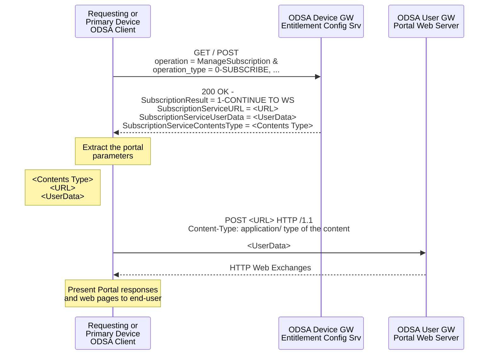
```mermaid
sequenceDiagram
    participant Client as Requesting or<br/>Primary Device<br/>ODSA Client
    participant ConfigSrv as ODSA Device GW<br/>Entitlement Config Srv
    participant Portal as ODSA User GW<br/>Portal Web Server

    Client->>ConfigSrv: GET / POST<br/>operation = ManageSubscription &<br/>operation_type = 0-SUBSCRIBE, ...
    ConfigSrv-->>Client: 200 OK -<br/>SubscriptionResult = 1-CONTINUE TO WS<br/>SubscriptionServiceURL = <URL><br/>SubscriptionServiceUserData = <UserData><br/>SubscriptionServiceContentsType = <Contents Type>
    
    Note over Client: Extract the portal<br/>parameters
    
    Note left of Client: <Contents Type><br/><URL><br/><UserData>
    
    Client->>Portal: POST <URL> HTTP /1.1<br/>Content-Type: application/ type of the content<br/><br/><UserData>
    
    Portal-->>Client: HTTP Web Exchanges
    Note over Client: Present Portal responses<br/>and web pages to end-user
```

<center>Figure 18. Example Processing of Web Portal Response Parameters by Client</center>

The processing rules for `UserData` and `ContentTypes` are provided in Table 50.

<table>
  <thead>
    <tr>
        <th>ContentTypes parameter</th>
        <th></th>
        <th>UserData parameter</th>
        <th></th>
        <th>Expected HTTP Request to SP Web Portal</th>
        <th></th>
    </tr>
  </thead>
  <tbody>
    <tr>
        <td>NOT present</td>
        <td>Contains user information as query parameters, of the form<br/>`field1=value1&amp;field=value2&amp;...`<br/>to be included in GET request.</td>
        <td>GET `&lt;URL&gt;?&lt;UserData&gt;` HTTP /1.1<br/>. . .</td>
        <td colspan="3"></td>
    </tr>
    <tr>
        <td>value of `json`</td>
        <td>Contains user information presented in a JSON object value.<br/>If it is preceded by `encodedValue=`, `UserData` is a base64 string and must first be decoded to text before inclusion in POST.</td>
        <td>POST `&lt;URL&gt;` HTTP /1.1<br/>Content-Type: application/json<br/>. . .<br/><br/>`&lt;UserData as JSON object&gt;`</td>
        <td colspan="3"></td>
    </tr>
    <tr>
        <td>value of `xml`</td>
        <td>Contains user information presented in an XML document.<br/>If it is preceded by `encodedValue=`, `UserData` is a base64 string and must first be decoded to text before inclusion in POST.</td>
        <td>POST `&lt;URL&gt;` HTTP /1.1<br/>Content-Type: text/xml,application/xml<br/>. . .<br/><br/>`&lt;UserData as XML document&gt;`</td>
        <td colspan="3"></td>
    </tr>
  </tbody>
</table>

<center>Table 50. Processing Rules for the Response Parameters ContentTypes and UserData</center>


TS.43 v12.0
Page 87 of 248

GSM Association
Non-confidential
Official Document TS.43 - Service Entitlement Configuration


### 6.5.10 VerifyPhoneNumber Operation Configuration Parameters

Parameter names and presence:

* `PhoneNumberVerification`: Mandatory. Indicates if the MSISDNs match.
* `msisdn`: Optional. The MSISDN of the subscription in E.164 format

<table>
  <thead>
    <tr>
        <th>“VerifyPhoneNumber” configuration parameters</th>
        <th>Type</th>
        <th>Values</th>
        <th>Description</th>
    </tr>
  </thead>
  <tbody>
    <tr>
        <td rowspan="3">PhoneNumberVerification</td>
        <td rowspan="3">Integer</td>
        <td colspan="2">Indicates the result of the Phone Number verification</td>
    </tr>
    <tr>
        <td>0 – FAILURE</td>
        <td>MSISDNs don’t match</td>
    </tr>
    <tr>
        <td>1 – SUCCESS</td>
        <td>MSISDNs match</td>
    </tr>
    <tr>
        <td>msisdn<br/>(Optional)</td>
        <td>String</td>
        <td>E.164 formatted phone number</td>
        <td>This parameter could be present when SUCCESS. If present, it indicates the MSISDN (the one from the request) that has been verified successfully.</td>
    </tr>
  </tbody>
</table>
Table 51. Configuration Parameters - VerifyPhoneNumber Operation

### 6.5.11 GetSubscriberInfo Operation Configuration Parameters

Parameter names and presence:

* `SubscriberInfo`: Conditional. Application specific subscriber information

The different values for the configuration parameters of the operation `GetSubscriberInfo` are provided in Table 52

<table>
  <thead>
    <tr>
        <th>“GetSubscriberInfo” configuration parameters</th>
        <th>Type</th>
        <th>Values</th>
        <th>Description</th>
    </tr>
  </thead>
  <tbody>
    <tr>
        <td>SubscriberInfo<br/>(Conditional)</td>
        <td>Structure</td>
        <td>multi-parameter value - see Table 53 for details</td>
        <td>Subscriber information details.</td>
    </tr>
  </tbody>
</table>
Table 52. Configuration Parameters – GetSubscriberInfo Operation

<table>
  <thead>
    <tr>
        <th>“SubscriberInfo” configuration parameters for ap2014</th>
        <th>Type</th>
        <th>Values</th>
        <th>Description</th>
    </tr>
  </thead>
  <tbody>
    <tr>
        <td>MSISDN</td>
        <td>String</td>
        <td>Any string value</td>
        <td>E.164 formatted phone number</td>
    </tr>
  </tbody>
</table>


TS.43 v12.0
Page 88 of 248

GSM Association
Non-confidential
Official Document TS.43 - Service Entitlement Configuration


<table>
  <thead>
    <tr>
        <th>“SubscriberInfo” configuration parameters for ap2014</th>
        <th></th>
        <th>Type</th>
        <th></th>
        <th>Values</th>
        <th></th>
        <th>Description</th>
        <th></th>
    </tr>
  </thead>
  <tbody>
    <tr>
        <td>SimIdType</td>
        <td>Integer</td>
        <td>0 – IMSI</td>
        <td rowspan="3">Specifies the type of unique identifier used in SimID parameter</td>
        <td colspan="4"></td>
    </tr>
    <tr>
        <td rowspan="2"></td>
        <td rowspan="2"></td>
        <td>1 – UUID</td>
        <td colspan="4"></td>
    </tr>
    <tr>
        <td rowspan="2"></td>
        <td>2 – IMSI HASH</td>
        <td></td>
        <td colspan="2"></td>
    </tr>
    <tr>
        <td>SimID</td>
        <td>String</td>
        <td>Any string value</td>
        <td>For SimIdType=0 (“IMSI”): International Mobile Subscriber Identity as per ITU E.212 or 3GPP TS 23.003 standards.<br/><br/>For SimIdType=1 (“UUID”)<br/><br/>For SimIdType=2 (“IMSI HASH”): “keyed hashing HMAC SHA256” where the key is owned by the MNO” (recommendation)</td>
        <td colspan="3"></td>
    </tr>
    <tr>
        <td>MvnoName<br/><br/>(Optional)</td>
        <td>String</td>
        <td>Any string value</td>
        <td>Applicable for MVNO-specific features, specifies the MVNO name to which the subscriber belongs. It can be Gid1/2 or a unique name.</td>
        <td colspan="4"></td>
    </tr>
  </tbody>
</table>
<center>Table 53. Configuration Parameters – SubscriberInfo for ap2014</center>

## 6.6 Examples of ODSA Responses

### 6.6.1 CheckEligibility Response Example
Table 54 presents an example for the CheckEligibility response to a Companion ODSA application.


TS.43 v12.0
Page 89 of 248

GSM Association
Non-confidential
Official Document TS.43 - Service Entitlement Configuration


```xml
<?xml version="1.0"?>
<wap-provisioningdoc version="1.1">
    <characteristic type="VERS">
        <parm name="version" value="1"/>
        <parm name="validity" value="172800"/>
    </characteristic>

    <characteristic type="TOKEN">
        <parm name="token" value="ASH127AHHA88SF"/>
    </characteristic>

    <characteristic type="APPLICATION">
        <parm name="AppID" value="ap2006"/>
        <parm name="CompanionAppEligibility" value="1"/>
        <parm name="CompanionDeviceServices" value="SharedNumber"/>
        <parm name="NotEnabledURL" value="http://www.MNO.org/AppNotAllowed"/>
        <parm name="NotEnabledUserData" value="msisdn=XX&amp;device_id=XX"/>
        <parm name="OperationResult" value="1"/>
    </characteristic>
</wap-provisioningdoc>
```

*Table 54. Example of a CheckEligibility ODSA Response in XML format*

Table 55 presents an example for the `CheckEligibility` response to a Companion ODSA application in JSON format.

```json
{
    "Vers" : {
        "version" : "1",
        "validity" : "172800"
    },
    "Token" : {                 // Optional
        "token" : "ASH127AHHA88SF"
    },
    "ap2006" : {                // ODSA for Companion Device app
        "CompanionAppEligibility" : "1",
        "CompanionDeviceServices" : "SharedNumber",
        "NotEnabledURL" : "http://www.MNO.org/AppNotAllowed",
        "NotEnabledUserData" : "msisdn=XX&amp;device_id=XX",
        "OperationResult" : "1"
    }
}
```

*Table 55. Example of a CheckEligibility ODSA Response in JSON format*

### 6.6.2 ManageService Response Example

Table 56 presents an example for the `ManageService` response to a Companion ODSA application.


TS.43 v12.0
Page 90 of 248

GSM Association
Non-confidential
Official Document TS.43 - Service Entitlement Configuration


```xml
<?xml version="1.0"?>
<wap-provisioningdoc version="1.1">
      <characteristic type="VERS">
        <parm name="version" value="1"/>
        <parm name="validity" value="172800"/>
      </characteristic>

      <characteristic type="TOKEN">
        <parm name="token" value="ASH127AHHA88SF"/>
      </characteristic>

      <characteristic type="APPLICATION">
        <parm name="AppID" value="ap2006"/>
        <parm name="ServiceStatus" value="3"/>
        <parm name="OperationResult" value="1"/>
      </characteristic>
</wap-provisioningdoc>
```
*Table 56. Example of a ManageService ODSA Response*

Table 57 presents an example for the `ManageService` response to a Companion ODSA application in JSON format.

```json
{
      "Vers" : {
         "version" : "1",
         "validity" : "172800"
      },
      "Token" : {              // Optional
         "token" : "ASH127AHHA88SF"
      },
      "ap2006" : {             // ODSA for Companion Device app
         "ServiceStatus" : "3",
         "OperationResult" : "1"
      }
}
```
*Table 57. Example of a ManageService ODSA Response in JSON format*

### 6.6.3 ManageSubscription Response Example

Table 58 presents an example for the `ManageSubscription` response in XML format to a Companion or Primary ODSA application. This response indicates that the end-user is to be sent to an ODSA portal web server.


TS.43 v12.0 Page 91 of 248

GSM Association
Non-confidential
Official Document TS.43 - Service Entitlement Configuration


```xml
<?xml version="1.0"?>
<wap-provisioningdoc version="1.1">
    <characteristic type="VERS"
        <parm name="version" value="1"/>
        <parm name="validity" value="172800"/>
    </characteristic>

    <characteristic type="TOKEN">
        <parm name="token" value="ASH127AHHA88SF"/>
    </characteristic>

    <characteristic type="APPLICATION">
        <parm name="AppID" value="ap2006"/>
        <parm name="SubscriptionServiceURL" value="http://www.MNO.org/CDSubs"/>
        <parm name="SubscriptionServiceUserData" value="imsi=XX&amp;msisdn=XX"/>
        <parm name="SubscriptionResult" value="1"/>  <!-- continue to websheet -->
        <parm name="OperationResult" value="1"/>
    </characteristic>
</wap-provisioningdoc>
```

*Table 58. Example of a ManageSubscription ODSA Response in XML format to send user to ODSA portal.*

Table 59 presents an example for the `ManageSubscription` response in XML format to a Companion or Primary ODSA application. This response provides information on the eSIM profile to download.

```xml
<?xml version="1.0"?>
<wap-provisioningdoc version="1.1">
    <characteristic type="VERS"
        <parm name="version" value="1"/>
        <parm name="validity" value="172800"/>
    </characteristic>

    <characteristic type="TOKEN">
        <parm name="token" value="ASH127AHHA88SF"/>
    </characteristic>

    <characteristic type="APPLICATION">
        <parm name="AppID" value="ap2006"/>
        <characteristic type="DownloadInfo">
            <parm name="ProfileIccid" value="11111111111111111"/>
            <parm name="ProfileSmdpAddress" value="SMDP+ ADDR"/>
        </characteristic>
        <parm name="SubscriptionResult" value="2"/>        <!--download profile -->
        <parm name="OperationResult" value="1"/>
    </characteristic>
</wap-provisioningdoc>
```

*Table 59. Example of a ManageSubscription ODSA Response in XML format with profile download information.*

Table 60 presents an example for the `ManageSubscription` response in JSON format to a Companion or Primary ODSA application. This response indicates that the end-user is to be sent to an ODSA portal web server.


TS.43 v12.0
Page 92 of 248

GSM Association
Non-confidential
Official Document TS.43 - Service Entitlement Configuration


```json
{
      "Vers" : {
           "version" : "1",
           "validity" : "172800"
      },
      "Token" : {                  // Optional
           "token" : "ASH127AHHA88SF"
      },
      "ap2006" : {                 // ODSA for Companion Device app
           "SubscriptionServiceURL" : "http://www.MNO.org/CDSubs",
           "SubscriptionServiceUserData" : "imsi=XX&amp;msisdn=XX",
           "SubscriptionResult" : "1",    // continue to websheet
           "OperationResult" : "1"
      }
}
```

*Table 60. Example of a ManageSubscription ODSA Response in JSON format to send user to ODSA portal.*

Table 61 presents an example for the `ManageSubscription` response in JSON format to a Companion or Primary ODSA application. This response provides information on the eSIM profile to download.

```json
{
      "Vers" : {
           "version" : "1",
           "validity" : "172800"
      },
      "Token" : {                  // Optional
           "token" : "ASH127AHHA88SF"
      },
      "ap2006" : {                 // ODSA for Companion Device app
           "DownloadInfo" : {
             "SubscriptionServiceURL" : "SMDP+ ADDR",
             "ProfileActivationCode" : "COMM PROFILE CODE"
           },
           "SubscriptionResult" : "2",    // download profile
           "OperationResult" : "1"
      }
}
```

*Table 61. Example of a ManageSubscription ODSA Response in JSON format with profile download information.*

### 6.6.4 AcquireConfiguration Response Example

Table 62 presents an example for the `AcquireConfiguration` operation in XML format for a Companion ODSA application.


TS.43 v12.0
Page 93 of 248

GSM Association Non-confidential
Official Document TS.43 - Service Entitlement Configuration


```xml
<?xml version="1.0"?>
<wap-provisioningdoc version="1.1">
  <characteristic type="VERS">
    <parm name="version" value="1"/>
    <parm name="validity" value="172800"/>
  </characteristic>
  <characteristic type="TOKEN">
    <parm name="token" value="ASH127AHHA88SF"/>
  </characteristic>
  <characteristic type="APPLICATION">
    <parm name="AppID" value="ap2006"/>
    <characteristic type="CompanionConfigurations">
      <characteristic type="CompanionConfiguration">
        <parm name="ICCID" value="8991101200003204510"/>
        <parm name="CompanionDeviceService" value="SharedNumber"/>
        <parm name="ServiceStatus" value="1"/>
      </characteristic>
    </characteristic>
    <parm name="OperationResult" value="1"/>
  </characteristic>
</wap-provisioningdoc>
```

*Table 62. Example of an AcquireConfiguration ODSA Response in XML format*

Table 63 presents an example for the AcquireConfiguration operation in JSON format for a Companion ODSA application.

```json
{
  "Vers" : {
    "version" : "1",
    "validity" : "172800"
  },
  "Token" : {                  // Optional
    "token" : "ASH127AHHA88SF"
  },
  "ap2006" : {                 // ODSA for Companion Device app
    "CompanionConfigurations" : [{
      "CompanionConfiguration" : {
        "ICCID" : "8991101200003204510",
        "CompanionDeviceService" : "SharedNumber",
        "ServiceStatus" : "1"
      }
    }],
    "OperationResult" : "1"
  }
}
```

*Table 63. Example of an AcquireConfiguration ODSA Response in JSON format*

Table 64 presents an example for the AcquireConfiguration operation in XML format for a Companion ODSA application.


TS.43 v12.0 Page 94 of 248

GSM Association
Non-confidential
Official Document TS.43 - Service Entitlement Configuration


```xml
<?xml version="1.0"?>
<wap-provisioningdoc version="1.1">
    <characteristic type="VERS">
        <parm name="version" value="1"/>
        <parm name="validity" value="172800"/>
    </characteristic>
    <characteristic type="TOKEN">
        <parm name="token" value="ASH127AHHA88SF"/>
    </characteristic>
    <characteristic type="APPLICATION">
        <parm name="AppID" value="ap2009"/>
        <characteristic type="PrimaryConfigurations">
            <characteristic type="PrimaryConfiguration">
                <parm name="ICCID" value="8991101200003204510"/>
                <parm name="ServiceStatus" value="1"/>
            </characteristic>
            <characteristic type="PrimaryConfiguration">
                <parm name="ICCID" value="8991101200003204514"/>
                <parm name="ServiceStatus" value="4"/>
                <parm name="SecondaryICCID" value="1"/>
            </characteristic>
        </characteristic>
        <parm name="OperationResult" value="1"/>
    </characteristic>
</wap-provisioningdoc>
```

Table 64. Example of an AcquireConfiguration ODSA Response in XML format

Table 65 presents an example for the AcquireConfiguration operation in JSON format for a Companion ODSA application.

```json
{
    "Vers" : {
        "version" : "1",
        "validity" : "172800"
    },
    "Token" : {                     // Optional
        "token" : "ASH127AHHA88SF"
    },
    "ap2009" : {                    // ODSA for Primary with Multiple Primary configurations
        "PrimaryConfigurations" : [{
            "PrimaryConfiguration" : {
                "ICCID" : "8991101200003204510",
                "ServiceStatus" : "1",
            },
            "PrimaryConfiguration" : {
                "ICCID" : "8991101200003204514",
                "ServiceStatus" : "4",
                "SecondaryICCID" : "1"
            }
        }],
        "OperationResult" : "1"
    }
}
```

Table 65. Example of an AcquireConfiguration ODSA Response in JSON format

### 6.6.5 AcquirePlan Response Example

Table 66 presents an example for the AcquirePlan operation in XML format for a Server-initiated ODSA application.


TS.43 v12.0
Page 95 of 248

GSM Association
Non-confidential
Official Document TS.43 - Service Entitlement Configuration


```xml
<?xml version="1.0"?>
<wap-provisioningdoc version="1.1">
    <characteristic type="VERS">
        <parm name="version" value="1"/>
        <parm name="validity" value="172800"/>
    </characteristic>

    <characteristic type="TOKEN">
        <parm name="token" value="ASH127AHHA88SF"/>
    </characteristic>

    <characteristic type="APPLICATION">
        <parm name="AppID" value="ap2011"/>
        <characteristic type="PlanOffers">
            <characteristic type="PlanOffer">
                <parm name="PlanId" value="Plan0001"/>
                <parm name="PlanName" value="Family Plan"/>
                <parm name="PlanDescription" value="This is the description of the Plan0001"/>
            </characteristic>
            <characteristic type="PlanOffer">
                <parm name="PlanId" value="Plan0376"/>
                <parm name="PlanName" value="All included Plan"/>
                <parm name="PlanDescription" value="This is the description of the Plan0376"/>
            </characteristic>
        </characteristic>
        <parm name="OperationResult" value="1"/>
    </characteristic>
</wap-provisioningdoc>
```

Table 66. Example of an AcquirePlan Server-initiated ODSA Response in XML format

Table 67 presents an example for the `AcquirePlan` operation in XML format for a Server-initiated ODSA application.

```json
{
    "Vers" : {
        "version" : "1",
        "validity" : "172800"
    },
    "Token" : {                        // Optional
        "token" : "ASH127AHHA88SF"
    },
    "ap2011" : {                       // ODSA for Server-initiated app
        "PlanOffers" : [{
            "PlanOffer" : {
                "PlanId" : " Plan0001",
                "PlanName" : "Family Plan",
                "PlanDescription" : "This is the description of the Plan0001"
            },
        },{
            "PlanOffer" : {
                "PlanId " : "Plan0376",
                "PlanName " : "All included Plan",
                "PlanDescription" : "This is the description of the Plan0376"
            }
        }],
        "OperationResult" : "1"
    }
}
```

Table 67. Example of a AcquirePlan Server-initiated ODSA Response in JSON format


TS.43 v12.0
Page 96 of 248

GSM Association
Non-confidential
Official Document TS.43 - Service Entitlement Configuration


### 6.6.6 AcquireTemporaryToken Response Example

Table 68 presents an example for the AcquireTemporaryToken response in XML format to a Primary ODSA application. This response provides the ODSA application with the `TemporaryToken` to be used for an eSIM transfer.

```xml
<?xml version="1.0"?>
<wap-provisioningdoc version="1.1">
    <characteristic type="VERS"
        <parm name="version" value="1"/>
        <parm name="validity" value="172800"/>
    </characteristic>

    <characteristic type="TOKEN">
        <parm name="token" value="ASH127AHHA88SF"/>
    </characteristic>

    <characteristic type="APPLICATION">
        <parm name="AppID" value="ap2009"/>
        <parm name="TemporaryToken" value="A8daAd8ads7fau34789947kjhsfad;kjfh"/>
        <parm name="TemporaryTokenExpiry" value="2019-01-29T13:15:31-08:00"/>
        <parm name="OperationTargets"
value="ManageSubscription,AcquireConfiguration"/>
        <parm name="OperationResult" value="1"/>
    </characteristic>
</wap-provisioningdoc>
```

*Table 68. Example of an AcquireTemporaryToken Response in XML*

### 6.6.7 GetPhoneNumber Response Example

Table 69 presents an example for GetPhoneNumber response in XML.

```xml
<?xml version="1.0"?>
<wap-provisioningdoc version="1.1">
    <characteristic type="VERS"
        <parm name="version" value="1"/>
        <parm name="validity" value="172800"/>
    </characteristic>

    <characteristic type="TOKEN">
        <parm name="token" value="ASH127AHHA88SF"/>
    </characteristic>

    <characteristic type="APPLICATION">
        <parm name="AppID" value="ap2014"/>
        <parm name="MSISDN" value="+14058885769"/>
    </characteristic>
</wap-provisioningdoc>
```

*Table 69. Example of a GetPhoneNumber Response in XML*

### 6.6.8 VerifyPhoneNumber Response Example

Table 70 presents an example for `VerifyPhoneNumber` response in XML


TS.43 v12.0
Page 97 of 248

GSM Association
Non-confidential
Official Document TS.43 - Service Entitlement Configuration


```xml
<?xml version="1.0"?>
<wap-provisioningdoc version="1.1">
      <characteristic type="VERS"
        <parm name="version" value="1"/>
        <parm name="validity" value="172800"/>
      </characteristic>

      <characteristic type="TOKEN">
        <parm name="token" value="ASH127AHHA88SF"/>
      </characteristic>

      <characteristic type="APPLICATION">
        <parm name="AppID" value="ap2014"/>
        <parm name="OperationResult" value="1"/>
        <parm name="PhoneNumberVerification" value="1"/>
        <parm name="msisdn" value="+14058885769"/> //Optional
      </characteristic>
</wap-provisioningdoc>
```

Table 70. Example of a VerifyPhoneNumber Response in XML

### 6.6.9 GetSubscriberInfo Response Example

Table 71 presents an example for the `GetSubscriberInfo` response in XML.

```xml
<?xml version="1.0"?>
<wap-provisioningdoc version="1.1">
      <characteristic type="VERS"
        <parm name="version" value="1"/>
        <parm name="validity" value="172800"/>
      </characteristic>

      <characteristic type="APPLICATION">
        <parm name="AppID" value="ap2014"/>
        <characteristic type="SubscriberInfo">
          <parm name="MSISDN" value="+14058885769"/>
          <parm name="SimIdType" value="2"/>
          <parm name="SimID"
value="ffc72d247a9c60d3220020b62bca7cfd0ea9e159076370586944968de219080a"/>
          <parm name="MvnoName" value="MVNO_222"/>
        </characteristic>
      </characteristic>
</wap-provisioningdoc>
```

Table 71. Example of a GetSubscriberInfo Response in XML format

### 6.7 ODSA Application Considerations around Web View Callback

During the procedure for ODSA on Companion or Primary eSIM devices, end-users can be presented with a set of web views specific to the Operator. The web views are hosted by an Operator portal web server as shown in Figure 10.

To support proper communication between web views and the ODSA application, the application should support JS callbacks to allow for the portal to share the following events and corresponding data elements described in Table 72.


TS.43 v12.0
Page 98 of 248

GSM Association Non-confidential
Official Document TS.43 - Service Entitlement Configuration


<table>
  <thead>
    <tr>
        <th>Communication profile ready for download</th>
        <th>Profile download method and corresponding parameters (Activation Code or SM-DP+ address, see Table 40 for details)</th>
        <th>The eSIM ODSA procedure was a success. The resulting communication profile can be downloaded.</th>
    </tr>
    <tr>
        <th>Web flow finished</th>
        <th>None</th>
        <th>The end-user has completed the ODSA web view flow. The device app needs to perform an `AcquireConfiguration` operation to retrieve the status of the eSIM profile and associated service.</th>
    </tr>
    <tr>
        <th>Web flow dismissed</th>
        <th>None</th>
        <th>The end-user or web portal logic has ended the ODSA web views without completing the ODSA procedure. An eSIM profile is not available.</th>
    </tr>
    <tr>
        <th>End-user logged out</th>
        <th>None</th>
        <th>The end-user was logged out of the web views. The active authentication token must be deleted, and re-authentication is required for subsequent requests.</th>
    </tr>
  </thead>
  <tbody>
    <tr>
        <td>Callback Event</td>
        <td>Data</td>
        <td>Description</td>
    </tr>
  </tbody>
</table>

<center>Table 72. Callback Events for ODSA Web Views</center>

The different callback functions are embedded in the **ODSAServiceFlow** object. They are defined to reflect the state of the web logic according to the opened web view:

<table>
  <thead>
    <tr>
        <th>profileReadyWithActivationCode (activationCode)</th>
        <th>X</th>
        <th></th>
        <th></th>
    </tr>
    <tr>
        <th>profileReadyWithDefaultSmdp (defaultSmdpAddress, iccid = 0)</th>
        <th>X</th>
        <th></th>
        <th></th>
    </tr>
    <tr>
        <th>SelectionCompleted (ICCID, IMEI)</th>
        <th>X</th>
        <th></th>
        <th></th>
    </tr>
    <tr>
        <th>finishFlow (next_action)</th>
        <th>X</th>
        <th></th>
        <th></th>
    </tr>
    <tr>
        <th>dismissFlow ()</th>
        <th>X</th>
        <th>X</th>
        <th>X</th>
    </tr>
    <tr>
        <th>deleteToken()</th>
        <th>X</th>
        <th></th>
        <th></th>
    </tr>
    <tr>
        <th>deleteProfileInUse()</th>
        <th>X</th>
        <th></th>
        <th></th>
    </tr>
    <tr>
        <th>checkProfileServiceStatus ()</th>
        <th>X</th>
        <th colspan="2"></th>
    </tr>
  </thead>
  <tbody>
    <tr>
        <td>Callback name</td>
        <td>Webview<br/>opened on<br/>SubscriptionServiceUrl</td>
        <td>Webview<br/>opened on<br/>NotEnabledUrl</td>
        <td>Webview<br/>opened on<br/>GeneralErrorURL</td>
    </tr>
  </tbody>
</table>


TS.43 v12.0 Page 99 of 248

GSM Association
Non-confidential
Official Document TS.43 - Service Entitlement Configuration


Table 73. Callback signatures for ODSA Web Views

### 6.7.1 profileReadyWithActivationCode(activationCode)

Calling this method indicates that an eSIM profile, identified by the activation code, is ready for download.

The parameter `activationCode` is mandatory. It is a string with GSMA SGP .22 v2.1 or higher format.

After this call back is called, the related eSIM profile will be downloaded, and the web view will not be closed.

### 6.7.2 profileReadyWithDefaultSmdp(defaultSmdpAddress, iccid)

Calling this method indicates that an eSIM profile, identified by its iccid, from a SM-DP+ server, is ready for download.

Default Smdp here does not refer to an SM-DP+ being the Default SM-DP+ server for the requesting device, but to the eSIM profile being prepared for Default SM-DP+ Download Use case, as defined in GSMA SGP.22 v2.1 or higher.

The parameter `defaultSmdpAddress` is mandatory, it is a string containing the FQDN of the SM-DP+, not an URL.

The parameter iccid is a string of the ICCID to be downloaded.

After this call back is called, the related eSIM profile will be downloaded, and the web view will not be closed.

### 6.7.3 SelectionCompleted(iccid, imei) callback function

Calling this method indicates that an eSIM profile, identified by its old ICCID and/or IMEI, was selected by the user on the Websheet.

The parameter `iccid` is a string, whose default value is empty.

The parameter `imei` is a string, whose default value is empty.

After this callback, the webview will be closed.

### 6.7.4 dismissFlow() callback function

Calling this method ends prematurely the ODSA service flow, whatever the cause (user action, user not eligible...), without a service profile being downloaded.

This callback has no parameter.

The web view to the end-user will be closed.

The call flows in the next figures show some examples of the callback use in the different webviews.


TS.43 v12.0
Page 100 of 248

GSM Association
Non-confidential
Official Document TS.43 - Service Entitlement Configuration


In the Figure 19, the webview is opened in step 10, following an end-user action. While the subscription page is displayed (13), the end-user may cancel the subscription, for instance with a dedicated button on the page. This should call the **dismissFlow()** callback. The ODSA client closes the webview.

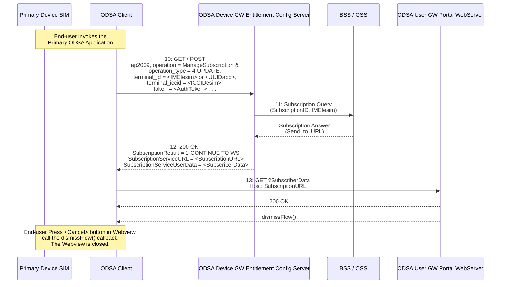
```mermaid
sequenceDiagram
    participant PD as Primary Device SIM
    participant OC as ODSA Client
    participant ECS as ODSA Device GW Entitlement Config Server
    participant BSS as BSS / OSS
    participant PW as ODSA User GW Portal WebServer

    Note over PD, OC: End-user invokes the<br/>Primary ODSA Application
    OC->>ECS: 10: GET / POST<br/>ap2009, operation = ManageSubscription &<br/>operation_type = 4-UPDATE,<br/>terminal_id = <IMEIesim> or <UUIDapp>,<br/>terminal_iccid = <ICCIDesim>,<br/>token = <AuthToken> . . .
    ECS->>BSS: 11: Subscription Query<br/>(SubscriptionID, IMEIesim)
    BSS-->>ECS: Subscription Answer<br/>(Send_to_URL)
    ECS-->>OC: 12: 200 OK -<br/>SubscriptionResult = 1-CONTINUE TO WS<br/>SubscriptionServiceURL = <SubscriptionURL><br/>SubscriptionServiceUserData = <SubscriberData>
    OC->>PW: 13: GET ?SubscriberData<br/>Host: SubscriptionURL
    PW-->>OC: 200 OK
    PW-->>OC: dismissFlow()
    Note over PD, OC: End-user Press <Cancel> button in Webview,<br/>call the dismissFlow() callback.<br/>The Webview is closed.
```

*Figure 19. Example of dismissFlow callback in SubscriptionServiceURL webview*

In the Figure 20, the webview is opened in step 10, following an end-user action. Once the "not enabled" page is displayed (13), giving information about the cause of the ineligibility, the end-user may discard it, for instance with a "close" button on the page. This should call the **dismissFlow()** callback. The ODSA client closes the webview.


TS.43 v12.0
Page 101 of 248

GSM Association
Non-confidential
Official Document TS.43 - Service Entitlement Configuration


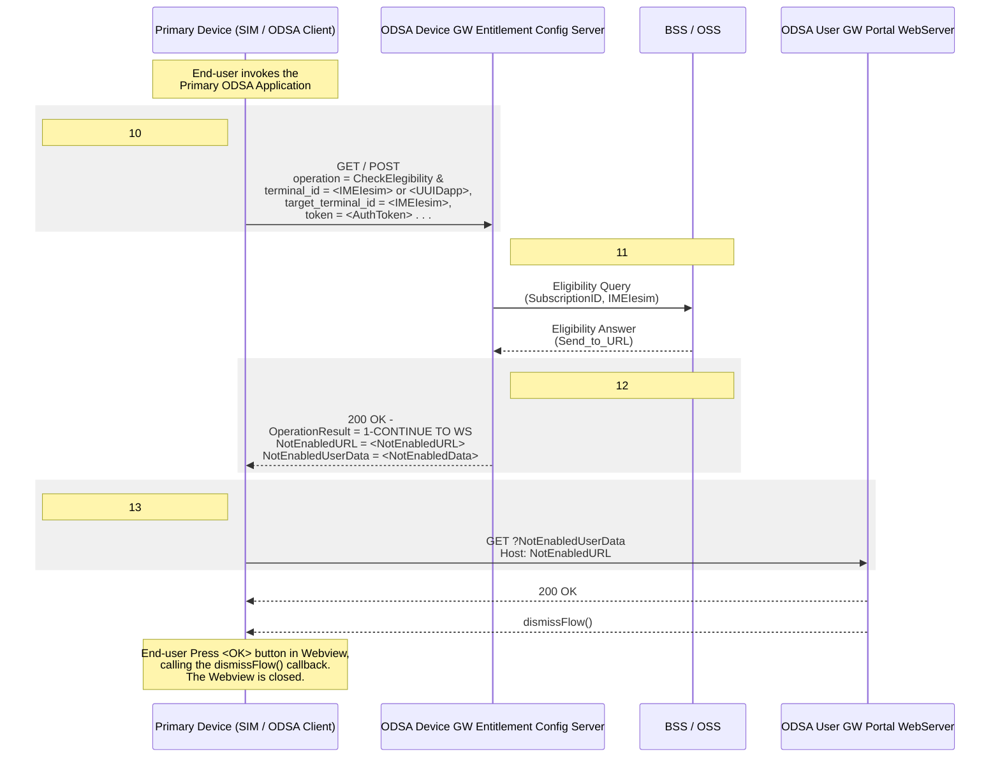
```mermaid
sequenceDiagram
    participant PrimaryDevice as Primary Device (SIM / ODSA Client)
    participant ECS as ODSA Device GW Entitlement Config Server
    participant BSS as BSS / OSS
    participant Portal as ODSA User GW Portal WebServer

    Note over PrimaryDevice: End-user invokes the<br/>Primary ODSA Application

    rect rgb(240, 240, 240)
    Note left of PrimaryDevice: 10
    PrimaryDevice->>ECS: GET / POST<br/>operation = CheckElegibility &<br/>terminal_id = <IMEIesim> or <UUIDapp>,<br/>target_terminal_id = <IMEIesim>,<br/>token = <AuthToken> . . .
    end

    Note right of ECS: 11
    ECS->>BSS: Eligibility Query<br/>(SubscriptionID, IMEIesim)
    BSS-->>ECS: Eligibility Answer<br/>(Send_to_URL)
    
    rect rgb(240, 240, 240)
    Note right of ECS: 12
    ECS-->>PrimaryDevice: 200 OK -<br/>OperationResult = 1-CONTINUE TO WS<br/>NotEnabledURL = <NotEnabledURL><br/>NotEnabledUserData = <NotEnabledData>
    end

    rect rgb(240, 240, 240)
    Note left of PrimaryDevice: 13
    PrimaryDevice->>Portal: GET ?NotEnabledUserData<br/>Host: NotEnabledURL
    end

    Portal-->>PrimaryDevice: 200 OK
    Portal-->>PrimaryDevice: dismissFlow()

    Note over PrimaryDevice: End-user Press <OK> button in Webview,<br/>calling the dismissFlow() callback.<br/>The Webview is closed.
```

Figure 20. Example of dismissFlow callback in NotEnabledURL webview

### 6.7.5 finishFlow(next_action(optional))

Calling this method shall dismiss the ODSA Web Service Flow on device side and trigger the `next_action` request to the ECS.

This callback could include a parameter (`next_action`). This parameter is defined as a String. If the callback doesn’t contain any parameter, the `AcquireConfiguration` value will be considered as the action to be triggered.

The web view will be closed.

### 6.7.6 deleteToken()

Calling this method erases the current authentication token to perform a full re-authentication request. This may be called in the subscription webview when the user account has been changed, for instance.

This callback has no parameter.

### 6.7.7 checkProfileServiceStatus()

Calling this method triggers the client to check the `ServiceStatus` using an `AcquireConfiguration` request without the need of for the Web View to dismiss the ODSA Web Service Flow.

This callback has no parameter.


TS.43 v12.0
Page 102 of 248

GSM Association
Non-confidential
Official Document TS.43 - Service Entitlement Configuration


### 6.7.8 deleteProfileInUse(iccid, msisdn (optional))

Calling this method notifies that the user needs to delete the profile having the ICCID in the parameter to complete the subscription transfer. This may be called in the subscription webview when the profile in use needs to be deleted before the subscription is transferred.

### 6.8 Device Information Representation for Subscription Transfer

In order to prepare an appropriate eSIM profile during the subscription transfer, the Primary ODSA client application on the old device may need to provide to the ECS relevant information of the new device where the prepared eSIM profile will be installed.

This section presents a device information representation for subscription transfer. The device information shall be coded as a concatenation of the string listed in the Table 74 using a URI format as defined in [21].

<table>
  <thead>
    <tr>
        <th>Scheme</th>
        <th>Shall be set to esim.</th>
    </tr>
    <tr>
        <th>Delimiter</th>
        <th>Shall be set to :.</th>
    </tr>
    <tr>
        <th>Path</th>
        <th>Expected operation for a device receiving this device information.<br/>The value shall be set to transfer when this device information is used in the context of the subscription transfer starting from the old device.<br/>NOTE: A value other than transfer is FFS.</th>
    </tr>
    <tr>
        <th>Delimiter</th>
        <th>Shall be present and set to ? if any of the following query components is present.</th>
    </tr>
    <tr>
        <th>Query</th>
        <th>Additional device-related information in the form of key=value pairs.</th>
    </tr>
  </thead>
  <tbody>
    <tr>
        <td>Name</td>
        <td>Description</td>
    </tr>
  </tbody>
</table>
<center>Table 74. Device Information Format</center>

Each key/value pair is defined in Table 75, and shall be concatenated by using "&" as a delimiter if there are more than one key/value pair in the query component. Any of keys can be present in any order.

<table>
  <thead>
    <tr>
        <th>eid</th>
        <th>EID of the eUICC, the numeric text representation SHALL comprise 32 digits, where each digit is represented by one character in the set [0123456789].</th>
    </tr>
    <tr>
        <th>imei</th>
        <th>IMEI of the Device, the numeric text representation SHALL comprise 15 digits, where each digit is represented by one character in the set [0123456789].</th>
    </tr>
  </thead>
  <tbody>
    <tr>
        <td>Key</td>
        <td>Value</td>
    </tr>
  </tbody>
</table>
<center>Table 75. Query Component for Device Information</center>

The device information can be represented in a text string restricted to Byte mode character set defined in table 6 of [23] and the equivalent QR code according to [23]. Examples of the device information representation are as follows:

*   `esim:transfer?eid=89001567010203040506070809101152`
    (if an EID is present)
*   `esim:transfer?imei=351234510000011`
    (if an IMEI is present)


TS.43 v12.0
Page 103 of 248

GSM Association
Non-confidential
Official Document TS.43 - Service Entitlement Configuration


*   esim:transfer?eid=89001122334455667788990011223344&imei=351234520000029
    (if an EID and IMEI are present)


TS.43 v12.0
Page 104 of 248

GSM Association
Non-confidential
Official Document TS.43 - Service Entitlement Configuration


# 7 Companion ODSA Procedure Call Flows

The following sections present a number of informational call flows for the different user experiences and use cases of the Companion ODSA procedure. The ODSA client application on the requesting device is invoked at the request of the end-user and should capture proper user consent to have access to the companion device.

The exchanges between the Entitlement Configuration Server (ECS) (aka ODSA Device Gateway) and the Service Provider’s (SP) back-end systems are shown for informational purposes only. This applies as well for the exchanges that involve the ODSA Portal Web Server.

## 7.1 Subscription Activation via ODSA Portal – Initial Steps

The following presents the case where:

* The companion ODSA client application is allowed for the type of requesting device and enabled for the end-user (entitled).
* The companion device does not have an active eSIM/subscription from the Service Provider.
* The SP's ODSA portal web server is responsible for completing the subscription activation for the companion device.

Figure 21 shows the initial steps of the flow involving the SP's ODSA portal, where the Companion ODSA client application acquires proper entitlement and subscription data from the SP's ECS. The steps are:

1. End-user invokes the Companion ODSA client application on the requesting device which connects with the companion device to initiate the ODSA procedure (over a protocol outside the scope of this specification).
2. The companion ODSA client application makes a **CheckEligibility** request to the ECS.
3. The ECS queries the SP's back-end system managing the end-user’s entitlements and services.
4. The ECS processes the answer from the SP's back-end system and generates the proper 200 OK response containing `CompanionDevice` entitlement set to ENABLED and allowed services in the `CompanionDeviceServices` field set to **`SharedNumber`**.
5. Since the `CompanionDevice` entitlement value is correct and target service is allowed, the companion ODSA client application sends an **AcquireConfiguration** request to the ECS to obtain information on any eSIM profiles associated with the companion device.
6. The ECS queries the SP's back-end system managing the subscriptions and active eSIM profiles. The device may also add the parameters `notif_token` and `notif_action` to the **AcquireConfiguration** request in case Infrastructure-based push-notifications (see 2.6.2) should be used later. These parameters may be added to any GET/POST request by the device.
7. The ECS processes the response from the SP's back-end system and generates the proper 200 OK response containing `CompanionDeviceConfigurations` without


TS.43 v12.0
Page 105 of 248

GSM Association
Non-confidential
Official Document TS.43 - Service Entitlement Configuration


any `CompanionConfiguration` (no eSIM profile/subscription is associated with the companion device). If in step 5, the device registered for push notifications, the ECS now also uses the `RegisterNotifStatus` parameter to notify the device about the Notification Registration (see 2.9.5).

8. The companion ODSA client application makes a **ManageSubscription** request to the ECS with an `operation_type` set to SUBSCRIBE (value of 0) to initiate the subscription procedure for the companion device.
9. The ECS queries the SP's back-end system to determine the next step and method to use for the companion device's subscription request.
10. The ECS processes the response from the SP's back-end system and generates the proper 200 OK response to send the application and end-user to the SP's ODSA portal. The response contains a `SubscriptionResult` set to CONTINUE_TO_WS (value of 1), and `SubscriptionServiceURL` along with `SubscriptionServiceUserData` presenting the URL of the ODSA Portal web server and any user-specific data that would be useful to the Portal.

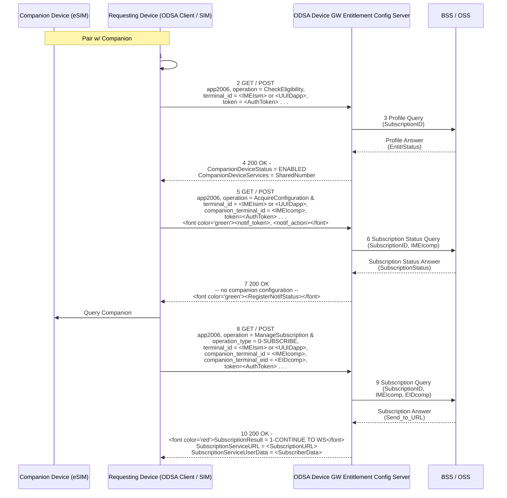
```mermaid
sequenceDiagram
    participant CD as Companion Device (eSIM)
    participant RD as Requesting Device (ODSA Client / SIM)
    participant ECS as ODSA Device GW Entitlement Config Server
    participant BSS as BSS / OSS

    Note over CD, RD: Pair w/ Companion
    RD->>RD: 1
    RD->>ECS: 2 GET / POST<br/>app2006, operation = CheckEligibility,<br/>terminal_id = <IMEIsim> or <UUIDapp>,<br/>token = <AuthToken> . . .
    ECS->>BSS: 3 Profile Query<br/>(SubscriptionID)
    BSS-->>ECS: Profile Answer<br/>(EntitIStatus)
    ECS-->>RD: 4 200 OK -<br/>CompanionDeviceStatus = ENABLED<br/>CompanionDeviceServices = SharedNumber
    RD->>ECS: 5 GET / POST<br/>app2006, operation = AcquireConfiguration &<br/>terminal_id = <IMEIsim> or <UUIDapp>,<br/>companion_terminal_id = <IMEIcomp>,<br/>token=<AuthToken> . . .<br/><font color="green"><notif_token>, <notif_action></font>
    ECS->>BSS: 6 Subscription Status Query<br/>(SubscriptionID, IMEIcomp)
    BSS-->>ECS: Subscription Status Answer<br/>(SubscriptionStatus)
    ECS-->>RD: 7 200 OK<br/>-- no companion configuration --<br/><font color="green"><RegisterNotifStatus></font>
    RD->>CD: Query Companion
    RD->>ECS: 8 GET / POST<br/>app2006, operation = ManageSubscription &<br/>operation_type = 0-SUBSCRIBE,<br/>terminal_id = <IMEIsim> or <UUIDapp>,<br/>companion_terminal_id = <IMEIcomp>,<br/>companion_terminal_eid = <EIDcomp>,<br/>token=<AuthToken> . . .
    ECS->>BSS: 9 Subscription Query<br/>(SubscriptionID,<br/>IMEIcomp, EIDcomp)
    BSS-->>ECS: Subscription Answer<br/>(Send_to_URL)
    ECS-->>RD: 10 200 OK -<br/><font color="red">SubscriptionResult = 1-CONTINUE TO WS</font><br/>SubscriptionServiceURL = <SubscriptionURL><br/>SubscriptionServiceUserData = <SubscriberData>
```

<center>Figure 21. Initial steps for companion ODSA procedure involving ODSA portal.</center>

## 7.2 ODSA Portal with Immediate Download Info – Final Steps
The following presents the case where:


TS.43 v12.0
Page 106 of 248

GSM Association
Non-confidential
Official Document TS.43 - Service Entitlement Configuration


* The companion ODSA client application was already informed to use the SP's ODSA portal to complete the subscription procedure (refer to 7.1).
* The ODSA portal is able to generate the eSIM profile download information as a result of the exchanges with the end-user.

Figure 22 shows the final steps of the Companion ODSA procedure in the case where the ODSA portal provides the eSIM profile download information back to the application (immediate delivery). The steps are:

11. The ODSA client application connects with the ODSA portal web server using the URL provided in the **ManageSubscription** operation response, allowing the web pages from the portal to be displayed to the end-user.
12. The ODSA portal web server presents a set of plan offers to the end-user and captures the selection from the end-user.
13. The ODSA portal makes a request towards the SP's back-end system to activate the selected plan and subscription.
14. The SP's back-end system interacts with the SM-DP+ over the ES2+ interface to make the required eSIM profile requests associated with the new subscription (for example, `DownloadOrder`, `ConfirmOrder` and `ReleaseProfile`) resulting in an activation code and ICCID for the companion device.
15. The ODSA portal provides the communication eSIM profile download information (activation code) to the ODSA client application using a JavaScript call back function.
16. The ODSA client application informs the companion device to download the eSIM profile.
17. The companion device downloads the eSIM profile from the SM-DP+
18. <u>Optional</u> - The ODSA application makes a **ManageService** request to the ECS with an `operation_type` set to ACTIVATE SERVICE (value of 10) to have the network activate and provision the `NumberShare` service on the companion device.
19. The ECS makes the appropriate requests to the SP's back-end system for service activation on the companion device's subscription.
20. The SP's back-end system replies back with service status and the ECS generates the proper response with service status to the ODSA client application.
21. The ODSA client application makes an **AcquireConfiguration** request to the ECS to verify that the subscription and service for the companion device are in the proper states.
22. The ECS queries the SP's back-end system managing the subscriptions and profiles.
23. The ECS processes the response from the SP's back-end system and generates the proper 200 OK response containing `CompanionDeviceConfigurations` with a `CompanionDeviceConfiguration` entry for the newly active subscription bearing the ACTIVATED status (value of 1).
24. As the companion device's subscription and service are in the right state, the ODSA client application informs the companion device to initiate cellular service.


TS.43 v12.0
Page 107 of 248

GSM Association
Non-confidential
Official Document TS.43 - Service Entitlement Configuration


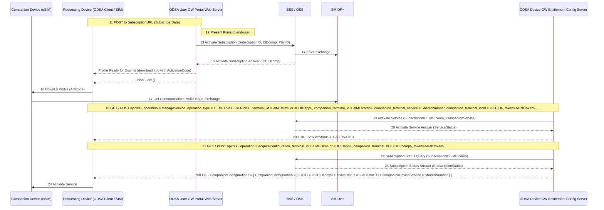
```mermaid
sequenceDiagram
    participant CD as Companion Device (eSIM)
    participant RD as Requesting Device (ODSA Client / SIM)
    participant GW as ODSA User GW Portal Web Server
    participant BSS as BSS / OSS
    participant SM as SM-DP+
    participant ECS as ODSA Device GW Entitlement Config Server

    Note over RD, GW: 11 POST to SubscriptionURL (SubscriberData)
    Note right of GW: 12 Present Plans to end-user
    GW->>BSS: 13 Activate Subscription (SubscriptionID, EIDcomp, PlanID)
    BSS->>SM: 14 ES2+ exchange
    BSS-->>GW: 15 Activate Subscription Answer (ICCIDcomp)
    GW-->>RD: Profile Ready for Downld (download Info with ActivationCode)
    GW-->>RD: Finish Flow ()
    RD->>CD: 16 DownLd Profile (ActCode)
    CD->>SM: 17 Get Communication Profile ES9+ Exchange
    
    Note over RD, ECS: 18 GET / POST ap2006, operation = ManageService, operation_type = 10-ACTIVATE SERVICE, terminal_id = <IMEIsim> or <UUIDapp>, companion_terminal_id = <IMEIcomp>, companion_terminal_service = SharedNumber, companion_terminal_iccid = <ICCID>, token=<AuthToken> . . .
    ECS->>BSS: 19 Activate Service (SubscriptionID, IMEIcomp, CompanionService)
    BSS-->>ECS: 20 Activate Service Answer (ServiceStatus)
    ECS-->>RD: 200 OK - ServiceStatus = 1-ACTIVATED

    Note over RD, ECS: 21 GET / POST ap2006, operation = AcquireConfiguration, terminal_id = <IMEIsim> or <UUIDapp>, companion_terminal_id = <IMEIcomp>, token=<AuthToken>
    ECS->>BSS: 22 Subscription Status Query (SubscriptionID, IMEIcomp)
    BSS-->>ECS: 23 Subscription Status Answer (SubscriptionStatus)
    ECS-->>RD: 200 OK - CompanionConfigurations = [ CompanionConfiguration = [ ICCID = <ICCIDcomp> ServiceStatus = 1-ACTIVATED CompanionDeviceService = SharedNumber ] ]
    RD->>CD: 24 Activate Service
```

*Figure 22. Final steps for companion ODSA procedure with profile download info from ODSA portal.*

## 7.3 ODSA Portal with Delayed Download Info – Final Steps

The following presents the case where:

*   The companion ODSA client application was already informed to use the SP's ODSA portal to complete the subscription procedure (refer to 7.1).
*   The ODSA portal interacts with the end-user for plan selection and subscription activation but does not return the eSIM profile download information to the application.
*   The companion ODSA client application subsequently obtains the eSIM profile information and service activation status by querying the ECS.
*   The **ManageService** operation is not used by the companion ODSA application.

The finalization of the process depends on the usage of network-generated notification messages (refer to 2.6). If notifications are used, the device will continue with the push-


TS.43 v12.0
Page 108 of 248

GSM Association
Non-confidential
Official Document TS.43 - Service Entitlement Configuration


enabled procedure 7.3.1 . If notifications are not used, the ODSA client will go into polling (7.3.2).

### 7.3.1 ODSA Portal with Delayed Download Info – Final Steps - Push

The following presents the case where:

* The application registered for network-based event notification (refer to 2.6)

In this example the companion ODSA client has registered for push-notifications, so the application waits for a notification from the ECS when the eSIM profile is ready (refer to 2.6).

Figure 23 shows the final steps of the Companion ODSA procedure in the case where the eSIM profile download information is obtained by the application after the end-user interactions with the ODSA portal (delayed delivery). The steps are:

11. The ODSA client application connects with the ODSA portal web server using the URL provided in the **ManageSubscription** operation, allowing the web pages from the portal to be displayed to the end-user.
12. The ODSA portal web server presents a set of plan offers to the end-user and captures the selection from the end-user.
13. The ODSA portal makes a request towards the SP's back-end system to activate the selected plan and subscription.
14. The SP's back-end system interacts with the SM-DP+ over the ES2+ interface to make the required eSIM profile requests associated with the new subscription (for example, `DownloadOrder`, `ConfirmOrder` and `ReleaseProfile`), and indicates to the ODSA portal that the final response with the download info is delayed (asynchronous)
15. The ODSA portal indicates to the ODSA client application the end of the end-user flow via a JavaScript callback function without providing the eSIM profile download information (activation code)
16. The ODSA client application makes an **AcquireConfiguration** request to the ECS to verify that the subscription and service for the companion device are in the proper states. It also adds the `notif_token` and `notif_action` to the request, so that infrastructure-based notifications can be used.
17. The ECS queries the SP's back-end system managing the subscriptions and profiles.
    If the subscription is not yet ready and eSIM profile info is not yet available, go to step 18.
    If the subscription is ready, as well as eSIM profile download info, go to step 20
18. The ECS generates a 200 OK response with a `CompanionDeviceConfiguration` entry bearing the ACTIVATING status (value of 2). It also uses the `RegisterNotifStatus` parameter to notify the device about the Notification Registration (0 = SUCCESS).
19. The ODSA application now waits until it receives a new status by the ECS via the established notification mode.
20. After a delay, as soon as the ECS gets notified about a status change from the MNO-backend, the ECS notifies the ODSA application about a Status Change, using the


TS.43 v12.0
Page 109 of 248

GSM Association
Non-confidential
Official Document TS.43 - Service Entitlement Configuration


method defined in `notif_action`. The ODSA application therefore repeats the **AcquireConfiguration**, going to step 16

21. The ECS generates a 200 OK response with a `CompanionDeviceConfiguration` entry for the newly active subscription bearing the ACTIVATED status (value of 1) and a filled in `DownloadInfo` structure.
22. As the companion device’s subscription and service are in the right state, the ODSA client application informs the companion device to download the eSIM profile.
23. The companion device downloads the eSIM profile from the SM-DP+
24. The ODSA client application informs the companion device to initiate cellular service.


TS.43 v12.0
Page 110 of 248

GSM Association
Non-confidential
Official Document TS.43 - Service Entitlement Configuration


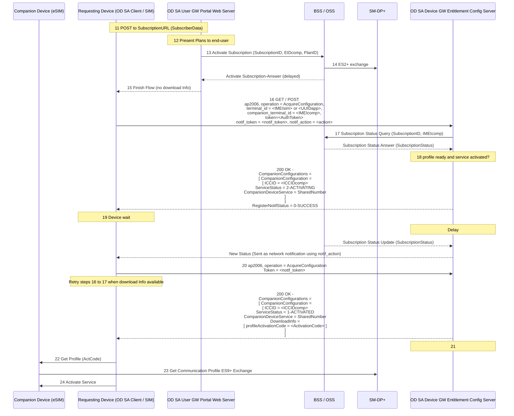
```mermaid
sequenceDiagram
    participant CD as Companion Device (eSIM)
    participant RD as Requesting Device (OD SA Client / SIM)
    participant GW as OD SA User GW Portal Web Server
    participant BSS as BSS / OSS
    participant SM as SM-DP+
    participant ECS as OD SA Device GW Entitlement Config Server

    Note over RD, GW: 11 POST to SubscriptionURL (SubscriberData)
    Note over GW: 12 Present Plans to end-user
    GW->>BSS: 13 Activate Subscription (SubscriptionID, EIDcomp, PlanID)
    BSS->>SM: 14 ES2+ exchange
    BSS-->>GW: Activate Subscription-Answer (delayed)
    GW-->>RD: 15 Finish Flow (no download Info)

    RD->>ECS: 16 GET / POST<br/>ap2006, operation = AcquireConfiguration,<br/>terminal_id = <IMEIsim> or <UUIDapp>,<br/>companion_terminal_id = <IMEIcomp>,<br/>token=<AuthToken><br/>notif_token = <notif_token>, notif_action = <action>
    ECS->>BSS: 17 Subscription Status Query (SubscriptionID, IMEIcomp)
    BSS-->>ECS: Subscription Status Answer (SubscriptionStatus)
    
    Note over ECS: 18 profile ready and service activated?
    ECS-->>RD: 200 OK -<br/>CompanionConfigurations =<br/>[ CompanionConfiguration =<br/>[ ICCID = <ICCIDcomp><br/>ServiceStatus = 2-ACTIVATING<br/>CompanionDeviceService = SharedNumber<br/>]<br/>]<br/>RegisterNotifStatus = 0-SUCCESS

    Note over RD: 19 Device wait
    Note over ECS: Delay
    BSS-->>ECS: Subscription Status Update (SubscriptionStatus)
    ECS-->>RD: New Status (Sent as network notification using notif_action)
    
    RD->>ECS: 20 ap2006, operation = AcquireConfiguration<br/>Token = <notif_token>
    Note over RD: Retry steps 16 to 17 when download Info available
    
    ECS-->>RD: 200 OK -<br/>CompanionConfigurations =<br/>[ CompanionConfiguration =<br/>[ ICCID = <ICCIDcomp><br/>ServiceStatus = 1-ACTIVATED<br/>CompanionDeviceService = SharedNumber<br/>DownloadInfo =<br/>[ profileActivationCode = <ActivationCode> ]<br/>]<br/>]
    Note over ECS: 21
    
    RD->>CD: 22 Get Profile (ActCode)
    CD->>SM: 23 Get Communication Profile ES9+ Exchange
    RD->>CD: 24 Activate Service
```

Figure 23. Final steps for companion ODSA procedure with ODSA portal, delayed profile download info and enabled push-notifications.

### 7.3.2 ODSA Portal with Delayed Download Info – Final Steps - Polling

The following presents the case where:

*   The application did not register for event notification (refer to 2.6)


TS.43 v12.0
Page 111 of 248

GSM Association
Non-confidential
Official Document TS.43 - Service Entitlement Configuration


In this example the companion ODSA client application polls the ECS continuously until the profile is ready and the service status is correct. Alternatively, the application can register for ODSA events and wait for the network-generated notification message (refer to 2.6).

Figure 24 shows the final steps of the Companion ODSA procedure in the case where the eSIM profile download information is obtained by the application after the end-user interactions with the ODSA portal (delayed delivery). The steps are:

11. The ODSA client application connects with the ODSA portal web server using the URL provided in the **ManageSubscription** operation, allowing the web pages from the portal to be displayed to the end-user.
12. The ODSA portal web server presents a set of plan offers to the end-user and captures the selection from the end-user.
13. The ODSA portal makes a request towards the SP's back-end system to activate the selected plan and subscription.
14. The SP's back-end system interacts with the SM-DP+ over the ES2+ interface to make the required eSIM profile requests associated with the new subscription (for example, `DownloadOrder`, `ConfirmOrder` and `ReleaseProfile`), and indicates to the ODSA portal that the final response with the download info is delayed (asynchronous)
15. The ODSA portal indicates to the ODSA client application the end of the end-user flow via a JavaScript callback function without providing the eSIM profile download information (activation code)
16. The ODSA client application makes an **AcquireConfiguration** request to the ECS to verify that the subscription and service for the companion device are in the proper states.
17. The ECS queries the SP's back-end system managing the subscriptions and profiles.
    If the subscription is not yet ready and eSIM profile info is not yet available, go to step 18.
    If the subscription is ready, as well as eSIM profile download info, go to step 20
18. The ECS generates a 200 OK response with a `CompanionDeviceConfiguration` that could be different based on the number of refresh requests the device has made.
    a) **#Request < MaxRefreshRequest**. The `CompanionDeviceConfiguration` response will bear the ACTIVATING status (value of 2). A specific polling interval value could be sent to define the new polling interval of the device application to refresh the service status. This new polling interval value could be different to the previous one based on the number of requests made by the device.
    b) **#Request = MaxRefreshRequest**. The `CompanionDeviceConfiguration` response will bear the DEACTIVATED, NO REUSE status (value of 4). At this point, the activation flow is finished.
19. After a delay (polling interval defined in the previous response), the ODSA application repeats the **AcquireConfiguration**, going to step 16
20. The ECS generates a 200 OK response with a `CompanionDeviceConfiguration` entry for the newly active subscription bearing the ACTIVATED status (value of 1) and a filled in `DownloadInfo` structure.


TS.43 v12.0
Page 112 of 248

GSM Association
Non-confidential
Official Document TS.43 - Service Entitlement Configuration


21. As the companion device’s subscription and service are in the right state, the ODSA client application informs the companion device to download the eSIM profile.
22. The companion device downloads the eSIM profile from the SM-DP+
23. The ODSA client application informs the companion device to initiate cellular service.


TS.43 v12.0
Page 113 of 248

GSM Association
Official Document TS.43 - Service Entitlement Configuration
Non-confidential


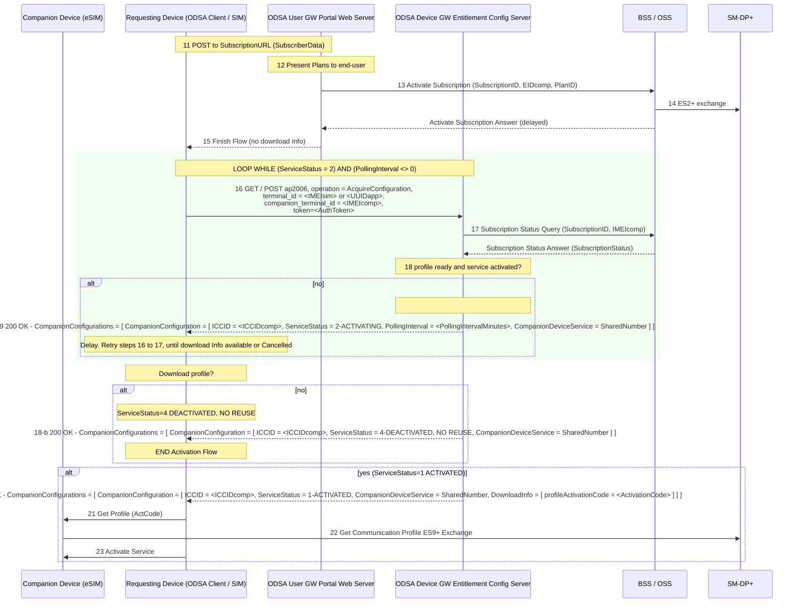
```mermaid
sequenceDiagram
    participant CD as Companion Device (eSIM)
    participant RD as Requesting Device (ODSA Client / SIM)
    participant GW as ODSA User GW Portal Web Server
    participant ECS as ODSA Device GW Entitlement Config Server
    participant BSS as BSS / OSS
    participant SM as SM-DP+

    Note over RD, GW: 11 POST to SubscriptionURL (SubscriberData)
    Note over GW: 12 Present Plans to end-user
    GW->>BSS: 13 Activate Subscription (SubscriptionID, EIDcomp, PlanID)
    BSS->>SM: 14 ES2+ exchange
    BSS-->>GW: Activate Subscription Answer (delayed)
    GW-->>RD: 15 Finish Flow (no download Info)

    rect rgb(240, 255, 240)
    Note over RD, ECS: LOOP WHILE (ServiceStatus = 2) AND (PollingInterval <> 0)
    RD->>ECS: 16 GET / POST ap2006, operation = AcquireConfiguration,<br/>terminal_id = <IMEIsim> or <UUIDapp>,<br/>companion_terminal_id = <IMEIcomp>,<br/>token=<AuthToken>
    ECS->>BSS: 17 Subscription Status Query (SubscriptionID, IMEIcomp)
    BSS-->>ECS: Subscription Status Answer (SubscriptionStatus)
    
    Note over ECS: 18 profile ready and service activated?
    
    alt no
        Note over ECS: #Request < MaxRefreshReq
        ECS-->>RD: 19 200 OK - CompanionConfigurations = [ CompanionConfiguration = [ ICCID = <ICCIDcomp>, ServiceStatus = 2-ACTIVATING, PollingInterval = <PollingIntervalMinutes>, CompanionDeviceService = SharedNumber ] ]
        Note over RD: Delay. Retry steps 16 to 17, until download Info available or Cancelled
    end
    end

    Note over RD: Download profile?
    
    alt no
        Note over RD: ServiceStatus=4 DEACTIVATED, NO REUSE
        ECS-->>RD: 18-b 200 OK - CompanionConfigurations = [ CompanionConfiguration = [ ICCID = <ICCIDcomp>, ServiceStatus = 4-DEACTIVATED, NO REUSE, CompanionDeviceService = SharedNumber ] ]
        Note over RD: END Activation Flow
    end

    alt yes (ServiceStatus=1 ACTIVATED)
        ECS-->>RD: 20 200 OK - CompanionConfigurations = [ CompanionConfiguration = [ ICCID = <ICCIDcomp>, ServiceStatus = 1-ACTIVATED, CompanionDeviceService = SharedNumber, DownloadInfo = [ profileActivationCode = <ActivationCode> ] ] ]
        RD->>CD: 21 Get Profile (ActCode)
        CD->>SM: 22 Get Communication Profile ES9+ Exchange
        RD->>CD: 23 Activate Service
    end
```

Figure 24. Final steps for companion ODSA procedure with ODSA portal and delayed profile download info.


TS.43 v12.0 Page 114 of 248

GSM Association
Non-confidential
Official Document TS.43 - Service Entitlement Configuration


## 7.4 Subscription Activation without ODSA Portal

The following presents the case where:

* The companion ODSA client application is allowed for the type of primary device and enabled for the end-user (entitled).
* The companion device does not have an active eSIM subscription/profile from the Service Provider.
* The SP is able to activate a subscription and create an eSIM profile for the companion device without involving the ODSA portal web server.

Figure 25 presents a call flow where the eSIM profile download information for the companion device is made available by the SP at the time of the **ManageSubscription** request. There is no need to send the end-user to an ODSA portal web server.

The steps 1 to 8 are the same as in 7.1. The remaining steps are:

9. The ECS queries the SP's back-end system to determine the next step and method to use for the companion device's subscription request (no need for ODSA portal)
10. The SP's back-end system interacts with the SM-DP+ over the ES2+ interface to make the required eSIM profile requests associated with the new subscription (for example, `DownloadOrder`, `ConfirmOrder` and `ReleaseProfile`) resulting in an activation code and ICCID for the companion device returned to the ECS.
11. The ECS processes the response from the SP's back-end system and generates the proper **ManageSubscription** 200 OK response with a `SubscriptionResult` set to DOWNLOAD_PROFILE (value of 2), and a filled in `DownloadInfo` structure.
12. The ODSA client application informs the companion device to download the eSIM profile.
13. The companion device downloads the eSIM profile from the SM-DP+
14. The ODSA client application makes an **AcquireConfiguration** request to the ECS to verify that the subscription and service for the companion device are in the proper states.
15. The ECS queries the SP's back-end system managing the subscriptions and profiles.
16. The ECS processes the response from the SP's back-end system and generates the proper 200 OK response containing `CompanionDeviceConfigurations` with a `CompanionDeviceConfiguration` entry for the newly active subscription bearing the ACTIVATED status (value of 1).
17. The ODSA client application informs the companion device to initiate cellular service.


TS.43 v12.0
Page 115 of 248

GSM Association
Non-confidential
Official Document TS.43 - Service Entitlement Configuration


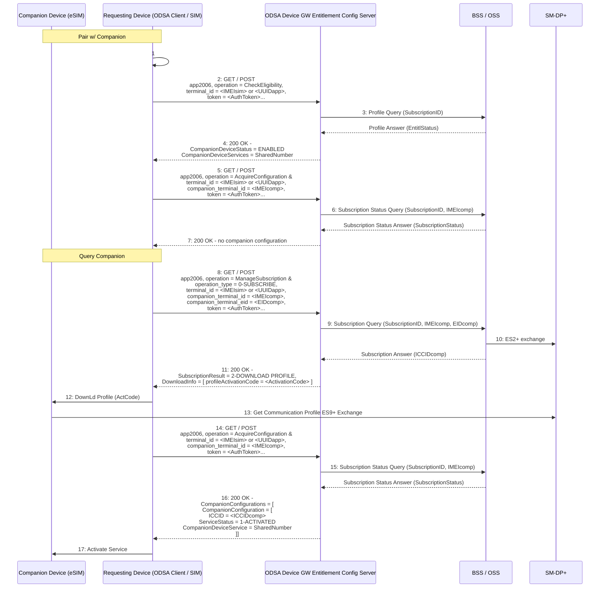
```mermaid
sequenceDiagram
    participant CD as Companion Device (eSIM)
    participant RD as Requesting Device (ODSA Client / SIM)
    participant GW as ODSA Device GW Entitlement Config Server
    participant BSS as BSS / OSS
    participant SM as SM-DP+

    Note over CD, RD: Pair w/ Companion
    RD->>RD: 1
    RD->>GW: 2: GET / POST<br/>app2006, operation = CheckEligibility,<br/>terminal_id = <IMEIsim> or <UUIDapp>,<br/>token = <AuthToken>...
    GW->>BSS: 3: Profile Query (SubscriptionID)
    BSS-->>GW: Profile Answer (EntitlStatus)
    GW-->>RD: 4: 200 OK -<br/>CompanionDeviceStatus = ENABLED<br/>CompanionDeviceServices = SharedNumber
    RD->>GW: 5: GET / POST<br/>app2006, operation = AcquireConfiguration &<br/>terminal_id = <IMEIsim> or <UUIDapp>,<br/>companion_terminal_id = <IMEIcomp>,<br/>token = <AuthToken>...
    GW->>BSS: 6: Subscription Status Query (SubscriptionID, IMEIcomp)
    BSS-->>GW: Subscription Status Answer (SubscriptionStatus)
    GW-->>RD: 7: 200 OK - no companion configuration
    Note over CD, RD: Query Companion
    RD->>GW: 8: GET / POST<br/>app2006, operation = ManageSubscription &<br/>operation_type = 0-SUBSCRIBE,<br/>terminal_id = <IMEIsim> or <UUIDapp>,<br/>companion_terminal_id = <IMEIcomp>,<br/>companion_terminal_eid = <EIDcomp>,<br/>token = <AuthToken>...
    GW->>BSS: 9: Subscription Query (SubscriptionID, IMEIcomp, EIDcomp)
    BSS->>SM: 10: ES2+ exchange
    BSS-->>GW: Subscription Answer (ICCIDcomp)
    GW-->>RD: 11: 200 OK -<br/>SubscriptionResult = 2-DOWNLOAD PROFILE,<br/>DownloadInfo = [ profileActivationCode = <ActivationCode> ]
    RD->>CD: 12: DownLd Profile (ActCode)
    CD->>SM: 13: Get Communication Profile ES9+ Exchange
    RD->>GW: 14: GET / POST<br/>app2006, operation = AcquireConfiguration &<br/>terminal_id = <IMEIsim> or <UUIDapp>,<br/>companion_terminal_id = <IMEIcomp>,<br/>token = <AuthToken>...
    GW->>BSS: 15: Subscription Status Query (SubscriptionID, IMEIcomp)
    BSS-->>GW: Subscription Status Answer (SubscriptionStatus)
    GW-->>RD: 16: 200 OK -<br/>CompanionConfigurations = [<br/>CompanionConfiguration = [<br/>ICCID = <ICCIDcomp><br/>ServiceStatus = 1-ACTIVATED<br/>CompanionDeviceService = SharedNumber<br/>]]
    RD->>CD: 17: Activate Service
```

<center>Figure 25. Call flow for Companion ODSA procedure without ODSA Portal</center>

## 7.5 Subscription Pre-activation via another Channel

The following presents the case where:

*   The companion ODSA application is allowed for the type of primary device and enabled for the end-user (entitled).
*   The companion device has an active eSIM subscription and communication profile from the Service Provider, created beforehand through another channel (for example point of sale or call to a SP's representative).


TS.43 v12.0
Page 116 of 248

GSM Association
Non-confidential
Official Document TS.43 - Service Entitlement Configuration


Figure 26 presents a call flow where the eSIM profile download information for the companion device is made available by the SP at the time of the AcquireConfiguration request. There is no need to send the end-user to an ODSA portal web server.

The steps 1 to 4 are the same as in 7.1. The remaining steps are:

5. The ODSA client application makes an **AcquireConfiguration** request to the ECS to verify that the subscription and service for the companion device are in the proper states.
6. The ECS queries the SP's back-end system managing the subscriptions and profiles, which shows that the companion device already has a subscription and associated eSIM profile.
7. The ECS processes the response from the SP's back-end system and generates the proper 200 OK response containing `CompanionDeviceConfigurations` with a `CompanionDeviceConfiguration` entry for the newly active subscription bearing the ACTIVATED status (value of 1) and a filled in `DownloadInfo` structure.
8. The ODSA client application informs the companion device to download the eSIM profile.
9. The companion device downloads the eSIM profile from the SM-DP+
10. The ODSA application informs the companion device to initiate cellular service.

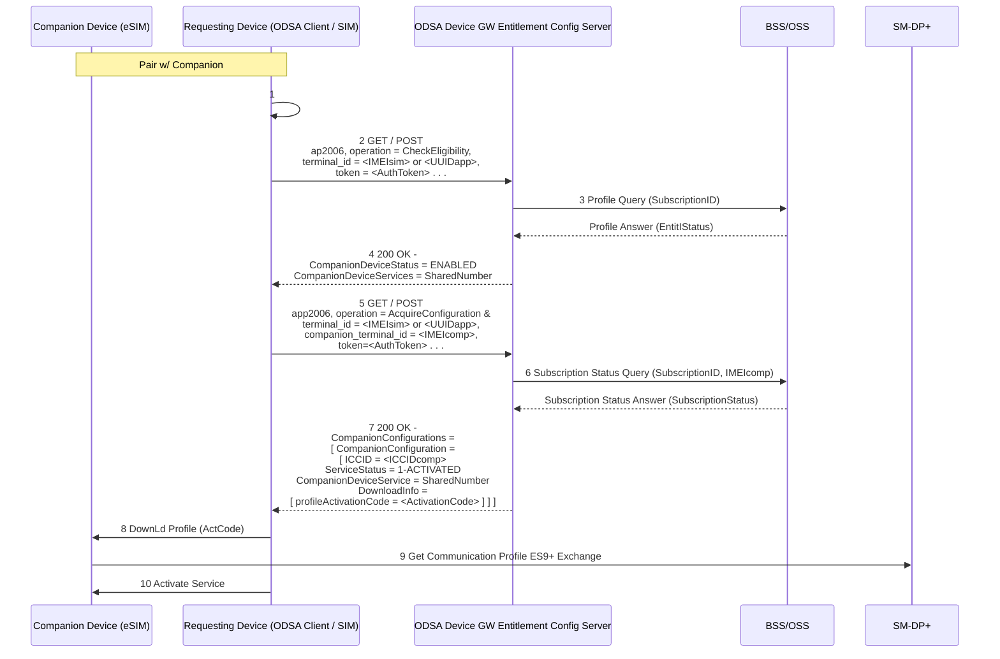
```mermaid
sequenceDiagram
    participant CD as Companion Device (eSIM)
    participant RD as Requesting Device (ODSA Client / SIM)
    participant ECS as ODSA Device GW Entitlement Config Server
    participant BSS as BSS/OSS
    participant SMDP as SM-DP+

    Note over CD, RD: Pair w/ Companion
    RD->>RD: 1
    RD->>ECS: 2 GET / POST<br/>ap2006, operation = CheckEligibility,<br/>terminal_id = <IMEIsim> or <UUIDapp>,<br/>token = <AuthToken> . . .
    ECS->>BSS: 3 Profile Query (SubscriptionID)
    BSS-->>ECS: Profile Answer (EntitIStatus)
    ECS-->>RD: 4 200 OK -<br/>CompanionDeviceStatus = ENABLED<br/>CompanionDeviceServices = SharedNumber
    RD->>ECS: 5 GET / POST<br/>app2006, operation = AcquireConfiguration &<br/>terminal_id = <IMEIsim> or <UUIDapp>,<br/>companion_terminal_id = <IMEIcomp>,<br/>token=<AuthToken> . . .
    ECS->>BSS: 6 Subscription Status Query (SubscriptionID, IMEIcomp)
    BSS-->>ECS: Subscription Status Answer (SubscriptionStatus)
    ECS-->>RD: 7 200 OK -<br/>CompanionConfigurations =<br/>[ CompanionConfiguration =<br/>[ ICCID = <ICCIDcomp><br/>ServiceStatus = 1-ACTIVATED<br/>CompanionDeviceService = SharedNumber<br/>DownloadInfo =<br/>[ profileActivationCode = <ActivationCode> ] ] ]
    RD->>CD: 8 DownLd Profile (ActCode)
    CD->>SMDP: 9 Get Communication Profile ES9+ Exchange
    RD->>CD: 10 Activate Service
```

<center>Figure 26. Call flow for Companion ODSA procedure with pre-activated subscription.</center>

## 7.6 Multiple companion device Management without webview

The following presents the case where:


TS.43 v12.0
Page 117 of 248

GSM Association
Non-confidential
Official Document TS.43 - Service Entitlement Configuration


* The Companion ODSA device is entitled, and companion devices are entitled by the Service provider for service.
* The end-user requests the current eSIM profiles associated with the active subscription and their installation location information and there is no need to involve the SP's ODSA portal web server.
* The end-user requests subscription transfer on the old companion device which carries an active subscription with the SP.

Figure 27 shows the steps of the flow for the transfer of an active companion eSIM profile from one companion to another. The Companion ODSA app acquires proper entitlement and subscription data from the SP's ECS. The steps are:

1. User requests On-Device Activation via the companion client application and obtains the necessary companion device information.
2. The Companion ODSA client application makes a **CheckEligibility** request to the ECS.
3. The ECS queries the SP back-end system managing the entitlements and eSIM profiles associated with ODSA applications.
4. The ECS generates proper response with application status (ENABLED)
5. The Companion ODSA client application sends an **AcquireConfiguration** request to the ECS to query all of the eSIM profiles associated with the SubscriptionID.
6. (OPTIONAL) The ECS queries the BSS to get the `SubscriptionStatus` of all the eSIM profiles associated with the SubscriptionID.
7. The ECS confirms that the `terminal_id` doesn't support websheet and therefore lists all `companion_terminal_iccid` values and their associated device information in the **CompanionConfigurations** parameter along with the associated CompanionDeviceInfo element.
8. The Companion ODSA client may list the eSIM profiles and their installation location to the User and may provide an MMI to allow the user to manage the location of these eSIM profiles by ICCID. The user selects the ICCID they want transferred and sets the **old_companion_terminal_id** and **old_companion_terminal_ICCID** using this MMI.
9. The Companion ODSA client application sends a **ManageSubscription** request to the ECS to start the subscription procedure with the SP. If `old_companion_terminal_iccid` is not present the ECS recognizes that the Companion ODSA client application doesn't support a device management MMI, the ES shall redirect the Companion ODSA client to the websheet as described in clause 6.5.3. If the ECS doesn't support any form of eSIM management function and `old_companion_terminal_iccid` is present the ECS shall follow the error mechanisms defined in section 2.10 of this document.
10. The ECS requests for a new subscription from the SP's back-end system to complete the transfer.
11. A set of eSIM profile requests over the ES2+ interface (for example, `DownloadOrder`, `ConfirmOrder` and `ReleaseProfile`) is made to the SM-DP+,


TS.43 v12.0
Page 118 of 248

GSM Association
Non-confidential
Official Document TS.43 - Service Entitlement Configuration


resulting in an activation code and ICCID (ICCIDnew) of the eSIM profile to be downloaded onto the new companion device.

12. The ECS sends subscription information (details of the eSIM profile) back to the Companion ODSA client along with subscription result (done).
13. The Companion ODSA client sends the activation code to the new Companion device to being the eSIM profile download.

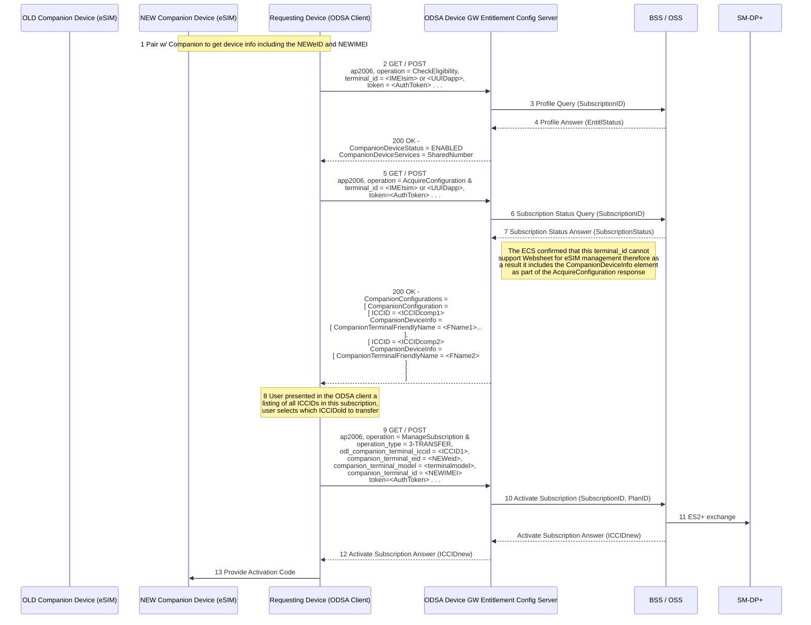
```mermaid
sequenceDiagram
    participant OLD as OLD Companion Device (eSIM)
    participant NEW as NEW Companion Device (eSIM)
    participant ODSA as Requesting Device (ODSA Client)
    participant ECS as ODSA Device GW Entitlement Config Server
    participant BSS as BSS / OSS
    participant SMDP as SM-DP+

    Note over NEW, ODSA: 1 Pair w/ Companion to get device info including the NEWeID and NEWIMEI
    ODSA->>ECS: 2 GET / POST<br/>ap2006, operation = CheckEligibility,<br/>terminal_id = <IMEIsim> or <UUIDapp>,<br/>token = <AuthToken> . . .
    ECS->>BSS: 3 Profile Query (SubscriptionID)
    BSS-->>ECS: 4 Profile Answer (EntitlStatus)
    ECS-->>ODSA: 200 OK -<br/>CompanionDeviceStatus = ENABLED<br/>CompanionDeviceServices = SharedNumber
    ODSA->>ECS: 5 GET / POST<br/>app2006, operation = AcquireConfiguration &<br/>terminal_id = <IMEIsim> or <UUIDapp>,<br/>token=<AuthToken> . . .
    ECS->>BSS: 6 Subscription Status Query (SubscriptionID)
    BSS-->>ECS: 7 Subscription Status Answer (SubscriptionStatus)
    Note right of ECS: The ECS confirmed that this terminal_id cannot<br/>support Websheet for eSIM management therefore as<br/>a result it includes the CompanionDeviceInfo element<br/>as part of the AcquireConfiguration response
    ECS-->>ODSA: 200 OK -<br/>CompanionConfigurations =<br/>[ CompanionConfiguration =<br/>[ ICCID = <ICCIDcomp1><br/>CompanionDeviceInfo =<br/>[ CompanionTerminalFriendlyName = <FName1>...<br/>],<br/>[ ICCID = <ICCIDcomp2><br/>CompanionDeviceInfo =<br/>[ CompanionTerminalFriendlyName = <FName2><br/>]<br/>]<br/>]
    Note over ODSA: 8 User presented in the ODSA client a<br/>listing of all ICCIDs in this subscription,<br/>user selects which ICCIDold to transfer
    ODSA->>ECS: 9 GET / POST<br/>ap2006, operation = ManageSubscription &<br/>operation_type = 3-TRANSFER,<br/>odl_companion_terminal_iccid = <ICCID1>,<br/>companion_terminal_eid = <NEWeid>,<br/>companion_terminal_model = <terminalmodel>,<br/>companion_terminal_id = <NEWIMEI><br/>token=<AuthToken> . . .
    ECS->>BSS: 10 Activate Subscription (SubscriptionID, PlanID)
    BSS->>SMDP: 11 ES2+ exchange
    BSS-->>ECS: Activate Subscription Answer (ICCIDnew)
    ECS-->>ODSA: 12 Activate Subscription Answer (ICCIDnew)
    ODSA->>NEW: 13 Provide Activation Code
```

Figure 27: Companion ODSA procedure for multiple companion device Management without webview (eSIM transfer to new device)

## 7.7 Early eligibility check with OIDC and web portal

The following presents the case where:

* The companion ODSA application is allowed for the type of requesting device.
* The companion device has not yet an active eSIM subscription/ profile from the Service Provider.
* The companion device model is **not supported** by the Service Provider.


TS.43 v12.0
Page 119 of 248

GSM Association
Non-confidential
Official Document TS.43 - Service Entitlement Configuration


*   The authentication mechanism is based on OAuth 2.0 / OpenID Connect.
*   The SP's ODSA portal web server is responsible for completing the subscription activation for the companion device.

Figure 28 presents a call flow where the user is advised about the incompatibility of the model without needing to authenticate, with a 302 HTTP redirect mechanism. These steps are:

1.  End-user invokes the Companion ODSA client application on the requesting device which connects with the companion device to initiate the ODSA procedure (over a protocol outside the scope of this specification).
2.  The initial GET request described in 2.8.2 includes the `companion_terminal_id` parameter, set to the companion device IMEI. There is no token as it is the first time the user is trying to entitle the companion device.
3.  The ECS determines that the companion device is not eligible to the service and returns the HTTP 302 redirect answer to indicate the "not enable" web page to the ODSA client.
4.  and 5. this later can display a web page explaining the issue to the end-user. The page may be closed with a call to the dismissFlow() callback.

The benefit of this use case is to keep the user journey simple by checking first the device compatibility before asking the user to authenticate. Nevertheless, this requires the client to provide the optional `companion_terminal_id` parameter, initialized with its IMEI. When this optional use case is implemented, devices not providing the `companion_terminal_id` parameter are still managed as described in Figure 3.

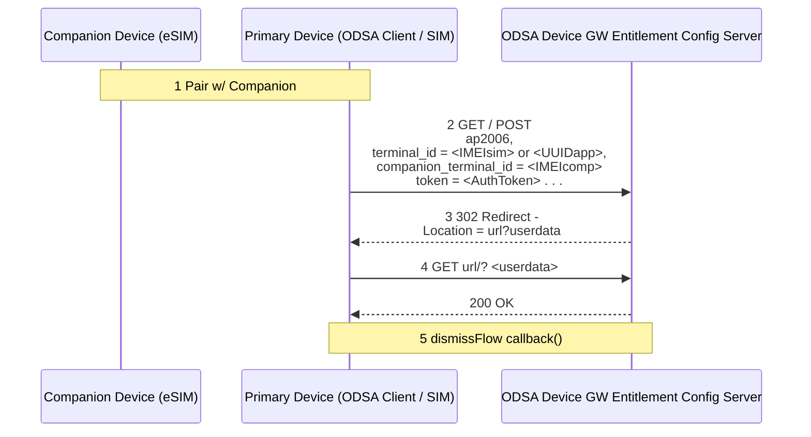
```mermaid
sequenceDiagram
    participant CD as Companion Device (eSIM)
    participant PD as Primary Device (ODSA Client / SIM)
    participant ECS as ODSA Device GW Entitlement Config Server

    Note over CD, PD: 1 Pair w/ Companion
    PD->>ECS: 2 GET / POST<br/>ap2006,<br/>terminal_id = <IMEIsim> or <UUIDapp>,<br/>companion_terminal_id = <IMEIcomp><br/>token = <AuthToken> . . .
    ECS-->>PD: 3 302 Redirect -<br/>Location = url?userdata
    PD->>ECS: 4 GET url/? <userdata>
    ECS-->>PD: 200 OK
    Note over PD, ECS: 5 dismissFlow callback()
```

Figure 28. Companion device incompatibility detected by companion_terminal_id.


TS.43 v12.0
Page 120 of 248

GSM Association
Non-confidential
Official Document TS.43 - Service Entitlement Configuration


# 8 Primary ODSA Procedure Call Flows

The following sections present a number of informational call flows for the different user experiences and use cases of the Primary ODSA procedure. The ODSA application on the primary device is invoked at the request of the end-user and should capture proper user consent in order to have access to the eSIM on that primary device.

The exchanges between the Entitlement Configuration Server (ECS) (aka ODSA Device Gateway) and the Service Provider’s (SP) back-end systems are shown for informational purposes only. This applies as well for the exchanges that involve the ODSA Portal Web Server.

## 8.1 New eSIM Subscription Activation via ODSA Portal

The following presents the case where:

* The Primary ODSA client application is allowed for the type of primary device and enabled by the SP (entitled).
* The primary device does not have an active eSIM subscription/profile from the SP and the end-user does not have a subscription on another device.
* The SP supports the OpenID Connect authentication flow, which also includes a "create account" option for new subscription request.
* The SP's ODSA portal web server is responsible for completing the subscription activation for the primary device's eSIM.

Figure 29 shows the initial steps of the flow for the activation of a new subscription leveraging the SP's ODSA portal. The Primary ODSA client application acquires proper entitlement and subscription data from the SP's ECS. The steps are:

1. User requests On-Device Activation via the Primary ODSA client application that sends an initial POST or GET request with proper terminal parameters to the ECS.
2. As there is no parameter associated with authentication or identification, the ECS invokes OAuth/OpenID authentication and connects the app/end-user with the SP's OpenID/OAuth 2.0 platform.
3. At the conclusion of the Authentication (which includes account creation steps), the ECS receives proper ID and access tokens from the OpenID platform and returns an ECS-generated AuthN Token to the ODSA application (see 2.8.2 for details)
4. The Primary ODSA client application makes a **CheckEligibility** request to the ECS.
5. The ECS queries the SP back-end system managing the entitlements and profile associated with ODSA applications.
6. The ECS generates proper response with application status (ENABLED)
7. Optional - Since the target service is allowed, the Primary ODSA application sends an **AcquireConfiguration** request to the ECS to obtain information on any eSIM profiles associated with the device.
8. The ECS queries the SP's back-end system managing the subscriptions and active profiles.
9. The ECS processes the response from the SP's back-end system and generates the proper 200 OK response without any `PrimaryDeviceConfigurations` (no eSIM profile/subscription is associated with the device).


TS.43 v12.0
Page 121 of 248

GSM Association
Non-confidential
Official Document TS.43 - Service Entitlement Configuration


10. The Primary ODSA client application sends a **ManageSubscription** request to the ECS to start the subscription procedure with the SP.
11. The ECS queries the SP back-end system responsible for managing subscriptions and makes a request for a new subscription.
12. The ECS generates a proper response with the subscription procedure data. It contains a `SubscriptionResult` set to CONTINUE_TO_WS (value of 1), and `SubscriptionServiceURL` along with `SubscriptionServiceUserData` presenting the URL of the ODSA Portal web server and any user-specific data that would be useful to the Portal.

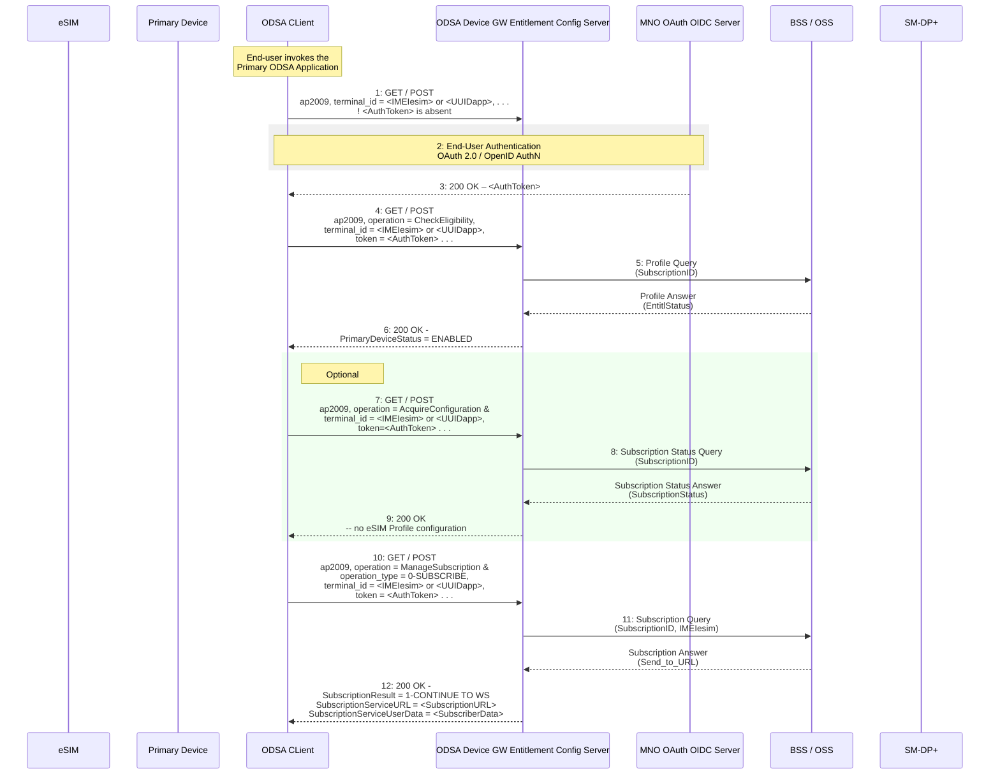
```mermaid
sequenceDiagram
    participant eSIM
    participant Primary Device
    participant ODSA CLient
    participant ECS as ODSA Device GW Entitlement Config Server
    participant MNO as MNO OAuth OIDC Server
    participant BSS as BSS / OSS
    participant SMDP as SM-DP+

    Note over ODSA CLient: End-user invokes the<br/>Primary ODSA Application

    ODSA CLient->>ECS: 1: GET / POST<br/>ap2009, terminal_id = <IMEIesim> or <UUIDapp>, . . .<br/>! <AuthToken> is absent
    
    rect rgb(240, 240, 240)
    Note over ODSA CLient, MNO: 2: End-User Authentication<br/>OAuth 2.0 / OpenID AuthN
    end
    
    MNO-->>ODSA CLient: 3: 200 OK – <AuthToken>

    ODSA CLient->>ECS: 4: GET / POST<br/>ap2009, operation = CheckEligibility,<br/>terminal_id = <IMEIesim> or <UUIDapp>,<br/>token = <AuthToken> . . .
    ECS->>BSS: 5: Profile Query<br/>(SubscriptionID)
    BSS-->>ECS: Profile Answer<br/>(EntitlStatus)
    ECS-->>ODSA CLient: 6: 200 OK -<br/>PrimaryDeviceStatus = ENABLED

    rect rgb(240, 255, 240)
    Note right of ODSA CLient: Optional
    ODSA CLient->>ECS: 7: GET / POST<br/>ap2009, operation = AcquireConfiguration &<br/>terminal_id = <IMEIesim> or <UUIDapp>,<br/>token=<AuthToken> . . .
    ECS->>BSS: 8: Subscription Status Query<br/>(SubscriptionID)
    BSS-->>ECS: Subscription Status Answer<br/>(SubscriptionStatus)
    ECS-->>ODSA CLient: 9: 200 OK<br/>-- no eSIM Profile configuration
    end

    ODSA CLient->>ECS: 10: GET / POST<br/>ap2009, operation = ManageSubscription &<br/>operation_type = 0-SUBSCRIBE,<br/>terminal_id = <IMEIesim> or <UUIDapp>,<br/>token = <AuthToken> . . .
    ECS->>BSS: 11: Subscription Query<br/>(SubscriptionID, IMEIesim)
    BSS-->>ECS: Subscription Answer<br/>(Send_to_URL)
    ECS-->>ODSA CLient: 12: 200 OK -<br/>SubscriptionResult = 1-CONTINUE TO WS<br/>SubscriptionServiceURL = <SubscriptionURL><br/>SubscriptionServiceUserData = <SubscriberData>
```

Figure 29. Primary ODSA procedure for New Subscription involving ODSA Portal – Initial Steps

Figure 30 presents the final steps of the flow for the activation of a new subscription leveraging the SP's ODSA portal. The Primary ODSA app connects the end-user to the SP's ODSA Portal to finalize the subscription activation. The steps are:

13. The Primary ODSA device application sends the end-user to the SP's ODSA web server portal.
14. The SP ODSA portal captures the subscription and plan selection from the end-user.
15. The SP's back-end system managing subscription receives a new subscription request from the SP portal.


TS.43 v12.0
Page 122 of 248

GSM Association
Non-confidential
Official Document TS.43 - Service Entitlement Configuration


16. A set of eSIM profile requests over the ES2+ interface (for example, `DownloadOrder`, `ConfirmOrder` and `ReleaseProfile`) is made to the SM-DP+, for the new subscription associated with the device eSIM, resulting in an activation code and ICCID for the primary device.
17. Via a JavaScript call back function, the SP ODSA portal sends subscription information (details of the eSIM profile) back to the Primary ODSA app.
18. The Primary ODSA device application informs the eSIM to download the eSIM profile, which is obtained from the SM-DP+.
19. The device's eSIM gets the eSIM profile from the SM-DP+ via ES9+ channel.
20. <u>Optional</u> - The Primary ODSA app makes another **ManageSubscription** to the ECS to provide/confirm the download of the newly created ICCID and to validate that the primary device subscription is ready and in proper activated state.
21. The ECS queries the Subscription Management system.
22. The ECS generates the proper response with subscription result (3-DONE).
23. <u>Optional</u> - The Primary ODSA client application makes an **AcquireConfiguration** request to the ECS to verify that the subscription and service for the device are in the proper states.
24. The ECS queries the SP's back-end system managing the subscriptions and profiles.
25. The ECS processes the response from the SP's back-end system and generates the proper 200 OK response containing a `PrimaryConfiguration` entry for the newly active subscription bearing the ACTIVATED status (value of 1).
26. As the primary device’s subscription and service is in the right state, the primary device can initiate cellular service.


TS.43 v12.0
Page 123 of 248

GSM Association Non-confidential
Official Document TS.43 - Service Entitlement Configuration


```mermaid
sequenceDiagram
    participant eSIM
    participant Primary Device
    participant ODSA Client
    participant ODSA User GW Portal Web Server
    participant BSS / OSS
    participant SM-DP+
    participant ODSA Device GW Entitlement Config Server

    Note over ODSA Client, ODSA User GW Portal Web Server: 13 POST to <SubscriptionURL> w/ <SubscriberData>
    Note right of ODSA User GW Portal Web Server: 14 Present Plans, Capture T&C,<br/>Request Subscription
    ODSA User GW Portal Web Server->>BSS / OSS: 15 Activate Subscription<br/>(SubscriptionID, IMEIesim, PlanID)
    BSS / OSS->>SM-DP+: 16 ES2+ exchange
    BSS / OSS-->>ODSA User GW Portal Web Server: Activate Subscription Answer (ICCIDesim)
    ODSA User GW Portal Web Server-->>ODSA Client: 17 Profile Ready for Download<br/>(download Info with ActivationCode)
    ODSA User GW Portal Web Server-->>ODSA Client: Finish Flow ()
    ODSA Client->>eSIM: 18 DownLd Profile (ActCode)
    eSIM->>SM-DP+: 19 Get Communication Profile ES9+ exchange

    rect rgb(240, 255, 240)
    Note right of ODSA Client: Optional
    ODSA Client->>ODSA Device GW Entitlement Config Server: 20 GET / POST<br/>app2009, operation = ManageSubscription &<br/>operation_type = 4-UPDATE,<br/>terminal_id = <IMEIesim> or <UUIDapp>,<br/>terminal_iccid = <ICCIDesim>,<br/>token = <AuthToken> . . .
    ODSA Device GW Entitlement Config Server->>BSS / OSS: 21 Confirm Subscription (SubscriptionID, ICCIDesim)
    BSS / OSS-->>ODSA Device GW Entitlement Config Server: Confirm Subscription Answer
    ODSA Device GW Entitlement Config Server-->>ODSA Client: 22 200 OK - SubscriptionResult=<DONE>
    
    ODSA Client->>ODSA Device GW Entitlement Config Server: 23 GET / POST<br/>app2009, operation = AcquireConfiguration &<br/>terminal_id = <IMEIesim> or <UUIDapp>,<br/>token=<AuthToken> . . .
    ODSA Device GW Entitlement Config Server->>BSS / OSS: 24 Subscription Status Query (SubscriptionID, IMEIesim)
    BSS / OSS-->>ODSA Device GW Entitlement Config Server: Subscription Status Answer (SubscriptionStatus)
    ODSA Device GW Entitlement Config Server-->>ODSA Client: 25 200 OK<br/>PrimaryConfiguration =<br/>[ ICCID = <ICCIDesim><br/>ServiceStatus = 1-ACTIVATED ]
    end

    eSIM->>Primary Device: 26 Activate Service
```

*Figure 30. Primary ODSA procedure for New Subscription involving ODSA Portal – Final Steps*

## 8.2 Additional eSIM Subscription Activation via ODSA Portal

The following presents the case where:

*   The Primary ODSA device application is allowed for the type of primary device and enabled by the SP (entitled).
*   The primary device already carries an active subscription and communication profile from the SP, accessible on a SIM.
*   The SP's ODSA portal web server is responsible for completing the subscription activation for the primary device's eSIM.

Figure 31 shows the initial steps of the flow for the activation of an additional subscription leveraging the SP's ODSA portal. The Primary ODSA device application acquires proper entitlement and subscription data from the SP's ECS.


TS.43 v12.0 Page 124 of 248

GSM Association
Non-confidential
Official Document TS.43 - Service Entitlement Configuration


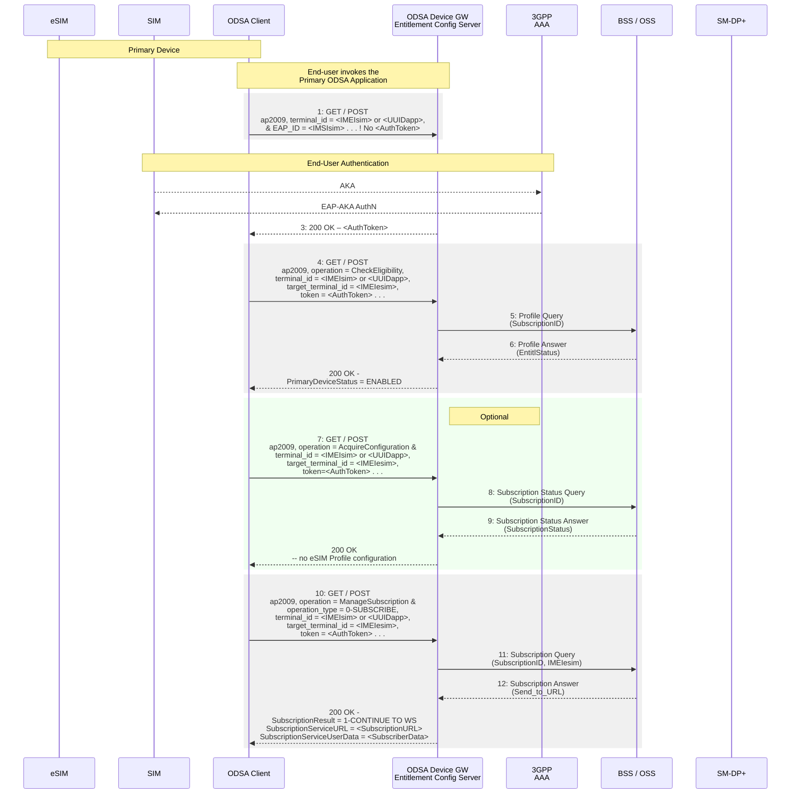
```mermaid
sequenceDiagram
    participant eSIM as eSIM
    participant SIM as SIM
    participant ODSA as ODSA Client
    participant ECS as ODSA Device GW<br/>Entitlement Config Server
    participant AAA as 3GPP<br/>AAA
    participant BSS as BSS / OSS
    participant SMDP as SM-DP+

    Note over eSIM, ODSA: Primary Device
    Note over ODSA, ECS: End-user invokes the<br/>Primary ODSA Application

    rect rgb(240, 240, 240)
    ODSA->>ECS: 1: GET / POST<br/>ap2009, terminal_id = <IMEIsim> or <UUIDapp>,<br/>& EAP_ID = <IMSIsim> . . . ! No <AuthToken>
    end

    rect rgb(255, 255, 255)
    Note over SIM, AAA: End-User Authentication
    SIM-->>AAA: AKA
    AAA-->>SIM: EAP-AKA AuthN
    ECS-->>ODSA: 3: 200 OK – <AuthToken>
    end

    rect rgb(240, 240, 240)
    ODSA->>ECS: 4: GET / POST<br/>ap2009, operation = CheckEligibility,<br/>terminal_id = <IMEIsim> or <UUIDapp>,<br/>target_terminal_id = <IMEIesim>,<br/>token = <AuthToken> . . .
    ECS->>BSS: 5: Profile Query<br/>(SubscriptionID)
    BSS-->>ECS: 6: Profile Answer<br/>(EntitlStatus)
    ECS-->>ODSA: 200 OK -<br/>PrimaryDeviceStatus = ENABLED
    end

    rect rgb(240, 255, 240)
    Note right of ECS: Optional
    ODSA->>ECS: 7: GET / POST<br/>ap2009, operation = AcquireConfiguration &<br/>terminal_id = <IMEIsim> or <UUIDapp>,<br/>target_terminal_id = <IMEIesim>,<br/>token=<AuthToken> . . .
    ECS->>BSS: 8: Subscription Status Query<br/>(SubscriptionID)
    BSS-->>ECS: 9: Subscription Status Answer<br/>(SubscriptionStatus)
    ECS-->>ODSA: 200 OK<br/>-- no eSIM Profile configuration
    end

    rect rgb(240, 240, 240)
    ODSA->>ECS: 10: GET / POST<br/>ap2009, operation = ManageSubscription &<br/>operation_type = 0-SUBSCRIBE,<br/>terminal_id = <IMEIsim> or <UUIDapp>,<br/>target_terminal_id = <IMEIesim>,<br/>token = <AuthToken> . . .
    ECS->>BSS: 11: Subscription Query<br/>(SubscriptionID, IMEIesim)
    BSS-->>ECS: 12: Subscription Answer<br/>(Send_to_URL)
    ECS-->>ODSA: 200 OK -<br/>SubscriptionResult = 1-CONTINUE TO WS<br/>SubscriptionServiceURL = <SubscriptionURL><br/>SubscriptionServiceUserData = <SubscriberData>
    end
```

Figure 31. Primary ODSA procedure for Additional Subscription involving ODSA Portal – Initial Steps

Figure 32 shows the final steps of the flow where the Primary ODSA app connects the end-user to the SP's ODSA Portal to finalize the subscription activation.

The steps are:

1. User requests On-Device Activation via the Primary ODSA application that sends an initial POST or GET request with proper terminal parameters to the ECS. The request contains the EAP_ID parameter, indicating that the app has access to a SIM or eSIM with an active subscription/profile.
2. The ECS initiates the EAP-AKA authentication procedure and performs the proper EAP-AKA exchange with the application (see 2.8.1 for details)
3. At the conclusion of the Authentication the ECS returns an ECS-generated AuthN Token to the ODSA application
4. **Steps 4 to 26** are the same as in clause 8.1.
   The difference is the addition of the `target_terminal_id` parameter for **CheckEligibility**, **AcquireConfiguration** and **ManageSubscription**, carrying the device identifier for the eSIM. The `terminal_id` parameter carries the device identifier for the SIM with the active subscription.


TS.43 v12.0
Page 125 of 248

GSM Association
Non-confidential
Official Document TS.43 - Service Entitlement Configuration


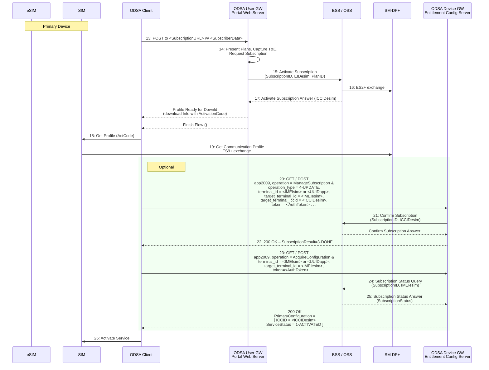
```mermaid
sequenceDiagram
    participant eSIM as eSIM
    participant SIM as SIM
    participant Client as ODSA Client
    participant Portal as ODSA User GW<br/>Portal Web Server
    participant BSS as BSS / OSS
    participant SMDP as SM-DP+
    participant ECS as ODSA Device GW<br/>Entitlement Config Server

    Note over eSIM, SIM: Primary Device

    Client->>Portal: 13: POST to <SubscriptionURL> w/ <SubscriberData>
    Portal->>Portal: 14: Present Plans, Capture T&C,<br/>Request Subscription
    Portal->>BSS: 15: Activate Subscription<br/>(SubscriptionID, EIDesim, PlanID)
    BSS->>SMDP: 16: ES2+ exchange
    BSS-->>Portal: 17: Activate Subscription Answer (ICCIDesim)
    Portal-->>Client: Profile Ready for Downld<br/>(download Info with ActivationCode)
    Portal-->>Client: Finish Flow ()
    Client->>SIM: 18: Get Profile (ActCode)
    SIM->>SMDP: 19: Get Communication Profile<br/>ES9+ exchange
    
    rect rgba(0, 255, 0, 0.05)
    Note right of Client: Optional
    Client->>ECS: 20: GET / POST<br/>app2009, operation = ManageSubscription &<br/>operation_type = 4-UPDATE,<br/>terminal_id = <IMEIsim> or <UUIDapp>,<br/>target_terminal_id = <IMEIesim>,<br/>target_terminal_iccid = <ICCIDesim>,<br/>token = <AuthToken> . . .
    ECS->>BSS: 21: Confirm Subscription<br/>(SubscriptionID, ICCIDesim)
    BSS-->>ECS: Confirm Subscription Answer
    ECS-->>Client: 22: 200 OK – SubscriptionResult=3-DONE
    
    Client->>ECS: 23: GET / POST<br/>app2009, operation = AcquireConfiguration &<br/>terminal_id = <IMEIsim> or <UUIDapp>,<br/>target_terminal_id = <IMEIesim>,<br/>token=<AuthToken> . . .
    ECS->>BSS: 24: Subscription Status Query<br/>(SubscriptionID, IMEIesim)
    BSS-->>ECS: 25: Subscription Status Answer<br/>(SubscriptionStatus)
    ECS-->>Client: 200 OK<br/>PrimaryConfiguration =<br/>[ ICCID = <ICCIDesim><br/>ServiceStatus = 1-ACTIVATED ]
    end

    Client->>SIM: 26: Activate Service
```

Figure 32. Primary ODSA procedure for Additional Subscription involving ODSA Portal – Final Steps

## 8.3 Subscription Transfer with OTP – initial steps

The following presents the case where:

*   The Primary ODSA device application is allowed for the type of primary device and enabled by the SP (entitled).
*   The end-user has an active subscription with the SP identified by its MSISDN.
*   There is no need to involve the SP's ODSA portal web server as the same type of subscription and plan is activated on the new device.

Figure 33 shows the steps of the flow for the activation of a subscription based on an existing subscription validated with a One-Time Password (OTP). The steps are:

1.  User requests On-Device Activation via the Primary ODSA client application. The client discovers that the end-user wants to transfer an existing subscription and sends an initial request to the ECS, which includes proper terminal and `msisdn` parameters.


TS.43 v12.0
Page 126 of 248

GSM Association
Non-confidential
Official Document TS.43 - Service Entitlement Configuration


2. The ECS performs OTP-based authentication by sending an OTP to the end-user (any method can be used, like SMS or e-mail) and returns a new `Cookie` to the client.
3. The Primary ODSA client application captures the OTP from the end-user and relays it to the ECS with another request, this time with `otp` parameter and proper `Cookie`.

The ECS validates the received OTP and generates response with new ECS-generated Authentication Token back to the client application.

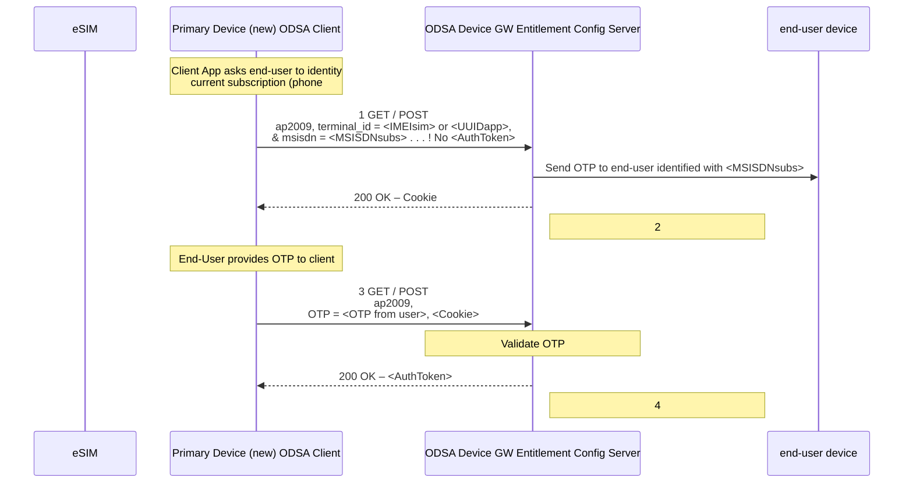
```mermaid
sequenceDiagram
    participant eSIM as eSIM
    participant Client as Primary Device (new) ODSA Client
    participant ECS as ODSA Device GW Entitlement Config Server
    participant User as end-user device

    Note over Client: Client App asks end-user to identity<br/>current subscription (phone #)
    
    Client->>ECS: 1 GET / POST<br/>ap2009, terminal_id = <IMEIsim> or <UUIDapp>,<br/>& msisdn = <MSISDNsubs> . . . ! No <AuthToken>
    
    ECS->>User: Send OTP to end-user identified with <MSISDNsubs>
    
    ECS-->>Client: 200 OK – Cookie
    Note right of ECS: 2
    
    Note over Client: End-User provides OTP to client
    
    Client->>ECS: 3 GET / POST<br/>ap2009,<br/>OTP = <OTP from user>, <Cookie>
    
    Note over ECS: Validate OTP
    
    ECS-->>Client: 200 OK – <AuthToken>
    Note right of ECS: 4
```

<p align="center">Figure 33. Primary ODSA procedure for Subscription Transfer with OTP</p>

### 8.4 Subscription Transfer with OAuth/OpenID – initial steps

The following presents the case where:

* The Primary ODSA device application is allowed for the type of primary device and enabled by the SP (entitled).
* The end-user has an active subscription with the SP, but cannot receive an OTP via SMS due to, e.g., the end-user has their device (including eSIM and/or pSIM) lost and/or stolen.
* There is no need to involve the SP's ODSA portal web server as the same type of subscription and plan is activated on the new device.

Figure 34 shows the initial steps of the flow for the activation of a subscription based on an existing subscription validated via OAuth or OpenID. The steps are:

1. User requests On-Device Activation via the Primary ODSA client application that sends an initial POST or GET request with proper terminal parameters to the ECS.
2. As there is no parameter associated with authentication or identification, the ECS invokes OAuth/OpenID authentication by redirecting the flow to the SP's OAuth 2.0/OpenID platform (using a 302 Found/Redirect response)
3. Authentication of the end-user by the SP's OpenID/OAuth 2.0 platform is performed, using proper SP-selected authenticators (see 2.8.2 for details)


TS.43 v12.0
Page 127 of 248

GSM Association
Non-confidential
Official Document TS.43 - Service Entitlement Configuration


4. At the conclusion of the Authentication, the ECS receives proper ID and access tokens from the OpenID platform and returns an ECS-generated AuthN Token to the ODSA application.

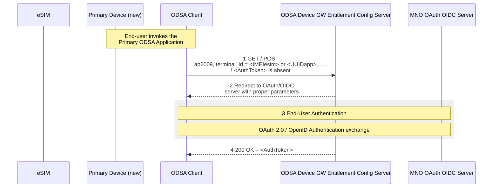
```mermaid
sequenceDiagram
    participant eSIM as eSIM
    participant Device as Primary Device (new)
    participant Client as ODSA Client
    participant ECS as ODSA Device GW Entitlement Config Server
    participant MNO as MNO OAuth OIDC Server

    Note over Device, Client: End-user invokes the<br/>Primary ODSA Application

    Client->>ECS: 1 GET / POST<br/>ap2009, terminal_id = <IMEIesim> or <UUIDapp>, . . .<br/>! <AuthToken> is absent
    ECS-->>Client: 2 Redirect to OAuth/OIDC<br/>server with proper parameters
    
    rect rgb(240, 240, 240)
    Note over Client, MNO: 3 End-User Authentication
    Note over Client, MNO: OAuth 2.0 / OpenID Authentication exchange
    end

    ECS-->>Client: 4 200 OK – <AuthToken>
```

<center>Figure 34. Primary ODSA procedure for Subscription Transfer with OAuth/OpenID</center>

## 8.5 Subscription Transfer with OTP or OAuth/OpenID– final steps

The following presents the case where:

* The Primary ODSA device application is allowed for the type of primary device and enabled by the SP (entitled).
* The end user is already authenticated using a method described in 8.3 or 8.4;

Figure 35 shows the steps of the flow for the activation of a subscription based on an existing subscription:

**Steps 1 to 4** handle the authentication as shown in clause 8.3 or 8.4 .

5. The Primary ODSA client application makes a **CheckEligibility** request to the ECS.
6. The ECS queries the SP back-end system managing the entitlements and profile associated with ODSA applications.
7. The ECS generates proper response with application status (ENABLED)
8. The Primary ODSA client application sends a **ManageSubscription** request to the ECS to start the subscription procedure with the SP. If the `old_terminal_iccid` is available, the device should also add the parameter.
9. The ECS checks with the BSS/OSS to verify if there is more than one device/ICC linked with the subscription. If the `old_terminal_iccid` is available, the ECS checks this value for correctness. If an identifier for the old terminal is needed, the ECS obtains it using e.g. the Websheet procedure in chapter 8.6.
10. The ECS requests for a new subscription from the SP's back-end system. A set of eSIM profile requests over the ES2+ interface (for example, `DownloadOrder`, `ConfirmOrder` and `ReleaseProfile`) is made to the SM-DP+, for the new


TS.43 v12.0
Page 128 of 248

GSM Association
Non-confidential
Official Document TS.43 - Service Entitlement Configuration


subscription associated with the primary device eSIM, resulting in an activation code and ICCID for the primary device.
11. The ECS requests for a subscription cancellation from the SP's back-end system.
12. A set of eSIM profile requests over the ES2+ interface is made to the SM-DP+, to cancel the current subscription.
13. The ECS sends subscription information (details of the eSIM profile) back to the app along with subscription result (2-DOWNLOAD PROFILE).
14. The primary ODSA client application informs the eSIM to download the profile.
15. The device's eSIM gets the profile from the SM-DP+ via ES9+ channel.
16. <u>Optional</u> - The Primary ODSA client application makes another **ManageSubscription** to the ECS to provide/confirm the download of the newly created ICCID and to validate that the primary device subscription is ready and in proper activated state.
17. The ECS queries the Subscription Management system.
18. The ECS generates the proper response with subscription result (3-DONE).
19. <u>Optional</u> - The Primary ODSA client application makes an **AcquireConfiguration** request to the ECS to verify that the subscription and service for the new device are in the proper state.
20. The ECS queries the SP's back-end system managing the subscriptions and profiles.
21. The ECS processes the response from the SP's back-end system and generates the proper 200 OK response containing a `PrimaryConfiguration` entry for the newly active subscription bearing the ACTIVATED status (value of 1).
22. As the primary device’s subscription and service is in the right state, the primary device can initiate cellular service.


TS.43 v12.0
Page 129 of 248

GSM Association
Non-confidential
Official Document TS.43 - Service Entitlement Configuration


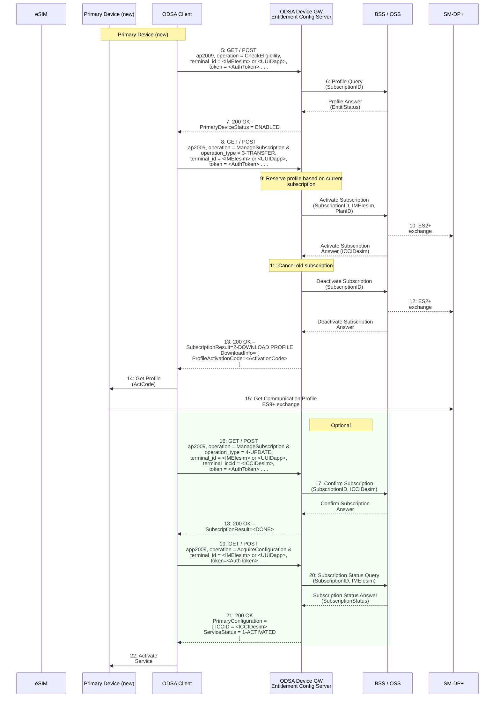
```mermaid
sequenceDiagram
    participant eSIM as eSIM
    participant PrimaryDevice as Primary Device (new)
    participant ODSAClient as ODSA Client
    participant ECS as ODSA Device GW<br/>Entitlement Config Server
    participant BSSOSS as BSS / OSS
    participant SMDP as SM-DP+

    Note over PrimaryDevice, ODSAClient: Primary Device (new)

    ODSAClient->>ECS: 5: GET / POST<br/>ap2009, operation = CheckEligibility,<br/>terminal_id = <IMEIesim> or <UUIDapp>,<br/>token = <AuthToken> . . .
    ECS->>BSSOSS: 6: Profile Query<br/>(SubscriptionID)
    BSSOSS-->>ECS: Profile Answer<br/>(EntitlStatus)
    ECS-->>ODSAClient: 7: 200 OK -<br/>PrimaryDeviceStatus = ENABLED

    ODSAClient->>ECS: 8: GET / POST<br/>ap2009, operation = ManageSubscription &<br/>operation_type = 3-TRANSFER,<br/>terminal_id = <IMEIesim> or <UUIDapp>,<br/>token = <AuthToken> . . .
    Note over ECS: 9: Reserve profile based on current<br/>subscription
    ECS->>BSSOSS: Activate Subscription<br/>(SubscriptionID, IMEIesim,<br/>PlanID)
    BSSOSS-->>SMDP: 10: ES2+<br/>exchange
    BSSOSS-->>ECS: Activate Subscription<br/>Answer (ICCIDesim)
    Note over ECS: 11: Cancel old subscription
    ECS->>BSSOSS: Deactivate Subscription<br/>(SubscriptionID)
    BSSOSS-->>SMDP: 12: ES2+<br/>exchange
    BSSOSS-->>ECS: Deactivate Subscription<br/>Answer
    ECS-->>ODSAClient: 13: 200 OK –<br/>SubscriptionResult=2-DOWNLOAD PROFILE<br/>DownloadInfo= [<br/>ProfileActivationCode=<ActivationCode><br/>]
    ODSAClient->>PrimaryDevice: 14: Get Profile<br/>(ActCode)
    PrimaryDevice->>SMDP: 15: Get Communication Profile<br/>ES9+ exchange

    rect rgba(0, 255, 0, 0.05)
    Note right of ECS: Optional
    ODSAClient->>ECS: 16: GET / POST<br/>ap2009, operation = ManageSubscription &<br/>operation_type = 4-UPDATE,<br/>terminal_id = <IMEIesim> or <UUIDapp>,<br/>terminal_iccid = <ICCIDesim>,<br/>token = <AuthToken> . . .
    ECS->>BSSOSS: 17: Confirm Subscription<br/>(SubscriptionID, ICCIDesim)
    BSSOSS-->>ECS: Confirm Subscription<br/>Answer
    ECS-->>ODSAClient: 18: 200 OK –<br/>SubscriptionResult=<DONE>

    ODSAClient->>ECS: 19: GET / POST<br/>app2009, operation = AcquireConfiguration &<br/>terminal_id = <IMEIesim> or <UUIDapp>,<br/>token=<AuthToken> . . .
    ECS->>BSSOSS: 20: Subscription Status Query<br/>(SubscriptionID, IMEIesim)
    BSSOSS-->>ECS: Subscription Status Answer<br/>(SubscriptionStatus)
    ECS-->>ODSAClient: 21: 200 OK<br/>PrimaryConfiguration =<br/>[ ICCID = <ICCIDesim><br/>ServiceStatus = 1-ACTIVATED<br/>]
    end

    ODSAClient->>PrimaryDevice: 22: Activate<br/>Service
```

*Figure 35. Primary ODSA procedure for Subscription Transfer with OAuth/OpenID*

## 8.6 Using Websheet in eSIM Transfer

During the eSIM transfer process, and independently which device (old or new) triggers the request, it could be necessary to have some interaction with the user. In most cases, it could be done through a Websheet.

Figure 36 shows, as an example, the procedure where the old terminal identifier is needed in a subscription transfer procedure, and is obtained using a Websheet:

1. The Primary ODSA client application sends a request to the ECS to start the subscription procedure with the SP, in this case a **ManageSubscription**.
2. The ECS needs an identifier for the old device, as it was not included in the request. The ECS redirects the ODSA client to the WebServer.


TS.43 v12.0 Page 130 of 248

GSM Association
Non-confidential
Official Document TS.43 - Service Entitlement Configuration


3. The ODSA client requests the Web Server using the URL and UserData received in step 10.
4. The web server presents the user the active subscriptions, so that the user can choose the one he claims as his old device.
5. The Web Server uses the `SelectionCompleted` callback and returns the identifiers `old_terminal_id` and/or `old_terminal_iccid` to the ODSA client.
6. The Primary ODSA client application sends its initial request from step 1, adding the identifiers received in step 5.

Alternatively to step 5 and 6, the webserver can also forward the identifier to the ECS directly.

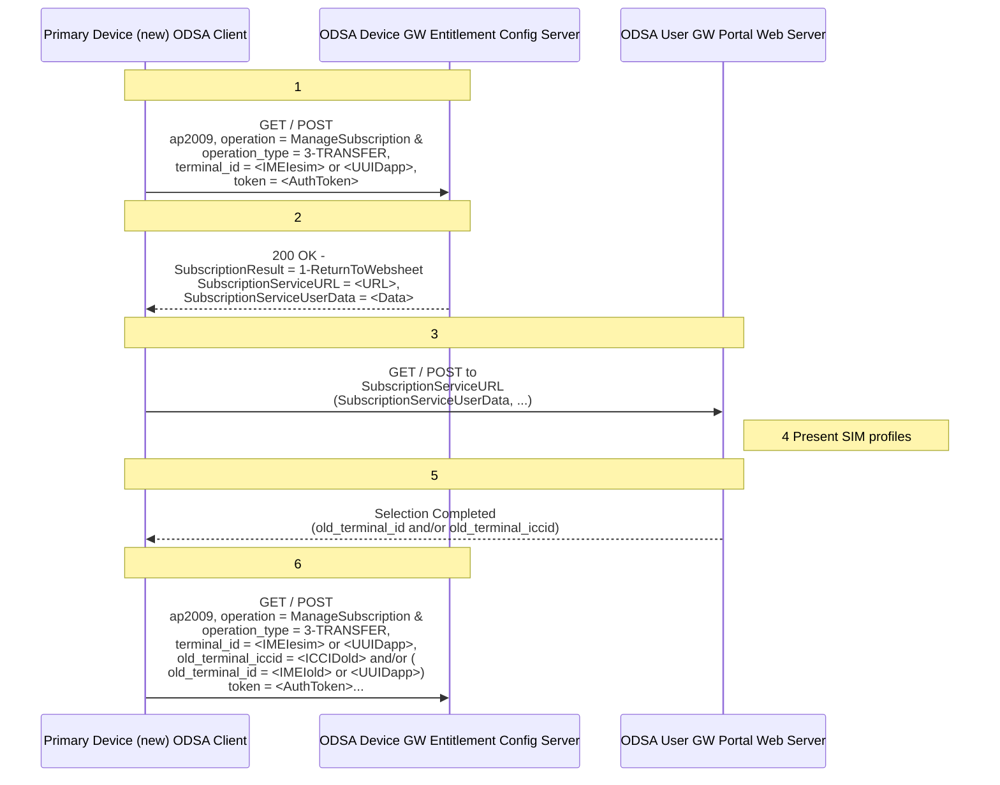
```mermaid
sequenceDiagram
    participant Primary as Primary Device (new) ODSA Client
    participant ECS as ODSA Device GW Entitlement Config Server
    participant Web as ODSA User GW Portal Web Server

    Note over Primary, ECS: 1
    Primary->>ECS: GET / POST<br/>ap2009, operation = ManageSubscription &<br/>operation_type = 3-TRANSFER,<br/>terminal_id = <IMEIesim> or <UUIDapp>,<br/>token = <AuthToken>
    
    Note over Primary, ECS: 2
    ECS-->>Primary: 200 OK -<br/>SubscriptionResult = 1-ReturnToWebsheet<br/>SubscriptionServiceURL = <URL>,<br/>SubscriptionServiceUserData = <Data>
    
    Note over Primary, Web: 3
    Primary->>Web: GET / POST to<br/>SubscriptionServiceURL<br/>(SubscriptionServiceUserData, ...)
    
    Note right of Web: 4 Present SIM profiles
    
    Note over Primary, Web: 5
    Web-->>Primary: Selection Completed<br/>(old_terminal_id and/or old_terminal_iccid)
    
    Note over Primary, ECS: 6
    Primary->>ECS: GET / POST<br/>ap2009, operation = ManageSubscription &<br/>operation_type = 3-TRANSFER,<br/>terminal_id = <IMEIesim> or <UUIDapp>,<br/>old_terminal_iccid = <ICCIDold> and/or (<br/>old_terminal_id = <IMEIold> or <UUIDapp>)<br/>token = <AuthToken>...
```

<center>Figure 36. Obtaining the old terminal identifier via web server</center>

## 8.7 Subscription Transfer with EAP-AKA

The following presents the case where:

* The Primary ODSA device application is allowed for the type of primary device and enabled by the Service Provider (entitled).
* The end-user requests subscription transfer on the old primary device which carries an active subscription with the SP and the end-user is accessible to the eSIM data.
* There is no need to involve the SP's ODSA portal web server as the same type of subscription and plan is activated on the new primary device.
* ECS is capable of handling EAP-AKA relay to a SP's Authentication server (a 3GPP AAA for example).


TS.43 v12.0
Page 131 of 248

GSM Association
Non-confidential
Official Document TS.43 - Service Entitlement Configuration


Figure 37 shows the steps of the flow for the activation of a subscription based on an existing subscription validated via EAP-AKA. The Primary ODSA app acquires proper entitlement and subscription data from the SP's ECS. The steps are:

1. User requests On-Device Activation via the Primary ODSA client application. This request may be done by scanning the QR code format of the device information of the new device as defined in section 6.8. The client discovers that the end-user wants to transfer an existing subscription and sends an initial request to the ECS, which includes proper old terminal and EAP_ID parameters.
2. The ECS detects EAP-AKA capability from client, initiates EAP procedure with AuthN server and obtains EAP Challenge.
3. Authentication of the end-user by the SP's 3GPP AAA server is performed using proper EAP-AKA exchanges (see 2.6.1 for details).
4. At the conclusion of the Authentication, the ECS returns new ECS-generated AuthN Token to the ODSA application.
5. The Primary ODSA client application makes a **CheckEligibility** request to the ECS.
6. The ECS queries the SP back-end system managing the entitlements and profile associated with ODSA applications.
7. The ECS generates proper response with application status (ENABLED)
8. The Primary ODSA client application sends a **ManageSubscription** request to the ECS to start the subscription procedure with the SP. If old_terminal_id is present, ECS recognizes that this request is from the old primary device. The request may contain target terminal eid and/or target terminal id.
9. The ECS requests for a new subscription from the SP's back-end system.
10. A set of eSIM profile requests over the ES2+ interface (for example, `DownloadOrder`, `ConfirmOrder` and `ReleaseProfile`) is made to the SM-DP+, resulting in profile download information for the new primary device. If ProfileSmdpAddress parameter of `DownloadInfo` is used, the target_terminal_eid value must be used for profile preparation.
11. The ECS sends subscription information (details of the communication profile) back to the app along with subscription result (2-DOWNLOAD PROFILE).
12. The ECS requests for a subscription cancellation from the SP's back-end system.
13. A set of eSIM profile requests is made to the SM-DP+ to cancel the current subscription.
14. The primary ODSA client application informs the eSIM in the new primary device to download the profile (e.g., QR Code scanning).
15. The new device's eSIM gets the profile from the SM-DP+ via ES9+ channel.
16. <u>Optional</u> - SP's back-end system requests to make another **ManageSubscription** to the ECS by providing/confirming the Profile's ICCID.
17. <u>Optional</u> - As a return, The ECS sends proper response. This response includes newly created Subscription ID which is linked to the ICCID in the Subscription Management system.
18. As the new primary device's subscription and service is in the right state, primary device can initiate cellular service.


TS.43 v12.0
Page 132 of 248

GSM Association
Official Document TS.43 - Service Entitlement Configuration
Non-confidential


```mermaid
sequenceDiagram
    participant PDN as Primary Device (New) eSIM
    participant ODSA_CN as ODSA Client (New)
    participant PDO as Primary Device (Old) eSIM
    participant ODSA_CO as ODSA Client (Old)
    participant GW as ODSA Device GW Entitlement Config Server
    participant AAA as 3GPP AAA
    participant BSS as BSS / OSS
    participant SMDP as SM-DP+

    Note over PDO, ODSA_CO: End-user invokes the<br/>Primary ODSA Application

    ODSA_CO->>GW: 1 GET / POST<br/>ap2009, terminal_id = <IMEIesim> or <UUIDapp>, . . .<br/>EAP_ID = <RootNai> ... ! <AuthToken> is absent
    GW->>AAA: Initiate EAP Procedure
    AAA-->>ODSA_CO: 2 EAP Challenge
    
    Note over ODSA_CO, AAA: 3 End-User Authentication
    PDO<->AAA: AKA EAPAKA Authentication exchange
    
    AAA-->>GW: 
    GW-->>ODSA_CO: 4 200 OK<br/><AuthToken>

    ODSA_CO->>GW: 5 GET / POST<br/>ap2009, operation = CheckEligibility,<br/>terminal_id = <IMEIesim> or <UUIDapp>,<br/>target_terminal_id = <IMEInew>,<br/>target_terminal_eid = <EIDnew>,<br/>token = <authToken>
    GW->>BSS: 6 Profile Query<br/>(SubscriptionID)
    BSS-->>GW: 7 Profile Answer<br/>(EntitlStatus)
    GW-->>ODSA_CO: 200 OK -<br/>PrimaryDeviceStatus = ENABLED

    ODSA_CO->>GW: 8 GET / POST<br/>ap2009, operation = ManageSubscription,<br/>operation_type=3-TRANSFER,<br/>terminal_id = <IMEIold> or <UUIDapp>,<br/>old_terminal_id = <IMEIold> or <UUIDapp>,<br/>old_terminal_iccid = <ICCIDold>,<br/>target_terminal_id = <IMEInew>,<br/>target_terminal_eid = <EIDnew>,<br/>token=<AuthToken>
    
    Note right of GW: 9 Reserve profile based<br/>on current subscription
    
    GW->>BSS: Activate Subscription<br/>(SubscriptionID, PlanID)
    BSS<->SMDP: 10 ES2+ exchange
    BSS-->>GW: Activate Subscription<br/>Answer (ICCIDnew)
    
    GW-->>ODSA_CO: 11 200 OK -<br/>SubscriptionResult = 2-DOWNLOAD PROFILE<br/>DownloadInfo =<br/>[ profileActivationCode = <Activation Code> ]

    Note right of GW: 12 Cancel Subscription
    
    GW->>BSS: Deactivate Subscription<br/>(SubscriptionID)
    BSS<->SMDP: 13 ES2+ exchange
    BSS-->>GW: Deactivate Subscription<br/>Answer

    ODSA_CO->>PDN: 14 Provide Activation Code
    
    PDN<->SMDP: 15 Get Communication Profile<br/>ES9+ Exchange

    rect rgba(0, 255, 0, 0.05)
    Note over GW, BSS: Optional
    SMDP->>BSS: ES2+ exchange
    BSS->>GW: 16 Confirm Subscription<br/>(ICCIDnew)
    GW-->>BSS: 17 Confirm Subscription Answer<br/>(SubscriptionID, ICCIDnew)
    end

    PDN->>PDN: 18 Activate Service
```

Figure 37: Primary ODSA procedure for Subscription Transfer with EAP-AKA

## 8.8 Primary ODSA service without ODSA Portal

The following presents the case where:

*   The Primary ODSA client application is allowed for the type of primary device and enabled for the end-user (entitled).


TS.43 v12.0
Page 133 of 248

GSM Association
Non-confidential
Official Document TS.43 - Service Entitlement Configuration


*   The SP is able to activate or transfer a subscription and create an eSIM profile for the primary device without involving the ODSA portal web server (i.e. native UX is used).
*   There is no need to send the end-user to an ODSA portal web server.
*   There is one eSIM profile to install or transfer on the primary device.

Figure 38 presents a call flow where the eSIM profile download information for the primary device is made available by the SP at the time of the **ManageSubscription** request. Authentication (e.g. EAP-AKA, SMS-OTP) is performed before starting this procedure described in Figure 38.

1.  The Primary ODSA client application makes a **CheckEligibility** request to the ECS.
2.  The ECS queries the SP back-end system managing the entitlements and eSIM profile associated with the ODSA application.
3.  The ECS generates proper response with application status (ENABLED).
4.  <u>Optional</u> - Since the target service is allowed, the Primary ODSA application sends an **AcquireConfiguration** request to the ECS to obtain information on the eSIM profile associated with the device.
5.  The ECS queries the SP's back-end system managing the subscription and active eSIM profile.
6.  The ECS processes the response from the SP's back-end system and generates the proper 200 OK response without any `PrimaryDeviceConfigurations` (no eSIM profile/subscription is associated with the device).
7.  The Primary ODSA client application sends a **ManageSubscription** request to the ECS to start the subscription procedure with the SP. It is optional for the device to add `old_terminal_iccid` in the **ManageSubscription** request.
8.  The ECS queries the SP's back-end system managing the subscriptions and eSIM profiles. If the `old_terminal_iccid` is available, the ECS checks this value for correctness.
9.  The SP's back-end system interacts with the SM-DP+ over the ES2+ interface to make the required eSIM profile requests associated with the new subscription (for example, `DownloadOrder`, `ConfirmOrder` and `ReleaseProfile`) resulting in an activation code and ICCID for the primary device returned to the ECS.
10. The ECS processes the response from the SP's back-end system and generates the proper **ManageSubscription** 200 OK response with a `SubscriptionResult` set to DOWNLOAD_PROFILE (value of 2), and a filled in `DownloadInfo` structure.
11. The primary ODSA client application informs the eSIM to download the eSIM profile.
12. The device's eSIM gets the eSIM profile from the SM-DP+ via ES9+ channel.
13. The ODSA client application makes an **AcquireConfiguration** request to the ECS to verify that the subscription and service for the primary device are in the proper states.
14. The ECS queries the SP's back-end system managing the subscriptions and eSIM profiles.
15. The ECS processes the response from the SP's back-end system and generates the proper 200 OK response containing `PrimaryDeviceConfiguration` with a `PrimaryDeviceConfiguration` entry for the newly active subscription bearing the ACTIVATED status (value of 1).
16. As the primary device's subscription and service is in the right state, the primary device can initiate cellular service.


TS.43 v12.0
Page 134 of 248

GSM Association
Non-confidential
Official Document TS.43 - Service Entitlement Configuration


```mermaid
sequenceDiagram
    participant PD as eSIM Primary Device
    participant ODSA as ODSA Client
    participant GW as ODSA Device GW Entitlement Config Server
    participant BSS as BSS/OSS
    participant SMDP as SM-DP+

    Note over PD, GW: 1
    ODSA->>GW: GET / POST<br/>ap2009, operation = CheckEligibility,<br/>terminal_id = <IMEIesim> or <UUIDapp>,<br/>token = <AuthToken>
    GW->>BSS: Profile Query (SubscriptionID)
    Note over GW, BSS: 2
    BSS-->>GW: Profile Answer (EntitStatus)
    GW-->>ODSA: 200 OK - PrimaryDeviceStatus = ENABLED
    Note over GW, ODSA: 3

    rect rgba(0, 255, 0, 0.05)
    Note right of GW: Optional
    Note over PD, GW: 4
    ODSA->>GW: GET / POST<br/>app2009, operation = AcquireConfiguration &<br/>terminal_id = <IMEIesim> or <UUIDapp>,<br/>token = <AuthToken>...
    GW->>BSS: Subscription Status Query (SubscriptionID, IMEIesim)
    Note over GW, BSS: 5
    BSS-->>GW: Subscription Status Answer (SubscriptionStatus)
    GW-->>ODSA: 200 OK Primary Configuration - No eSIM Profile configuration
    Note over GW, ODSA: 6
    end

    Note over PD, GW: 7
    ODSA->>GW: GET / POST<br/>ap2009, operation = ManageSubscription &<br/>operation_type = 0-SUBSCRIBE or 3-TRANSFER,<br/>terminal_id = <IMEIesim> or <UUIDapp>,<br/>token = <AuthToken>,<br/>old_terminal_iccid = <ICCIDold>
    GW->>BSS: Subscription Query (SubscriptionID, IMEIesim, ICCIDold)
    Note over GW, BSS: 8
    BSS->>SMDP: ES2+ exchange
    Note over BSS, SMDP: 9
    BSS-->>GW: Subscription Answer (ICCIDesim)
    GW-->>ODSA: 200 OK - SubscriptionResult = 2-DOWNLOAD PROFILE<br/>DownloadInfo = [ profileActivationCode = <Activation Code> ]
    Note over GW, ODSA: 10
    ODSA->>PD: DownLd Profile (ActCode)
    Note over ODSA, PD: 11

    Note over PD, SMDP: 12
    PD->>SMDP: Get the Profile "ES9+ Exchange"

    Note over PD, GW: 13
    ODSA->>GW: GET / POST<br/>ap2009, operation = AcquireConfiguration,<br/>terminal_id = <IMEIesim> or <UUIDapp>,<br/>token = <AuthToken>
    GW->>BSS: Subscription Status Query (SubscriptionID, IMEIesim)
    Note over GW, BSS: 14
    BSS-->>GW: Subscription Status Answer (SubscriptionStatus)
    GW-->>ODSA: 200 OK - PrimaryConfigurations = [ ICCID = <ICCIDesim><br/>ServiceStatus = 1-ACTIVATED ]
    Note over GW, ODSA: 15
    ODSA->>PD: Activate Service
    Note over ODSA, PD: 16
```

<center>Figure 38: Primary ODSA service when no ODSA Portal is used with immediate download.</center>

Figure 39 presents a call flow where the profile download information for the primary device is not made available by the SP at the time of the **ManageSubscription** request. (delayed delivery).

The steps 1 to 8 are the same as in Figure 38. The remaining steps are:

9. The SP's back-end system interacts with the SM-DP+ over the ES2+ interface to make the required eSIM profile requests associated with the subscription and


TS.43 v12.0
Page 135 of 248

GSM Association
Non-confidential
Official Document TS.43 - Service Entitlement Configuration


indicates to the ECS that the final response with the download info is delayed (asynchronous).
10. The ECS processes the response from the SP's back-end system and generates the proper **ManageSubscription** 200 OK response with a `SubscriptionResult` set to DELAYED DOWNLOAD (value of 4).

Two different mechanisms can be implemented with this procedure: push and polling. In case of implementing the push mechanism, it should be necessary to follow this step 11 to 16:

11. The ODSA client application makes an **AcquireConfiguration** request to the ECS to verify that the subscription and service for the primary device are in the proper states. ODSA client also adds the `notif_token` and `notif_action` to the request, so that infrastructure-based notifications can be used.
12. The ECS queries the SP's back-end system managing the subscriptions and eSIM profiles. ECS determines that eSIM profile download info is not available, and the subscription is not yet ready.
13. The ECS generates a 200 OK response with a `PrimaryDeviceConfiguration` entry bearing the ACTIVATING status (value of 2). If eSIM profile download info is available in step 12, ECS may send `DownloadInfo` while ACTIVATING. The ODSA client should not expect that receiving `DownloadInfo` while ACTIVATING means `ServiceStatus` is now ACTIVATED. ECS adds the `RegisterNotifStatus` parameter to notify the device about the Notification Registration (0 = SUCCESS).
14. After a delay, as soon as the ECS gets notified about a status change and eSIM profile download info from the MNO-backend, the ECS notifies the ODSA client, using the method defined in `notif_action`.
15. Upon receiving `notif_action`, the ODSA application therefore requests the **AcquireConfiguration**.
16. The ECS queries the SP's back-end system managing the subscriptions and eSIM profiles.

If polling mechanism is implemented, it should be necessary to follow this step 17 to 20 instead of step 11 to 16:

17. The ODSA client application makes an **AcquireConfiguration** request to the ECS to verify that the subscription and service for the primary device are in the proper states.
18. The ECS queries the SP's back-end system managing the subscriptions and eSIM profiles.
    a) If eSIM profile download info is not available and the subscription is not yet ready before reaching the `MaxRefreshRequest`, go to step 19.
    b) If eSIM profile download info is not available and the subscription is not yet ready when to reach the `MaxRefreshRequest`, go to step 20.
    c) If eSIM profile download info is available and the subscription is ready before reaching the `MaxRefreshRequest`, go to step 21.
19. The ECS generates a 200 OK response with a `PrimaryDeviceConfiguration` entry bearing the ACTIVATING status (value of 2). ECS also adds the `PollingInterval`. If eSIM profile download info is available in step 18, ECS may


TS.43 v12.0
Page 136 of 248

GSM Association Non-confidential
Official Document TS.43 - Service Entitlement Configuration


send `DownloadInfo` while ACTIVATING. The ODSA client should not expect that receiving `DownloadInfo` while ACTIVATING means that `ServiceStatus` is now ACTIVATED. ODSA client repeats steps 17 to 19 to check the status update.
20. The ECS returns `PrimaryDeviceConfiguration` bearing the DEACTIVATED, NO REUSE status (value of 4). At this point, the activation flow is finished.

The remaining common steps for both push and polling are:

21. The ECS generates a 200 OK response with a `PrimaryDeviceConfiguration` entry for the newly active subscription bearing the ACTIVATED status (value of 1) and a filled in `DownloadInfo` structure.
22. The primary ODSA client application informs the eSIM to download the eSIM profile.
23. The device's eSIM gets the eSIM profile from the SM-DP+ via ES9+ channel.
24. Both eSIM profile installed and ServiceStatus=Activated are needed to use the service. As the primary device's subscription and service is in the right state, the primary device can initiate cellular service.


TS.43 v12.0 Page 137 of 248

GSM Association
Non-confidential
Official Document TS.43 - Service Entitlement Configuration


```mermaid
sequenceDiagram
    participant eSIM as eSIM
    participant PD as Primary Device
    participant ODSA as ODSA Client
    participant GW as ODSA Device GW<br/>Entitlement Config Server
    participant BSS as BSS / OSS
    participant SMDP as SM-DP+

    Note over BSS, SMDP: 9 ES2+ exchange
    BSS-->>GW: Subscription Answer (delayed)
    GW-->>ODSA: 10: 200 OK - SubscriptionResult = 4-DELAYED DOWNLOAD

    rect rgb(240, 255, 255)
    Note left of ODSA: If push is used
    ODSA->>GW: 11: GET / POST<br/>ap2009, operation = AcquireConfiguration,<br/>terminal_id = <IMEIsim> or <UUIDapp>,<br/>token=<AuthToken>,<br/>notif_token = <notif_token>, notif_action = <action>
    GW->>BSS: 12: Subscription Status Query (SubscriptionID, IMEIsim)
    BSS-->>GW: Subscription Status Answer (SubscriptionStatus)
    GW-->>ODSA: 13: 200 OK - PrimaryConfiguration =<br/>[ ServiceStatus = 2-ACTIVATING ],<br/>RegisterNotifStatus = 0-SUCCESS
    
    Note over BSS, SMDP: Profile is ready and service is activated
    
    BSS-->>ODSA: 14: New Status (Sent as network notification using notif_action)<br/>ap2009, Token = <notif_token>
    
    ODSA->>GW: 15: GET / POST<br/>ap2009, operation = AcquireConfiguration,<br/>terminal_id = <IMEIsim> or <UUIDapp>,<br/>token=<AuthToken>
    GW->>BSS: 16: Subscription Status Query (SubscriptionID, IMEIsim)
    BSS-->>GW: Subscription Status Answer (SubscriptionStatus)
    end

    rect rgb(240, 255, 255)
    Note left of ODSA: If polling is used<br/>(Alternative)
    ODSA->>GW: 17: GET / POST<br/>ap2009, operation = AcquireConfiguration,<br/>terminal_id = <IMEIsim> or <UUIDapp>,<br/>token=<AuthToken>
    GW->>BSS: 18: Subscription Status Query (SubscriptionID, IMEIsim)
    BSS-->>GW: Subscription Status Answer (SubscriptionStatus)
    
    Note over GW: profile ready and<br/>service activated?
    GW-->>GW: no
    Note over GW: #Request < MaxRefreshReq
    GW-->>GW: yes
    
    GW-->>ODSA: 19: 200 OK - PrimaryConfiguration =<br/>[ ServiceStatus = 2-ACTIVATING,<br/>PollingInterval = <PollingintervalMinutes> ]
    Note over ODSA: Delay
    Note over ODSA: Retry steps 17 to 19 until download info is<br/>ready and service is activated
    
    GW-->>GW: #Request >= MaxRefreshReq (no)
    GW-->>ODSA: 20: 200 OK - PrimaryConfiguration =<br/>[ ServiceStatus = 4-DEACTIVATED, NO REUSE ]
    Note over ODSA: End Activation Flow
    
    GW-->>ODSA: 21: 200 OK - PrimaryConfiguration =<br/>[ ICCID = <ICCIDesim>,<br/>ServiceStatus = 1-ACTIVATED,<br/>DownloadInfo = {<br/>profileActivationCode = <ActivationCode><br/>}<br/>]
    end

    ODSA->>PD: 22: DownLd Profile (ActCode)
    PD->>SMDP: 23: Get the Profile ES9+ Exchange
    PD->>PD: 24: Activate Service
```

Figure 39: Primary ODSA service when no ODSA Portal is used with delayed download info.


TS.43 v12.0
Page 138 of 248

GSM Association
Non-confidential
Official Document TS.43 - Service Entitlement Configuration


## 8.9 Subscription Transfer with TemporaryToken

The following presents the case where:

* The Old and New Primary ODSA client applications are allowed for the type of primary device and enabled for the end-user (entitled).
* The New Primary ODSA client application does not have access to the primary profile and its TOKEN to transfer the subscription and uses a temporary token as authentication token to complete the transfer.

Figure 40 presents a call flow where an old device requests a temporary token for use with ManageSubscription and AcquireConfiguration, a new device will use this temporary token to trigger the transfer and the download of the eSIM profile. This download is completed immediately.

1. The **Old Primary** ODSA client application sends a request to the ECS to trigger the authentication procedure (in this case EAP-AKA).
2. ECS and the Old Primary device go through the authentication exchange procedure.
3. The ECS returns a TOKEN to the Old Primary ODSA client application.
4. The Old Primary ODSA client application makes a CheckEligibility request to the ECS.
5. The ECS queries the SP back-end system managing the entitlements and profile associated with ODSA applications.
6. The ECS generates proper response with application status (ENABLED)
7. The Old Primary ODSA client application requests a temporary token to the ECS and includes the operation_targets to indicate what requests may be used by a trusted third party (in this case the New Primary client application).
8. The ECS shall respond with a new temporary token if the subscription allows the OperationTargets to be used. In this case, this temporary token can be used in any future (up until the TemporaryTokenExpiry) ManageSubscription and AcquireConfiguration requests from the New Primary ODSA application which doesn’t have access to the TOKEN.
9. The Old Primary device shall transmit all relevant eSIM transfer information to the New Primary device. The mechanisms to achieve this are outside the scope of this specification.
10. The **New Primary** ODSA client application sends a ManageSubscription with operation_type 3 - TRANSFER and the old_terminal_iccid request to the ECS using the temporary token. The request shall also contain target_terminal_eid and target_terminal_id parameters.
    Note: it is also possible for the New Primary ODSA client to request a CheckEligibility request prior to the ManageSubscription to the ECS using the `temporary_token`.
11. STEPS 11-13 ARE OPTIONAL: SKIP to step 14 if user interaction without websheet is not required, if user interaction without websheet is required, the ECS sends a SubscriptionResult 8 – REQUIRES USER INPUT response to the New Primary ODSA client application and includes a MSG object.
12. When the ODSA client receives Subscription Result 8 – REQUIRES USER INPUT with the MSG parameter, the New Primary ODSA client application display the


TS.43 v12.0
Page 139 of 248

GSM Association Non-confidential
Official Document TS.43 - Service Entitlement Configuration


message of the MSG parameter along with the free text field and the `Accept_btn` button. The user will then enter their response and accept.
13. The New Primary ODSA client application sends a ManageSubscription with operation_type 3 - TRANSFER and the old_terminal_iccid request to the ECS using the temporary token. The New Primary ODSA client SHALL append the user response to the `MSG_response` field and the `MSG_btn` value selected by the user.
14. The ECS queries the SP back-end for a subscription transfer.
15. The SP backend generates a new profile to complete the transfer.
16. The SP back-end provides the ECS with an activation code or new ICCID and SM-DP+ address.
17. The ECS sends a 2 – DOWNLOAD PROFILE response to the Primary ODSA client application and includes the profile activation code or new ICCID and SM-DP+ address. In the case where the ECS wishes to trigger a 4 – DELAYED DOWNLOAD please refer to Figure 40.
18. The New Primary ODSA client application starts the profile download.
19. The New Primary device downloads the profile from the DP+ and the subscription transfer is completed.
20. The New Primary ODSA client application can consider the service activated.

Steps 21-31: Optionally the New Primary ODSA client application and the ECS shall now consider the temporary token expired and the New Primary ODSA application shall use the normal authentication procedures to obtain a TOKEN in order to interact with the ECS.


TS.43 v12.0 Page 140 of 248

GSM Association
Official Document TS.43 - Service Entitlement Configuration
Non-confidential


```mermaid
sequenceDiagram
    participant PDN as Primary Device (New) eSIM
    participant ODSA_N as ODSA Client (New)
    participant PDO as Primary Device (Old) eSIM
    participant ODSA_O as ODSA Client (Old)
    participant ECS as ODSA Device GW Entitlement Config Server
    participant AAA as 3GPP AAA
    participant BSS as BSS / OSS
    participant SMDP as SM-DP+

    Note over PDN, SMDP: Figure 40: Subscription Transfer Using Temporary Token immediate activation and download.

    ODSA_N->>ECS: 1: GET / POST<br/>ap2009, terminal_id = <IMEIesim> or <UUIDapp>, . . .<br/>! <AuthToken> is absent
    rect rgb(240, 240, 240)
        ECS-->>AAA: 2: End-User Authentication<br/>EAPAKA Authentication exchange
    end
    ECS-->>ODSA_N: 3: 200 OK<br/><AuthToken>
    ODSA_N->>ECS: 4: GET / POST<br/>ap2009, operation = CheckEligibility,<br/>terminal_id = <IMEIesim> or <UUIDapp>,<br/>token = <authToken>
    ECS->>BSS: 5: Profile Query<br/>(SubscriptionID)
    BSS-->>ECS: 6: Profile Answer<br/>(EntitlStatus)
    ECS-->>ODSA_N: 200 OK -<br/>PrimaryDeviceStatus = ENABLED

    ODSA_N->>ECS: 7: GET / POST<br/>ap2009, operation = AcquireTemporaryToken,<br/>terminal_id = <IMEIesim> or <UUIDapp>,<br/>operation_targets = <ManageSubscription,<br/>AcquireConfiguration>,<br/>token=<AuthToken>
    ECS-->>ODSA_N: 8: 200 OK -<br/>[ TemporaryToken = NewTemporaryToken<br/>TemporaryTokenExpiry = NewTemporaryTokenExpiry<br/>OperationType = 3 – TRANSFER<br/>OperationTargets = ManageSubscription,<br/>AcquireConfiguration ]

    Note over ODSA_N, ODSA_O: 9: eSIM Transfer Information Exchange

    ODSA_N->>ECS: 10: GET / POST<br/>ap2009, operation = ManageSubscription &<br/>operation_type = 3-TRANSFER,<br/>terminal_id = <IMEIesim> or <UUIDapp>,<br/>temporary_token = <TemporaryToken>,<br/>target_terminal_eid = <EIDesim>,<br/>target_terminal_id = <IMEIesim>,<br/>old_terminal_iccid = <ICCIDold>

    rect rgb(240, 255, 240)
        Note right of ODSA_N: Optional
        ECS-->>ODSA_N: 11: 200 OK -<br/>SubscriptionResult = 7 – REQUIRES USER INPUT<br/>MSG = [ Message = <InformationMessage><br/>Accept_freetext = 1, Accept_btn = 1, Reject_btn = 1 ]
        Note left of ODSA_N: 12: Display Message to the user<br/>and allow the user to enter<br/>text and accept it.
        ODSA_N->>ECS: 13: GET / POST<br/>ap2009, operation = ManageSubscription &<br/>operation_type = 3-TRANSFER,<br/>terminal_id = <IMEIesim> or <UUIDapp>,<br/>temporary_token = <TemporaryToken>,<br/>target_terminal_eid = <EIDesim>,<br/>target_terminal_id = <IMEIesim>,<br/>old_terminal_iccid = <ICCIDold><br/>MSG_response=<User Response>,<br/>MSG_btn = 1
    end

    ECS->>BSS: 14: Subscription Query<br/>(SubscriptionID, IMEIesim, ICCIDold)
    BSS->>SMDP: 15: ES2+ exchange
    SMDP-->>BSS: 16: Subscription Answer (ICCIDesim)
    BSS-->>ECS: 17: 200 OK
    ECS-->>ODSA_N: 18: 200 OK -<br/>SubscriptionResult = 2-DOWNLOAD PROFILE<br/>DownloadInfo = [ profileActivationCode = <Activation Code> ]
    Note left of ODSA_N: DownLd Profile (ActCode)

    ODSA_N->>SMDP: 19: Get the Profile ES9+ Exchange
    Note left of ODSA_N: 20: Activate Service

    rect rgb(240, 255, 240)
        Note right of ODSA_N: Optional
        ODSA_N->>ECS: 21: GET / POST<br/>ap2009, terminal_id = <IMEIesim> or <UUIDapp>, . . .<br/>! <AuthToken> is absent or not valid
        rect rgb(240, 240, 240)
            ECS-->>AAA: 22: End-User Authentication<br/>EAPAKA Authentication exchange
        end
        ECS-->>ODSA_N: 23: 200 OK – <AuthToken>
        ODSA_N->>ECS: 24: GET / POST<br/>ap2009, operation = CheckEligibility,<br/>terminal_id = <IMEIesim> or <UUIDapp>,<br/>token = <authToken>
        ECS->>BSS: 25: Profile Query (SubscriptionID)
        BSS-->>ECS: 26: Profile Answer (EntitlStatus)
        ECS-->>ODSA_N: 27: 200 OK - PrimaryDeviceStatus = ENABLED
        ODSA_N->>ECS: 28: GET / POST<br/>ap2009, operation = AcquireConfiguration,<br/>terminal_id = <IMEIesim> or <UUIDapp>,<br/>terminal_iccid = <ICCIDeSIM><br/>token=<AuthToken>
        ECS->>BSS: 29: Subscription Status Query (SubscriptionID, IMEIesim)
        BSS-->>ECS: 30: Subscription Status Answer (SubscriptionStatus)
        ECS-->>ODSA_N: 31: 200 OK -<br/>PrimaryConfiguration = [ ICCID = <ICCIDesim><br/>ServiceStatus = 1-ACTIVATED ]
    end
```

Figure 40: Subscription Transfer Using Temporary Token immediate activation and download.


TS.43 v12.0 Page 141 of 248

GSM Association
Non-confidential
Official Document TS.43 - Service Entitlement Configuration


Figure 41 presents how the temporary token can be used by the New Primary ODSA client application in the cases where there is a delayed activation or download of the eSIM after the transfer request has been sent to the ECS. Note: if there is a delayed activation of the new eSIM, there may be situations where the Old Primary ODSA device loses its subscription and access to the network during this transfer process.

The steps 1 to 15 are the same as in Figure 40. The remaining steps are:

16. The SP's back-end system interacts with the SM-DP+ over the ES2+ interface to make the required eSIM profile requests associated with the subscription and indicates to the ECS that the final response with the download info is delayed (asynchronous).
17. The ECS processes the response from the SP's back-end system and generates the proper **ManageSubscription** 200 OK response with a `SubscriptionResult` set to DELAYED DOWNLOAD (value of 4).

Two different mechanisms can be implemented with this procedure: push and polling. In case of implementing the push mechanism, it should be necessary to follow this step 18 to 23:

18. The New Primary ODSA client application makes an **AcquireConfiguration** request to the ECS using the temporary token to verify that the subscription and service for the primary device are in the proper states. ODSA client also adds the `notif_token` and `notif_action` to the request, so that infrastructure-based notifications can be used.
19. The ECS queries the SP's back-end system managing the subscriptions and eSIM profiles. ECS determines that eSIM profile download info is not available, and the subscription is not yet ready.
20. The ECS generates a 200 OK response with a `PrimaryDeviceConfiguration` entry bearing the ACTIVATING status (value of 2). If eSIM profile download info is available in step 12, ECS may send `DownloadInfo` while ACTIVATING. The New Primary ODSA client should not expect that receiving `DownloadInfo` while ACTIVATING means `ServiceStatus` is now ACTIVATED. ECS adds the `RegisterNotifStatus` parameter to notify the device about the Notification Registration (0 = SUCCESS).
21. After a delay, as soon as the ECS gets notified about a status change and eSIM profile download info from the MNO-backend, the ECS notifies the New Primary ODSA client, using the method defined in `notif_action`.
22. Upon receiving `notif_action`, the New Primary ODSA client application therefore requests the **AcquireConfiguration**.
23. The ECS queries the SP's back-end system managing the subscriptions and eSIM profiles.

If polling mechanism is implemented, it should be necessary to follow this step 24 to 26 instead of step 18 to 23:


TS.43 v12.0
Page 142 of 248

GSM Association
Non-confidential
Official Document TS.43 - Service Entitlement Configuration


24. The New Primary ODSA client application makes an **AcquireConfiguration** request to the ECS to verify that the subscription and service for the primary device are in the proper states.
25. The ECS queries the SP's back-end system managing the subscriptions and eSIM profiles.
26. If eSIM profile download info is not available and the subscription is not yet ready the ECS generates a 200 OK response with a `PrimaryDeviceConfiguration` entry bearing the ACTIVATING status (value of 2). ECS also adds the `PollingInterval`. If eSIM profile download info is available, ECS may send `DownloadInfo` while ACTIVATING. The ODSA client should not expect that receiving `DownloadInfo` while ACTIVATING means that `ServiceStatus` is now ACTIVATED. ODSA client repeats steps 24 to 26 to check the status update.

The remaining common steps for both push and polling are:

27. The ECS generates a 200 OK response with a `PrimaryDeviceConfiguration` entry for the newly active subscription bearing the ACTIVATED status (value of 1) and a filled in `DownloadInfo` structure.
28. The New Primary ODSA client application informs the eSIM to download the eSIM profile.
29. The device's eSIM gets the eSIM profile from the SM-DP+ via ES9+ channel.
30. Both eSIM profile installed and ServiceStatus=Activated are needed to use the service. As the primary device's subscription and service is in the right state, the primary device can initiate cellular service.


TS.43 v12.0
Page 143 of 248

GSM Association
Non-confidential
Official Document TS.43 - Service Entitlement Configuration


```mermaid
sequenceDiagram
    participant eSIM
    participant Primary Device (New)
    participant ODSA Client
    participant ODSA Device GW Entitlement Config Server
    participant BSS / OSS
    participant SM-DP+

    Note over BSS / OSS, SM-DP+: 15 ES2+ exchange
    BSS / OSS -->> ODSA Device GW Entitlement Config Server: 16 Subscription Answer (delayed)
    ODSA Device GW Entitlement Config Server -->> ODSA Client: 17 200 OK - SubscriptionResult = 4-DELAYED DOWNLOAD

    rect rgba(0, 255, 0, 0.05)
        Note left of ODSA Client: If push is used
        ODSA Client ->> ODSA Device GW Entitlement Config Server: 18 GET / POST<br/>ap2009, operation = AcquireConfiguration,<br/>terminal_id = <IMEIsim> or <UUIDapp>,<br/>temporary_token=<TemporaryToken>,<br/>notif_token = <notif_token>, notif_action = <action>
        ODSA Device GW Entitlement Config Server ->> BSS / OSS: 19 Subscription Status Query (SubscriptionID, IMEIsim)
        BSS / OSS -->> ODSA Device GW Entitlement Config Server: Subscription Status Answer (SubscriptionStatus)
        ODSA Device GW Entitlement Config Server -->> ODSA Client: 20 200 OK - PrimaryConfiguration = [ ServiceStatus = 2-ACTIVATING ], RegisterNotifStatus = 0-SUCCESS
        
        Note over ODSA Device GW Entitlement Config Server, SM-DP+: Profile is ready and service is activated
        
        ODSA Device GW Entitlement Config Server -->> ODSA Client: 21 New Status (Sent as network notification using notif_action)<br/>ap2009, Token = <notif_token>
        
        ODSA Client ->> ODSA Device GW Entitlement Config Server: 22 GET / POST<br/>ap2009, operation = AcquireConfiguration,<br/>terminal_id = <IMEIsim> or <UUIDapp>,<br/>temporary_token=<TemporaryToken>
        ODSA Device GW Entitlement Config Server ->> BSS / OSS: 23 Subscription Status Query (SubscriptionID, IMEIsim)
        BSS / OSS -->> ODSA Device GW Entitlement Config Server: Subscription Status Answer (SubscriptionStatus)
    end

    rect rgba(0, 255, 0, 0.05)
        Note left of ODSA Client: If polling is used (Alternative)
        ODSA Client ->> ODSA Device GW Entitlement Config Server: 24 GET / POST<br/>ap2009, operation = AcquireConfiguration,<br/>terminal_id = <IMEIsim> or <UUIDapp>,<br/>temporary_token=<TemporaryToken>
        ODSA Device GW Entitlement Config Server ->> BSS / OSS: 25 Subscription Status Query (SubscriptionID, IMEIsim)
        BSS / OSS -->> ODSA Device GW Entitlement Config Server: Subscription Status Answer (SubscriptionStatus)
        
        Note over ODSA Device GW Entitlement Config Server: profile ready and service activated?
        
        ODSA Device GW Entitlement Config Server -->> ODSA Device GW Entitlement Config Server: no
        ODSA Device GW Entitlement Config Server -->> ODSA Client: 26 200 OK - PrimaryConfiguration = [ ServiceStatus = 2-ACTIVATING, PollingInterval = <PollingintervalMinutes> ]
        Note left of ODSA Client: Delay
        
        ODSA Device GW Entitlement Config Server -->> ODSA Device GW Entitlement Config Server: Yes
    end

    ODSA Device GW Entitlement Config Server -->> ODSA Client: 27 200 OK - PrimaryConfiguration = [ ICCID = <ICCIDesim>, ServiceStatus = 1-ACTIVATED, DownloadInfo = { profileActivationCode = <ActivationCode> } ]
    
    ODSA Client ->> Primary Device (New): 28 DownLd Profile (ActCode)
    Primary Device (New) ->> SM-DP+: 29 Get the Profile ES9+ Exchange
    Primary Device (New) ->> eSIM: 30 Activate Service
```

<center>Figure 41: Subscription Transfer Using Temporary Token delayed activation and download.</center>


TS.43 v12.0 Page 144 of 248

GSM Association
Non-confidential
Official Document TS.43 - Service Entitlement Configuration


## 8.10 VOID

## 8.11 Subscription Transfer and Deleting Subscription in Old Device
The following presents the case where:

* The Primary ODSA client application is allowed for the type of primary device and enabled for the end-user (entitled).
* The end-user has an active subscription with the SP identified by its MSISDN.
* The SP is able to know if the profile in use needs to be deleted.

### 8.11.1 Subscription Transfer starting from Old Device without ODSA Portal
The following presents the case where:

* There is no need to involve the SP's ODSA portal web server as the same type of subscription and plan is activated on the new device.
* The SP is able to activate a subscription and create an eSIM profile for the primary device without involving the ODSA portal web server.

Figure 42 presents a call flow where the subscription transfer starts from **old device** and ECS notifies to the device that the profile in use needs to be deleted and then complete the subscription transfer after the user deletes the profile in use.

The steps are:

1. The user requests On-Device Activation via the Primary ODSA client application. The client discovers that the end-user wants to transfer an existing subscription and sends an initial request to the ECS, which includes proper old terminal and EAP_ID parameters.
2. The ECS detects EAP-AKA capability from client, initiates EAP procedure with AuthN server and obtains EAP Challenge.
3. Authentication of the end-user by the SP's 3GPP AAA server is performed using proper EAP-AKA exchanges (see 2.6.1 for details).
4. At the conclusion of the Authentication, the ECS returns new ECS-generated AuthN Token to the ODSA application.
5. The Primary ODSA client application makes a **CheckEligibility** request to the ECS.
6. The ECS queries the SP back-end system managing the entitlements and profile associated with ODSA applications.
7. The ECS generates proper response with application status (ENABLED)
8. The Primary ODSA client application sends a **ManageSubscription** request to the ECS to start the subscription procedure with the SP. If old_terminal_id is present, ECS recognizes that this request is from the **old primary device**.
9. The ECS requests for a new subscription from the SP's back-end system.
10. Check whether deletion operation is needed e.g. A set of eSIM profile requests over the ES2+ interface (for example, `DownloadOrder`, `ConfirmOrder` and `ReleaseProfile`) is made to the SM-DP+, and SM-DP+ recognizes that the profile in use needs to be deleted and then notifies to SP's back-end system.
11. The ECS sends subscription result (6-DELETE PROFILE IN USE) back to the app.


TS.43 v12.0
Page 145 of 248

GSM Association
Non-confidential
Official Document TS.43 - Service Entitlement Configuration


12. The Primary ODSA client application notifies the user that the profile in use needs to be deleted to complete the subscription transfer.
13. When the user deletes the profile in use, `HandleNotification` is sent to SM-DP+ over the ES2+ interface.
14. SM-DP+ notifies to SP's backend system that the profile in use has been deleted therefore the subscription transfer can be complete.
15. A set of eSIM profile requests over the ES2+ interface (for example, `DownloadOrder`, `ConfirmOrder` and `ReleaseProfile`) is made to the SM-DP+, resulting in an activation code and ICCID of the profile to be downloaded onto the new primary device.
16. the ECS gets notified about a status change from the MNO-backend.
17. The ECS notifies the old device the ODSA application about a Status Change, using the method defined in `notif_action`.
18. The ODSA client application makes an **AcquireConfiguration** request to the ECS to verify that the subscription and service for the primary device are in the proper states.
19. The ECS queries the SP's back-end system managing the subscriptions and profiles. SP's back-end system notifies the subscription state and eSIM profile download Info.
20. The ECS generates a 200 OK response with a `PrimaryDeviceConfiguration` entry for the newly active subscription bearing the ACTIVATED status (value of 1) and a filled in `DownloadInfo` structure. ICCIDnew could be same with ICCIDold if the profile is redownloadable.
21. The primary ODSA client application informs the eSIM in the new primary device to download the profile.
22. The device's eSIM gets the profile from the SM-DP+ via ES9+ channel.


TS.43 v12.0
Page 146 of 248

GSM Association
Non-confidential
Official Document TS.43 - Service Entitlement Configuration


```mermaid
sequenceDiagram
    participant eSIM_new as Primary Device (new) eSIM
    participant eSIM_old as Primary Device (old) eSIM
    participant ODSA_Client as ODSA Client
    participant ODSA_GW as ODSA Device GW Entitlement Config Server
    participant AAA as 3GPP AAA
    participant BSS_OSS as BSS / OSS
    participant SM_DP as SM-DP+

    Note over ODSA_Client: End-user invokes the<br/>Primary ODSA Application

    ODSA_Client->>ODSA_GW: 1: GET / POST<br/>ap2009, terminal_id = <IMEIold> or <UUIDapp>,<br/>EAP_ID =<Root NAI>, . . .! No <AuthToken>
    ODSA_GW->>AAA: Initiate EAP Procedure
    AAA-->>ODSA_GW: 2: EAP Challenge
    
    rect rgb(240, 240, 240)
    Note over eSIM_old, AAA: 3: End-User Authentication
    eSIM_old-->>AAA: AKA
    AAA-->>eSIM_old: EAP-AKA AuthN
    end

    AAA-->>ODSA_GW: 4: 200 OK – <AuthToken>
    ODSA_GW-->>ODSA_Client: 200 OK – <AuthToken>

    ODSA_Client->>ODSA_GW: 5: GET / POST<br/>ap2009, operation = CheckEligibility,<br/>terminal_id = <IMEIold> or <UUIDapp>,<br/>token = <AuthToken> . . .
    ODSA_GW->>BSS_OSS: 6: Profile Query (SubscriptionID)
    BSS_OSS-->>ODSA_GW: Profile Answer (EntitlStatus)
    ODSA_GW-->>ODSA_Client: 7: 200 OK - PrimaryDeviceStatus = ENABLED

    ODSA_Client->>ODSA_GW: 8: GET / POST<br/>ap2009, operation = ManageSubscription &<br/>operation_type = 3-TRANSFER,<br/>terminal_id = <IMEIold> or <UUIDapp>,<br/>old_terminal_id = <IMEIold> or <UUIDapp>,<br/>old_terminal_iccid =<ICCIDold>,<br/>redownloadable_profile = 1-SUPPORTED,<br/>token = <AuthToken>,<br/>notif_token = <notif_token>, notif_action = <action>
    ODSA_GW->>BSS_OSS: 9: Activate Subscription (SubscriptionID, PlanID)
    BSS_OSS->>SM_DP: 10: ES2+ exchange
    BSS_OSS-->>ODSA_GW: Activate Subscription Answer (NeedToDeleteICCID)
    ODSA_GW-->>ODSA_Client: 11: 200 OK – SubscriptionResult=6-DELETE PROFILE IN USE

    ODSA_Client->>eSIM_old: 12: Delete Profile
    eSIM_old->>SM_DP: 13: ES9+ : HandleNotification (ProfileDeletionResult)
    SM_DP-->>eSIM_old: OK
    SM_DP->>BSS_OSS: 14: ES2+ Handle Notification
    BSS_OSS->>SM_DP: 15: ES2+ exchange for new Subscription
    BSS_OSS->>ODSA_GW: 16: Subscription Status Update (Subscription Status)
    
    ODSA_GW-->>ODSA_Client: 17: New Status (Sent as network notification using notif_action)<br/>ap2009, Token = <notif_token>

    ODSA_Client->>ODSA_GW: 18: GET / POST<br/>ap2009, operation = AcquireConfiguration,<br/>terminal_id = <IMEIold> or <UUIDapp>,<br/>token=<AuthToken>,
    ODSA_GW->>BSS_OSS: 19: Subscription Status Query (SubscriptionID, IMEIold)
    BSS_OSS-->>ODSA_GW: Subscription Status Answer (SubscriptionStatus)
    ODSA_GW-->>ODSA_Client: 20: 200 OK - PrimaryConfiguration = [ ICCID = <ICCIDnew>, ServiceStatus = 1-ACTIVATED, DownloadInfo = { profileActivationCode = <ActivationCode> } ]

    ODSA_Client->>eSIM_new: 21: Provide Activation Code
    eSIM_new->>SM_DP: 22: Get eSIM profile ES9+ Exchange
```

*Figure 42. Subscription Transfer starting from Old Device without ODSA Portal*

### 8.11.2 Subscription Transfer starting from New Device via ODSA Portal

The following presents the case where:

*   The user normally has an old device since the profile in the old device is required to be deleted. Application can display a pop-up box to ask whether the user has an old phone


TS.43 v12.0 Page 147 of 248

GSM Association Non-confidential
Official Document TS.43 - Service Entitlement Configuration


or not. However, it depends on applications and is implementation specific. The details are out of scope of this spec.
*   The SP's ODSA portal web server is responsible for notifying to the device that the profile in use needs to be deleted before the subscription is transferred.

Figure 43 presents a call flow where the subscription transfer starts from new device and ECS notifies to the device that the profile in use needs to be deleted and then complete the subscription transfer after the user deletes the profile in use.

The steps are:

1.  The user requests On-Device Activation via the Primary ODSA client application that sends an initial POST or GET request with proper terminal parameters to the ECS. If SMS-OTP is used, an initial request to the ECS includes MSISDN parameters.
2.  The ECS invokes OAuth/OpenID authentication or SMS-OPT authentication which SP supports.
3.  At the conclusion of the Authentication, the ECS returns new ECS-generated AuthN Token to the ODSA application.
4.  The Primary ODSA client application makes a **CheckEligibility** request to the ECS.
5.  The ECS queries the SP back-end system managing the entitlements and profile associated with ODSA applications.
6.  The ECS generates proper response with application status (ENABLED)
7.  The Primary ODSA client application sends a **ManageSubscription** request to the ECS to start the subscription procedure with the SP.
8.  The ECS queries the SP back-end system responsible for managing subscriptions and makes a request for the subscription transfer.
9.  The ECS generates a proper response with the subscription procedure data. It contains a `SubscriptionResult` set to CONTINUE_TO_WS (value of 1), and `SubscriptionServiceURL` along with `SubscriptionServiceUserData` presenting the URL of the ODSA Portal web server and any user-specific data that would be useful to the Portal.
10. The Primary ODSA device application sends the end-user to the SP's ODSA web server portal.
11. The SP ODSA portal captures the confirmation on the subscription transfer from the end-user.
12. The SP's back-end system managing subscription receives a new subscription request from the SP portal.
13. A set of eSIM profile requests over the ES2+ interface (for example, `DownloadOrder`, `ConfirmOrder` and `ReleaseProfile`) is made to the SM-DP+, for the new subscription associated with the device eSIM, and SM-DP+ recognizes that the profile in use needs to be deleted and notifies to SP's back-end system.
14. Via a JavaScript call back function, the SP ODSA portal notifies the Primary ODSA app that the profile in use needs to be deleted to complete the subscription transfer.
15. The Primary ODSA device application notifies the user that the profile in use needs to be deleted to complete the subscription transfer.
16. The user deletes the profile in the old device.


TS.43 v12.0 Page 148 of 248

GSM Association
Non-confidential
Official Document TS.43 - Service Entitlement Configuration


17. When the user deletes the profile in use, `HandleNotification` is sent to SM-DP+ over the ES2+ interface.
18. SM-DP+ notifies to SP's backend system that the profile in use has been deleted therefore the subscription transfer can be complete.
19. A set of eSIM profile requests over the ES2+ interface (for example, `DownloadOrder`, `ConfirmOrder` and `ReleaseProfile`) is made to the SM-DP+, resulting in an activation code and ICCID of the profile to be downloaded onto the new primary device.
20. the ECS gets notified about a status change from the MNO-backend.
21. The ECS notifies the ODSA application about a Status Change, using the method defined in `notif_action`.
22. The ODSA client application makes an **AcquireConfiguration** request to the ECS to verify that the subscription and service for the primary device are in the proper states.
23. The ECS queries the SP's back-end system managing the subscriptions and profiles. SP's back-end system notifies the subscription state and eSIM profile download Info.
24. The ECS generates a 200 OK response with a `PrimaryDeviceConfiguration` entry for the newly active subscription bearing the ACTIVATED status (value of 1) and a filled in `DownloadInfo` structure.
25. The device's eSIM gets the profile from the SM-DP+ via ES9+ channel.


TS.43 v12.0
Page 149 of 248

GSM Association
Non-confidential
Official Document TS.43 - Service Entitlement Configuration


```mermaid
sequenceDiagram
    participant PD_OLD as Primary Device (old) eSIM
    participant PD_NEW as Primary Device (new) eSIM
    participant ODSA_C as ODSA Client
    participant ECS as ODSA Device GW Entitlement Config Server
    participant OIDC as MNO OAuth OIDC Server
    participant BSS as BSS / OSS
    participant SMDP as SM-DP+
    participant PORTAL as ODSA User GW Portal Web Server

    Note over ODSA_C: End-user invokes the<br/>Primary ODSA Application
    ODSA_C->>ECS: 1: GET / POST<br/>ap2009, terminal_id = <IMEInew> or <UUIDapp><br/>. . . ! No <AuthToken>
    ODSA_C-->>OIDC: 2: OAuth 2.0 / OpenID or SMS-OTP Authentication
    OIDC-->>ODSA_C: 3: 200 OK - <AuthToken>
    ODSA_C->>ECS: 4: GET / POST<br/>ap2009, operation = CheckEligibility,<br/>terminal_id = <IMEInew> or <UUIDapp>,<br/>token = <AuthToken> . . .
    ECS->>BSS: 5: Profile Query (SubscriptionID)
    BSS-->>ECS: 6: Profile Answer (EntitlStatus)
    ECS-->>ODSA_C: 200 OK - PrimaryDeviceStatus = ENABLED
    ODSA_C->>ECS: 7: GET / POST<br/>ap2009, operation = ManageSubscription &<br/>operation_type = 3-TRANSFER,<br/>terminal_id = <IMEInew> or <UUIDapp>,<br/>redownloadable_profile = 1-SUPPORTED,<br/>token = <AuthToken>,<br/>notif_token = <notif_token>, notif_action = <action>
    ECS->>BSS: 8: Activate Subscription (SubscriptionID, IMEInew, PlanID)
    BSS-->>ECS: Activate Subscription Answer (Send to URL)
    ECS-->>ODSA_C: 9: 200 OK -<br/>SubscriptionResult = 1-CONTINUE TO WS<br/>SubscriptionServiceURL = <URL><br/>SubscriptionServiceUserData = <UserData>
    ODSA_C->>PORTAL: 10: POST to Subscription URL (Subscription Data)
    Note over PORTAL: 11: Present confirmation on<br/>Transfer to end-user
    PORTAL->>BSS: 12: Activate Subscription (SubscriptionID, PlanID)
    BSS->>SMDP: 13: ES2+ exchange
    BSS-->>PORTAL: Activate Subscription Answer (NeedToDeleteICCID)
    PORTAL->>ECS: 14: Delete Profile In Use (Iccid=<ICCID>, msisdn=<MSISDN>)
    ECS->>PD_OLD: 15: Request to delete eSIM profile in Primary Device (old)
    Note over PD_OLD: 16: Delete Profile
    PD_OLD->>SMDP: 17: ES9+: HandleNotification (ProfileDeletionResult)
    SMDP-->>PD_OLD: OK
    BSS-->>SMDP: 18: ES2+: Handle Notification
    BSS->>SMDP: 19: ES2+ exchange for new Subscription
    BSS->>ECS: 20: Subscription Status Update (Subscription Status)
    ECS-->>ODSA_C: 21: New Status (Sent as network notification using notif_action)<br/>ap2009, Token = <notif_token>
    ODSA_C->>ECS: 22: GET / POST<br/>app2009, operation = AcquireConfiguration &<br/>terminal_id = <IMEInew> or <UUIDapp>,<br/>token = <AuthToken> . . .
    ECS->>BSS: 23: Subscription Status Query (SubscriptionID, IMEInew)
    BSS-->>ECS: Subscription Status Answer (SubscriptionStatus)
    ECS-->>ODSA_C: 24: 200 OK -<br/>PrimaryConfiguration = [<br/>ICCID = <ICCIDnew><br/>ServiceStatus = 1-ACTIVATED<br/>DownloadInfo = {<br/>profileActivationCode = <ActivationCode><br/>}<br/>]
    ODSA_C->>SMDP: 25: Get eSIM profile ES9+ Exchange
```

*Figure 43. Subscription Transfer starting from New Device via ODSA Portal*

# 8.12 Primary ODSA service requiring user input prior to download on the Default SM-DP+

## 8.12.1 User verification with ODSA portal

The following presents the case where:


TS.43 v12.0
Page 150 of 248

GSM Association
Non-confidential
Official Document TS.43 - Service Entitlement Configuration


* The user buys a new eSIM device via online channel or offline store.
* The device is shipped to the user and the operator prepares an eSIM profile at their Default SM-DP+ as defined in the SGP.22 [11].
* The operator wants to verify that the user is an eligible user before allowing to download the eSIM profile from the Default SM-DP+.
* The SP's ODSA portal web server is responsible for the user verification.
* The SP prepares one eSIM profile at the Default SM-DP+.

Figure 44 presents the call flow where new eSIM subscription activation with the user verification is handled at the SP's ODSA portal web server, and upon completing the verification successfully, the ECS notifies to the ODSA client that the eSIM profile is released state at the SM-DP+.

1. The Primary ODSA application sends an AcquireConfiguration request to the ECS to get information about the eSIM profile associated with the device.
2. The ECS queries the SP's back-end system managing the subscriptions and the eSIM profile associated with the ODSA applications.
3. The ECS processes the response from the SP's back-end system and generates the proper 200 OK response with Primary Configuration indicating that an eSIM profile/subscription is associated with the device, but the subscription associated with the eSIM profile is not activated (i.e. ServiceStatus=3-DEACTIVATED).
4. When the ODSA client receives ServiceStatus=3-DEACTIVATED, the Primary ODSA client application sends a **ManageSubscription** with operation_type= 0-SUBSCRIBE request to the ECS to start the subscription procedure with the SP. The Primary ODSA client SHALL add terminal_iccid that is returned by the Primary Configuration in step 3.
5. The ECS queries the SP back-end system responsible for managing subscriptions and detects that further end user confirmation is needed before the subscription activation.
6. The ECS generates a proper response with the subscription procedure data. It contains a SubscriptionResult set to **CONTINUE_TO_WS** (value of 1), and SubscriptionServiceURL along with SubscriptionServiceUserData presenting the URL of the ODSA portal web server and any user-specific data that would be useful.
7. The Primary ODSA client application sends the end-user to the SP's ODSA web server portal.
8. The SP's ODSA portal performs the user verification and may capture the confirmation on the subscription activation from the user.
9. The SP's back-end system managing subscription receives a subscription request from the SP's ODSA web portal.
10. In case the eSIM profile is not released at the SM-DP+ server, the SP's back-end system interacts with the Default SM-DP+ over the ES2+ interface to make the required eSIM profile associated with the new subscription is to be released state at the SM-DP+.
11. If immediate download procedure, step 11 is performed:
    Upon the eSIM profile is released, the SP's back-end system notifies it to the SP's ODSA web portal. And then, the SP's ODSA web portal notifies the Default SM-DP address and ICCID to the Primary ODSA client application via a JavaScript call back


TS.43 v12.0
Page 151 of 248

GSM Association
Non-confidential
Official Document TS.43 - Service Entitlement Configuration


function. The ECS MAY be also notified the change from the SP's back-end system to update the subscription status.

12. If delayed procedure, this step 12, and the following step 13 are performed.

    The eSIM profile status change may take some time in SP's back-end systems. If the procedure is delayed, the SP's back-end system notifies it to the SP's ODSA web portal. The SP's ODSA web portal returns the finish flow (no download info) to the Primary ODSA client application.

13. Polling or push notification mechanisms should be implemented for user experience:

    *   In case of polling mechanism is used: it is necessary to include the loop for refreshing status as described in the section 7.3.2.
    *   In case of push notification is used: ODSA client may request a push notification by registering a push token as described in the section 7.3.1. Alternatively, if agreed between operator and device vendor, the device may use SM-DS push mechanism defined in the SGP.22 [11], which is out of this TS.43 scope.

    Which polling or push notification mechanism a device vendor chooses is up to the agreement between a Service Provider and a device vendor.

14. The Primary ODSA client application sends the user to download the eSIM profile that is prepared at the Default SM-DP+.
15. The device's eSIM gets the eSIM profile from the SM-DP+ via ES9+ channel.


TS.43 v12.0
Page 152 of 248

GSM Association Non-confidential
Official Document TS.43 - Service Entitlement Configuration


```mermaid
sequenceDiagram
    participant PD as Primary Device (new) / eSIM
    participant OC as ODSA Client
    participant GW as ODSA Device GW Entitlement Config Server
    participant AS as MNO OAuth OIDC Server
    participant BSS as BSS / OSS
    participant SMDP as SM-DP+
    participant PW as ODSA User GW Portal Web Server

    Note over PD, SMDP: eSIM profile download is failed from the Default SM-DP+

    Note over PD, OC: Invoke the Primary ODSA Application
    Note over OC, AS: ODSA Client gets Auth Token

    rect rgb(255, 255, 255)
    Note right of OC: 1
    OC->>GW: GET / POST<br/>app2009, operation = AcquireConfiguration &<br/>terminal_id = <IMEInew> or <UUIDapp>,<br/>token=<AuthToken> . . .
    Note right of GW: 2
    GW->>BSS: Subscription Status Query<br/>(SubscriptionID, IMEInew)
    BSS-->>GW: Subscription Status Answer<br/>(SubscriptionStatus)
    Note right of GW: 3
    GW-->>OC: 200 OK -<br/>PrimaryConfiguration =<br/>[ ICCID = <ICCIDnew>,<br/>ServiceStatus = 3-DEACTIVATED<br/>]
    end

    rect rgb(255, 255, 255)
    Note right of OC: 4
    OC->>GW: GET / POST<br/>ap2009, operation = ManageSubscription &<br/>operation_type = 0-SUBSCRIBE,<br/>terminal_id = <IMEInew> or <UUIDapp>,<br/>terminal_iccid = <ICCIDnew>,<br/>token = <AuthToken>
    Note right of GW: 5
    GW->>BSS: Activate Subscription<br/>(SubscriptionID, IMEINew, ICCIDnew)
    BSS-->>GW: Activate Subscription<br/>Answer (Send to URL)
    Note right of GW: 6
    GW-->>OC: 200 OK -<br/>SubscriptionResult = 1-CONTINUE TO WS<br/>SubscriptionServiceURL = <URL>,<br/>SubscriptionServiceUserData = <UserData>
    end

    rect rgb(255, 255, 255)
    Note right of OC: 7
    OC->>PW: POST to<br/>Subscription URL (Subscription Data)
    Note right of PW: 8
    PW->>PW: Confirm Subscription<br/>(with the user verification)
    Note right of PW: 9
    PW->>BSS: New Subscription<br/>(SubscriptionID, PlanID, ICCIDnew)
    Note right of BSS: 10
    BSS->>SMDP: ES2+ exchange<br/>(Release the eSIM profile)
    SMDP-->>BSS: New Subscription Answer (ReleaseProfile)
    end

    rect rgb(240, 255, 240)
    Note left of PD: If immediate download
    Note right of GW: 11
    GW-->>OC: profileReadyWithDefaultSmdp (defaultSmpdAddress, iccid)
    end

    rect rgb(240, 255, 240)
    Note left of PD: If delayed download
    Note right of GW: 12
    GW-->>OC: finishFlow (No download info)
    Note right of OC: 13
    Note over OC, GW: Polling or Push Notification
    end

    Note right of PD: 14
    PD->>PD: Trigger to download the profile<br/>from the default SMDP+
    Note right of PD: 15
    PD->>SMDP: Get eSIM profile<br/>ES9+ Exchange
```

Figure 44. Primary ODSA service requiring user input prior to download on the Default SM-DP+ with ODSA portal.


TS.43 v12.0 Page 153 of 248

GSM Association
Non-confidential
Official Document TS.43 - Service Entitlement Configuration


### 8.12.2 User verification without an ODSA portal

The following presents the case where:

* The user buys a new eSIM device via online channel or offline store.
* The device is shipped to the user and the operator prepares an eSIM profile at their Default SM-DP+ as defined in the SGP.22 [11].
* The operator wants to verify that the user is an eligible user before allowing to download the eSIM profile from the Default SM-DP+.
* The SP's ODSA ECS combined with OSDA client are responsible for the user verification.
* The SP prepares one eSIM profile at the Default SM-DP+.

Figure 45 presents the call flow where new eSIM subscription activation with the user verification is handled without an ODSA portal web server.

1. The Primary ODSA application sends an AcquireConfiguration request to the ECS to get information about the eSIM profile associated with the device.
2. The ECS queries the SP's back-end system managing the subscriptions and the eSIM profile associated with the ODSA applications.
3. The ECS processes the response from the SP's back-end system and generates the proper 200 OK response with `PrimaryConfiguration` indicating that an eSIM profile/subscription is associated with the device, but the eSIM profile's IMSI is not activated (i.e. ServiceStatus=3-DEACTIVATED). It can return along with the MSG parameter containing the user verification question, a request for a free text field and a `MSG_btn` 'accept' in order to allow the user to acknowledge their response.
4. When the ODSA client receives ServiceStatus=3-DEACTIVATED with the MSG parameter, the Primary ODSA client application displays the message of the MSG parameter along with the free text field and the Accept_btn button. The user will then enter their response and accept.
5. The Primary ODSA client SHALL append the user response to the `MSG_response` field and the `MSG_btn` value selected by the user and add terminal_iccid that is returned by the `PrimaryConfiguration` in step 3 in the ManageSubscription request and send an operation_type 0 SUBSCRIBE.
6. In the case where the `MSG_response` is validated by the ECS, the ECS queries the SP back-end system responsible for managing subscriptions and makes a request in the operator backend for the next steps in the transfer (e.g. SIM SWAP request). In the case where the `MSG_response` cannot be not validated by the ECS, go to step 11.
7. If immediate download procedure: The SP's back-end system interacts with the Default SM-DP+ over the ES2+ interface to make the required eSIM profile associated with the new subscription is to be released state at the SM-DP+.
8. If the eSIM profile is ready for immediate download, the ECS generates a proper response with the subscription procedure data. It contains a SubscriptionResult set to **2 - DOWNLOAD PROFILE** including the ProfileSmdpAddress (or ProfileActivationCode), and the flow moves directly to step 12.
9. If delayed eSIM profile download procedure, this step 9, and the following step 10, 12, 13 are performed.


TS.43 v12.0
Page 154 of 248

GSM Association
Non-confidential
Official Document TS.43 - Service Entitlement Configuration


10. Polling or push notification mechanisms should be implemented for user experience:
    * In case of polling mechanism is used: it is necessary to include the loop for refreshing status as described in the section 7.3.2.
    * In case of push notification is used: ODSA client may request a push notification by registering a push token as described in the section 7.3.1. Alternatively, if agreed between operator and device vendor, the device may use SM-DS push mechanism defined in the SGP.22 [11], which is out of this TS.43 scope.

11. If the user input is invalid, the ECS returns and `OperationalResult` **104 – ERROR, INVALID MSG RESPONSE** to inform the client that the response was not accepted by the ECS, and the process ends here.
12. The Primary ODSA client application sends the user to download the eSIM profile that is prepared at the Default SM-DP+.
13. The device's eSIM gets the eSIM profile from the SM-DP+ via ES9+ channel.


TS.43 v12.0
Page 155 of 248

GSM Association
Official Document TS.43 - Service Entitlement Configuration
Non-confidential


```mermaid
sequenceDiagram
    participant eSIM as eSIM
    participant PrimaryDevice as Primary Device (new)
    participant ODSAClient as ODSA Client
    participant ECS as ODSA Device GW Entitlement Config Server
    participant OAuth as MNO OAuth OIDC Server
    participant BSS as BSS / OSS
    participant SMDP as SM-DP+

    Note over eSIM, SMDP: eSIM profile download is failed from the Default SM-DP+
    Note over PrimaryDevice, ODSAClient: Invoke the Primary ODSA Application
    Note over ODSAClient, OAuth: ODSA Client gets Auth Token

    ODSAClient->>ECS: 1: GET / POST app2009, operation = AcquireConfiguration & terminal_id = <IMEInew> or <UUIDapp>, token=<AuthToken> . . .
    ECS->>BSS: 2: Subscription Status Query (SubscriptionID, IMEInew)
    BSS-->>ECS: Subscription Status Answer (SubscriptionStatus)
    ECS-->>ODSAClient: 3: 200 OK - PrimaryConfiguration = [ ICCID = <ICCIDnew> ServiceStatus = 3-DEACTIVATED] MSG = [ Message = <InformationMessage> Accept_freetext = 1 Accept_btn = 1 Reject_btn = 1 ]
    Note over PrimaryDevice, ODSAClient: 4: Display Message to the user and allow the user to enter text and accept it.
    ODSAClient->>ECS: 5: GET / POST ap2009, operation = ManageSubscription & operation_type = 0-SUBSCRIBE, terminal_id = <IMEInew> or <UUIDapp>, terminal_iccid = <ICCIDnew>, token = <AuthToken>, MSG_response = <User Response>, MSG_btn = 1
    ECS->>BSS: 6: Activate Subscription (SubscriptionID, IMEINew, ICCIDnew)

    rect rgba(0, 255, 0, 0.05)
    Note over ODSAClient, ECS: If MSG_response is validated by the ECS immediate download
    BSS-->>ECS: 7: Subscription Activated
    ECS-->>ODSAClient: 8: 200 OK - SubscriptionResult = 2-DOWNLOAD PROFILE
    end

    rect rgba(0, 255, 0, 0.05)
    Note over ODSAClient, ECS: If MSG_response is validated by the ECS delayed download
    ECS-->>ODSAClient: 9: 200 OK - SubscriptionResult = 4-DELAYED DOWNLOAD
    BSS-->>ECS: Subscription Activated
    Note over ODSAClient, ECS: 10: Polling or Push Notification
    end

    rect rgba(0, 255, 0, 0.05)
    Note over ODSAClient, ECS: If MSG_response is invalidated by the ECS
    ECS-->>ODSAClient: 11: 200 OK - OperationResult = 104 – ERROR, INVALID MSG RESPONSE
    end

    Note over PrimaryDevice, ODSAClient: 12: Trigger to download the profile from the default SMDP+
    ODSAClient->>SMDP: 13: Get eSIM profile ES9+ Exchange
```

Figure 45. Primary ODSA service requiring user input prior to download on the Default SM-DP+ without ODSA portal.

## 8.13 Active Subscription Recovery

### 8.13.1 Active Subscription Recovery with ODSA Portal.

The following presents the case where:

*   End user has a primary eSIM device with the active subscription.


TS.43 v12.0 Page 156 of 248

GSM Association
Non-confidential
Official Document TS.43 - Service Entitlement Configuration


*   End user factory reset the primary eSIM device or manually remove the existing eSIM profile and the subscription cannot be used at the primary eSIM device any longer.
*   End user would like to recover the original subscription via the specific process provide by the SP via the web portal different from the first-time activation.

Figure 46 displays the call flow in which the end user starts the active subscription recovery case, and the SP redirects the end user to a specific web portal URL to complete the subscription recovery process.

1.  User requests active subscription recovery procedure via the Primary ODSA client application that sends an initial POST or GET request with proper terminal parameters to the ECS.
2.  If there is no parameter associated with authentication or identification (no IMSI in the request), the ECS invokes OAuth/OpenID authentication and connects the app/end-user with the SP's OpenID/OAuth 2.0 platform. If there's other SIM/eSIM profile on the device, SIM based authentication is also possible. This procedure is authentication mode agnostic.
3.  At the conclusion of the Authentication, the ECS-generated AuthN Token to the ODSA application.
4.  The Primary ODSA client application makes a **CheckEligibility** request to the ECS.
5.  The ECS queries the SP back-end system managing the entitlements and profile associated with ODSA applications.
6.  The ECS generates proper response with application status (ENABLED)
7.  Since the target service is allowed, the Primary ODSA application sends an **AcquireConfiguration** request to the ECS to obtain the original eSIM profiles associated with the device.
8.  The ECS queries the SP's back-end system managing the subscriptions for the active profiles.
9.  The ECS processes the response from the SP's back-end system and generates the proper 200 OK response with the PrimaryDeviceConfigurations (the original profile/subscription associated to the primary device). The Primary ODSA application identify the "*terminal_iccid*" can be recovered by cross checking the ICCIDs returned by ECS and the ones which are still installed on the primary device.
10. The Primary ODSA client application displays the list of ICCID/Subscriptions can be recovered to the end user and based on end user selection, the primary ODSA client application sends a **ManageSubscription** (Operation= 7 Active Subscription Recover) request with the specific ICCID that has been removed (*terminal_iccid*) to the ECS to start the subscription recovery procedure. Based on the number of the ICCID/Subscription(s) that can be recovered, steps from #10 can be repeated.
11. The ECS queries the SP back-end system responsible for managing subscriptions and makes a request for existing subscription recovery. SP can double check at the SM-DP+ to confirm that if the ICCID to be recovered is really removed from device.
12. The ECS generates a proper response with the subscription procedure data. It contains a SubscriptionResult set to CONTINUE_TO_WS (value of 1), and SubscriptionServiceURL along with SubscriptionServiceUserData presenting the


TS.43 v12.0
Page 157 of 248

GSM Association Non-confidential
Official Document TS.43 - Service Entitlement Configuration


URL of the ODSA Portal web server and any user-specific data that would be useful to the Portal dedicated for the subscription recovery.
13. The Primary ODSA device application redirects the end-user to the SP's ODSA web server portal for active subscription recovery.
14. The SP ODSA portal shows the details of the original subscription whose eSIM profile has been removed from the device and asks for the final confirmation from the end user.
15. The SP's back-end system managing subscription receives the subscription recovery request from the SP portal.
16. A set of eSIM profile requests over the ES2+ interface (for example, DownloadOrder, ConfirmOrder and ReleaseProfile) is made to the SM-DP+, for the new eSIM profile associated with the device eSIM, resulting in an activation code and ICCID for the primary device.
17. Via a JavaScript call back function, the SP ODSA portal sends subscription information (details of the eSIM profile) back to the Primary ODSA app.
18. The Primary ODSA device application informs the eSIM module to download the eSIM profile, which is obtained from the SM-DP+.
19. The device's eSIM gets the eSIM profile from the SM-DP+ via ES9+ channel.
20. <u>Optional</u> - The Primary ODSA app makes another **ManageSubscription** to the ECS to provide/confirm the download of the newly created ICCID and to validate that the primary device subscription is ready and in proper activated state.
21. The ECS queries the Subscription Management system.
22. The ECS generates the proper response with subscription result (3-DONE).
23. <u>Optional</u> - The Primary ODSA client application makes an **AcquireConfiguration** request to the ECS to verify that the subscription and service for the device are in the proper states.
24. The ECS queries the SP's back-end system managing the subscriptions and profiles.
25. The ECS processes the response from the SP's back-end system and generates the proper 200 OK response containing a PrimaryConfiguration entry for the newly recovered subscription bearing the ACTIVATED status (value of 1).
26. As the primary device’s subscription and service is in the right state, the primary device can initiate cellular service.


TS.43 v12.0 Page 158 of 248

GSM Association
Non-confidential
Official Document TS.43 - Service Entitlement Configuration


```mermaid
sequenceDiagram
    participant eSIM as eSIM
    participant PD as Primary Device
    participant OC as ODSA Client
    participant GW as ODSA Device GW<br/>Entitlement Config Server
    participant AS as MNO OAuth<br/>OIDC Server
    participant BSS as BSS / OSS
    participant DP as SM-DP+
    participant PW as ODSA User GW<br/>Portal Web Server

    Note over PD, OC: End-user invokes the Primary<br/>ODSA Application, choose to<br/>recover removed subscription.

    OC->>GW: 1: GET / POST<br/>app2009, terminal_id = <IMEIesim> or <UUIDapp>, ...<br/>! <AuthToken>, <EAP_ID>
    
    rect rgb(240, 255, 240)
    Note over OC, AS: 2: Authentication
    alt No EAP_ID, all ICCID profiles at device are removed and no physical SIM
        OC<->AS: OAuth 2.0 / OpenID AuthN
    else Other SIM/eSIM on the device
        OC<->GW: SIM based AuthN
    end
    end

    GW-->>OC: 3: 200 OK - <AuthToken>

    OC->>GW: 4: GET / POST<br/>app2009, operation = CheckEligibility,<br/>terminal_id = <IMEIesim> or <UUIDapp>,<br/>token = <AuthToken> ...
    GW->>BSS: 5: Profile Query<br/>(SubscriptionID)
    BSS-->>GW: Profile Answer<br/>(EntitStatus)
    GW-->>OC: 6: 200 OK -<br/>PrimaryDeviceStatus = ENABLED

    OC->>GW: 7: GET / POST<br/>app2009, operation = AcquireConfiguration &<br/>terminal_id = <IMEIesim> or <UUIDapp>,<br/>token=<AuthToken> ...
    GW->>BSS: 8: Subscription Status Query<br/>(SubscriptionID)
    BSS-->>GW: Subscription Status Answer<br/>(SubscriptionStatus)
    GW-->>OC: 9: 200 OK<br/>-- Return the ICCIDs associated<br/>to the original subscription

    Note over PD, OC: End-user chooses one ICCID to recover<br/>each time if multiple ICCIDs returned,<br/>following steps can be repeated

    OC->>GW: 10: GET / POST<br/>app2009, operation = ManageSubscription &<br/>operation_type = 7- ACTIVE_SUBSCRIPTION_RECOVER,<br/>terminal_id = <IMEIesim> or <UUIDapp>,<br/>terminal_iccid = <ICCID Removed>,<br/>token = <AuthToken> ...
    GW->>BSS: 11: Subscription Query<br/>(SubscriptionID, IMEIesim, ICCID)
    Note right of BSS: Double check if the ICCID is<br/>really removed from SM-DP+
    BSS-->>GW: Subscription Answer<br/>(Send_to_URL)
    GW-->>OC: 12: 200 OK -<br/>SubscriptionResult = 1-CONTINUE TO WS<br/>SubscriptionServiceURL = <SubscriptionURL><br/>SubscriptionServiceUserData = <SubscriberData>

    OC->>PW: 13: POST to <SubscriptionURL> w/ <SubscriberData>
    PW->>PW: 14: Confirm Original Subscription to<br/>be recovered
    PW->>BSS: 15: Recover Subscription<br/>(SubscriptionID,<br/>IMEIesim, PlanID, ICCID)
    BSS<->DP: 16: ES2+<br/>exchange
    BSS-->>PW: Recover Subscription<br/>Answer<br/>(New ICCIDesim)
    PW-->>OC: 17: Profile Ready for Downld<br/>(download Info with<br/>ActivationCode)
    OC-->>PD: Finish Flow ()
    PD->>eSIM: 18: DownLd Profile<br/>(ActCode)
    eSIM<->DP: 19: Get Communication Profile<br/>ES9+ exchange

    rect rgb(240, 255, 240)
    Note over OC, GW: Optional
    OC->>GW: 20: GET / POST<br/>app2009, operation = ManageSubscription &<br/>operation_type = 4-UPDATE,<br/>terminal_id = <IMEIesim> or <UUIDapp>,<br/>terminal_iccid = <New ICCIDesim>,<br/>token = <AuthToken> ...
    GW->>BSS: 21: Confirm Subscription<br/>(SubscriptionID, ICCIDesim)
    BSS-->>GW: Confirm Subscription<br/>Answer
    GW-->>OC: 22: 200 OK -<br/>SubscriptionResult=<DONE>

    OC->>GW: 23: GET / POST<br/>app2009, operation = AcquireConfiguration &<br/>terminal_id = <IMEIesim> or <UUIDapp>,<br/>token=<AuthToken> ...
    GW->>BSS: 24: Subscription Status Query<br/>(SubscriptionID, IMEIesim)
    BSS-->>GW: Subscription Status Answer<br/>(SubscriptionStatus)
    GW-->>OC: 25: 200 OK<br/>PrimaryConfiguration =<br/>[ ICCID = <ICCIDesim><br/>ServiceStatus = 1-ACTIVATED<br/>]
    end

    PD->>PD: 26: Activate<br/>Service
```

Figure 46. End user request for recovering the subscription which has been removed via ODSA web portal.


TS.43 v12.0 Page 159 of 248

GSM Association
Non-confidential
Official Document TS.43 - Service Entitlement Configuration


### 8.13.2 Active Subscription Recovery without ODSA Portal.

The following presents the case where:

* End user has a primary eSIM device with the active subscription.
* End user factory reset the primary eSIM device or manually remove the existing eSIM profile and the subscription cannot be used at the primary eSIM device any longer.
* End user would like to recover the original subscription via the native UI, no need to redirect the end user to the web portal.

Figure 47 presents the call flow that the end user starts the active subscription recovery case, SP indicate end user to complete the subscription recovery process at native UI directly.

1. User requests active subscription recovery procedure via the Primary ODSA client application that sends an initial POST or GET request with proper terminal parameters to the ECS.
2. If there is no parameter associated with authentication or identification (no IMSI in the request), the ECS invokes OAuth/OpenID authentication and connects the app/end-user with the SP's OpenID/OAuth 2.0 platform. If there's other SIM/eSIM profile on the device, SIM based authentication is also possible. This procedure is authentication mode agnostic.
3. At the conclusion of the Authentication, the ECS-generated AuthN Token to the ODSA application.
4. The Primary ODSA client application makes a **CheckEligibility** request to the ECS.
5. The ECS queries the SP back-end system managing the entitlements and profile associated with ODSA applications.
6. The ECS generates proper response with application status (ENABLED)
7. Since the target service is allowed, the Primary ODSA application sends an **AcquireConfiguration** request to the ECS to obtain the original eSIM profiles associated with the device.
8. The ECS queries the SP's back-end system managing the subscriptions and active profiles.
9. The ECS processes the response from the SP's back-end system and generates the proper 200 OK response with the PrimaryDeviceConfigurations (the original profile/subscription associated to the primary device). The Primary ODSA application identify the "*terminal_iccid*" can be recovered by cross checking the ICCIDs returned by ECS and the ones which are still installed on the primary device.
10. The Primary ODSA client application displays the list of ICCID/Subscriptions can be recovered to the end user and based on end user selection, the primary ODSA client application sends a **ManageSubscription** (Operation= 7 Active Subscription Recover) request with the specific ICCID that has been removed (*terminal_iccid*) to the ECS to start the subscription recovery procedure. Based on the number of the ICCID/Subscription(s) that can be recovered, steps from #10 can be repeated.


TS.43 v12.0 Page 160 of 248

GSM Association
Non-confidential
Official Document TS.43 - Service Entitlement Configuration


11. The ECS queries the SP back-end system responsible for managing subscriptions and makes a request for existing subscription recovery. SP can double check at the SM-DP+ to confirm that if the ICCID to be recovered is really removed from device.
12. <u>Optional</u> - The ECS detects that the removed subscription recovery operation requires further end user interaction and sends a SubscriptionResult 8 – REQUIRES USER INPUT response to the New Primary ODSA client application and includes a MSG object.
13. <u>Optional</u> - The Primary ODSA device application instructs the end user based on the content in the MSG to complete the interaction and sends another **ManageSubscription** (Operation= 7 Active Subscription Recover) request with the specific ICCID has been removed(*terminal_iccid*) to the ECS together with the end user input.
14. The SP's back-end system managing subscription receives the subscription recovery request from the ECS one the end user input validation pass.
15. A set of eSIM profile requests over the ES2+ interface (for example, DownloadOrder, ConfirmOrder and ReleaseProfile) is made to the SM-DP+, for the new eSIM profile associated with the device eSIM, resulting in an activation code and ICCID for the primary device.
16. The SP back-end provides the ECS with an activation code or new ICCID and SM-DP+ address.
17. The ECS generates a 200 OK response with a PrimaryDeviceConfiguration entry for the recovered subscription bearing the ACTIVATED status (value of 1) and a filled in DownloadInfo structure.
18. The Primary ODSA device application indicates the eSIM to download the new eSIM profile.
19. The device's eSIM gets the eSIM profile from the SM-DP+ via ES9+ channel.
20. <u>Optional</u> - The Primary ODSA app makes another **ManageSubscription** to the ECS to provide/confirm the download of the newly created ICCID and to validate that the primary device subscription is ready and in proper activated state.
21. The ECS queries the Subscription Management system.
22. The ECS generates the proper response with subscription result (3-DONE).
23. <u>Optional</u> - The Primary ODSA client application makes an **AcquireConfiguration** request to the ECS to verify that the subscription and service for the device are in the proper states.
24. The ECS queries the SP's back-end system managing the subscriptions and profiles.
25. The ECS processes the response from the SP's back-end system and generates the proper 200 OK response containing a PrimaryConfiguration entry for the newly recovered subscription bearing the ACTIVATED status (value of 1).
26. As the primary device’s subscription and service is in the right state, the primary device can initiate cellular service.


TS.43 v12.0
Page 161 of 248

GSM Association Non-confidential
Official Document TS.43 - Service Entitlement Configuration


```mermaid
sequenceDiagram
    participant Device as Primary Device eSIM ODSA Client
    participant GW as ODSA Device GW Entitlement Config Server
    participant OAuth as MNO OAuth OIDC Server
    participant BSS as BSS / OSS
    participant SMDP as SM-DP+

    Note over Device: End-user open the Primary ODSA<br/>application, choose to recover<br/>removed subscription.

    Device->>GW: 1: GET / POST<br/>app2009, terminal_id = <IMEIesim> or <UUIDapp>, ...<br/>! <AuthToken>, <EAP_ID>
    
    rect rgb(240, 255, 240)
    Note over Device, OAuth: 2: Authentication
    alt No EAP_ID, all ICCID profiles at device are removed and no physical SIM
        GW->>OAuth: OAuth 2.0 / OpenID AuthN
    else Other SIM/eSIM on the device
        GW->>OAuth: SIM based AuthN
    end
    end

    OAuth-->>GW: 3: 200 OK - <AuthToken>
    
    Device->>GW: 4: GET / POST<br/>app2009, operation = CheckEligibility,<br/>terminal_id = <IMEIesim> or <UUIDapp>,<br/>token = <AuthToken> ...
    GW->>BSS: 5: Profile Query<br/>(SubscriptionID)
    BSS-->>GW: Profile Answer<br/>(EntitStatus)
    GW-->>Device: 6: 200 OK -<br/>PrimaryDeviceStatus = ENABLED

    Device->>GW: 7: GET / POST<br/>app2009, operation = AcquireConfiguration &<br/>terminal_id = <IMEIesim> or <UUIDapp>,<br/>token=<AuthToken> ...
    GW->>BSS: 8: Subscription Status Query<br/>(SubscriptionID)
    BSS-->>GW: Subscription Status Answer<br/>(SubscriptionStatus)
    GW-->>Device: 9: 200 OK<br/>-- Return the ICCIDs associated<br/>to the original subscription

    Note over Device: End-user chooses one ICCID to recover<br/>each time if multiple ICCIDs returned,<br/>following steps can be repeated

    Device->>GW: 10: GET / POST<br/>app2009, operation = ManageSubscription &<br/>operation_type = 7- ACTIVE_SUBSCRIPTION_RECOVER,<br/>terminal_id = <IMEIesim> or <UUIDapp>,<br/>terminal_iccid = <ICCID Removed>,<br/>token = <AuthToken> ...
    GW->>BSS: 11: Subscription Query<br/>(SubscriptionID, IMEIesim, ICCID)
    Note right of BSS: Double check if the ICCID is<br/>really removed from SM-DP+
    BSS-->>GW: Subscription Answer<br/>(Send_Back_NativeUI)

    rect rgb(240, 255, 240)
    Note over Device, GW: Optional
    GW-->>Device: 12: 200 OK -<br/>SubscriptionResult = 8 - REQUIRES USER INPUT<br/>MSG = [ Message = <InformationMessage><br/>Accept_freetext = 1<br/>Accept_btn = 1<br/>Reject_btn = 1 ]
    Note over Device: Display Message to the user<br/>and allow the user to enter<br/>text and confirm the operation.
    Device->>GW: 13: GET / POST<br/>app2009, operation = ManageSubscription &<br/>operation_type = 7- ACTIVE_SUBSCRIPTION_RECOVER,<br/>terminal_id = <IMEIesim> or <UUIDapp>,<br/>terminal_iccid = <ICCID Removed>,<br/>MSG_response = <User Response>,<br/>MSG_btn = 1,<br/>token = <AuthToken>
    end

    GW->>BSS: 14: Recover Subscription<br/>(SubscriptionID,<br/>IMEIesim, PlanID, ICCID)
    BSS->>SMDP: 15: ES2+ exchange
    SMDP-->>BSS: 16
    BSS-->>GW: 17: Recover Subscription<br/>Answer<br/>(New ICCIDesim)

    GW-->>Device: 18: 200 OK - PrimaryConfiguration =<br/>{<br/>PrimaryConfiguration = {<br/>ICCID = <ICCIDesim><br/>ServiceStatus = 1-ACTIVATED<br/>DownloadInfo = {<br/>profileActivationCode = <ActivationCode><br/>}<br/>}<br/>}
    Note left of Device: DownLd Profile<br/>(ActCode)
    Device->>SMDP: 19: Get Communication Profile<br/>ES9+ exchange

    rect rgb(240, 255, 240)
    Note over Device, BSS: Optional
    Device->>GW: 20: GET / POST<br/>app2009, operation = ManageSubscription &<br/>operation_type = 4-UPDATE,<br/>terminal_id = <IMEIesim> or <UUIDapp>,<br/>terminal_iccid = <New ICCIDesim>,<br/>token = <AuthToken> ...
    GW->>BSS: 21: Confirm Subscription<br/>(SubscriptionID, New ICCIDesim)
    BSS-->>GW: Confirm Subscription<br/>Answer
    GW-->>Device: 22: 200 OK -<br/>SubscriptionResult = <DONE>
    end

    Device->>GW: 23: GET / POST<br/>app2009, operation = AcquireConfiguration &<br/>terminal_id = <IMEIesim> or <UUIDapp>,<br/>token=<AuthToken> ...
    GW->>BSS: 24: Subscription Status Query<br/>(SubscriptionID, IMEIesim)
    BSS-->>GW: Subscription Status Answer<br/>(SubscriptionStatus)
    GW-->>Device: 25: 200 OK<br/>PrimaryConfiguration =<br/>[ ICCID = <ICCIDesim><br/>ServiceStatus = 1-ACTIVATED<br/>]

    Note over Device: 26: Activate Service
```

Figure 47. End user request for recovering the subscription which has been removed via native UI.


TS.43 v12.0 Page 162 of 248

GSM Association
Non-confidential
Official Document TS.43 - Service Entitlement Configuration


# 9 Data Plan Related Information Entitlement Configuration

Mobile devices that support high data rate Radio Access Types (RAT) can receive guidance from the Service Provider on how certain data-intensive and low-latency applications should access the device's available RATs.

As opposed to device or application configuration that is applied to all devices by a Service Provider, the Data Plan Related Information described in this clause is based on the end-user's subscription and associated plans.

The Data Plan Related Information is relayed by the requesting device to the applications using a method outside the scope of this specification. The returned configuration data contains the type of data plans associated with the end-user's subscription and assigned (if available) to each device’s RAT.

This is especially relevant for devices with 5G access which offers high-speed, high-volume data connectivity to the device's applications. With the inappropriate data plan in place, applications could exceed the usage limits of the subscription's data plan and result in a negative user experience due to data overage fees.

The device must therefore be made aware of the types of data plans active on the current subscription (for each RAT if applicable) and current data usage of the subscription and provide that information to target applications that are data and bandwidth-intensive. The device's subscription is identified through the authentication feature of TS.43, preferably via the EAP-AKA method (see 2.8.1) as it is seamless for the end-user and involves in a secure manner the device's SIM.

In addition to RAT related information, Data Plan information can include data boost information related to the access to slicing resources of the 5G network.

NOTE: use cases on 5G network resources other than network slicing are for further study.

More specifically use cases may require a performance boost upsell to the end user may require an entitlement check for the purposes of validating a subscriber’s price plan or checking Network’s current ability to support such an upsell experience for the user. This is especially relevant for devices with 5G SA access that have the ability to offer high-speed, low-latency data connectivity to the device’s applications.

The device may relay to the network the type of contextual experience of interest to the user in real time by means of a boost type. The network may validate that request against subscriber’s eligibility and network’s current ability to deliver that experience. For example, device may request a gaming experience based on user’s engagement in a gaming app and the network may deliver the necessary policy required to enable a gaming package upsell to the user in response.

Validation of subscriber price plan may include whether an upsell should be precluded due to various reasons e.g., user being on a premium price plan that inherently allows such experiences, or user belonging to certain category such as enterprise etc.


TS.43 v12.0
Page 163 of 248

GSM Association
Non-confidential
Official Document TS.43 - Service Entitlement Configuration


Validation of Network's ability to deliver the upsell experience may include current availability of Network resources or Network functionality to deliver the experience. How the network determines its ability is outside the scope of this document.

Figure 48 presents the high-level architecture of the Data Plan Related Information use case.

```mermaid
graph LR
    subgraph Device ["5G-capable Device"]
        SIM["SIM / eSIM"] --- Apps["Service Apps"]
        Apps --- TS43App["TS.43 App<br/>Data Plan<br/>Related Info"]
    end

    subgraph Network ["3G, 4G-LTE, 5GNR"]
        Tower((Tower))
    end

    subgraph ServicePlatforms ["Service Platforms"]
        direction TB
        subgraph TEM ["Telco Engagement Management"]
            ECS["Entitlement<br/>Config Server"]
        end
        subgraph TBE ["Telco Back-End"]
            direction LR
            BEAPIs["Back-End APIs"]
            subgraph Subs ["Subscriptions & Plans"]
                SP[ ]
            end
            subgraph Prod ["Production"]
                AAA["3GPP<br/>AAA"]
            end
            BEAPIs <--> Subs
            BEAPIs <--> Prod
        end
    end

    Tower -- "Based on access" --> Apps
    Tower --- ServicePlatforms
    
    TS43App -- "TS.43 - Protocol<br/>• Request (Device, SIM info)<br/>• Response (Data Plan Info<br/>Data Boost,<br/>Data Usage Info)" --> ECS
    ECS -- "Notification of Change<br/>(Data Plan Info, Data Boost,<br/>Data Usage Info)" -.-> TS43App
    
    ECS <--> BEAPIs
    ECS -. "EAP-AKA Auth" .-> AAA
```

<center>Figure 48. Data Plan Related Information high-level architecture</center>

## 9.1 Data Plan Related Configuration Parameters

An ECS can implement either or all of the Data Plan, Data Boost or Data Usage Information function. The examples in this document show an ECS that implements both.

### 9.1.1 Data Plan Information Configuration Parameters

* Data Plan parameter names and presence:
    * `DataPlanInfo`: Top level, list of all data plan information associated with the device's subscription.
    * `DataPlanInfoDetails`: Within `DataPlanInfo`, one or more

`DataPlanInfoDetails` is a multi-parameter structures that provides data plan information for a particular Radio Access Types (RAT). The `DataPlanInfoDetails` structure has the parameters listed in Table 76.

<table>
  <thead>
    <tr>
        <th>Data Plan Info configuration parameters</th>
        <th></th>
        <th>Type</th>
        <th></th>
        <th>Values</th>
        <th></th>
        <th>Description</th>
        <th></th>
    </tr>
  </thead>
  <tbody>
    <tr>
        <td>AccessType</td>
        <td rowspan="5">Integer</td>
        <td>0 to 5</td>
        <td>The Radio Access Type (RAT) associated<br/>with the Data Plan</td>
        <td colspan="4"></td>
    </tr>
    <tr>
        <td></td>
        <td>0 - all</td>
        <td>All the different RAT on the device</td>
        <td colspan="4"></td>
    </tr>
    <tr>
        <td></td>
        <td>1 – WiFi</td>
        <td>Wi-Fi access type</td>
        <td colspan="4"></td>
    </tr>
    <tr>
        <td></td>
        <td>2 – 2G</td>
        <td>RAT of type 2G</td>
        <td colspan="4"></td>
    </tr>
    <tr>
        <td></td>
        <td>3 – 3G</td>
        <td>RAT of type 3G</td>
        <td colspan="4"></td>
    </tr>
  </tbody>
</table>


TS.43 v12.0
Page 164 of 248

GSM Association
Non-confidential
Official Document TS.43 - Service Entitlement Configuration


<table>
  <thead>
    <tr>
        <th>“Data Plan Info” configuration parameters</th>
        <th></th>
        <th>Type</th>
        <th></th>
        <th>Values</th>
        <th></th>
        <th>Description</th>
        <th></th>
    </tr>
  </thead>
  <tbody>
    <tr>
        <td rowspan="2"></td>
        <td rowspan="2"></td>
        <td>4 - LTE</td>
        <td>RAT of type LTE (4G)</td>
        <td colspan="4"></td>
    </tr>
    <tr>
        <td>5 – NG-RAN</td>
        <td>RAT of type NG-RAN (5G)</td>
        <td colspan="4"></td>
    </tr>
    <tr>
        <td rowspan="2">DataPlanType</td>
        <td rowspan="2">String</td>
        <td>Metered</td>
        <td>The data plan is of the metered type</td>
        <td colspan="4"></td>
    </tr>
    <tr>
        <td>Unmetered</td>
        <td>The data plan is of the un-metered type</td>
        <td colspan="4"></td>
    </tr>
  </tbody>
</table>
<center>Table 76. Data Plan Information Configuration Parameter</center>

### 9.1.2 Data Boost Information Configuration Parameters
* Data Boost parameter names and presence:
    * `DataBoostInfo`: Top level, list of all data plan slicing boost related information associated with the device's subscription.
    * `DataBoostInfoDetails`: Within `DataBoostInfo`, one or more

`DataBoostInfoDetails` is a multi-parameter structures that provides data plan information for a particular 5G slicing boost. The `DataBoostInfoDetails` structure has the parameters listed in Table 77.

<table>
  <thead>
    <tr>
        <th>“Data Boost Info” configuration parameters</th>
        <th></th>
        <th>Type</th>
        <th></th>
        <th>Values</th>
        <th></th>
        <th>Description</th>
        <th></th>
    </tr>
  </thead>
  <tbody>
    <tr>
        <td rowspan="2">BoostType</td>
        <td rowspan="2">Integer</td>
        <td>0 - REALTIME_INTERACTIVE_TRAFFIC</td>
        <td>Data Boost Type enabling users to consume to a real time interactive experience</td>
        <td colspan="4"></td>
    </tr>
    <tr>
