        <td>1 through 255 - The connection capability identifier defined in 3GPP TS24.526 Section 5.2 [20], which is encoded in one octet for the connection capability, is used as the value in Values of BoostType, e.g. 166 for Real time interactive.</td>
        <td>The type of BoostType can be specified as connection capabilities defined in 3GPP TS24.526 Section 5.2 [20], e.g. Real time interactive.</td>
        <td colspan="4"></td>
    </tr>
    <tr>
        <td rowspan="2">BoostTypeStatus</td>
        <td rowspan="2">Integer</td>
        <td>0 - DISABLED</td>
        <td>The Data Plan is eligible for this particular Boost Type; device should not offer notification and upsell experience but can poll later</td>
        <td colspan="4"></td>
    </tr>
    <tr>
        <td>1 - ENABLED</td>
        <td>The Data Plan is eligible to this particular Boost Type; device may offer notification and upsell experience</td>
        <td colspan="4"></td>
    </tr>
  </tbody>
</table>


TS.43 v12.0
Page 165 of 248

GSM Association
Non-confidential
Official Document TS.43 - Service Entitlement Configuration


<table>
  <thead>
    <tr>
        <th>“Data Boost Info” configuration parameters</th>
        <th></th>
        <th>Type</th>
        <th></th>
        <th>Values</th>
        <th></th>
        <th>Description</th>
        <th></th>
    </tr>
  </thead>
  <tbody>
    <tr>
        <td></td>
        <td rowspan="2"></td>
        <td>2 - INCOMPATIBLE</td>
        <td>The Data Plan is not eligible for this particular Boost Type</td>
        <td colspan="4"></td>
    </tr>
    <tr>
        <td>TargetCharacteristics Info<br/>(Optional)</td>
        <td>Structure</td>
        <td>Multi-parameter value – see next table for detail</td>
        <td>The values indicate target values of expected network performance for a corresponding BoostType</td>
        <td colspan="3"></td>
    </tr>
  </tbody>
</table>
<center>Table 77. Data Boost Information Configuration Parameters</center>

> Note: The value 0 in BoostType for REALTIME_INTERACTIVE_TRAFFIC is used for backword compatibility with TS.43 versions 11 and earlier. There is also a value for REALTIME_INTERACTIVE_TRAFFIC in TS24.526 [20]. The value is 166. These values, 0 and 166, are treated with same behaviour for REALTIME_INTERACTIVE_TRAFFIC.

The `TargetCharacteristicsInfo` configuration parameter is defined as a structure with several parameters as shown in Table 78

<table>
  <thead>
    <tr>
        <th>“TargetCharacteristicsInfo” configuration parameters</th>
        <th></th>
        <th>Type</th>
        <th></th>
        <th>Values</th>
        <th></th>
        <th>Description</th>
        <th></th>
    </tr>
  </thead>
  <tbody>
    <tr>
        <td>PDB<br/>(Optional)</td>
        <td>Integer</td>
        <td>A valid positive integer number excluding 0 value.</td>
        <td>The value indicates a packet delay budget which users can expect as network performance at the time of Data Boost. Unit is ms.</td>
        <td colspan="4"></td>
    </tr>
    <tr>
        <td>Jitter<br/>(Optional)</td>
        <td>Integer</td>
        <td>A valid positive integer number excluding 0 value.</td>
        <td>The value indicates a jitter which users can expect as network performance at the time of Data Boost. Unit is ns.</td>
        <td colspan="4"></td>
    </tr>
    <tr>
        <td>MinDownlinkDataRate<br/>(Optional)</td>
        <td>Integer</td>
        <td>A valid positive integer number including 0 value.</td>
        <td>The value indicates a minimum downlink data rate which users can expect as network performance at the time of Data Boost. Unit is Mbps.</td>
        <td colspan="4"></td>
    </tr>
    <tr>
        <td>MaxDownlinkDataRate<br/>(Optional)</td>
        <td>Integer</td>
        <td>A valid positive integer number including 0 value.</td>
        <td>The value indicates a maximum of downlink data rate. Unit is Mbps.</td>
        <td colspan="4"></td>
    </tr>
    <tr>
        <td>MaxDownlinkBurstRate<br/>(Optional)</td>
        <td>Integer</td>
        <td>A valid positive integer number including 0 value.</td>
        <td>The value indicates a maximum downlink burst rate that will enable the network to burst data at a higher rate than the BoostedMaxDownlinkDataRate for a period of time. Unit is Mbps.</td>
        <td colspan="4"></td>
    </tr>
  </tbody>
</table>


TS.43 v12.0
Page 166 of 248

GSM Association
Non-confidential
Official Document TS.43 - Service Entitlement Configuration


<table>
  <thead>
    <tr>
        <th>MinUplinkDataRate<br/>(Optional)</th>
        <th>Integer</th>
        <th>A valid positive integer number including 0 value.</th>
        <th>The value indicates a target minimum uplink data rate which users can expect as network performance at the time of Data Boost. Unit is Mbps.</th>
    </tr>
    <tr>
        <th>MaxUplinkDataRate<br/>(Optional)</th>
        <th>Integer</th>
        <th>A valid positive integer number including 0 value.</th>
        <th>The value indicates a maximum of uplink data rate. Unit is Mbps.</th>
    </tr>
    <tr>
        <th>MaxUplinkBurstRate<br/>(Optional)</th>
        <th>Integer</th>
        <th>A valid positive integer number including 0 value.</th>
        <th>The value indicates a maximum uplink burst rate that will enable the network to burst data at a higher rate than the BoostedMaxUplinkDataRate for a period of time. Unit is Mbps.</th>
    </tr>
    <tr>
        <th>PER<br/>(Optional)</th>
        <th>Integer</th>
        <th>A valid positive integer number including 0 value.</th>
        <th>The value indicates a packet error rate which users can expect as network performance at the time of Data Boost. The value specifies the x of 10^-x</th>
    </tr>
  </thead>
  <tbody>
    <tr>
        <td>TargetCharacteristic sInfo configuration parameters</td>
        <td>Type</td>
        <td>Values</td>
        <td>Description</td>
    </tr>
  </tbody>
</table>
<center>Table 78. TargetCharacteristicInfo Configuration Parameters</center>

The usage of the following parameters is noted that:

*   **MinDownlinkDataRate** and **MinUplinkDataRate** show lower bound of data rate to be provided by a network associated with a boost type. For example, the parameters are specified for boost types which always require to consume a certain data rate, such as streaming services.
*   **MaxDownlinkDataRate** and **MaxUplinkDataRate** show upper bound of data rate to be provided by a network associated with a boost type. For example, the parameters are specified for IoT-related boost types. They enable operators to save radio resource consumption, which leads to provide reasonable services to customers.

### 9.1.3 Data Usage Information Configuration Parameters

*   Data Usage parameter names and presence:
    *   `DataUsageInfo`: Top level, list of all data usage information associated with the device's subscription.
    *   `DataUsageInfoDetails`: Within `DataUsageInfo`, one or more

`DataUsageInfoDetails` is a multi-parameter structures that provides information on current data usage over cellular. The `DataUsageInfoDetails` structure has the parameters listed in Table 79.


TS.43 v12.0 Page 167 of 248

GSM Association Non-confidential
Official Document TS.43 - Service Entitlement Configuration


<table>
  <thead>
    <tr>
        <th>DataUsageType</th>
        <th>Integer</th>
        <th>0 to 1</th>
        <th>The type of data usage</th>
    </tr>
    <tr>
        <th rowspan="2"></th>
        <th rowspan="2"></th>
        <th>0 - Cellular</th>
        <th>Cellular data for this device</th>
    </tr>
    <tr>
        <th></th>
        <th>1 - Tethering</th>
        <th>Cellular data to connect other device(s) to the cellular network via this device (e.g. mobile hotspot, USB tethering)</th>
    </tr>
  </thead>
  <tbody>
    <tr>
        <td>“Data Usage Info” configuration parameters</td>
        <td>Type</td>
        <td>Values</td>
        <td>Description</td>
    </tr>
    <tr>
        <td>DataUsageName (Optional)</td>
        <td>String</td>
        <td>Any string value</td>
        <td>Name of the data usage provided by the MNO</td>
    </tr>
    <tr>
        <td>DataUsageDescription (Optional)</td>
        <td>String</td>
        <td>Any string value</td>
        <td>Description of the plan offered by the MNO. It is considered as an optional parameter, but it is recommended to convey additional information.</td>
    </tr>
    <tr>
        <td>EndOfBillingCycle (Conditional)</td>
        <td>Timestamp</td>
        <td>ISO 8601 format, of the form YYYY-MM-DDThh:mm:ssTZD</td>
        <td>This UTC value provides the expiration time for current billing cycle. This parameter shall not be present if there is no expiration time for current billing cycle.</td>
    </tr>
    <tr>
        <td>DataAllowanceInBytes (Conditional)</td>
        <td>Integer</td>
        <td>A valid positive integer number including 0 value</td>
        <td>Indicates the data allowance for the current billing cycle in bytes. This parameter shall not be present if the data allowance is unlimited.</td>
    </tr>
    <tr>
        <td>DataUsedInBytes</td>
        <td>Integer</td>
        <td>A valid positive integer number including 0 value</td>
        <td>Indicates the used data for the current billing cycle in bytes.</td>
    </tr>
  </tbody>
</table>
<center>Table 79. Data Usage Information Configuration Parameters</center>

### 9.1.4 5G SA Information Configuration Parameters

* 5G Standalone (SA) Information parameter names and presence:
    * `5GSAInfo`: Top level, list 5G SA information associated with the device's subscription.
    * `5GSAInfoDetails`: Within `5GSAInfo`

`5GSAInfoDetails` is a multi-parameter structures that provides information on users 5G-SA enablement by the network. The `5GSAInfoDetails` structure has the parameters listed in Table 80.

<table>
  <thead>
    <tr>
        <th>5GSAStatus</th>
        <th>Integer</th>
        <th>0 - DISABLED</th>
        <th>5G-SA disabled for this device</th>
    </tr>
    <tr>
        <th></th>
        <th></th>
        <th>1 - ENABLED</th>
        <th>5G-SA enabled for this device</th>
    </tr>
  </thead>
  <tbody>
    <tr>
        <td>“5GSAInfo” configuration parameters</td>
        <td>Type</td>
        <td>Values</td>
        <td>Description</td>
    </tr>
  </tbody>
</table>
<center>Table 80. 5G SA Information Configuration Parameters</center>


TS.43 v12.0 Page 168 of 248

GSM Association
Non-confidential
Official Document TS.43 - Service Entitlement Configuration


## 9.2 Data Plan Related Information Response Example

Table 81 presents an example for a returned Data Plan Related Information entitlement configuration in XML format where the only RAT that is metered is NG-RAN (5G).


TS.43 v12.0
Page 169 of 248

GSM Association
Non-confidential
Official Document TS.43 - Service Entitlement Configuration


```xml
<?xml version="1.0"?>
<wap-provisioningdoc version="1.1">
    <characteristic type="VERS">
        <parm name="version" value="1"/>
        <parm name="validity" value="172800"/>
    </characteristic>

    <characteristic type="TOKEN">
        <parm name="token" value="ASH127AHHA88SF"/>
    </characteristic>

    <characteristic type="APPLICATION">
        <parm name="AppID" value="ap2010"/>
        <characteristic type="DataPlanInfo">

            <characteristic type="DataPlanInfoDetails">
                <parm name="AccessType" value="1"/>
                <parm name="DataPlanType" value="Unmetered"/>
            </characteristic>

            <characteristic type="DataPlanInfoDetails">
                <parm name="AccessType" value="2"/>
                <parm name="DataPlanType" value="Unmetered"/>
            </characteristic>

            <characteristic type="DataPlanInfoDetails">
                <parm name="AccessType" value="3"/>
                <parm name="DataPlanType" value="Unmetered"/>
            </characteristic>

            <characteristic type="DataPlanInfoDetails">
                <parm name="AccessType" value="4"/>
                <parm name="DataPlanType" value="Unmetered"/>
            </characteristic>

            <characteristic type="DataPlanInfoDetails">
                <parm name="AccessType" value="5"/>
                <parm name="DataPlanType" value="Metered"/>
            </characteristic>

        </characteristic>

        <characteristic type="DataBoostInfo">
            <characteristic type="DataBoostInfoDetails">
                /* REALTIME_INTERACTIVE_TRAFFIC */
                <parm name="BoostType" value="166"/>
                <parm name="BoostTypeStatus" value="1"/>
                <characteristic type="TargetCharacteristicsInfo">
                    <parm name="PDB" value="20"/>
                    <parm name="PER" value="3"/>
                </characteristic>
            </characteristic>
        </characteristic>

        <characteristic type="DataUsageInfo">

            <characteristic type="DataUsageInfoDetails">
                <parm name="DataUsageType" value="0"/>
                <parm name="DataUsageName" value="Unlimited Data"/>
                <parm name="DataUsageDescription" value="This is the description of the Unlimited Data"/>
                <parm name="EndOfBillingCycle" value="2023-02-28T23:59:99"/>
                <parm name="DataUsedInBytes" value="2147483648"/>
            </characteristic>

            <characteristic type="DataUsageInfoDetails">
                <parm name="DataUsageType" value="1"/>
                <parm name="DataUsageName" value="Tethering data up to 5 GB"/>
```


TS.43 v12.0
Page 170 of 248

GSM Association
Non-confidential
Official Document TS.43 - Service Entitlement Configuration


```xml
        <parm name="DataUsageDescription" value="This is the description
of the Tethering data up to 5 GB"/>
        <parm name="EndOfBillingCycle" value="2023-02-28T23:59:99"/>
        <parm name="DataAllowanceInBytes" value="5368709120"/>
        <parm name="DataUsedInBytes" value="314572800"/>
    </characteristic>

</charateristic>

</characteristic>
</wap-provisioningdoc>
```

*Table 81. Example of a Data Plan Related Information response in XML format*

Table 82 presents an example for a returned Data Plan Related Information entitlement configuration in JSON format where only 3G, LTE and NG-RAN data plan info details are returned, and both LTE and NG-RAN are metered.


TS.43 v12.0
Page 171 of 248

GSM Association
Non-confidential
Official Document TS.43 - Service Entitlement Configuration


```json
{
  "Vers" : {
    "version" : "1",
    "validity" : "172800"
  },
  "Token" : {                        // Optional
    "token" : "ASH127AHHA88SF"
  },
  "ap2010" : {                       // Data Plan Information app
    "DataPlanInfo" : [{
      "DataPlanInfoDetails" : {
        "AccessType" : "3",
        "DataPlanType" : "Unmetered" }
      },
      {
      "DataPlanInfoDetails" : {
        "AccessType" : "4",
        "DataPlanType" : "Metered" }
      },
      {
      "DataPlanInfoDetails" : {
        "AccessType" : "5",
        "DataPlanType" : "Metered" }
      }],

    "DataBoostInfo" : [{
      "DataBoostInfoDetails" : {
        /* REALTIME_INTERACTIVE_TRAFFIC */
        "BoostType" : "166",
        "BoostTypeStatus" : "1"
        "TargetCharacteristicsInfo" : {
          "PDB" : "20",
          "PER" : "3" }
      }
    }]
    "DataUsageInfo" : [{
      "DataUsageInfoDetails" : {
        "DataUsageType" : "0",
        "DataUsageName" : "Unlimited Data",
        "DataUsageDescription" : "This is the description of the Unlimited Data",
        "EndOfBillingCycle" : "2023-02-28T23:59:99",
        "DataUsedInBytes" : "2147483648"
      }
    },
    {
      "DataUsageInfoDetails" : {
        "DataUsageType" : "1",
        "DataUsageName" : "Tethering data up to 5 GB",
        "DataUsageDescription" : "This is the description of the Tethering data up to 5 GB",
        "EndOfBillingCycle" : "2023-02-28T23:59:99",
        "DataAllowanceInBytes" : "5368709120",
        "DataUsedInBytes" : "314572800"
      }
    }
  ]
  }
}
```

Table 82. Example of a Data Plan Related Information response in JSON format


TS.43 v12.0
Page 172 of 248

GSM Association
Non-confidential
Official Document TS.43 - Service Entitlement Configuration


## 9.3 Data Plan Related Information Call Flow

Figure 49 shows the call flow for the Data Plan Related Information entitlement configuration use case. Authentication steps are not shown for simplification purposes.

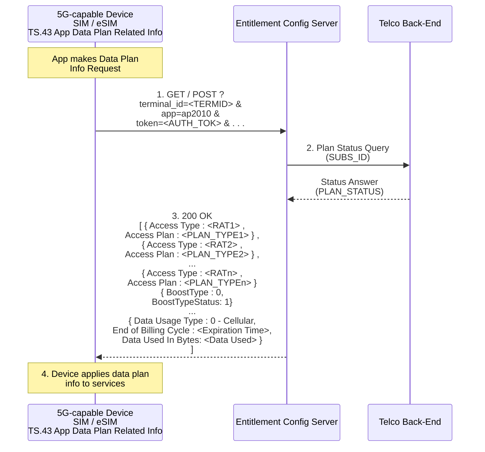
```mermaid
sequenceDiagram
    participant Device as 5G-capable Device<br/>SIM / eSIM<br/>TS.43 App Data Plan Related Info
    participant ECS as Entitlement Config Server
    participant BE as Telco Back-End

    Note over Device: App makes Data Plan<br/>Info Request
    
    Device->>ECS: 1. GET / POST ?<br/>terminal_id=<TERMID> &<br/>app=ap2010 &<br/>token=<AUTH_TOK> & . . .
    
    ECS->>BE: 2. Plan Status Query<br/>(SUBS_ID)
    BE-->>ECS: Status Answer<br/>(PLAN_STATUS)
    
    ECS-->>Device: 3. 200 OK<br/>[ { Access Type : <RAT1> ,<br/>Access Plan : <PLAN_TYPE1> } ,<br/>{ Access Type : <RAT2> ,<br/>Access Plan : <PLAN_TYPE2> } ,<br/>...<br/>{ Access Type : <RATn> ,<br/>Access Plan : <PLAN_TYPEn> }<br/>{ BoostType : 0,<br/>BoostTypeStatus: 1}<br/>...<br/>{ Data Usage Type : 0 - Cellular,<br/>End of Billing Cycle : <Expiration Time>,<br/>Data Used In Bytes: <Data Used> }<br/>]
    
    Note over Device: 4. Device applies data plan<br/>info to services
```

<center>Figure 49. Data Plan Related Information Call Flow</center>

The steps are:

1. The device makes a Data Plan Related Information entitlement request with proper App ID and token acquired from an authentication exchange.
2. The ECS queries the Service Provider's back-end system for data plan related information associated with the end-user's subscription.
3. The ECS receives the data plan related information and creates an entitlement response of the proper format.
4. The device applies the data plan and/or boost info details and/or data usage info details for the targeted application(s).

If there is some change in plan status that could impact on the data plan related information, the ‘Telco Back-End’ will inform the ECS about this change. ECS will notify to the device using any of the available options (see section 2.6) to refresh this data as shown in the Figure 50.


TS.43 v12.0
Page 173 of 248

GSM Association
Non-confidential
Official Document TS.43 - Service Entitlement Configuration


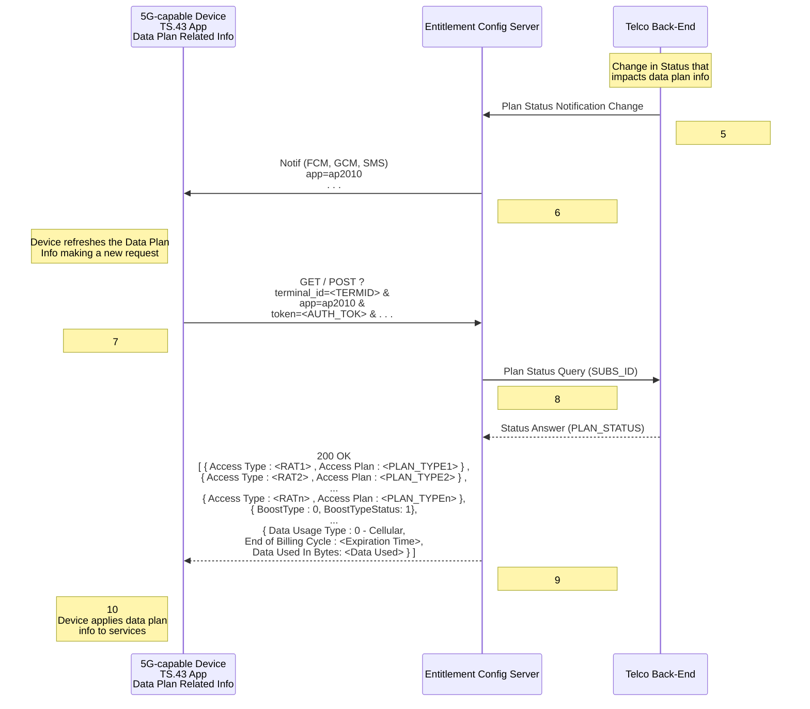
```mermaid
sequenceDiagram
    participant Device as 5G-capable Device<br/>TS.43 App<br/>Data Plan Related Info
    participant ECS as Entitlement Config Server
    participant Telco as Telco Back-End

    Note over Telco: Change in Status that<br/>impacts data plan info
    Telco->>ECS: Plan Status Notification Change
    Note right of Telco: 5
    ECS->>Device: Notif (FCM, GCM, SMS)<br/>app=ap2010<br/>. . .
    Note right of ECS: 6
    Note left of Device: Device refreshes the Data Plan<br/>Info making a new request
    Device->>ECS: GET / POST ?<br/>terminal_id=<TERMID> &<br/>app=ap2010 &<br/>token=<AUTH_TOK> & . . .
    Note left of Device: 7
    ECS->>Telco: Plan Status Query (SUBS_ID)
    Note right of ECS: 8
    Telco-->>ECS: Status Answer (PLAN_STATUS)
    ECS-->>Device: 200 OK<br/>[ { Access Type : <RAT1> , Access Plan : <PLAN_TYPE1> } ,<br/>{ Access Type : <RAT2> , Access Plan : <PLAN_TYPE2> } ,<br/>...<br/>{ Access Type : <RATn> , Access Plan : <PLAN_TYPEn> },<br/>{ BoostType : 0, BoostTypeStatus: 1},<br/>...<br/>{ Data Usage Type : 0 - Cellular,<br/>End of Billing Cycle : <Expiration Time>,<br/>Data Used In Bytes: <Data Used> } ]
    Note right of ECS: 9
    Note left of Device: 10<br/>Device applies data plan<br/>info to services
```

Figure 50. Data Plan Related Information request triggered by carrier notification.

The steps are:

5. Service Provider informs the ECS of a change in data plan related information.
6. The ECS generates the notification message based on the notify_* parameters received earlier from the device (see 2.6 for details). This notification will trigger a new Data Plan Information entitlement request as detailed in Figure 50.
7. **Steps 7 to 10** are exactly the same as steps 1 to 4 detailed in Figure 49.

## 9.4 Data Boost real-time request

The device configured with a particular Data Boost Type can request this Boost Type to the ECS and the ECS can initiate the webview procedures in order to complete the transaction.

As the state of the data boost provisioning and its eligibility on the network can be very fluid. The device also can receive critical data boost status information in real-time to provide best user experience.

## 9.5 Data Boost Web View Parameters

These are the parameters name and presence required in Data Boost.

* `ServiceFlow_URL`: Conditional
* `ServiceFlow_UserData`: Conditional


TS.43 v12.0 Page 174 of 248

GSM Association Non-confidential
Official Document TS.43 - Service Entitlement Configuration


*   `ServiceFlow_ContentsType`: Conditional

During the activation of Data Boost, end-users can be presented with web views specific to the carrier. Data boost web views allow end-users to change user-specific attributes of Data Boost, like the acceptance of the service’s Terms and Conditions (T&C) or purchasing a Data Boost.

The entitlement parameters associated with Data Boost are described in Table 83.

<table>
  <thead>
    <tr>
        <th>Data Boost Entitlement parameter</th>
        <th></th>
        <th>Type</th>
        <th></th>
        <th>Values</th>
        <th></th>
        <th>Description</th>
        <th></th>
    </tr>
  </thead>
  <tbody>
    <tr>
        <td>ServiceFlow_URL<br/>(Conditional)</td>
        <td>String</td>
        <td>URL to a Service Provider site or portal</td>
        <td>The URL of web views to be used by Data Boost client to present the user with Data Boost service management, which may include agreeing to the T&amp;C of the Data Boost service or purchasing a Data Boost.</td>
        <td colspan="4"></td>
    </tr>
    <tr>
        <td>ServiceFlow_UserData<br/>(Conditional)</td>
        <td>String</td>
        <td>Parameters or content to insert when invoking URL provided in the `ServiceFlow_URL` parameter</td>
        <td>User data sent to the Service Provider when requesting the `ServiceFlow_URL` web view.<br/>It should contain user-specific attributes to improve user experience. The format must follow the `ServiceFlow_ContentsType` parameter.<br/>For content types of JSON and XML, it is possible to provide the base64 encoding of the value by preceding it with `encodedValue=`.</td>
        <td colspan="4"></td>
    </tr>
    <tr>
        <td rowspan="4">ServiceFlow_ContentsType<br/>(Conditional)</td>
        <td rowspan="4">String</td>
        <td colspan="2">Specifies content and HTTP method to use when reaching out to the web server specified in `ServiceFlow_URL`.</td>
        <td colspan="4"></td>
    </tr>
    <tr>
        <td>NOT present</td>
        <td>Method to `ServiceFlow_URL` is HTTP GET request with query parameters from `ServiceFlow_UserData`.</td>
        <td colspan="4"></td>
    </tr>
    <tr>
        <td>json</td>
        <td>Method to `ServiceFlow_URL` is HTTP POST request with JSON content from `ServiceFlow_UserData`.</td>
        <td colspan="4"></td>
    </tr>
    <tr>
        <td>Xml</td>
        <td>Method to `ServiceFlow_URL` is HTTP POST request with XML content from `ServiceFlow_UserData`.</td>
        <td colspan="4"></td>
    </tr>
  </tbody>
</table>
<center>Table 83. Data Boost Service Parameters - WebView Information</center>


TS.43 v12.0 Page 175 of 248

GSM Association
Non-confidential
Official Document TS.43 - Service Entitlement Configuration


## 9.6 Data Boost Web View JavaScript Callbacks

At the completion of the web service flow, the web service shall invoke a specific JavaScript (JS) callback function associated with the Data Boost manager. The callback functions shall provide the overall state of the web flow to the Data Boost manager and indicate that the webview needs to be closed.

The object associated with the callback functions is **DataBoostWebServiceFlow** and three different callback functions are defined to reflect the state of the web logic.

### 9.6.1 notifyPurchaseSuccessful(duration)

Calling this method indicates that the user has successfully purchased data boost.

The parameter `duration` is mandatory. It is the time period (in milliseconds) for which the boost is applied.

After this call back is called, the webview is closed.

### 9.6.2 notifyPurchaseFailed(code, reason)

Calling this method indicates that the data boost purchase has failed.

The parameter `code` is mandatory. The parameter `reason` is optional. Details for these parameters are provided in Table 84.

After this call back is called, the webview is closed.

<table>
  <thead>
    <tr>
        <th></th>
        <th>Type</th>
        <th>Values</th>
        <th>Description</th>
    </tr>
  </thead>
  <tbody>
    <tr>
        <td>code</td>
        <td>Integer</td>
        <td>0 – FAILURE_CODE_UNKNOWN</td>
        <td>Unknown failure code (in this case the parameter `reason` provides a human-readable reason)</td>
    </tr>
    <tr>
        <td rowspan="2"></td>
        <td rowspan="2"></td>
        <td>1 – FAILURE_CODE_AUTHENTICATION_FAILED</td>
        <td>User authentication failed</td>
    </tr>
    <tr>
        <td></td>
        <td>2 - FAILURE_CODE_PAYMENT_FAILED</td>
        <td>User payment failed</td>
    </tr>
    <tr>
        <td>reason</td>
        <td>String</td>
        <td>ANY VALUE</td>
        <td>Human readable reason for the failure.</td>
    </tr>
  </tbody>
</table>
Table 84. Failure codes for data boost purchase failure

### 9.6.3 dismissFlow()

Calling this method indicates that the data boost purchase mechanism has ended prematurely, either caused by user action or by an error in the web sheet logic or from the network side.

After this call back is called, the webview is closed.


TS.43 v12.0
Page 176 of 248

GSM Association
Non-confidential
Official Document TS.43 - Service Entitlement Configuration


## 9.7 Data Boost Real-time Request Parameters

* Parameter names and presence:
    * `boost_type`: Top level; list of performance experience in the form of a boost type category. See Table 85 for currently defined values for this version.

<table>
  <thead>
    <tr>
        <th>“Data Boost Real-time” configuration parameters</th>
        <th>Type</th>
        <th>Values</th>
        <th>Description</th>
    </tr>
  </thead>
  <tbody>
    <tr>
        <td>boost_type</td>
        <td>Integer</td>
        <td>See `BoostType` in Table 77</td>
        <td>Boost type to be requested by the subscriber</td>
    </tr>
  </tbody>
</table>
<center>Table 85. Data Boost Real-time Request Parameter</center>

## 9.8 Data Boost Real-time Request Example

Table 86 presents an example for the Data Boost operation for a server ODSA application.

```
GET ? terminal_id = 013787006099944&
token = es7w1erXjh%2FEC%2FP8BV44SBmVipg&
terminal_vendor = TVENDOR&
terminal_model = TMODEL&
terminal_sw_version = TSWVERS&
entitlement_version = ENTVERS&
app = ap2010&
boost_type = 0&
vers = 1 HTTP/1.1

Host: entitlement.telco.net:9014
Accept: text/html,application/xhtml+xml,application/xml;q=0.9,*/*;q=0.8
Accept-Language: en-US,en;q=0.5
Accept-Encoding: gzip, deflate
Connection: keep-alive
```
<center>Table 86. Example of a Data Boost request</center>

## 9.9 Data Boost Real-Time Response Parameters

* Data Boost Real-time response parameter names and presence:
    * `EntitlementStatus`: provides the real-time entitlement status of the boost request by the device. See Table 87 for details.
    * `ProvStatus`: provides the real-time provisioning status of the boost request by the device. See Table 88 for details.

The real-time response includes an Entitlement status and Provisioning status as defined in the tables below. If a data plan is eligible for a boost experience, device may handle user interaction based on internal logic (outside the scope of this spec). The entitlement response may also provide a redirect URL from where the user is able to purchase the boost experience.


TS.43 v12.0 Page 177 of 248

GSM Association
Non-confidential
Official Document TS.43 - Service Entitlement Configuration


<table>
  <thead>
    <tr>
        <th></th>
        <th>Type</th>
        <th>Values</th>
        <th>Description</th>
    </tr>
  </thead>
  <tbody>
    <tr>
        <td rowspan="5">EntitlementStatus</td>
        <td rowspan="5">Integer</td>
        <td>0 - DISABLED</td>
        <td>Data Plan is eligible, but boost is disabled currently; device should not offer notification and upsell experience but can poll later</td>
    </tr>
    <tr>
        <td>1 – ENABLED</td>
        <td>Data Plan is eligible. Boost is allowed, provisioned, and activated; device may offer notification and upsell experience</td>
    </tr>
    <tr>
        <td>2 – INCOMPATIBLE</td>
        <td>Data Plan is no longer eligible. Boost is not allowed or can’t be offered; device should not offer upsell experience</td>
    </tr>
    <tr>
        <td>3 - PROVISIONING</td>
        <td>Data Plan is eligible. Boost is not fully provisioned; device should wait for provisioning to finish</td>
    </tr>
    <tr>
        <td>4 - INCLUDED</td>
        <td>Data Plan is eligible. Boost is enabled e.g. included in the sub plan. Device may proceed with upsell experience, but notification is not required</td>
    </tr>
  </tbody>
</table>
<center>Table 87. Real-time Data Boost Information Configuration Parameter</center>

The Provisioning status provides the device with additional real-time information regarding the provisioning status of the boost service. If the provisioning is pending, the device may implement logic to delay the boost purchase.

<table>
  <thead>
    <tr>
        <th></th>
        <th>Type</th>
        <th>Values</th>
        <th>Description</th>
    </tr>
  </thead>
  <tbody>
    <tr>
        <td rowspan="4">ProvStatus</td>
        <td rowspan="4">Integer</td>
        <td>0 – NOT PROVISIONED</td>
        <td>Boost service is not provisioned yet on the backend</td>
    </tr>
    <tr>
        <td>1 – PROVISIONED</td>
        <td>Boost service is fully provisioned on the backend</td>
    </tr>
    <tr>
        <td>2 – NOT AVAILABLE</td>
        <td>Boost service provisioning progress not required/tracked</td>
    </tr>
    <tr>
        <td>3 – IN PROGRESS</td>
        <td>Boost service provisioning is still in progress; client should wait for provisioning to complete.</td>
    </tr>
  </tbody>
</table>
<center>Table 88. Provisioning status Information Configuration Parameter</center>

### 9.10 Data Boost Real-time Response Example

Table 89 presents an example for a returned Data Boost Real-time Information entitlement configuration in XML format.


TS.43 v12.0
Page 178 of 248

GSM Association
Non-confidential
Official Document TS.43 - Service Entitlement Configuration


```xml
<?xml version="1.0"?>
<wap-provisioningdoc version="1.1">
      <characteristic type="VERS">
           <parm name="version" value="1"/>
           <parm name="validity" value="172800"/>
      </characteristic>

      <characteristic type="TOKEN">
           <parm name="token" value="ASH127AHHA88SF"/>
      </characteristic>

      <characteristic type="APPLICATION">
           <parm name="AppID" value="ap2010"/>
           <parm name="EntitlementStatus" value="1"/>
           <parm name="ServiceFlow_URL" value="X"/>
           <parm name="ServiceFlow_UserData" value="X"/>
           <parm name="ProvStatus" value="1"/>
      </characteristic>
</wap-provisioningdoc>
```

Table 89. Example of a Data Boost Real-time Information response in XML format

## 9.11 Data Boost Real-time Request Call Flow with webview

Figure 51 shows the call flow for the Data Boost Upsell Information entitlement configuration use case. Authentication steps are not shown for simplification purposes.

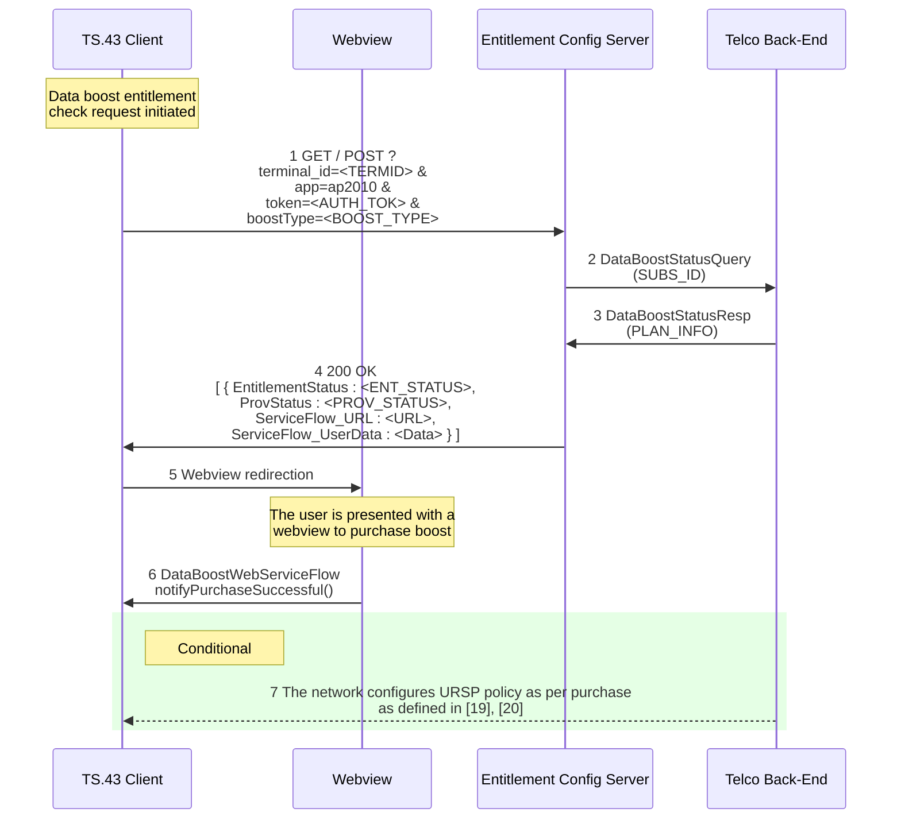
```mermaid
sequenceDiagram
    participant C as TS.43 Client
    participant W as Webview
    participant S as Entitlement Config Server
    participant B as Telco Back-End

    Note over C: Data boost entitlement<br/>check request initiated

    C->>S: 1 GET / POST ?<br/>terminal_id=<TERMID> &<br/>app=ap2010 &<br/>token=<AUTH_TOK> &<br/>boostType=<BOOST_TYPE>
    S->>B: 2 DataBoostStatusQuery<br/>(SUBS_ID)
    B->>S: 3 DataBoostStatusResp<br/>(PLAN_INFO)
    S->>C: 4 200 OK<br/>[ { EntitlementStatus : <ENT_STATUS>,<br/>ProvStatus : <PROV_STATUS>,<br/>ServiceFlow_URL : <URL>,<br/>ServiceFlow_UserData : <Data> } ]
    C->>W: 5 Webview redirection
    Note over W: The user is presented with a<br/>webview to purchase boost
    W->>C: 6 DataBoostWebServiceFlow<br/>notifyPurchaseSuccessful()
    
    rect rgba(0, 255, 0, 0.1)
    Note right of C: Conditional
    B-->>C: 7 The network configures URSP policy as per purchase<br/>as defined in [19], [20]
    end
```

Figure 51. Data Boost Real-time request and response Call Flow with webview

The steps are:

1. Once a data boost entitlement check request is initiated, the device entitlement client makes a Performance Boost Upsell Information entitlement request with proper App


TS.43 v12.0
Page 179 of 248

GSM Association
Non-confidential
Official Document TS.43 - Service Entitlement Configuration


ID, optional OS App ID and token acquired from an authentication exchange. The entitlement client also provides the boost type corresponding to the upsell experience requested by the user.
2. The ECS queries the Service Provider's back-end system for plan information associated with the end-user's subscription.
3. The ECS receives the plan information and Network capability information from the Service Provider's back-end system.
4. The ECS creates an entitlement response (data boost real-time response) of the proper format and informs the device entitlement client.
5. The device entitlement client informs the user of availability of data boost experience. If the user requests the data boost experience, the user is redirected to a webview to purchase the data boost experience. Aspects related to user consent for notification and details of when and how the notification of data boost purchase availability is performed is outside the scope of this specification.
6. The user is presented with the webview to purchase the boost and the webview invokes a callback function to inform the device entitlement client of data boost purchase decision.
7. Conditional (If not received already or expired): Depending on the data boost experience purchased by the user, the Service Provider's back-end configures the device with the appropriate URSP policy as specified in [19] and [20].


TS.43 v12.0
Page 180 of 248

GSM Association
Non-confidential
Official Document TS.43 - Service Entitlement Configuration


# 10 Server-initiated ODSA Procedure Call Flows

In specific environments like the enterprise one, there are some needs to manage the device subscriptions. This could be managed by Mobile Device Management (MDM) software for the purpose to simplify and enhance the management of the end user devices.

The activation flow for the new devices is similar to the one implemented for the Companion devices (see section 7) where the MDM works as a primary device and the end user device as a companion one.

One of the main differences is that behind the device (MDM system) initiating the request there is no user, neither an eSIM/SIM but just a server. Due to this restriction, it is no possible to use authentication methods like Embedded EAP-AKA (see section 2.8.1) or OAuth2.0/OpenID with customer interaction (see section 2.8.2) and it is necessary to use Server to Server Authentication using OAuth2.0 as described in section 2.8.3 of this document.

The architecture for the server-initiated ODSA use case is shown in Figure 52. The Entitlement Configuration Server acts as the Service Provider’s ODSA Gateway for the ODSA procedure (labelled as the “ODSA GW” in Figure 52), providing entitlement and configuration data to the server (MDM) managing the devices for “ODSA server-initiated” application.

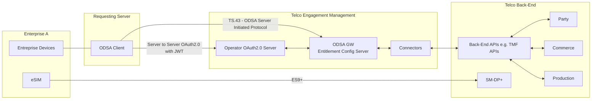
```mermaid
graph LR
    subgraph Enterprise_A [Enterprise A]
        ED[Entreprise Devices]
        ESIM[eSIM]
    end

    subgraph Requesting_Server [Requesting Server]
        OC[ODSA Client]
    end

    subgraph Telco_Engagement_Management [Telco Engagement Management]
        OAS[Operator OAuth2.0 Server]
        OGW[ODSA GW<br/>Entitlement Config Server]
        CON[Connectors]
    end

    subgraph Telco_Back_End [Telco Back-End]
        BEA[Back-End APIs e.g. TMF APIs]
        P[Party]
        C[Commerce]
        PR[Production]
        SMDP[SM-DP+]
    end

    ED --- OC
    OC -- "Server to Server OAuth2.0 with JWT" --> OAS
    OC -- "TS.43 - ODSA Server Initiated Protocol" --> OGW
    OAS <--> OGW
    OGW <--> CON
    CON <--> BEA
    BEA <--> P
    BEA <--> C
    BEA <--> PR
    ESIM -- "ES9+" --> SMDP
```
<center>Figure 52. ODSA server-initiated request, architecture, and TS.43 positioning</center>

## 10.1 Initial considerations

The main difference between this use case and the others related to ODSA is that there is not any direct interaction with the use, and the device doesn’t interact with the entitlement configuration server (ECS) until it is already activated. At that point on time, and if the policies applied by the MDM allow it to do that, it could interact as any other device having the proper TS.43 apps.

The MDM is not a terminal but a server, but, even so, in the request there will be some parameters referring to `terminal_*` present on the requests as part of the RCC.14 standard. For these mandatory parameters, it is recommended to use dummy values, keeping the new ones (`requestor_id` or `enterprise_*` as referred in Table 27).


TS.43 v12.0 Page 181 of 248

GSM Association
Non-confidential
Official Document TS.43 - Service Entitlement Configuration


Due to there is no real info for the targeted device in the `CheckEligibility` request, it should be the MDM the one in charge of checking the eligibility of the device to use any specific service when onboarding with a new plan. These policies/rules are managed by the MDM and are out of the scope of this spec.

### 10.2 Subscription Activation initiated by the server.

The following premises are considered for this the case:

*   The requesting server (through the ODSA client application) is allowed to request new eSIM profiles for and specific Enterprise (`enterprise_id`).
*   The ODSA GW (Entitlement Configuration Server) is able to keep the authentication tokens for each requesting server (`requestor_id`) and enterprise (`enterprise_id`) to avoid sending the `enterprise_id` in each request triggered by the requesting server once it has the authentication token.
*   If the authentication token is invalid or expires, the server initiating the ODSA request will need to get a new Access Token (from the Authorization server) to perform the new Authentication through the ECS (Resource Server).

Figure 53 shows the steps of the flow for the activation of an eSIM managed by the requesting server (aka MDM).


TS.43 v12.0
Page 182 of 248

GSM Association
Non-confidential
Official Document TS.43 - Service Entitlement Configuration


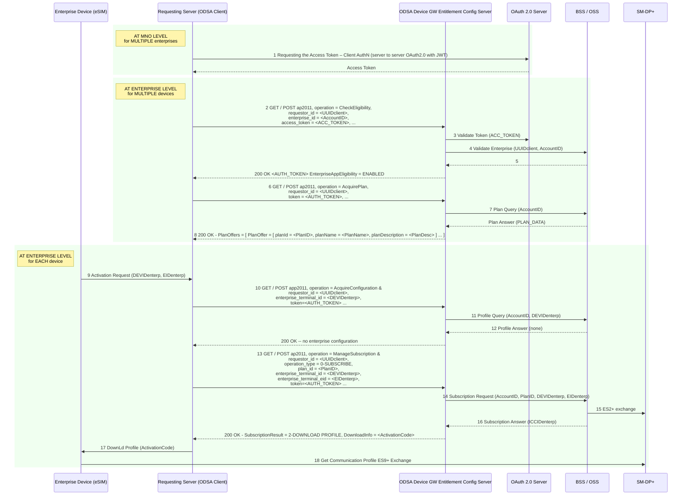
```mermaid
sequenceDiagram
    participant ED as Enterprise Device (eSIM)
    participant RS as Requesting Server (ODSA Client)
    participant ECS as ODSA Device GW Entitlement Config Server
    participant OAuth as OAuth 2.0 Server
    participant BSS as BSS / OSS
    participant SMDP as SM-DP+

    rect rgb(240, 255, 240)
    Note left of RS: AT MNO LEVEL<br/>for MULTIPLE enterprises
    RS->>OAuth: 1 Requesting the Access Token – Client AuthN (server to server OAuth2.0 with JWT)
    OAuth-->>RS: Access Token
    end

    rect rgb(240, 255, 240)
    Note left of RS: AT ENTERPRISE LEVEL<br/>for MULTIPLE devices
    RS->>ECS: 2 GET / POST ap2011, operation = CheckEligibility,<br/>requestor_id = <UUIDclient>,<br/>enterprise_id = <AccountID>,<br/>access_token = <ACC_TOKEN>, ...
    ECS->>OAuth: 3 Validate Token (ACC_TOKEN)
    ECS->>BSS: 4 Validate Enterprise (UUIDclient, AccountID)
    BSS-->>ECS: 5
    ECS-->>RS: 200 OK <AUTH_TOKEN> EnterpriseAppEligibility = ENABLED
    
    RS->>ECS: 6 GET / POST ap2011, operation = AcquirePlan,<br/>requestor_id = <UUIDclient>,<br/>token = <AUTH_TOKEN>, ...
    ECS->>BSS: 7 Plan Query (AccountID)
    BSS-->>ECS: Plan Answer (PLAN_DATA)
    ECS-->>RS: 8 200 OK - PlanOffers = [ PlanOffer = [ planId = <PlanID>, planName = <PlanName>, planDescription = <PlanDesc> ] ... ]
    end

    rect rgb(240, 255, 240)
    Note left of ED: AT ENTERPRISE LEVEL<br/>for EACH device
    ED->>RS: 9 Activation Request (DEVIDenterp, EIDenterp)
    RS->>ECS: 10 GET / POST app2011, operation = AcquireConfiguration &<br/>requestor_id = <UUIDclient>,<br/>enterprise_terminal_id = <DEVIDenterp>,<br/>token=<AUTH_TOKEN> ...
    ECS->>BSS: 11 Profile Query (AccountID, DEVIDenterp)
    BSS-->>ECS: 12 Profile Answer (none)
    ECS-->>RS: 200 OK -- no enterprise configuration
    
    RS->>ECS: 13 GET / POST ap2011, operation = ManageSubscription &<br/>requestor_id = <UUIDclient>,<br/>operation_type = 0-SUBSCRIBE,<br/>plan_id = <PlanID>,<br/>enterprise_terminal_id = <DEVIDenterp>,<br/>enterprise_terminal_eid = <EIDenterp>,<br/>token=<AUTH_TOKEN> ...
    ECS->>BSS: 14 Subscription Request (AccountID, PlanID, DEVIDenterp, EIDenterp)
    BSS->>SMDP: 15 ES2+ exchange
    BSS-->>ECS: 16 Subscription Answer (ICCIDenterp)
    ECS-->>RS: 200 OK - SubscriptionResult = 2-DOWNLOAD PROFILE, DownloadInfo = <ActivationCode>
    RS->>ED: 17 DownLd Profile (ActivationCode)
    ED->>SMDP: 18 Get Communication Profile ES9+ Exchange
    end
```

<center>Figure 53. ODSA initiated by a server flow.</center>

The steps are the following ones and can be split in three sections:

### Steps at MNO level for MULTIPLE enterprises:

1. The server ODSA application requests (and gets) an access token to the SP’s Authentication Server. For additional info about how the requesting server gets the access token see section 2.8.3.

### Steps at enterprise level for MULTIPLE devices:

2. The server ODSA application makes a **CheckEligibility** request to the ECS providing the access token (`ACC_TOKEN`) and the Enterprise ID (`enterprise_id`) to operate.
3. The ECS validates the access token with SP OAuth2.0 Server.


TS.43 v12.0 Page 183 of 248

GSM Association
Non-confidential
Official Document TS.43 - Service Entitlement Configuration


4. Additional to the access token validation, the ECS checks if Enterprise is entitled to manage subscriptions.
5. Once access token validation and enterprise entitlement check are successful, the ECS will create an AuthN Token that will be sent back to the ODSA client application. The ECS will associate this token to the ODSA app ID (`requestor_id`) and Enterprise ID for future requests. This avoids sending the Enterprise ID in each request.
6. The server ODSA application makes an **AcquirePlan** request to get all the plans offered by the SP to a specific Enterprise. Note that it is not necessary to send the `enterprise_id` parameter as the ECS knows it based on the authentication token received.
7. The ECS queries, based on the `enterprise_id`, for this plan info to the SP back-end system managing this info.
8. The ECS generates a proper response with the different plans available for offering.

**Steps at enterprise level for EACH device:**
9. A new device (belonging to an enterprise) sends an activation request to the requesting server. This new device will be managed as an enterprise device for the requesting server.
10. The server ODSA client application makes an **AcquireConfiguration** request to the ECS to obtain information on any communication profiles associated with the device.
11. The ECS queries the SP's back-end system managing the subscriptions and active profiles.
12. The ECS processes the response from the SP's back-end system and generates the proper 200 OK response containing `EnterpriseDeviceConfigurations` without any `EnterpriseConfiguration` (no profile/subscription is associated with the enterprise device).
13. The server ODSA client application makes a **ManageSubscription** request to the ECS with an `operation_type` set to SUBSCRIBE (value of 0) to initiate the subscription procedure for the enterprise device.
14. The ECS makes a request towards the SP's back-end system to activate the selected plan and subscription.
15. The SP's back-end system interacts with the SM-DP+ over the ES2+ interface to make the required eSIM profile requests associated with the new subscription (for example, `DownloadOrder`, `ConfirmOrder` and `ReleaseProfile`) resulting in an activation code and ICCID for the enterprise device.
16. The ECS processes the response from the SP's back-end system and generates the proper **ManageSubscription** 200 OK response with a `SubscriptionResult` set to DOWNLOAD_PROFILE (value of 2), and a filled in `DownloadInfo` structure with the proper `ActivationCode`.
17. The server ODSA client application informs the enterprise device to download the eSIM profile.
18. The new device (acting as an enterprise one) downloads the eSIM profile from the SM-DP+.


TS.43 v12.0
Page 184 of 248

GSM Association Non-confidential
Official Document TS.43 - Service Entitlement Configuration


### 10.2.1 Subscription Activation for Delayed Activations

It is possible that carrier could consider delaying the eSIM profile activation in their backend systems, so a polling or notification mechanisms should be implemented to notify when the eSIM profile is ready to be used.

In case of implementing the polling mechanism, it should be necessary to include the loop for refreshing status between steps 14 and 16 in the Figure 53 as explained in the section 7.3.

In case of implementing the notifications, and due to there is no standard notification API for these MDMs, carriers, ECS vendors and MDM vendors should agree the way to implement this. This specification/agreement is out of scope of TS.43.


TS.43 v12.0 Page 185 of 248

GSM Association Non-confidential
Official Document TS.43 - Service Entitlement Configuration


# 11 Direct Carrier Billing Entitlement Configuration

The following sections describe the different configuration parameters associated with the Direct Carrier Billing (aka DCB) entitlement as well as the expected behaviour of the DCB client based on the entitlement configuration document received by the client.

Figure 54 shows the steps of the flow for the activation of DCB.

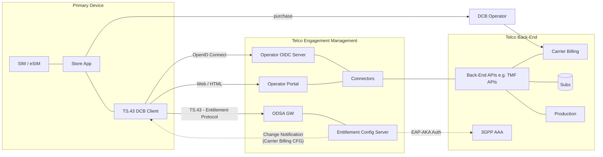
```mermaid
graph LR
    subgraph Primary_Device [Primary Device]
        SIM[SIM / eSIM] --- StoreApp[Store App]
        StoreApp --- DCBClient[TS.43 DCB Client]
    end

    DCBOperator[DCB Operator]
    
    subgraph Telco_Engagement_Management [Telco Engagement Management]
        OIDC[Operator OIDC Server]
        Portal[Operator Portal]
        Connectors[Connectors]
        ODSA[ODSA GW]
        ECS[Entitlement Config Server]
    end

    subgraph Telco_Back_End [Telco Back-End]
        CB[Carrier Billing]
        BackEndAPIs[Back-End APIs e.g. TMF APIs]
        Subs[(Subs)]
        Production[Production]
        AAA[3GPP AAA]
    end

    StoreApp -- purchase --> DCBOperator
    DCBOperator --> CB
    DCBClient -- OpenID Connect --> OIDC
    DCBClient -- Web / HTML --> Portal
    DCBClient -- TS.43 - Entitlement Protocol --> ODSA
    ODSA --- ECS
    OIDC --- Connectors
    Portal --- Connectors
    Connectors --- BackEndAPIs
    BackEndAPIs --- CB
    BackEndAPIs --- Subs
    BackEndAPIs --- Production
    ECS -. EAP-AKA Auth .-> AAA
    ECS -. Change Notification <br/> (Carrier Billing CFG) .-> DCBClient
```

<center>Figure 54. Direct Carrier Billing Configuration - High level Architecture</center>

## 11.1 DCB Entitlement Parameters

Parameters for the DCB entitlement provide the overall status of the DCB service to the client, as well as the different sub-status associated with the activation procedure of the service.

The DCB entitlement parameters also include information associated with the web views presented to users by the DCB client during management of the service.

Additional to the parameters identified in (section 2.3, Table 4), new parameters are required for the Direct Carrier Billing use case. These parameters are defined in the following table:

<table>
  <thead>
    <tr>
        <th>HTTP GET parameter</th>
        <th></th>
        <th>Type</th>
        <th></th>
        <th>Description</th>
        <th></th>
        <th>Usage</th>
        <th></th>
    </tr>
  </thead>
  <tbody>
    <tr>
        <td>store_vendor</td>
        <td>String</td>
        <td>This value shall be a unique and persistent identifier of the store.<br/>Example: S9999</td>
        <td>Only required for DCB</td>
        <td colspan="4"></td>
    </tr>
  </tbody>
</table>


TS.43 v12.0 Page 186 of 248

GSM Association
Non-confidential
Official Document TS.43 - Service Entitlement Configuration


<table>
  <thead>
    <tr>
        <th>HTTP GET parameter</th>
        <th></th>
        <th>Type</th>
        <th></th>
        <th>Description</th>
        <th></th>
        <th>Usage</th>
        <th></th>
    </tr>
  </thead>
  <tbody>
    <tr>
        <td>store_user_id</td>
        <td>String</td>
        <td>User Identity on the store. This value shall be a unique and persistent identifier for each specific user in each specific store.<br/>This value is used to be generated by a system in the store.</td>
        <td>Only required for DCB</td>
        <td colspan="4"></td>
    </tr>
    <tr>
        <td>MSG_btn<br/>(Optional)</td>
        <td>Integer</td>
        <td colspan="2">This indicate either “Accept” or “Reject” button has been pressed on device UI. The action associated with is to set `TC_Status`.</td>
        <td colspan="4"></td>
    </tr>
    <tr>
        <td rowspan="2"></td>
        <td rowspan="2"></td>
        <td>0 – REJECTED</td>
        <td>T&amp;C have been rejected by the end-user. `TC_Status` will be set to 0 - NOT AVAILABLE</td>
        <td colspan="4"></td>
    </tr>
    <tr>
        <td rowspan="2"></td>
        <td>1 – ACCEPTED</td>
        <td>T&amp;C have been accepted by the end-user. `TC_Status` will be set to 1 – AVAILABLE</td>
        <td colspan="3"></td>
    </tr>
  </tbody>
</table>
<center>Table 90. Additional GET Parameters for DCB Entitlement Configuration Request</center>

### 11.1.1 DCB Entitlement Status
This is the parameter name and presence required in DCB.

* `EntitlementStatus`: Mandatory

This parameter indicates the overall status of the DCB entitlement, stating if the service can be offered on the device, and if it can be activated or not by the end-user.

The different values for the DCB entitlement status are provided in Table 91

<table>
  <thead>
    <tr>
        <th>DCB Entitlement parameter</th>
        <th></th>
        <th>Type</th>
        <th></th>
        <th>Values</th>
        <th></th>
        <th>Description</th>
        <th></th>
    </tr>
  </thead>
  <tbody>
    <tr>
        <td>EntitlementStatus (Mandatory)</td>
        <td>Integer</td>
        <td>0 - DISABLED</td>
        <td>DCB service allowed, but not yet provisioned and activated on the network side</td>
        <td colspan="4"></td>
    </tr>
    <tr>
        <td rowspan="3"></td>
        <td rowspan="3"></td>
        <td>1 - ENABLED</td>
        <td>DCB service allowed, provisioned, and activated on the network side</td>
        <td colspan="4"></td>
    </tr>
    <tr>
        <td rowspan="3"></td>
        <td>2 - INCOMPATIBLE</td>
        <td>DCB service cannot be offered</td>
        <td colspan="3"></td>
    </tr>
    <tr>
        <td rowspan="3"></td>
        <td>3 - PROVISIONING</td>
        <td>DCB service being provisioned on the network side</td>
        <td colspan="2"></td>
    </tr>
  </tbody>
</table>
<center>Table 91. Entitlement Parameter - DCB Overall Status</center>

### 11.1.2 DCB T&C Status
These are the parameters name and presence required in DCB for T&C status.

* `TC_Status`: Mandatory


TS.43 v12.0
Page 187 of 248

GSM Association
Non-confidential
Official Document TS.43 - Service Entitlement Configuration


* `TC_Operation`: Optional

In some regions, end-users must agree to the Terms and Conditions (T&C) of the DCB service before being allowed to use it. This entitlement parameter indicates if that condition must be met before offering the DCB service.

Also, if acceptance of the DCB’s T&C is indeed needed from the end-user, this parameter indicates the state of the “T&C acceptance” process.

The different values for the DCB T&C status are provided in Table 92.

<table>
  <thead>
    <tr>
        <th>TC_Status<br/>(Mandatory)</th>
        <th rowspan="4">Integer</th>
        <th>0 - NOT AVAILABLE</th>
        <th>T&amp;C have not yet been accepted by the end-user</th>
    </tr>
    <tr>
        <th></th>
        <th>1 - AVAILABLE</th>
        <th>T&amp;C have been accepted by the end-user</th>
    </tr>
    <tr>
        <th></th>
        <th>2 - NOT REQUIRED</th>
        <th>T&amp;C acceptance is not required to offer VoWiFi service</th>
    </tr>
    <tr>
        <th></th>
        <th>3 - IN PROGRESS</th>
        <th>T&amp;C capture and acceptance is on-going</th>
    </tr>
    <tr>
        <th>TC_Operation<br/>(Conditional)</th>
        <th rowspan="3">Integer</th>
        <th colspan="2">Returned only if TC_Status is 0 - NOT AVAILABLE</th>
    </tr>
    <tr>
        <th></th>
        <th>1 – WEBSHEET_IS_PREFERED</th>
        <th>T&amp;C capture and acceptance through web portal is the preferred option for the carrier.<br/>If device doesn’t support this, it will take the other one (MSG), if available.</th>
    </tr>
    <tr>
        <th></th>
        <th>2 – MSG_IS_PREFERED</th>
        <th>T&amp;C capture and acceptance through client is the preferred option for the carrier.<br/>If device doesn’t support this, it will take the other one (WEBSHEET), if available.</th>
    </tr>
  </thead>
  <tbody>
    <tr>
        <td>DCB Entitlement parameter</td>
        <td>Type</td>
        <td>Values</td>
        <td>Description</td>
    </tr>
  </tbody>
</table>
<center>Table 92. Entitlement Parameter - DCB T&C Status and Operation</center>

### 11.1.3 DCB Service Parameters

During activation procedure of the DCB service, end-users could interact with Carrier Websheets or Device GUI to validate or approve some conditions. Both options are described in the following subsections.

These options (described in section 11.1.3.1 and 11.1.3.2) are not mutually exclusive. It means that both configurations could be provided to the device, and it will decide, based on its capabilities, which one to use.

#### 11.1.3.1 DCB Client’s Web Views Parameters

These are the parameters name and presence required in DCB.

* `ServiceFlow_URL`: Conditional


TS.43 v12.0
Page 188 of 248

GSM Association
Non-confidential
Official Document TS.43 - Service Entitlement Configuration


*   `ServiceFlow_UserData`: Conditional
*   `ServiceFlow_ContentsType`: Conditional

The entitlement parameters associated with the DCB service's web views are described in Table 93.

<table>
  <thead>
    <tr>
        <th>DCB Entitlement parameter</th>
        <th></th>
        <th>Type</th>
        <th></th>
        <th>Values</th>
        <th></th>
        <th>Description</th>
        <th></th>
    </tr>
  </thead>
  <tbody>
    <tr>
        <td>ServiceFlow_URL<br/>(Conditional)</td>
        <td>String</td>
        <td>URL to a Service Provider site or portal</td>
        <td>The URL of web views to be used by DCB client to present the user with DCB service management, which may include agreeing to the T&amp;C of the DCB service.</td>
        <td colspan="4"></td>
    </tr>
    <tr>
        <td>ServiceFlow_UserData<br/>(Conditional)</td>
        <td>String</td>
        <td>Parameters or content to insert when invoking URL provided in the `ServiceFlow_URL` parameter</td>
        <td>User data sent to the Service Provider when requesting the `ServiceFlow_URL` web view.<br/>It should contain user-specific attributes to improve user experience.<br/>The format must follow the `ServiceFlow_ContentsType` parameter.<br/>For content types of JSON and XML, it is possible to provide the base64 encoding of the value by preceding it with `encodedValue=`.</td>
        <td colspan="4"></td>
    </tr>
    <tr>
        <td rowspan="3">ServiceFlow_ContentsType<br/>(Conditional)</td>
        <td rowspan="3">String</td>
        <td colspan="2">Specifies content and HTTP method to use when reaching out to the web server specified in `ServiceFlow_URL`.</td>
        <td colspan="4"></td>
    </tr>
    <tr>
        <td>NOT present</td>
        <td>Method to `ServiceFlow_URL` is HTTP GET request with query parameters from `ServiceFlow_UserData`.</td>
        <td colspan="4"></td>
    </tr>
    <tr>
        <td>json</td>
        <td>Method to `ServiceFlow_URL` is HTTP POST request with JSON content from `ServiceFlow_UserData`.</td>
        <td colspan="4"></td>
    </tr>
    <tr>
        <td>Xml</td>
        <td>Method to `ServiceFlow_URL` is HTTP POST request with XML content from `ServiceFlow_UserData`.</td>
        <td colspan="6"></td>
    </tr>
  </tbody>
</table>
<center>Table 93. DCB Service Parameters - WebView Information</center>

### 11.1.3.2 DCB Client's GUI Parameters
These are the parameters name and presence required in DCB.

*   `MSG`: Conditional


TS.43 v12.0
Page 189 of 248

GSM Association
Non-confidential
Official Document TS.43 - Service Entitlement Configuration


The entitlement parameters associated with the DCB service’s web views are described in Table 94.

<table>
  <thead>
    <tr>
        <th>DCB Entitlement parameter</th>
        <th></th>
        <th>Type</th>
        <th></th>
        <th>Values</th>
        <th></th>
        <th>Description</th>
        <th></th>
    </tr>
  </thead>
  <tbody>
    <tr>
        <td>MSG<br/>(Conditional)</td>
        <td>Structure</td>
        <td>multi-parameter value - see Table 95. DCB Service Parameters - GUI MSG Information for details</td>
        <td>Specifies the message to be displayed/accepted/rejected through the client.</td>
        <td colspan="4"></td>
    </tr>
  </tbody>
</table>
Table 94. DCB Service Parameters - Client Information

<table>
  <thead>
    <tr>
        <th>MSG object</th>
        <th></th>
        <th>Type</th>
        <th></th>
        <th>Description</th>
        <th></th>
    </tr>
  </thead>
  <tbody>
    <tr>
        <td>Title<br/>(mandatory)</td>
        <td>String</td>
        <td>The window title where the user message is displayed.</td>
        <td colspan="3"></td>
    </tr>
    <tr>
        <td>Message<br/>(mandatory)</td>
        <td>String</td>
        <td>The message that is displayed to the user. Please note the message may contain references to HTTP addresses (websites) that need to be highlighted and converted into links by the device/client.</td>
        <td colspan="3"></td>
    </tr>
    <tr>
        <td>Accept_btn<br/>(mandatory)</td>
        <td>String</td>
        <td>This indicate whether an “Accept” button is shown with the message on device UI. The action associated with the Accept button on the device/client is to clear the message box.<br/>• “1” indicates that an “Accept” button shall be displayed.<br/>• “0” indicates that no “Accept” button shall be displayed.</td>
        <td colspan="3"></td>
    </tr>
    <tr>
        <td>Reject_btn<br/>(mandatory)</td>
        <td>String</td>
        <td>This indicate whether an “Decline” button is shown with the message on device UI. The action associated with the Reject button on the device/client is to revert the configured services to their defined default behaviour.<br/>• “1” indicates that a “Decline” button has to be displayed.<br/>• “0” indicates that no “Decline” button has to be displayed.</td>
        <td colspan="3"></td>
    </tr>
  </tbody>
</table>
Table 95. DCB Service Parameters - GUI MSG Information

### 11.1.4 DCB Message for Incompatible Status
These are the parameters name and presence required in DCB for Incompatible status.

* `MessageForIncompatible`: Mandatory

When the status for the DCB entitlement is INCOMPATIBLE (see 11.1.1) and the end-user tries to activate DCB, the DCB client should show a message to the end-user indicating why activation was refused.


TS.43 v12.0 Page 190 of 248

GSM Association
Non-confidential
Official Document TS.43 - Service Entitlement Configuration


This entitlement parameter provides the content of that message, as decided by the Service Provider. Table 96 describes this DCB entitlement parameter.

<table>
  <thead>
    <tr>
        <th>DCB Entitlement parameter</th>
        <th>Type</th>
        <th>Description</th>
    </tr>
  </thead>
  <tbody>
    <tr>
        <td>MessageForIncompatible (Mandatory)</td>
        <td>String</td>
        <td>A message to be displayed to the end-user when activation fails due to an incompatible DCB Entitlement Status</td>
    </tr>
  </tbody>
</table>
Table 96. Entitlement Parameter - DCB Message for Incompatible Status

## 11.2 Client Behavior for DCB Entitlement Configuration

The entitlement parameters for DCB provide an overall status for the service as well as additional information associated with the activation procedure and provisioning of the service.

As such, the entitlement configuration for DCB carries information that impacts the behavior of the DCB client.

The client shall then activate (or deactivate) the DCB service according to the combination of the DCB’s general setting on the device (controlled by the end-user) and the received DCB entitlement configuration.

The client shall also use the DCB entitlement parameters to decide if DCB web views for activation and service management should be presented to the end-user. This includes country-specific details on the need for DCB’s Terms & Conditions acceptance and the requirement to enable or not the service - a country’s regulations may require users to enable the service as well as agree to the Terms & Conditions of the service when activating DCB.

## 11.3 Entitlement Modes of DCB Client

To simplify the description of the client’s behavior with respect to the DCB entitlement configuration, a set of “DCB entitlement modes” for the client is defined, each with specific expectations on the client side.

The relationship between the values of the DCB entitlement parameters and the DCB entitlement modes are shown in Table 97.

<table>
  <thead>
    <tr>
        <th colspan="2">DCB Entitlement parameter</th>
        <th rowspan="2">DCB Entitlement mode</th>
        <th></th>
    </tr>
    <tr>
        <th>Entitlement Status</th>
        <th>TC Status</th>
        <th></th>
    </tr>
  </thead>
  <tbody>
    <tr>
        <td>INCOMPATIBLE</td>
        <td>Any</td>
        <td>Cannot purchase</td>
        <td></td>
    </tr>
    <tr>
        <td rowspan="2">DISABLED</td>
        <td>NOT AVAILABLE</td>
        <td>Service Data Missing</td>
        <td></td>
    </tr>
    <tr>
        <td>AVAILABLE or NOT REQUIRED</td>
        <td>Service Being Provisioned</td>
        <td></td>
    </tr>
    <tr>
        <td>ENABLED</td>
        <td>AVAILABLE or NOT REQUIRED</td>
        <td>Can purchase</td>
        <td></td>
    </tr>
    <tr>
        <td>PROVISIONING</td>
        <td>Any</td>
        <td>Service Being Provisioned</td>
        <td></td>
    </tr>
  </tbody>
</table>
Table 97. DCB Entitlement Modes


TS.43 v12.0
Page 191 of 248

GSM Association
Non-confidential
Official Document TS.43 - Service Entitlement Configuration


The description of each DCB entitlement mode follows.

### 11.3.1 DCB Entitlement Mode – Cannot purchase.
The Client shall stay in this mode when:

* `EntitlementStatus` is INCOMPATIBLE

The Client cannot use the DCB service.

Due to end-user’s action, the client may send a request to the Entitlement Configuration Server to refresh the DCB entitlement status. If the received status is still INCOMPATIBLE, the device shall either display `MessageForIncompatible` when it is not void, or the default device error message (if any).

### 11.3.2 DCB Entitlement Mode – Service Being Provisioned
There can be two scenarios where the client stays in this mode:

* `EntitlementStatus` is DISABLED
* `TC_Status` is AVAILABLE or NOT REQUIRED

The Client cannot use the DCB service.

Due to end-user’s action, the Client may send a request to the Entitlement Configuration Server to refresh the DCB entitlement status. If the received status leads to the same mode, the Client shall open a web view and instruct the end-user to enter the required missing DCB service information (enable DCB).

* Or
* `EntitlementStatus` is PROVISIONING

The Client cannot use the DCB service.

Due to end-user’s action, the Client may send a request to the Entitlement Configuration Server to refresh the DCB entitlement status.

### 11.3.3 DCB Entitlement Mode – Service Data Missing
The Client shall stay in this mode when:

* `EntitlementStatus` is DISABLED
* `TC_Status` is NOT AVAILABLE

The Client cannot use the DCB service.

Due to end-user’s action, the Client may send a request to the Entitlement Configuration Server to refresh the DCB entitlement status. If the received status leads to the same mode, the Client shall either open a web view or display a message and instruct the end-user to enter the required missing DCB service information (T&C).


TS.43 v12.0
Page 192 of 248

GSM Association Non-confidential
Official Document TS.43 - Service Entitlement Configuration


### 11.3.4 DCB Entitlement Mode – Can purchase.

The Client shall stay in this mode when all the following conditions are met:

*   `EntitlementStatus` is ENABLED
*   `TC_Status` is AVAILABLE or NOT REQUIRED

When entering this mode, the client can use the DCB service.

### 11.4 DCB Flows

#### 11.4.1 DCB Entitlement Request and Notifications

Figure 55 shows the standard entitlement request for DCB (steps 1 to 4). Additionally, it is added a refresh request triggered by an entitlement changed triggered by the carrier (steps 5 to 10).

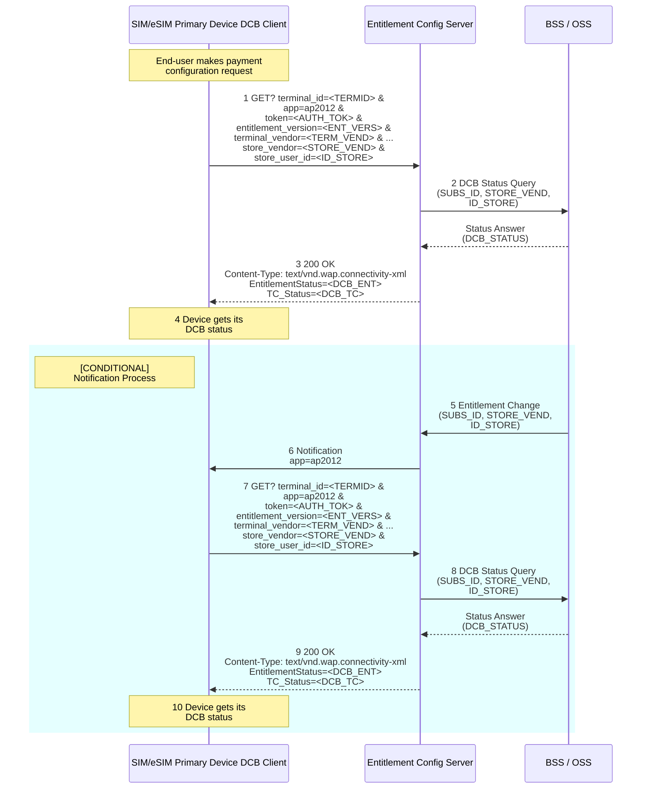
```mermaid
sequenceDiagram
    participant Device as SIM/eSIM Primary Device DCB Client
    participant Server as Entitlement Config Server
    participant BSS as BSS / OSS

    Note over Device: End-user makes payment<br/>configuration request
    
    Device->>Server: 1 GET? terminal_id=<TERMID> &<br/>app=ap2012 &<br/>token=<AUTH_TOK> &<br/>entitlement_version=<ENT_VERS> &<br/>terminal_vendor=<TERM_VEND> & ...<br/>store_vendor=<STORE_VEND> &<br/>store_user_id=<ID_STORE>
    
    Server->>BSS: 2 DCB Status Query<br/>(SUBS_ID, STORE_VEND,<br/>ID_STORE)
    BSS-->>Server: Status Answer<br/>(DCB_STATUS)
    
    Server-->>Device: 3 200 OK<br/>Content-Type: text/vnd.wap.connectivity-xml<br/>EntitlementStatus=<DCB_ENT><br/>TC_Status=<DCB_TC>
    
    Note over Device: 4 Device gets its<br/>DCB status

    rect rgba(0, 255, 255, 0.1)
    Note left of Device: [CONDITIONAL]<br/>Notification Process
    
    BSS->>Server: 5 Entitlement Change<br/>(SUBS_ID, STORE_VEND,<br/>ID_STORE)
    
    Server->>Device: 6 Notification<br/>app=ap2012
    
    Device->>Server: 7 GET? terminal_id=<TERMID> &<br/>app=ap2012 &<br/>token=<AUTH_TOK> &<br/>entitlement_version=<ENT_VERS> &<br/>terminal_vendor=<TERM_VEND> & ...<br/>store_vendor=<STORE_VEND> &<br/>store_user_id=<ID_STORE>
    
    Server->>BSS: 8 DCB Status Query<br/>(SUBS_ID, STORE_VEND,<br/>ID_STORE)
    BSS-->>Server: Status Answer<br/>(DCB_STATUS)
    
    Server-->>Device: 9 200 OK<br/>Content-Type: text/vnd.wap.connectivity-xml<br/>EntitlementStatus=<DCB_ENT><br/>TC_Status=<DCB_TC>
    
    Note over Device: 10 Device gets its<br/>DCB status
    end
```

<center>Figure 55. DCB Entitlement Request Flow and Notification Update</center>


TS.43 v12.0 Page 193 of 248

GSM Association
Non-confidential
Official Document TS.43 - Service Entitlement Configuration


### 11.4.2 DCB Entitlement Request with user Interaction

Figure 56 explains how the user could interact with backend systems (through Websheets or Device GUI) to Accept or Reject, for example, some Terms&Conditions. Based on the ECS response (step 3), device will decide what's the preferred option: Websheets (steps 4 to 7) or through Device GUI (steps 8 to 11).


TS.43 v12.0
Page 194 of 248

GSM Association
Non-confidential
Official Document TS.43 - Service Entitlement Configuration


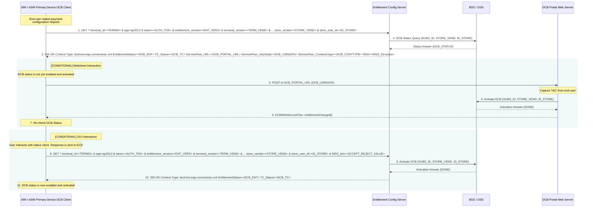
```mermaid
sequenceDiagram
    participant DCB as SIM / eSIM Primary Device DCB Client
    participant ECS as Entitlement Config Server
    participant BSS as BSS / OSS
    participant Portal as DCB Portal Web Server

    Note over DCB: End-user makes payment<br/>configuration request
    DCB->>ECS: 1. GET ? terminal_id=<TERMID> & app=ap2012 & token=<AUTH_TOK> & entitlement_version=<ENT_VERS> & terminal_vendor=<TERM_VEND> & ... store_vendor=<STORE_VEND> & store_user_id=<ID_STORE>
    ECS->>BSS: 2. DCB Status Query (SUBS_ID, STORE_VEND, ID_STORE)
    BSS-->>ECS: Status Answer (DCB_STATUS)
    ECS-->>DCB: 3. 200 OK Content-Type: text/vnd.wap.connectivity-xml EntitlementStatus=<DCB_ENT> TC_Status=<DCB_TC> ServiceFlow_URL=<DCB_PORTAL_URL> ServiceFlow_UserData=<DCB_USRDATA> ServiceFlow_ContentsType=<DCB_CONTTYPE> MSG=<MSG_Structure>

    rect rgba(0, 128, 128, 0.05)
        Note right of DCB: [CONDITIONAL] Websheet Interaction
        Note over DCB: DCB status is not yet enabled and activated
        DCB->>Portal: 4. POST to DCB_PORTAL_URL (DCB_USRDATA)
        Note over Portal: Capture T&C from end-user
        Portal->>BSS: 5. Activate DCB (SUBS_ID, STORE_VEND, ID_STORE)
        BSS-->>Portal: Activation Answer (DONE)
        Portal-->>DCB: 6. DCBWebServiceFlow: entitlementChanged()
        Note over DCB: 7. Re-check DCB Status
    end

    rect rgba(0, 128, 128, 0.05)
        Note right of DCB: [CONDITIONAL] GUI Interaction
        Note over DCB: User interacts with native client. Response is sent to ECS
        DCB->>ECS: 8. GET ? terminal_id=<TERMID> & app=ap2012 & token=<AUTH_TOK> & entitlement_version=<ENT_VERS> & terminal_vendor=<TERM_VEND> & ... store_vendor=<STORE_VEND> & store_user_id=<ID_STORE> & MSG_btn=<ACCEPT_REJECT_VALUE>
        ECS->>BSS: 9. Activate DCB (SUBS_ID, STORE_VEND, ID_STORE)
        BSS-->>ECS: Activation Answer (DONE)
        ECS-->>DCB: 10. 200 OK Content-Type: text/vnd.wap.connectivity-xml EntitlementStatus=<DCB_ENT> TC_Status=<DCB_TC>
        Note over DCB: 11. DCB status is now enabled and activated
    end
```

Figure 56. Entitlement Request Flow with User Interaction (Websheet or GUI)


TS.43 v12.0
Page 195 of 248

GSM Association
Non-confidential
Official Document TS.43 - Service Entitlement Configuration


## 11.5 DCB Request/Responses examples

### 11.5.1 Initial Requests
Initial request can use GET or POST methods.

Table 98 presents a sample HTTP GET request for DCB entitlement with the parameters located in the HTTP query string.

```
GET ? terminal_id = 013787006099944&
token = es7w1erXjh%2FEC%2FP8BV44SBmVipg&
terminal_vendor = TVENDOR&
terminal_model = TMODEL&
terminal_sw_version = TSWVERS&
entitlement_version = ENTVERS&
app = ap2012&
store_vendor=STORE_VEND&
store_user_id=<STORE_USR>&
vers = 1 HTTP/1.1

Host: entitlement.telco.net:9014
User-Agent: PRD-TS43 TVENDOR/TMODEL IMS-Entitlement/TSWVERS OS-Android/8.0
Accept: text/html,application/xhtml+xml,application/xml;q=0.9,*/*;q=0.8
Accept-Language: en-US,en;q=0.5
Accept-Encoding: gzip, deflate
Connection: keep-alive
```
Table 98. Example of an HTTP GET Entitlement Configuration Request for DCB

Table 99 presents a sample HTTP POST request for DCB entitlement with the parameters located in the HTTP message body.

```
POST / HTTP/1.1
Host: entitlement.telco.net:9014
User-Agent: PRD-TS43 TVENDOR/TMODEL IMS-Entitlement/TSWVERS OS-Android/8.0Accept:
text/html,application/xhtml+xml,application/xml;q=0.9,*/*;q=0.8
Accept-Language: en-US,en;q=0.5
Accept-Encoding: gzip, deflate
Connection: keep-alive
Content-Type: application/json

{
    "terminal_id" : "013787006099944",
    "entitlement_version" : "ENTVERS",
    "token" : "es7w1erXjh%2FEC%2FP8BV44SBmVipg",
    "terminal_vendor" : "TVENDOR",
    "terminal_model" : "TMODEL",
    "terminal_sw_version" : "TSWVERS",
    "app" : "ap2012",
    "store_vendor" : "STORE_VEND",
    "store_user_id" : "STORE_USR",
    "vers" : "1"
}
```
Table 99. Example of an HTTP POST Entitlement Configuration Request for DCB

### 11.5.2 Initial Responses
Table 100 presents an example for a returned DCB entitlement configuration in XML format where entitlement is enabled, and T&C is not required.


TS.43 v12.0
Page 196 of 248

GSM Association
Non-confidential
Official Document TS.43 - Service Entitlement Configuration


```xml
<?xml version="1.0"?>
<wap-provisioningdoc version="1.1">
  <characteristic type="VERS"
    <parm name="version" value="1"/>
    <parm name="validity" value="172800"/>
  </characteristic>
  <characteristic type="TOKEN">
    <parm name="token" value="ASH127AHHA88SF"/>
  </characteristic>
  <characteristic type="APPLICATION">
    <parm name="AppID" value="ap2012"/>
    <parm name="EntitlementStatus" value="1"/>
    <parm name="TC_Status" value="2"/>
  </characteristic>
</wap-provisioningdoc>
```

*Table 100. DCB configuration response in XML format example where DCB is enabled, and T&C is not required.*

Table 101 presents an example for a returned Data Plan Information entitlement configuration in JSON format where entitlement is enabled, and T&C is not required.

```json
{
  "Vers" : {
    "version" : "1",
    "validity" : "172800"
  },
  "Token" : {              // Optional
    "token" : "ASH127AHHA88SF"
  },
  "ap2012": {              // DCB Entitlement settings
    "EntitlementStatus" : 1,
    "TC_Status" : 2
  }
}
```

*Table 101. DCB configuration response in JSON format example where DCB is enabled, and T&C is not required.*

Table 102 presents an example for a returned DCB entitlement configuration in XML format where entitlement is enabled, and T&C is available.

```xml
<?xml version="1.0"?>
<wap-provisioningdoc version="1.1">
  <characteristic type="VERS"
    <parm name="version" value="1"/>
    <parm name="validity" value="172800"/>
  </characteristic>
  <characteristic type="TOKEN">
    <parm name="token" value="ASH127AHHA88SF"/>
  </characteristic>
  <characteristic type="APPLICATION">
    <parm name="AppID" value="ap2012"/>
    <parm name="EntitlementStatus" value="1"/>
    <parm name="TC_Status" value="1"/>
  </characteristic>
</wap-provisioningdoc>
```

*Table 102. DCB configuration response in XML format example where DCB is enabled, and T&C is available.*


TS.43 v12.0
Page 197 of 248

GSM Association Non-confidential
Official Document TS.43 - Service Entitlement Configuration


Table 103 presents an example for a returned DCB entitlement configuration in JSON format where entitlement is enabled, and T&C is available.

```json
{
  "Vers" : {
    "version" : "1",
    "validity" : "172800"
  },
  "Token" : {              // Optional
    "token" : "ASH127AHHA88SF"
  },
  "ap2012": {              // DCB Entitlement settings
    "EntitlementStatus" : 1,
    "TC_Status" : 1
  }
}
```

Table 103. DCB configuration response in JSON format example where DCB is enabled, and T&C is available.

Table 104 presents an example for a returned DCB entitlement configuration in XML format where DCB entitled and T&C Status "NOT AVAILABLE" and ECS provides both, Websheets and GUI, options to interact with the user. `TC_Operation=1` identifies that Websheet is the preferred one for the carrier.

```xml
<?xml version="1.0"?>
<wap-provisioningdoc version="1.1">
  <characteristic type="VERS">
    <parm name="version" value="1"/>
    <parm name="validity" value="172800"/>
  </characteristic>
  <characteristic type="TOKEN">
    <parm name="token" value="ASH127AHHA88SF"/>
  </characteristic>
  <characteristic type="APPLICATION">
    <parm name="AppID" value="ap2012"/>
    <parm name="EntitlementStatus" value="1"/>
    <parm name="TC_Status" value="0"/>
    <parm name="TC_Operation" value="1"/>
    <parm name="ServiceFlow_URL" value=" https://www.MNO.org/termsAndCons"/>
    <parm name="ServiceFlow_UserData" value="encodedValue=eyJpbXNpIjo...OiJ"/>
    <parm name="ServiceFlow_ContentsType" value="json"/>
    <characteristic type="MSG">
      <parm name="title" value="Terms and Conditions"/>
      <parm name="message" value="Are you agree with ..."/>
      <parm name="Accept_btn" value="1"/>
      <parm name="Reject_btn" value="0"/>
    </characteristic>
  </characteristic>
</wap-provisioningdoc>
```

Table 104. DCB configuration response in XML format example providing Websheet and GUI parameters.

Table 105 presents an example for a returned DCB entitlement configuration in XML format where DCB entitled and T&C Status "NOT AVAILABLE" and ECS provides both, Websheets and GUI, options to interact with the user. `TC_Operation=2` identifies that GUI is the preferred one for the carrier.


TS.43 v12.0 Page 198 of 248

GSM Association
Non-confidential
Official Document TS.43 - Service Entitlement Configuration


```json
{
  "Vers" : {
    "version" : "1",
    "validity" : "172800"
  },
  "Token" : {              // Optional
    "token" : "ASH127AHHA88SF"
  },
  "ap2012": {              // DCB Entitlement settings
    "EntitlementStatus": 1,
    "TC_Status" : 0,
    "TC_Operation" : 1,
    "ServiceFlow_URL": "https://www.MNO.org/termsAndCons",
    "ServiceFlow_UserData": "encodedValue=eyJpbXNpIjo...OiJ",
    "ServiceFlow_ContentsType": "json"
    "MSG": {
      "title": "Terms and Conditions",
      "message": "Are you agree with ...",
      "Accept_btn": 1,
      "Reject_btn": 0
    }
  }
}
```

*Table 105. DCB configuration response in JSON format example providing Websheet and GUI parameters.*

Table 106 presents an example for a returned DCB entitlement configuration in XML format where entitlement is incompatible.

```xml
<?xml version="1.0"?>
<wap-provisioningdoc version="1.1">
  <characteristic type="VERS"
    <parm name="version" value="1"/>
    <parm name="validity" value="172800"/>
  </characteristic>
  <characteristic type="TOKEN">
    <parm name="token" value="ASH127AHHA88SF"/>
  </characteristic>
  <characteristic type="APPLICATION">
    <parm name="AppID" value="ap2012"/>
    <parm name="EntitlementStatus" value="2"/>
    <parm name="MessageForIncompatible" value="Sorry your MNO have no Carrier Billing"/>
  </characteristic>
</wap-provisioningdoc>
```

*Table 106. DCB configuration response in XML format example where DCB is incompatible.*

Table 107 presents an example for a returned DCB entitlement configuration in JSON format where entitlement is incompatible.


TS.43 v12.0
Page 199 of 248

GSM Association
Non-confidential
Official Document TS.43 - Service Entitlement Configuration


```json
{
  "Vers" : {
       "version" : "1",
       "validity" : "172800"
  },
  "Token" : {          // Optional
       "token" : "ASH127AHHA88SF"
  },
  "ap2012": {             // DCB Entitlement settings
       "EntitlementStatus" : 2,
       "MessageForIncompatible" : "Sorry your MNO have no Carrier Billing"
  }
}
```

*Table 107. DCB configuration response in JSON format example where DCB is incompatible.*

Table 108 presents an example for a returned DCB entitlement configuration in XML format where DCB not entitled, and service flow required.

```xml
<?xml version="1.0"?>
<wap-provisioningdoc version="1.1">
  <characteristic type="VERS">
       <parm name="version" value="1"/>
       <parm name="validity" value="172800"/>
  </characteristic>
  <characteristic type="TOKEN">
       <parm name="token" value="ASH127AHHA88SF"/>
  </characteristic>
  <characteristic type="APPLICATION">
       <parm name="AppID" value="ap2012"/>
       <parm name="EntitlementStatus" value="0"/>
       <parm name="TC_Status" value="0"/>
       <parm name="TC_Operation" value="1"/>
       <parm name="ServiceFlow_URL" value="https://www.MNO.org/entDisabled"/>
       <parm name="ServiceFlow_UserData" value="encodedValue=eyJpbXNpIjo...OiJ"/>
       <parm name="ServiceFlow_ContentsType" value="json"/>
  </characteristic>
</wap-provisioningdoc>
```

*Table 108. DCB configuration response in XML format example where DCB not entitled, and service flow required.*

Table 109 presents an example for a returned DCB entitlement configuration in JSON format where DCB not entitled, and service flow required.


TS.43 v12.0
Page 200 of 248

GSM Association
Non-confidential
Official Document TS.43 - Service Entitlement Configuration


```json
{
    "Vers" : {
        "version" : "1",
        "validity" : "172800"
    },
    "Token" : {              // Optional
        "token" : "ASH127AHHA88SF"
    },
    "ap2012": {              // DCB Entitlement settings
        "EntitlementStatus": 0,
        "TC_Status": 0,
        "TC_Operation": 1;
        "ServiceFlow_URL": "https://www.MNO.org/entDisabled",
        "ServiceFlow_UserData": "encodedValue=eyJpbXNpIjo…OiJ",
        "ServiceFlow_ContentsType": "json"
    }
}
```

*Table 109. DCB configuration response in JSON format example where DCB not entitled, and service flow required.*

## 11.6 DCB Client Considerations around Web View Callbacks

### 11.6.1 entitlementChanged() Callback function

The `entitlementChanged()` callback function indicates that the DCB service flow ended properly between the device and DCB portal web server.

The web view to the end-user should be closed and the DCB client shall make a request for the latest DCB entitlement configuration status, via the proper TS.43 entitlement configuration request.

Based on the returned set of status parameters, the DCB client shall behave as specified in section 11.2

In Figure 55 shows, in step 6 how the `entitlementChanged()` callback function fits into the typical steps involved with DCB entitlement configuration.

### 11.6.2 dismissFlow() Callback function

The `dismissFlow()` callback function indicates that the DCB service flow ends prematurely, either caused by user action (DISMISS button for example) or by an error in the web sheet logic or from the network side.

As a result of the dismissal of the service flow, the DCB entitlement status has not been updated by the DCB portal.

The web view to the end-user should be closed and the DCB client should not make a request for the latest DCB entitlement configuration status.


TS.43 v12.0
Page 201 of 248

GSM Association
Non-confidential
Official Document TS.43 - Service Entitlement Configuration


# 12 Private User Identity

Private User Identity (from here on out Private UserID) use case allows devices to connect to Access Points using SIM-based authentication. EAP methods are used for this purpose.

As per the SIM-based EAP Authentication, the device needs to connect to the carrier network to perform to validate the credentials. For doing this, on the first ever connection to such a Wi-Fi network (for the EAP-Request/Identity & EAP-Response/Identity messages), the peer must provide its permanent subscriber identity information (IMSI) to the authenticator. This identity is sent in the clear.

This use case will not only solve the identity encryption for the first connection to the Wi-Fi network but also validate if a specific user is eligible or not to use this type of service.

Figure 57 presents the high-level architecture of the Private UserID use case.

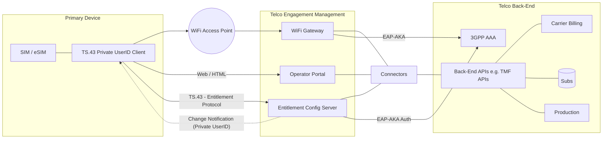
```mermaid
graph LR
    subgraph Primary_Device [Primary Device]
        SIM[SIM / eSIM] --- Client[TS.43 Private UserID Client]
    end

    subgraph Telco_Engagement_Management [Telco Engagement Management]
        WFGW[WiFi Gateway]
        OP[Operator Portal]
        ECS[Entitlement Config Server]
    end

    subgraph Telco_Back_End [Telco Back-End]
        CB[Carrier Billing]
        Subs[(Subs)]
        Prod[Production]
        AAA[3GPP AAA]
        BEAPIs[Back-End APIs e.g. TMF APIs]
    end

    WAP((WiFi Access Point))

    Client --> WAP
    WAP --> WFGW
    Client -- "Web / HTML" --> OP
    Client -- "TS.43 - Entitlement Protocol" --> ECS
    
    WFGW --- Connectors[Connectors]
    OP --- Connectors
    ECS --- Connectors
    
    Connectors --- BEAPIs
    BEAPIs --- CB
    BEAPIs --- Subs
    BEAPIs --- Prod
    
    ECS -- "EAP-AKA Auth" --> AAA
    WFGW -- "EAP-AKA" --> AAA
    
    ECS -. "Change Notification (Private UserID)" .-> Client
```

*Figure 57. Private User ID high-level architecture*

## 12.1 Private UserID entitlement parameters

Parameters for the Private UserID entitlement provide the overall status of the Private UserID service to the client, as well as the different sub-status associated with the activation procedure of the service.

The Private UserID entitlement parameters also include information associated with the web views presented to users by the Private UserID client during activation and management of the service.

### 12.1.1 Private UserID Entitlement Status

This is the parameter name and presence required in Private UserID.

*   `EntitlementStatus`: Mandatory

This parameter indicates the overall status of the Private UserID entitlement, stating if the service can be offered on the device, and if it can be activated or not by the end-user.

The different values for the Private UserID entitlement status are provided in Table 110


TS.43 v12.0
Page 202 of 248

GSM Association Non-confidential
Official Document TS.43 - Service Entitlement Configuration


<table>
  <thead>
    <tr>
        <th>Private UserID Entitlement parameter</th>
        <th>Type</th>
        <th>Values</th>
        <th>Description</th>
    </tr>
  </thead>
  <tbody>
    <tr>
        <td rowspan="3">EntitlementStatus (Mandatory)</td>
        <td rowspan="3">Integer</td>
        <td>0 - DISABLED</td>
        <td>Private UserID service not entitled</td>
    </tr>
    <tr>
        <td>1 - ENABLED</td>
        <td>Private UserID service entitled</td>
    </tr>
    <tr>
        <td>2 - INCOMPATIBLE</td>
        <td>Private UserID service cannot be offered</td>
    </tr>
  </tbody>
</table>
<center>Table 110. Entitlement Parameter - Private UserID Overall Status</center>

### 12.1.2 Private UserID Data
These are the parameters name and presence required in Private UserID for Encoded Data
* `PrivateUserID`: Conditional
* `PrivateUserIDType`: Mandatory if `PrivateUserID` is present.
* `PrivateUserIDExpiry`: Optional

The following parameters describe the information to be shared with the device. Initially, Private UserID use case only strictly requires **IMSI** (for EAP-AKA authentication) to be encoded, but there could be any other info as part of the `PrivateUserID` parameter if required by the WiFi Gateway.

<table>
  <thead>
    <tr>
        <th>Private UserID Entitlement parameter</th>
        <th>Type</th>
        <th>Values</th>
        <th>Description</th>
    </tr>
  </thead>
  <tbody>
    <tr>
        <td>PrivateUserID</td>
        <td>String</td>
        <td>Any valid string.<br/>It could be an empty string for the `PrivateUserIDType` =1</td>
        <td>Present if **EntitlementStatus** is “1”.<br/>Encoded information to be sent to the device for devices usage. See section 12.4 for special considerations.<br/>It is possible to provide the base64 encoding of the value by preceding it with `encodedValue=`</td>
    </tr>
    <tr>
        <td rowspan="2">PrivateUserIDType</td>
        <td rowspan="2">Integer</td>
        <td colspan="2">Defines the type of data includes in the `PrivateUserID` parameter.</td>
    </tr>
    <tr>
        <td>1 – PSEUDONYM</td>
        <td>Used when the `AT_NEXT_PSEUDONYM` in the EAP-Request/AKA-Challenge is defined as `PrivateUserID`.</td>
    </tr>
    <tr>
        <td>2 – OTHER</td>
        <td>Used when the content in the `PrivateUserID` parameter includes an encrypted data (including IMSI). For additional info see section 12.4</td>
        <td colspan="2"></td>
    </tr>
  </tbody>
</table>


TS.43 v12.0 Page 203 of 248

GSM Association
Non-confidential
Official Document TS.43 - Service Entitlement Configuration


<table>
  <thead>
    <tr>
        <th>Private UserID Entitlement parameter</th>
        <th>Type</th>
        <th>Values</th>
        <th>Description</th>
    </tr>
  </thead>
  <tbody>
    <tr>
        <td>PrivateUserIDExpiry (Optional)</td>
        <td>Time</td>
        <td>in ISO 8601 format, of the form YYYY-MM-DDThh:mm:ssTZD</td>
        <td>The time/date when the `PrivateUserID` expires and should be renewed by the device.</td>
    </tr>
  </tbody>
</table>
<center>Table 111. Entitlement Parameter – Private UserID Data</center>

**NOTE.-** There are some interactions in the end-to-end Private UserID Authentication flow, that are out of scope of this document (TS.43). Section 12.4 provides some considerations about how the info could be managed.

## 12.2 Private UserID Flows

Private UserID Flows don’t differ a lot from the VoWiFi or Direct Carrier Billing use cases.

Figure 58 shows an initial request (requiring a Full Authentication) where ECS interacts with the AAA. This flow is the standard one for a Full Authentication process as described in Figure 2 (2.8.1), but at the end of the flow, ECS will send the proper parameters for the Private UserID use case.


TS.43 v12.0
Page 204 of 248

GSM Association Non-confidential
Official Document TS.43 - Service Entitlement Configuration


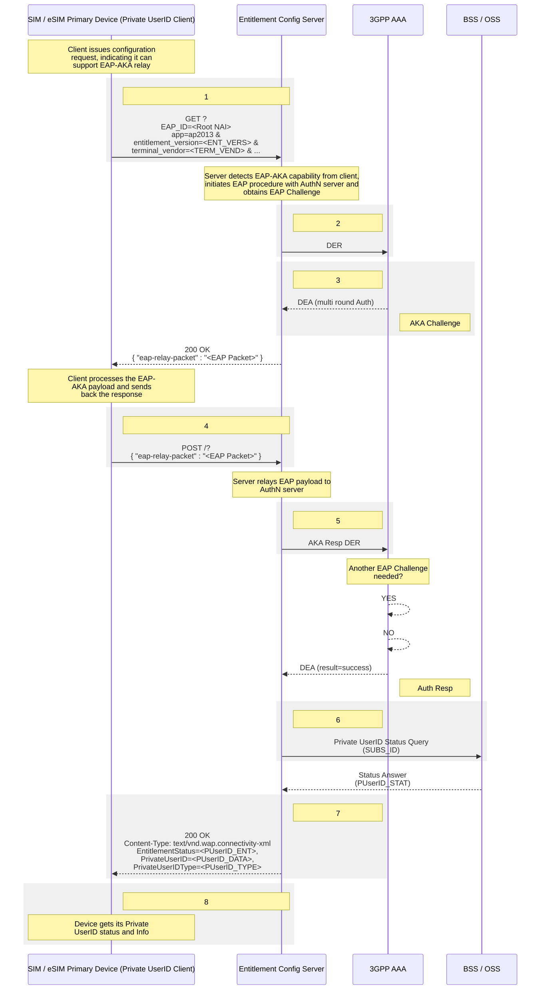
```mermaid
sequenceDiagram
    participant UE as SIM / eSIM Primary Device (Private UserID Client)
    participant ECS as Entitlement Config Server
    participant AAA as 3GPP AAA
    participant BSS as BSS / OSS

    Note over UE: Client issues configuration<br/>request, indicating it can<br/>support EAP-AKA relay

    rect rgb(240, 240, 240)
    Note right of UE: 1
    UE->>ECS: GET ?<br/>EAP_ID=<Root NAI><br/>app=ap2013 &<br/>entitlement_version=<ENT_VERS> &<br/>terminal_vendor=<TERM_VEND> & ...
    end

    Note over ECS: Server detects EAP-AKA capability from client,<br/>initiates EAP procedure with AuthN server and<br/>obtains EAP Challenge

    rect rgb(240, 240, 240)
    Note right of ECS: 2
    ECS->>AAA: DER
    end

    rect rgb(240, 240, 240)
    Note right of ECS: 3
    AAA-->>ECS: DEA (multi round Auth)
    Note right of AAA: AKA Challenge
    end

    ECS-->>UE: 200 OK<br/>{ "eap-relay-packet" : "<EAP Packet>" }

    Note over UE: Client processes the EAP-<br/>AKA payload and sends<br/>back the response

    rect rgb(240, 240, 240)
    Note right of UE: 4
    UE->>ECS: POST /?<br/>{ "eap-relay-packet" : "<EAP Packet>" }
    end

    Note over ECS: Server relays EAP payload to<br/>AuthN server

    rect rgb(240, 240, 240)
    Note right of ECS: 5
    ECS->>AAA: AKA Resp DER
    end

    Note over AAA: Another EAP Challenge<br/>needed?
    AAA-->>AAA: YES
    AAA-->>AAA: NO

    AAA-->>ECS: DEA (result=success)
    Note right of AAA: Auth Resp

    rect rgb(240, 240, 240)
    Note right of ECS: 6
    ECS->>BSS: Private UserID Status Query<br/>(SUBS_ID)
    end

    BSS-->>ECS: Status Answer<br/>(PUserID_STAT)

    rect rgb(240, 240, 240)
    Note right of ECS: 7
    ECS-->>UE: 200 OK<br/>Content-Type: text/vnd.wap.connectivity-xml<br/>EntitlementStatus=<PUserID_ENT>,<br/>PrivateUserID=<PUserID_DATA>,<br/>PrivateUserIDType=<PUserID_TYPE>
    end

    rect rgb(240, 240, 240)
    Note right of UE: 8
    Note over UE: Device gets its Private<br/>UserID status and Info
    end
```

*Figure 58. Private User ID Entitlement Request with Full Authentication*

Figure 59 shows the standard entitlement request for Private UserID (steps 1 to 4) when UE already has an authentication token. Additionally, it is added a refresh request triggered by an entitlement changed triggered by the carrier (steps 5 to 10).


TS.43 v12.0 Page 205 of 248

GSM Association
Official Document TS.43 - Service Entitlement Configuration
Non-confidential


```mermaid
sequenceDiagram
    participant SIM as SIM / eSIM
    participant Device as Primary Device<br/>Private UserID Client
    participant ECS as Entitlement Config Server
    participant AAA as 3GPP AAA
    participant BSS as BSS / OSS

    Note over SIM, AAA: AKA Full Authentication EAP-AKA AuthN
    
    Note over Device: Device makes Private UserID<br/>configuration request
    
    rect rgb(255, 255, 255)
    Note left of Device: 1
    Device->>ECS: GET ?<br/>terminal_id=&lt;TERMID&gt; &<br/>app=ap2013 &<br/>token=&lt;AUTH_TOK&gt; &<br/>entitlement_version=&lt;ENT_VERS&gt; &<br/>terminal_vendor=&lt;TERM_VEND&gt; & ...
    
    Note right of ECS: 2
    ECS->>BSS: Private UserID Status Query<br/>(SUBS_ID)
    BSS-->>ECS: Status Answer<br/>(PUserID_STAT)
    
    Note left of ECS: 3
    ECS-->>Device: 200 OK<br/>Content-Type: text/vnd.wap.connectivity-xml<br/>EntitlementStatus=&lt;PUserID_ENT&gt;,<br/>PrivateUserID=&lt;PUserID_DATA&gt;,<br/>PrivateUserIDType=&lt;PUserID_TYPE&gt;
    
    Note left of Device: 4
    Note over Device: Device gets its Private<br/>UserID status and Info<br/>Encoded
    end

    rect rgb(240, 255, 240)
    Note over Device, BSS: [CONDITIONAL] Notification Process
    
    Note right of BSS: 5
    BSS->>ECS: Entitlement Change<br/>(SUBS_ID)
    
    Note left of ECS: 6
    ECS->>Device: Notification<br/>app=ap2013
    
    Note left of Device: 7
    Device->>ECS: GET ?<br/>terminal_id=&lt;TERMID&gt; &<br/>app=ap2013 &<br/>token=&lt;AUTH_TOK&gt; &<br/>entitlement_version=&lt;ENT_VERS&gt; &<br/>terminal_vendor=&lt;TERM_VEND&gt; & ...
    
    Note right of ECS: 8
    ECS->>BSS: Private UserID Status Query<br/>(SUBS_ID)
    BSS-->>ECS: Status Answer<br/>(PUserID_STAT)
    
    Note left of ECS: 9
    ECS-->>Device: 200 OK<br/>Content-Type: text/vnd.wap.connectivity-xml<br/>EntitlementStatus=&lt;PUserID_ENT&gt;,<br/>PrivateUserID=&lt;PUserID_DATA&gt;,<br/>PrivateUserIDType=&lt;PUserID_TYPE&gt;
    
    Note left of Device: 10
    Note over Device: Device gets its Private<br/>UserID status and Info
    end
```

<center>Figure 59. Private User ID Entitlement Request Flow and Notification Update</center>

## 12.3 Private UserID Request/Responses examples

### 12.3.1 Initial Requests

Initial request can use GET or POST methods.

Table 112 presents a sample HTTP GET request for Private UserID entitlement with the parameters located in the HTTP query string.


TS.43 v12.0
Page 206 of 248

GSM Association
Non-confidential
Official Document TS.43 - Service Entitlement Configuration


```http
GET ? terminal_id = 013787006099944&
token = es7w1erXjh%2FEC%2FP8BV44SBmVipg&
terminal_vendor = TVENDOR&
terminal_model = TMODEL&
terminal_sw_version = TSWVERS&
entitlement_version = ENTVERS&
app = ap2013&
vers = 1 HTTP/1.1

Host: entitlement.telco.net:9014
User-Agent: PRD-TS43 TVENDOR/TMODEL IMS-Entitlement/TSWVERS OS-Android/8.0
Accept: text/html,application/xhtml+xml,application/xml;q=0.9,*/*;q=0.8
Accept-Language: en-US,en;q=0.5
Accept-Encoding: gzip, deflate
Connection: keep-alive
```

> Table 112. Example of an HTTP GET Entitlement Configuration Request for Private UserID

Table 113 presents a sample HTTP POST request for Private UserID entitlement with the parameters located in the HTTP message body.

```http
POST / HTTP/1.1
Host: entitlement.telco.net:9014
User-Agent: PRD-TS43 TVENDOR/TMODEL IMS-Entitlement/TSWVERS OS-Android/8.0Accept:
text/html,application/xhtml+xml,application/xml;q=0.9,*/*;q=0.8
Accept-Language: en-US,en;q=0.5
Accept-Encoding: gzip, deflate
Connection: keep-alive
Content-Type: application/json

{
    "terminal_id" : "013787006099944",
    "entitlement_version" : "ENTVERS",
    "token" : "es7w1erXjh%2FEC%2FP8BV44SBmVipg",
    "terminal_vendor" : "TVENDOR",
    "terminal_model" : "TMODEL",
    "terminal_sw_version" : "TSWVERS",
    "app" : "ap2013",
    "vers" : "1"
}
```

> Table 113. Example of an HTTP POST Entitlement Configuration Request for Private UserID

### 12.3.2 Initial Responses

Table 114 presents an example for a returned Private UserID entitlement configuration in XML format where entitlement is enabled.


TS.43 v12.0
Page 207 of 248

GSM Association
Non-confidential
Official Document TS.43 - Service Entitlement Configuration


```xml
<?xml version="1.0"?>
<wap-provisioningdoc version="1.1">
    <characteristic type="VERS"
        <parm name="version" value="1"/>
        <parm name="validity" value="172800"/>
    </characteristic>
    <characteristic type="TOKEN">
        <parm name="token" value="ASH127AHHA88SF"/>
    </characteristic>
    <characteristic type="APPLICATION">
        <parm name="AppID" value="ap2013"/>
        <parm name="EntitlementStatus" value="1"/>
        <parm name="PrivateUserID" value="RRHAXHQXFZivBlEOr2ZnlTbnn78xdrW5i"/>
        <parm name="PrivateUserIDType" value="2"/>
    </characteristic>
</wap-provisioningdoc>
```

*Table 114. Private UserID configuration response in XML format example where Private UserID is entitled.*

Table 115 presents an example for a returned Private UserID entitlement configuration in JSON format where entitlement is enabled.

```json
{
    "Vers" : {
        "version" : "1",
        "validity" : "172800"
    },
    "Token" : {        // Optional
        "token" : "ASH127AHHA88SF"
    },
    "ap2013": {        // Private UserID Entitlement settings
        "EntitlementStatus" : 1,
        "PrivateUserID" : "RRHAXHQXFZivBlEOr2ZnlTbnn78xdrW5i",
        "PrivateUserIDType" : "2"
    }
}
```

*Table 115. Private UserID configuration response in JSON format example where Private UserID is entitled.*

## 12.4 Private UserID - Special considerations

TS.43 document only defines how devices and ECS interacts each other, as part of and specific use case. It's out of scope of this document to describe in detail how the ECS interacts with the carrier backend or how the device manages the info received by the ECS to use a specific service.

For the Private UserID, it is necessary to bear in mind the following considerations.

*   In those cases where ECS is not able to provide `AT_NEXT_PSEUDONYM`, but the pseudonym usage (`PrivateUserIDType=1`) is the desired option, ECS will send an empty string as the `PrivateUserID` value, and the UE will be responsible to extract from `AT_ENCR_DATA` in the EAP-Request/AKA-Challenge.

*   IMSI encrypted value will be sent in the `AT_IDENTITY` parameter, as part of the EAP-AKA/Identity-Response. The size of this Identity must smaller than 1016 bytes as defined in [18].


TS.43 v12.0
Page 208 of 248

GSM Association
Non-confidential
Official Document TS.43 - Service Entitlement Configuration


*   ECS and WiFi Gateway must have an agreement in advance to know how to encrypt or decrypt the info. For simplicity it is recommended to use **JSON Web Tokens** (JWT) with **offline validation** to avoid overload in other systems. JWT are flexible enough to add more parameters without any big change. Encryption/Decryption and how the information is 'encapsulated' is out of scope of TS.43, but it is part of the E2E flow.

*   To avoid any type of interoperability issues, and to make sure that the UE and Authentication Server derive the same MK, the following should be implemented.
    *   `PrivateUserIDType=1`: Pseudonym will be used as Identity for deriving the MK = SHA1(Identity | IK | CK)
    *   `PrivateUserIDType=2`: IMSI will be used as Identity for deriving the MK = SHA1(Identity | IK | CK)

*   WiFi Gateway could implement their own Fast Re-Authentication process. This is out of scope of this document, and it is totally separate to the ECS Fast Authentication process defined in section 2.8.5.


TS.43 v12.0
Page 209 of 248

GSM Association
Non-confidential
Official Document TS.43 - Service Entitlement Configuration


# 13 Device and User Information

## 13.1 Phone Number Information
Phone Number (MSISDN) is one of the main subscription identifiers and it is required for multiple services. Although RCC.14 (reference [5]) implements the MSISDN parameter as part of the USER characteristic, this TS.43 specification provides additional alternatives to provide this information. These options are described in the following sections where the phone number could be requested by the primary device or by a different one (including an application server) which use a temporary token for validating the request.

In the case where the MSISDN should be encrypted, it is recommended to use base64 encoding, using `encodedValue` tag as described in Table 49. The procedure used to encrypt the MSISDN by ECS and decrypt by primary device or application server is out of scope of TS.43.

### 13.1.1 Phone Number Information from device
The device, as it does with other services like VoWiFi (section 3), VoCellular (section 4) or SMSoIP (section 5), will trigger a request to get MSISDN as part of its configuration. The main difference is that Phone Number is not considered as a specific service, so it doesn't require any specific entitlement validation.

Figure 60 presents the flow describing how the primary device triggers a `GetPhoneNumber` request. The steps are:

1. Authentication of the end-user by the SP's 3GPP AAA server is performed using proper EAP-AKA exchanges (see 2.8.1 for details).
2. The primary TS.43 client application makes a `GetPhoneNumber` request to the ECS.
3. ECS then queries the SP's back-end system managing the subscriptions to request the MSISDN assigned to the end-user.
   
   Otherwise, the ECS should reply with a 405 (see Table 13 for details) and end the flow there.
4. The SP's backend-end system answers to the ECS query, including the MSISDN in the case of a positive response.

The ECS generates a 200 OK response including the MSISDN and sends it to the device.


TS.43 v12.0
Page 210 of 248

GSM Association Non-confidential
Official Document TS.43 - Service Entitlement Configuration


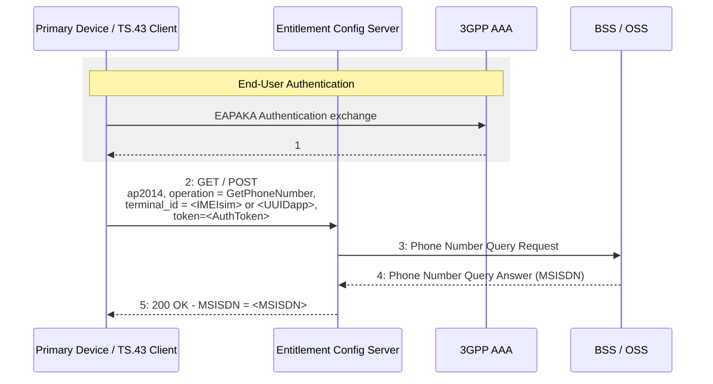
```mermaid
sequenceDiagram
    participant PD as Primary Device / TS.43 Client
    participant ECS as Entitlement Config Server
    participant AAA as 3GPP AAA
    participant BSS as BSS / OSS

    rect rgb(240, 240, 240)
    Note over PD, AAA: End-User Authentication
    PD->>AAA: EAPAKA Authentication exchange
    AAA-->>PD: 1
    end

    PD->>ECS: 2: GET / POST<br/>ap2014, operation = GetPhoneNumber,<br/>terminal_id = <IMEIsim> or <UUIDapp>,<br/>token=<AuthToken>
    ECS->>BSS: 3: Phone Number Query Request
    BSS-->>ECS: 4: Phone Number Query Answer (MSISDN)
    ECS-->>PD: 5: 200 OK - MSISDN = <MSISDN>
```

<center>Figure 60. Phone Number Information from Primary Device</center>

### 13.1.2 Phone Number Information through Application Server

The following presents the case where:

* The Primary ODSA client application is allowed for the type of primary device and enabled for the end-user (entitled).
* The Application Server can receive TemporaryToken from the ODSA client.
* The Application Server is authorized by the Entitlement Configuration Server to execute GET PHONE NUMBER operations on behalf of the ODSA client, using a TemporaryToken.

Figure 61 presents a call flow where the Application Server requests a Phone Number from the ECS on behalf of the ODSA client, using a TemporaryToken. Authentication (e.g. EAP-AKA, SMS-OTP) is performed before starting this procedure described in Figure 61.

1. Authentication of the end-user by the SP's 3GPP AAA server is performed using proper EAP-AKA exchanges (see 2.8.1 for details).
2. The Primary ODSA client application makes an **AcquireTemporaryToken** request to the ECS for a GetPhoneNumber operation target.
3. The ECS generates a 200 OK response with a `TemporaryToken`, a `TemporaryTokenExpiry` and the allowed GetPhoneNumber target operation.
4. The Primary ODSA client application sends the `TemporaryToken` alongside with the `TemporaryTokenExpiry` to the Application Server.
   Note that the communication between the device (client) and the application server is outside the scope of TS.43 and it only appears in the flow as 'Informative'.

If Server to Server authentication mechanism is implemented, it should be necessary to follow step 5, otherwise move directly to step 6:

5. <u>Optional</u> - The Application Server requests an Access Token to the Authorization Server controlling the access to the ECS.
6. The Application Server makes a **GetPhoneNumber** request to the ECS, including the `TemporaryToken` in the parameters, while also ensuring the


TS.43 v12.0 Page 211 of 248

GSM Association
Non-confidential
Official Document TS.43 - Service Entitlement Configuration


`TemporaryTokenExpiry` has not been exceeded. **Optional** - In the case where a Server-to-Server authentication is required, the latest and still valid `access_token` and `requestor_id` are to be included in the request.
7. The ECS authenticates the **GetPhoneNumber** request based on the `TemporaryToken` and evaluates if the requested operation is authorized. This evaluation could be based on various information such as `requestor_id` or device info in request parameters.
If the operation is authorized, the ECS then queries the SP’s back-end system managing the subscriptions to request the MSISDN assigned to the end-user. Otherwise, the ECS should reply with a 403 (see 2.8.6 for details) and end the flow there.
8. The SP’s backend-end system answers to the ECS query, including the `MSISDN` in the case of a positive response.

The ECS generates a 200 OK response including the `MSISDN` and sends it to the Application Server.

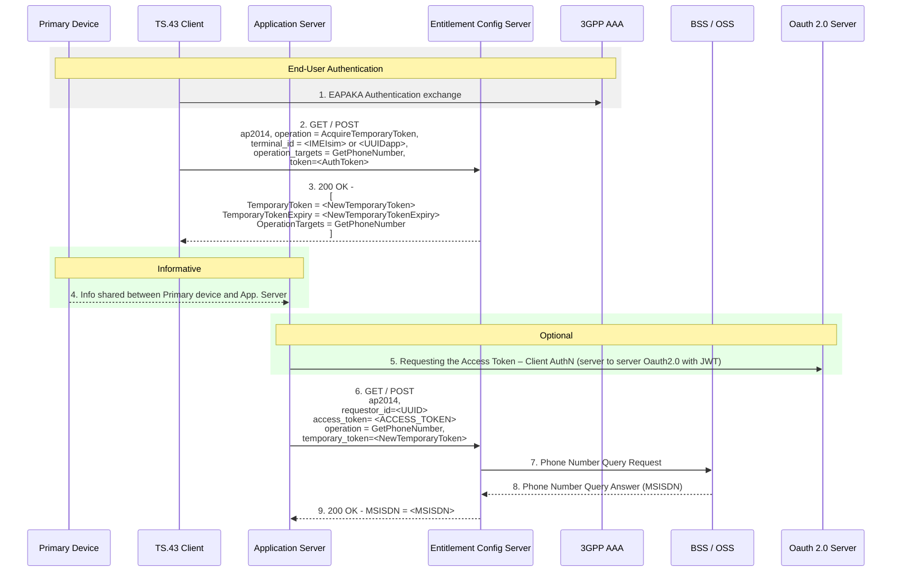
```mermaid
sequenceDiagram
    participant PD as Primary Device
    participant TC as TS.43 Client
    participant AS as Application Server
    participant ECS as Entitlement Config Server
    participant AAA as 3GPP AAA
    participant BSS as BSS / OSS
    participant OA as Oauth 2.0 Server

    rect rgb(240, 240, 240)
    Note over PD, AAA: End-User Authentication
    TC->>AAA: 1. EAPAKA Authentication exchange
    end

    TC->>ECS: 2. GET / POST<br/>ap2014, operation = AcquireTemporaryToken,<br/>terminal_id = <IMEIsim> or <UUIDapp>,<br/>operation_targets = GetPhoneNumber,<br/>token=<AuthToken>
    ECS-->>TC: 3. 200 OK -<br/>[<br/>TemporaryToken = <NewTemporaryToken><br/>TemporaryTokenExpiry = <NewTemporaryTokenExpiry><br/>OperationTargets = GetPhoneNumber<br/>]

    rect rgb(230, 255, 230)
    Note over PD, AS: Informative
    PD-->>AS: 4. Info shared between Primary device and App. Server
    end

    rect rgb(230, 255, 230)
    Note over AS, OA: Optional
    AS->>OA: 5. Requesting the Access Token – Client AuthN (server to server Oauth2.0 with JWT)
    end

    AS->>ECS: 6. GET / POST<br/>ap2014,<br/>requestor_id=<UUID><br/>access_token= <ACCESS_TOKEN><br/>operation = GetPhoneNumber,<br/>temporary_token=<NewTemporaryToken>
    ECS->>BSS: 7. Phone Number Query Request
    BSS-->>ECS: 8. Phone Number Query Answer (MSISDN)
    ECS-->>AS: 9. 200 OK - MSISDN = <MSISDN>
```

<center>Figure 61. Phone Number Information through Application Server</center>

## 13.2 Phone Number Verification

There could be some scenarios where device, 3<sup>rd</sup> party application or Application server, would need to verify that the phone number (MSISDN) it has, it’s the right one. For doing this


TS.43 v12.0
Page 212 of 248

GSM Association
Non-confidential
Official Document TS.43 - Service Entitlement Configuration


operation, instead of pulling (getting) the information (MSISDN) from the ECS, it will be pushed for validation.

ECS will validate that the MSISDN included in the `msisdn` parameter for the `VerifyPhoneNumber` operation, is the same phone number that the one associated to the authentication method belonging to the device.

This Authentication method could be any of the ones described in this document (EAP-AKA, OIDC, SMS OTP ..., see section 2.8 for detailed info) or any other token derived from that Authentication (for example TemporaryToken).

Figure 62 presents a call flow where the device (could be also a 3<sup>rd</sup> Party App installed in the device) requests a Phone Number Verification with a token acquired after some of the AuthN methods.

1. Device (or 3<sup>rd</sup> Party App) performs the Authentication (any of the supported by TS.43) and receives an Authentication Token from ECS.
2. Device (or 3<sup>rd</sup> Party App) sends `VerifyPhoneNumber` request including the MSISDN for validation.
3. ECS, using the token, gets the device identifier and interacts with the backend to get the MSISDN associated to that identifier.
4. Backend provides the MSISDN requested by ECS.
5. ECS compares the MSISDN receive by the backend with the one in the request.
6. ECS sends the result of the comparation to the device. Optionally, and if the validation is success, ECS can send the MSISDN that have been validated.

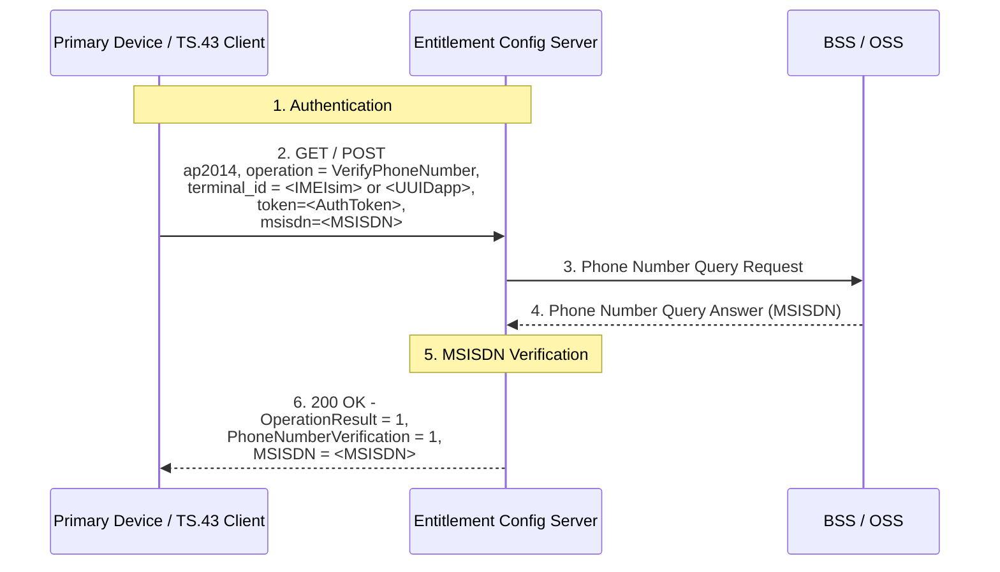
```mermaid
sequenceDiagram
    participant D as Primary Device / TS.43 Client
    participant ECS as Entitlement Config Server
    participant BSS as BSS / OSS

    Note over D, ECS: 1. Authentication
    D->>ECS: 2. GET / POST<br/>ap2014, operation = VerifyPhoneNumber,<br/>terminal_id = <IMEIsim> or <UUIDapp>,<br/>token=<AuthToken>,<br/>msisdn=<MSISDN>
    ECS->>BSS: 3. Phone Number Query Request
    BSS-->>ECS: 4. Phone Number Query Answer (MSISDN)
    Note over ECS: 5. MSISDN Verification
    ECS-->>D: 6. 200 OK -<br/>OperationResult = 1,<br/>PhoneNumberVerification = 1,<br/>MSISDN = <MSISDN>
```

<center>Figure 62. PhoneNumber Verification Flow</center>

### 13.3 Subscriber Information

Subscriber information includes Phone Number (MSISDN) which is one of the main subscription identifiers as well as other information such as identifiers for the SIM, identifiers for the MVNO etc. This TS.43 specification provides an alternative to provide this information


TS.43 v12.0
Page 213 of 248

GSM Association
Non-confidential
Official Document TS.43 - Service Entitlement Configuration


that could be requested by an application server which uses a temporary token for validating the request.

### 13.3.1 Subscriber Information through Application Server

The following presents the case where:

*   The Primary ODSA client application is allowed for the type of primary device and enabled for the end-user (entitled).
*   The Application Server can receive TemporaryToken from the ODSA client.
*   The Application Server is authorised by the Entitlement Configuration Server to execute `GetSubscriberInfo` operations on behalf of the ODSA client, using a TemporaryToken.

Figure 63 presents a call flow where the Application Server requests Subscriber Information from the ECS on behalf of the ODSA client, using a TemporaryToken. Authentication (e.g. EAP-AKA) is performed before starting this procedure, as described in Figure 61.

1.  Authentication of the end-user by the SP's 3GPP AAA server is performed using proper EAP-AKA exchanges (see 2.8.1 for details).
2.  The Primary ODSA client application makes an **AcquireTemporaryToken** request to the ECS for a **GetSubscriberInfo** operation target.
3.  The ECS generates a 200 OK response with a TemporaryToken, a TemporaryTokenExpiry and the allowed target operation.
4.  The Primary ODSA client application sends the TemporaryToken alongside with the TemporaryTokenExpiry to the Application Server.

    Note that the communication between the device (client) and the Application Server is outside the scope of TS.43 and it only appears in the flow as 'Informative'.

If Server to Server authentication mechanism is implemented, it should be necessary to follow step 5, otherwise move directly to step 6:

5.  <u>Optional</u> - The Application Server requests an Access Token to the Authorization Server controlling the access to the ECS.
6.  The Application Server makes a **GetSubscriberInfo** request to the ECS, including the TemporaryToken in the parameters, while also ensuring the TemporaryTokenExpiry has not been exceeded. <u>Optional</u> - In the case where a Server-to-Server authentication is required, the latest and still valid access_token and requestor_id are to be included in the request.
7.  The ECS authenticates the **GetSubscriberInfo** request based on the TemporaryToken and evaluates if the requested operation is authorized. This evaluation could be based on various information such as requestor_id or device info in request parameters.


TS.43 v12.0
Page 214 of 248

GSM Association
Non-confidential
Official Document TS.43 - Service Entitlement Configuration


If the operation is authorized, the ECS then queries the SP’s back-end system managing the subscriptions to request the Subscriber Information for the end-user.

Otherwise, the ECS should reply with a 403 (see 2.8.6 for details) and end the flow there.

8. The SP’s backend-end system answers to the ECS query in the case of a positive response.

The ECS generates a 200 OK response including the parameters detailed in section 6.5.X and sends it to the Application Server.

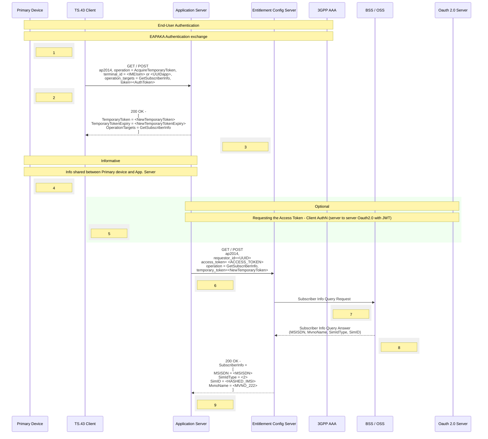
```mermaid
sequenceDiagram
    participant PD as Primary Device
    participant TC as TS.43 Client
    participant AS as Application Server
    participant ECS as Entitlement Config Server
    participant AAA as 3GPP AAA
    participant BSS as BSS / OSS
    participant OA as Oauth 2.0 Server

    Note over PD, AAA: End-User Authentication
    Note over PD, AAA: EAPAKA Authentication exchange
    rect rgb(240, 240, 240)
    Note right of PD: 1
    end

    TC->>AS: GET / POST<br/>ap2014, operation = AcquireTemporaryToken,<br/>terminal_id = <IMEIsim> or <UUIDapp>,<br/>operation_targets = GetSubscriberInfo,<br/>token=<AuthToken>
    rect rgb(240, 240, 240)
    Note right of PD: 2
    end
    
    AS-->>TC: 200 OK -<br/>[<br/>TemporaryToken = <NewTemporaryToken><br/>TemporaryTokenExpiry = <NewTemporaryTokenExpiry><br/>OperationTargets = GetSubscriberInfo<br/>]
    rect rgb(240, 240, 240)
    Note left of ECS: 3
    end

    Note over PD, AS: Informative
    Note over PD, AS: Info shared between Primary device and App. Server
    rect rgb(240, 240, 240)
    Note right of PD: 4
    end

    rect rgb(240, 255, 240)
    Note over AS, OA: Optional
    Note over AS, OA: Requesting the Access Token - Client AuthN (server to server Oauth2.0 with JWT)
    rect rgb(240, 240, 240)
    Note right of TC: 5
    end
    end

    AS->>ECS: GET / POST<br/>ap2014,<br/>requestor_id=<UUID><br/>access_token= <ACCESS_TOKEN><br/>operation = GetSubscriberInfo,<br/>temporary_token=<NewTemporaryToken>
    rect rgb(240, 240, 240)
    Note right of AS: 6
    end

    ECS->>BSS: Subscriber Info Query Request
    rect rgb(240, 240, 240)
    Note left of BSS: 7
    end

    BSS-->>ECS: Subscriber Info Query Answer<br/>(MSISDN, MvnoName, SimIdType, SimID)
    rect rgb(240, 240, 240)
    Note right of BSS: 8
    end

    ECS-->>AS: 200 OK -<br/>SubscriberInfo =<br/>[<br/>MSISDN = <MSISDN><br/>SimIdType = <2><br/>SimID = <HASHED_IMSI><br/>MvnoName = <MVNO_222><br/>]
    rect rgb(240, 240, 240)
    Note right of AS: 9
    end
```

Figure 63. Subscriber Information through Application Server


TS.43 v12.0
Page 215 of 248

GSM Association
Non-confidential
Official Document TS.43 - Service Entitlement Configuration


# 14 Device App authentication

This section describes different use cases where the operator provides a token to authenticate subscribers and/or applications installed in the subscriber's device.

*   Operator token use case
*   App token use case

For both cases:

*   A 3<sup>rd</sup> party application is installed on the device and is not capable of performing TS.43 functions.
*   The TS.43 client is able to call TS.43 methods, including EAP_AKA authentication.
*   The 3<sup>rd</sup> party App and the ECS previously exchanged a shared security information to enable authentication. This could be done directly between ECS and app-backend or with a dedicated partner management system e.g. as described in GSMA IDG specifications.
*   The 3<sup>rd</sup> party App is authorized to request app authentication from the TS.43 client via device-specific access control.
*   Note: ECS may implement additional features to enable enhanced access control mechanisms (e.g. Auth Server)

For these use cases the appID ap2015 is used in the requests.

## 14.1 Operator Token use case

The benefit of this procedure is that an app can gain SIM based authentication, without requiring access to the EAP-AKA token or the temporary_token, so that the security and integrity of the tokens is maintained.

Note.- When access_token (eligibility token in ASAC.01) is present in the request, it may be more efficient to validate this token in the first stage before executing the standard authentication actions (Full or Fast Authentication).

### 14.1.1 Device App authentication Request Parameters

For device App authentication, devices require additional parameters in the HTTP requests, outside of the ones described in 2.3 and 6.2. Table 116 presents the new parameters and their associated operations.

<table>
  <thead>
    <tr>
        <th>operation</th>
        <th>String</th>
        <th>AcquireOperatorToken</th>
        <th>Indicates the operation requested by the TS.43 client</th>
    </tr>
  </thead>
  <tbody>
    <tr>
        <td>New GET parameters app authentication</td>
        <td>Type</td>
        <td>Values</td>
        <td>Description</td>
    </tr>
    <tr>
        <td colspan="4"></td>
    </tr>
  </tbody>
</table>


TS.43 v12.0
Page 216 of 248

GSM Association Non-confidential
Official Document TS.43 - Service Entitlement Configuration


<table>
  <thead>
    <tr>
        <th>New GET parameters app authentication</th>
        <th></th>
        <th>Type</th>
        <th></th>
        <th>Values</th>
        <th></th>
        <th>Description</th>
        <th></th>
    </tr>
  </thead>
  <tbody>
    <tr>
        <td>access_token<br/>(optional)</td>
        <td rowspan="2">String</td>
        <td colspan="2">Used by the `AcquireOperatorToken` and `AcquireTemporaryToken` operation to verify the requesting application.<br/>This parameter is also used when consuming the `OperatorToken` through any of the operations described in section 14.1.6</td>
        <td colspan="4"></td>
    </tr>
    <tr>
        <td>[blank]</td>
        <td>Any string value</td>
        <td>Token based on pre-shared security information</td>
        <td colspan="4"></td>
    </tr>
    <tr>
        <td>client_id<br/>(conditional)</td>
        <td rowspan="2">String</td>
        <td colspan="2">Used by the `AcquireOperatorToken` operation to identify the requesting application. Used in combination with the `TemporaryToken` serving as secret for authentication.<br/>This parameter will be mandatory for `validateOperationToken` in case the user wants to validate **client_id** for a specific token. It could be used in combination (for validation) with `scope` parameter.</td>
        <td colspan="4"></td>
    </tr>
    <tr>
        <td>[blank]</td>
        <td>Any string value</td>
        <td>Identifier of the requesting application</td>
        <td colspan="4"></td>
    </tr>
    <tr>
        <td>scope<br/>(conditional)</td>
        <td rowspan="2">String</td>
        <td colspan="2">Used by the `AcquireOperatorToken` operation to indicate the access privileges being requested for `OperatorToken`. Used in combination with `client_id`.<br/>This parameter will be mandatory for `validateOperationToken` in case the user wants to validate **scope** for a specific token. It could be used in combination (for validation) with `client_id` parameter.</td>
        <td colspan="4"></td>
    </tr>
    <tr>
        <td>[blank]</td>
        <td>Any string value</td>
        <td>Indicates which access privileges are being requested for `OperatorToken`</td>
        <td colspan="4"></td>
    </tr>
    <tr>
        <td>msisdn<br/>(Conditional)</td>
        <td rowspan="2">String</td>
        <td colspan="2">Used by the `VerifyPhoneNumber` operation to compare this value with the one mapped to the token generated during the Authentication process.</td>
        <td colspan="4"></td>
    </tr>
    <tr>
        <td>[blank]</td>
        <td>MSISDN of the subscription in E.164 format.</td>
        <td>MSISDN to verify.</td>
        <td colspan="4"></td>
    </tr>
  </tbody>
</table>
<center>Table 116. New parameters for device app authentication</center>

### 14.1.2 AcquireOperatorToken Operation Configuration Parameters
* Parameter names and presence:
    * `OperatorToken`: Conditional. Operators token to allow authentication for a 3<sup>rd</sup> party application on the device that may not have the means to acquire token or temporary_token.
    * `OperatorTokenExpiry`: Conditional. Indicates the time the provided `OperatorToken` expires.
    * `OperatorTokenAuthURL`: Conditional. The URL to representing the endpoint when validating `OperatorToken`
    * `ClientID`: Conditional. ID identifying the requesting application.

The different values for the configuration parameters of the operation `AcquireOperatorToken` are provided in Table 117


TS.43 v12.0 Page 217 of 248

GSM Association
Non-confidential
Official Document TS.43 - Service Entitlement Configuration


<table>
  <thead>
    <tr>
        <th>“AcquireOperatorToken” configuration parameters</th>
        <th></th>
        <th>Type</th>
        <th></th>
        <th>Values</th>
        <th></th>
        <th>Description</th>
        <th></th>
    </tr>
  </thead>
  <tbody>
    <tr>
        <td>OperatorToken<br/>(Conditional)</td>
        <td>String</td>
        <td>Any string value</td>
        <td>This Operator token can be provided by the ECS if the requesting 3<sup>rd</sup> party application can be authenticated based on `ClientID` and `access_token`.<br/><br/>The operator token can be used by the 3<sup>rd</sup> party application to authenticate the device against the app backend.</td>
        <td colspan="4"></td>
    </tr>
    <tr>
        <td>OperatorTokenExpiry<br/>(Conditional)</td>
        <td>Timestamp</td>
        <td>ISO 8601 format, of the form YYYY-MM-DDThh:mm:ssTZD</td>
        <td>This UTC value provides the expiration time for the Operator token. After the time expiration the Operator token cannot be used for authentication.</td>
        <td colspan="4"></td>
    </tr>
    <tr>
        <td>OperatorTokenAuthURL<br/>(Conditional)</td>
        <td>String</td>
        <td>URL to validate OperatorToken</td>
        <td>URL representing the endpoint to validate the OperatorToken</td>
        <td colspan="4"></td>
    </tr>
    <tr>
        <td>ClientID<br/>(Conditional)</td>
        <td>String</td>
        <td>Any string value</td>
        <td>Identifies the app requesting the OperatorToken</td>
        <td colspan="4"></td>
    </tr>
  </tbody>
</table>
<center>Table 117. Configuration Parameters – AcquireOperatorToken ODSA Operation</center>

### 14.1.3 AcquireOperatorToken Request Example

Table 118 presents an example for the `AcquireOperatorToken` operation for an ODSA application.

```
GET ? terminal_id = 06170799658&
token = es7w1erXjh%2FEC%2FP8BV44SBmVipg&
terminal_vendor = TVENDOR&
terminal_model = TMODEL&
terminal_sw_version = TSWVERS&
entitlement_version = ENTVERS&
client_id = 08723459340765ß91&
scope = openid%20profile&
app = ap2015&
access_token = ab2d52xaix%2FEC%2FoMNs12Sammctz&
operation = AcquireOperatorToken&
vers = 1 HTTP/1.1

Host: entitlement.telco.net:9014
User-Agent: PRD-TS43 TVENDOR/TMODEL Primary-ODSA/TSWVERS OS-Android/8.0
Accept: text/html,application/xhtml+xml,application/xml;q=0.9,*/*;q=0.8
Accept-Language: en-US,en;q=0.5
Accept-Encoding: gzip, deflate
Connection: keep-alive
```
<center>Table 118. Example of an AcquireOperatorToken ODSA Request</center>


TS.43 v12.0
Page 218 of 248

GSM Association
Non-confidential
Official Document TS.43 - Service Entitlement Configuration


### 14.1.4 AcquireOperatorToken Response Example

Table 119 presents an example for the AcquireOperatorToken response in XML format to a Primary ODSA application. This response provides the TS.43 client with the `OperatorToken` to be used for an app authentication.

```xml
<?xml version="1.0"?>
<wap-provisioningdoc version="1.1">
    <characteristic type="VERS">
        <parm name="version" value="1"/>
        <parm name="validity" value="172800"/>
    </characteristic>

    <characteristic type="TOKEN">
        <parm name="token" value="ASH127AHHA88SF"/>
    </characteristic>

    <characteristic type="APPLICATION">
        <parm name="AppID" value="ap2015"/>
        <parm name="OperatorToken" value="A8daAd8ads7fau34789947kjhsfad;kjfh"/>
        <parm name="OperatorTokenExpiry" value="2019-01-29T13:15:31-08:00"/>
        <parm name="OperatorTokenAuthURL" value="http://verifyurl.example.net"/>
        <parm name="OperationResult" value="1"/>
        <parm name="ClientID" value="68485498622168489104"/>
    </characteristic>
</wap-provisioningdoc>
```

*Table 119. Example of an AcquireOperatorToken Response in XML*

### 14.1.5 Device App authentication with OperatorToken call flow.

Necessary preconditions for this use case:

1. ECS and App Backend exchanged information for OperatorToken encryption.
    * e.g. ECS uses Public Key of App Backend to encrypt OperatorToken. App-Backend can later decrypt OperatorToken with own private Key
2. ECS and App Backend exchanged information for access_token validation.
    * e.g. App Backend uses Public Key of ECS, and forwards information to the app-client on the device. Client can then use this information in the `access_token`

The workflow then follows as described in Figure 64:

3. The 3<sup>rd</sup> party App requests an Operator Token from the TS.43 client of the device
4. The TS.43 client initiates the EAP-AKA authentication procedure with the ECS, using `app_ID` ap2015.
5. Device and ECS perform EAP-AKA authentication as described in section 2.8.1.
6. The TS.43 requests a TemporaryToken, using the EAP-AKA token and the `access_token` of the 3<sup>rd</sup> party app. The `operation_target` should be AcquireOperatorToken.
7. The ECS validates the request including the identifiers and the AuthToken. The `access_token` is validated with the information shared between the ECS and the app_backend. Optionally the ECS can also verify the `access_token` with the 3<sup>rd</sup> party app backend. When successful, ECS creates the temporary_token.


TS.43 v12.0
Page 219 of 248

GSM Association
Non-confidential
Official Document TS.43 - Service Entitlement Configuration


8. ECS sends the AcquireTemporaryToken response including TemporaryToken, `TemporaryTokenExpiry` and the `OperationTargets` = "AcquireOperatorToken". The client stores the temporary_token in a secured space not accessible to 3<sup>rd</sup> party apps.
9. Client uses the temporary_token to acquire the OperatorToken. In the AcquireOperatorToken Request the client also provides the client_id, which uniquely identifies the app.  
If the client & ECS support encrypting all information in one token, steps 6, 7 and 8 are optional here.  
If steps 6, 7 and 8 are skipped the client should send the access_token in this step.
10. ECS validates the temporary_token together with the client_id. e.g. the ECS could use OAuth with client_id and temporary_token as secret. If successful, the ECS generates the `OperatorToken`
11. ECS sends AcquireOperatorToken response, including OperatorToken, OperatorTokenExpiry, OperatorTokenAuthURL & ClientID
12. TS.43 Client forwards the OperatorToken to the 3<sup>rd</sup> Party App
13. The 3<sup>rd</sup> Party App can use OperatorToken to authenticate at its own Backend Service. By using OperatorToken, the device is authenticated by the MNO based on the inserted SIM-Card

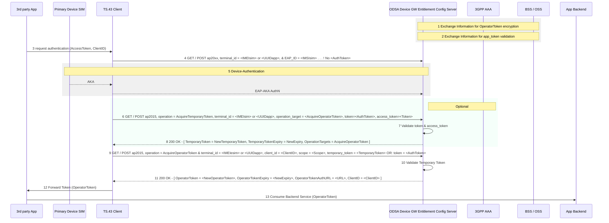
```mermaid
sequenceDiagram
    participant App as 3rd party App
    participant SIM as Primary Device SIM
    participant Client as TS.43 Client
    participant ECS as ODSA Device GW Entitlement Config Server
    participant AAA as 3GPP AAA
    participant BSS as BSS / OSS
    participant Backend as App Backend

    rect rgb(240, 240, 240)
    Note over ECS, BSS: 1 Exchange Information for OperatorToken encryption
    Note over ECS, BSS: 2 Exchange Information for app_token validation
    end

    App->>Client: 3 request authentication (AccessToken, ClientID)
    Client->>ECS: 4 GET / POST ap20xx, terminal_id = <IMEIsim> or <UUIDapp>, & EAP_ID = <IMSIsim> . . . ! No <AuthToken>
    
    rect rgb(240, 240, 240)
    Note over SIM, ECS: 5 Device-Authentication
    SIM-->>Client: AKA
    Client-->>ECS: EAP-AKA AuthN
    end

    rect rgb(245, 255, 250)
    Note right of ECS: Optional
    Client->>ECS: 6 GET / POST ap2015, operation = AcquireTemporaryToken, terminal_id = <IMEIsim> or <UUIDapp>, operation_target = <AcquireOperatorToken>, token=<AuthToken>, access_token=<Token>
    ECS->>ECS: 7 Validate token & access_token
    ECS-->>Client: 8 200 OK - [ TemporaryToken = NewTemporaryToken, TemporaryTokenExpiry = NewExpiry, OperationTargets = AcquireOperatorToken ]
    end

    Client->>ECS: 9 GET / POST ap2015, operation = AcquireOperatorToken & terminal_id = <IMEIesim> or <UUIDapp>, client_id = <ClientID>, scope = <Scope>, temporary_token = <TemporaryToken> OR: token = <AuthToken>
    ECS->>ECS: 10 Validate Temporary Token
    ECS-->>Client: 11 200 OK - [ OperatorToken = <NewOperatorToken>, OperatorTokenExpiry = <NewExpiry>, OperatorTokenAuthURL = <URL>, ClientID = <ClientID> ]

    Client->>App: 12 Forward Token (OperatorToken)
    App->>Backend: 13 Consume Backend Service (OperatorToken)
```


TS.43 v12.0
Page 220 of 248

GSM Association
Non-confidential
Official Document TS.43 - Service Entitlement Configuration


*Figure 64. App Authentication using OperatorToken.*

### 14.1.6 Operator Token Consumption

An **External Entity** (e.g. Application Server, etc.), may use the OperatorToken implementing new operations that will be specific for **ap2015**. These new operations are identified in Table 120.

It’s important to note that external entity could not be a terminal but a server, but, even so, in the request there will be some parameters referring to terminal_* present on the requests as part of the RCC.14 standard. For these mandatory parameters, it is recommended to use dummy values.

<table>
  <thead>
    <tr>
        <th>ValidateOperatorToken</th>
        <th>14.1.6.1</th>
        <th>Validates the operator token for a specific `client_id` and/or `scope`. <br/> This operation requires as part of the request, at least, one of the following parameters to be checked: client_id, scope.</th>
    </tr>
    <tr>
        <th>GetSubscriberDeviceInfo</th>
        <th>14.1.6.2</th>
        <th>Provides information related to the subscriber device that acquired the operator token.</th>
    </tr>
    <tr>
        <th>VerifyPhoneNumber</th>
        <th>14.1.7</th>
        <th>Verifies if the MSISDN provided in the request maps to the MSISDN from terminal_id belonging the token for Authentication.</th>
    </tr>
  </thead>
  <tbody>
    <tr>
        <td>“Operator Token” operations</td>
        <td>Section</td>
        <td>Description</td>
    </tr>
  </tbody>
</table>
*Table 120. Operations available for Operator Token usage*

Operations in Table 120 needs to be mapped to one or more scopes for validation. This scope definition is out of scope of TS.43 and should be the ECS (as it is the system generating the operator token) the one taking care of this mapping.

Using operations like the ones defined in Table 120 is similar, and the flow will follow the example as described in Figure 65, where:

1. The External Entity makes a request using the `operator_token` and for a specific `operation`.
2. ECS checks the validity of the `operator_token`. Validation could also require crosschecking with `requestor_id`.
3. Optional. Depending on the operation, ECS could require interacting with backend systems.
4. As a result, ECS will send the response containing the response parameters specific to the `operation`.


TS.43 v12.0
Page 221 of 248

GSM Association
Non-confidential
Official Document TS.43 - Service Entitlement Configuration


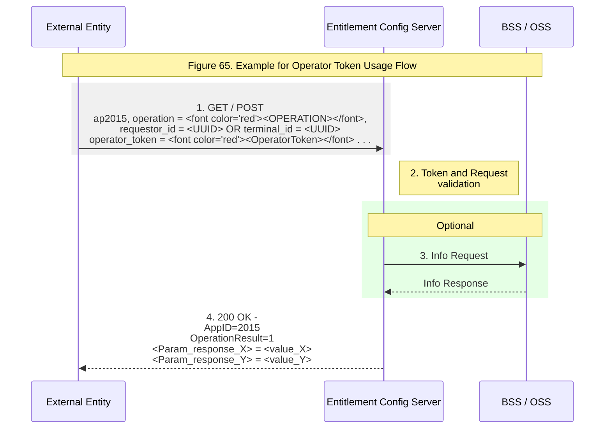
```mermaid
sequenceDiagram
    participant EE as External Entity
    participant ECS as Entitlement Config Server
    participant BO as BSS / OSS

    Note over EE, BO: Figure 65. Example for Operator Token Usage Flow

    rect rgb(240, 240, 240)
    EE->>ECS: 1. GET / POST<br/>ap2015, operation = <font color="red"><OPERATION></font>,<br/>requestor_id = <UUID> OR terminal_id = <UUID><br/>operator_token = <font color="red"><OperatorToken></font> . . .
    end
    
    Note right of ECS: 2. Token and Request<br/>validation

    rect rgba(0, 255, 0, 0.1)
    Note over ECS, BO: Optional
    ECS->>BO: 3. Info Request
    BO-->>ECS: Info Response
    end

    ECS-->>EE: 4. 200 OK -<br/>AppID=2015<br/>OperationResult=1<br/><Param_response_X> = <value_X><br/><Param_response_Y> = <value_Y>
```

<center>Figure 65. Example for Operator Token Usage Flow</center>

Application requests using operator token mainly differs in the operation parameter. Table 121 shows a generic example which could be applicable for any request.

```text
GET ? requestor_id = 06170799658&
terminal_vendor = TVENDOR&
terminal_model = TMODEL&
terminal_sw_version = TSWVERS&
entitlement_version = ENTVERS&
app = ap2015&
operator_token = <OPERATOR_TOKEN>&
operation = <OPERATION>&
scope= <SCOPE>&
access_token = <ACCESS_TOKEN>&      // Optional
vers = 1 HTTP/1.1

Host: entitlement.telco.net:9014
User-Agent: PRD-TS43 TVENDOR/TMODEL Primary-ODSA/TSWVERS OS-Android/8.0
Accept: text/html,application/xhtml+xml,application/xml;q=0.9,*/*;q=0.8
Accept-Language: en-US,en;q=0.5
Accept-Encoding: gzip, deflate
Connection: keep-alive
```
<center>Table 121. Generic operation request for specific Operator Token Usage</center>

The same approach is used for the responses where the main difference between each of the operations will defer in the response parameters. Table 122 shows a generic example where the response contains two parameters (`<Param_response_X>` and `<Param_response_Y>`).


TS.43 v12.0
Page 222 of 248

GSM Association
Non-confidential
Official Document TS.43 - Service Entitlement Configuration


```xml
<?xml version="1.0"?>
<wap-provisioningdoc version="1.1">
    <characteristic type="VERS"
        <parm name="version" value="1"/>
        <parm name="validity" value="172800"/>
    </characteristic>

    <characteristic type="APPLICATION">
        <parm name="AppID" value="ap2015"/>
        <parm name="OperationResult" value="1"/>
        <parm name="<Param_response_X>" value="<Param_response_X_value>"/>
        <parm name="<Param_response_Y>" value="<Param_response_Y_value>"/>
    </characteristic>

</wap-provisioningdoc>
```

Table 122. Generic operation request for specific Operator Token Usage

**IMPORTANT.-** Note that Operation Token Usage responses (Table 121) **do not contain a token** for Fast Authentication.

### 14.1.6.1 Operator Token Validation

Parameters in the response are described in Table 123.

<table>
  <thead>
    <tr>
        <th>ValidateOperatorToken response parameters</th>
        <th></th>
        <th>Type</th>
        <th></th>
        <th>Values</th>
        <th></th>
        <th>Description</th>
        <th></th>
    </tr>
  </thead>
  <tbody>
    <tr>
        <td>OperatorTokenValidity</td>
        <td>Integer</td>
        <td rowspan="3">Indicates if the parameters (`client_id` and/or `scope`) are valid ones for the specific operator token in the request.</td>
        <td rowspan="3"></td>
        <td colspan="4"></td>
    </tr>
    <tr>
        <td colspan="2"></td>
        <td>0 – NOT VALID</td>
        <td>The `operator_token` provided is not a valid one</td>
        <td colspan="2"></td>
    </tr>
    <tr>
        <td colspan="2"></td>
        <td>1 – VALID</td>
        <td>The `operator_token` provided is valid one</td>
        <td colspan="2"></td>
    </tr>
    <tr>
        <td>OperatorTokenValidatedParams<br/>(Optional)</td>
        <td>String</td>
        <td>Comma-separated list with parameters validated.</td>
        <td>List the parameters that have been validated for the `operator_token`.</td>
        <td colspan="4"></td>
    </tr>
  </tbody>
</table>

Table 123. Response parameters for ValidateOperatorToken operation

Table 124 shows an example of a request for `ValidateOperatorToken`, validating the OperatorToken for a specific `scope` and `client_id`.


TS.43 v12.0
Page 223 of 248

GSM Association Non-confidential
Official Document TS.43 - Service Entitlement Configuration


```
GET ? requestor_id = 06170799658&
terminal_vendor = TVENDOR&
terminal_model = TMODEL&
terminal_sw_version = TSWVERS&
entitlement_version = ENTVERS&
app = ap2015&
operator_token = ab2d52xaix%2FEC%2FoMNs12Sammctz&
operation = ValidateOperatorToken&
scope= "scope1"&
client_id= "25625441&
access_token = 32487234987238974& // Optional
vers = 1 HTTP/1.1

Host: entitlement.telco.net:9014
User-Agent: PRD-TS43 TVENDOR/TMODEL Primary-ODSA/TSWVERS OS-Android/8.0
Accept: text/html,application/xhtml+xml,application/xml;q=0.9,*/*;q=0.8
Accept-Language: en-US,en;q=0.5
Accept-Encoding: gzip, deflate
Connection: keep-alive
```

Table 124. ValidateOperatorToken Request example

Table 125 shows a response example for the previous (`ValidateOperatorToken`) request (Table 124).

```xml
<?xml version="1.0"?>
<wap-provisioningdoc version="1.1">
    <characteristic type="VERS"
        <parm name="version" value="1"/>
        <parm name="validity" value="172800"/>
    </characteristic>

    <characteristic type="APPLICATION">
        <parm name="AppID" value="ap2015"/>
        <parm name="OperationResult" value="1"/>
        <parm name="OperatorTokenValidity" value="1"/>
        <parm name="OperatorTokenValidatedParams" value="scope,client_id"/>
    </characteristic>

</wap-provisioningdoc>
```

Table 125. ValidateOperatorToken Response example

### 14.1.6.2 Subscriber Device Information

Parameters in the response are described in Table 126.

<table>
  <thead>
    <tr>
        <th>GetSubscriberDeviceInfo response parameters</th>
        <th>Type</th>
        <th>Values</th>
        <th>Description</th>
    </tr>
  </thead>
  <tbody>
    <tr>
        <td>MSISDN</td>
        <td>String</td>
        <td>Any string value</td>
        <td>E.164 formatted phone number.<br/>It is possible to provide the base64 encoding of the value by preceding it with encodedValue=</td>
    </tr>
    <tr>
        <td>IMSI<br/>(Optional)</td>
        <td>String</td>
        <td>A 15 digits (max) string</td>
        <td>International Mobile Subscriber Identity as per ITU E.212 or 3GPP TS 23.003 standards.</td>
    </tr>
  </tbody>
</table>


TS.43 v12.0 Page 224 of 248

GSM Association
Non-confidential
Official Document TS.43 - Service Entitlement Configuration


Table 126. Response parameters for GetSubscriberDeviceInfo operation

Table 127 shows an example of a request for `GetSubscriberDeviceInfo`.

```http
GET ? requestor_id = 06170799658&
terminal_vendor = TVENDOR&
terminal_model = TMODEL&
terminal_sw_version = TSWVERS&
entitlement_version = ENTVERS&
app = ap2015&
operator_token = ab2d52xaix%2FEC%2FoMNs12Sammctz&
operation = GetSubscriberDeviceInfo&
access_token = 32487234987238974&  // Optional
vers = 1 HTTP/1.1

Host: entitlement.telco.net:9014
User-Agent: PRD-TS43 TVENDOR/TMODEL Primary-ODSA/TSWVERS OS-Android/8.0
Accept: text/html,application/xhtml+xml,application/xml;q=0.9,*/*;q=0.8
Accept-Language: en-US,en;q=0.5
Accept-Encoding: gzip, deflate
Connection: keep-alive
```

Table 127. GetSubscriberDeviceInfo Request example

Table 128 shows a response example for the previous (`GetSubscriberDeviceInfo`) request (Table 127).

```xml
<?xml version="1.0"?>
<wap-provisioningdoc version="1.1">
    <characteristic type="VERS">
        <parm name="version" value="1"/>
        <parm name="validity" value="172800"/>
    </characteristic>

    <characteristic type="APPLICATION">
        <parm name="AppID" value="ap2015"/>
        <parm name="OperationResult" value="1"/>
        <parm name="MSISDN" value="+34616210000"/>
        <parm name="IMSI" value="214990011223344"/>
    </characteristic>

</wap-provisioningdoc>
```

Table 128. GetSubscriberDeviceInfo Response example

### 14.1.7 Phone Number Verification

Parameters in the response are described in Table 129

<table>
  <thead>
    <tr>
        <th>VerifyPhoneNumber response parameters</th>
        <th></th>
        <th>Type</th>
        <th></th>
        <th>Values</th>
        <th></th>
        <th>Description</th>
        <th></th>
    </tr>
  </thead>
  <tbody>
    <tr>
        <td>PhoneNumberVerification</td>
        <td>Integer</td>
        <td rowspan="3">Indicates the result of the Phone Number verification</td>
        <td></td>
        <td colspan="4"></td>
    </tr>
    <tr>
        <td></td>
        <td></td>
        <td>0 – FAILURE</td>
        <td>MSISDNs don’t match</td>
        <td colspan="3"></td>
    </tr>
    <tr>
        <td></td>
        <td></td>
        <td>1 – SUCCESS</td>
        <td>MSISDNs match</td>
        <td colspan="3"></td>
    </tr>
  </tbody>
</table>


TS.43 v12.0
Page 225 of 248

GSM Association
Non-confidential
Official Document TS.43 - Service Entitlement Configuration


<table>
  <thead>
    <tr>
        <th>VerifyPhoneNumber response parameters</th>
        <th></th>
        <th>Type</th>
        <th></th>
        <th>Values</th>
        <th></th>
        <th>Description</th>
        <th></th>
    </tr>
  </thead>
  <tbody>
    <tr>
        <td>msisdn<br/>(Optional)</td>
        <td>String</td>
        <td></td>
        <td>This parameter could be present when SUCCESS. If present, it indicates the MSISDN (the one from the request) that has been verified successfully.</td>
        <td colspan="4"></td>
    </tr>
  </tbody>
</table>
Table 129 Response parameters for VerifyPhoneNumber operation

```
GET ? requestor_id = 06170799658&
terminal_vendor = TVENDOR&
terminal_model = TMODEL&
terminal_sw_version = TSWVERS&
entitlement_version = ENTVERS&
app = ap2015&
operator_token = ab2d52xaix%2FEC%2FoMNs12Sammctz&
operation = VerifyPhoneNumber&
msisdn = "+34616210000"
access_token = 32487234987238974&    // Optional
vers = 1 HTTP/1.1

Host: entitlement.telco.net:9014
User-Agent: PRD-TS43 TVENDOR/TMODEL Primary-ODSA/TSWVERS OS-Android/8.0
Accept: text/html,application/xhtml+xml,application/xml;q=0.9,*/*;q=0.8
Accept-Language: en-US,en;q=0.5
Accept-Encoding: gzip, deflate
Connection: keep-alive
```
Table 130 VerifyPhoneNumber Request example

Table 131 shows a response example for the previous (`VerifyPhoneNumber`) request (Table 130).

```xml
<?xml version="1.0"?>
<wap-provisioningdoc version="1.1">
    <characteristic type="VERS">
        <parm name="version" value="1"/>
        <parm name="validity" value="172800"/>
    </characteristic>

    <characteristic type="APPLICATION">
        <parm name="AppID" value="ap2015"/>
        <parm name="OperationResult" value="1"/>
        <parm name="PhoneNumberVerification" value="1"/>
        <parm name="msisdn" value="+34616210000"/>
    </characteristic>

</wap-provisioningdoc>
```
Table 131. VerifyPhoneNumber Response example

## 14.2 App token use case

For some use cases, like accessing operator special network capabilities, there might be situations where the device needs to be aware of application information managed by the network operator. For this case, devices require additional parameters in the HTTP requests, outside of the ones described in 2.3, 6.2 and 14.1.1, which are described in the following sections presenting the new parameters and their associated operations.


TS.43 v12.0
Page 226 of 248

GSM Association
Non-confidential
Official Document TS.43 - Service Entitlement Configuration


### 14.2.1 App Token consumption

For the consumption of the App token, the new operation and parameters described in Table 132 are needed.

App token may be used only once, and once it is consumed by a device invoking the `Get3ppAppInfo` operation, it shall become useless (further operations shall return an error). Additionally, it should have associated a short expiration time (minutes range).

<table>
  <thead>
    <tr>
        <th>New GET parameters app information</th>
        <th></th>
        <th>Type</th>
        <th></th>
        <th>Values</th>
        <th></th>
        <th>Description</th>
        <th></th>
    </tr>
  </thead>
  <tbody>
    <tr>
        <td>operation</td>
        <td>String</td>
        <td>Get3PAppInfo</td>
        <td>Indicates the operation requested by the TS.43 client</td>
        <td colspan="4"></td>
    </tr>
    <tr>
        <td colspan="4"></td>
        <td colspan="4"></td>
    </tr>
    <tr>
        <td>App_token</td>
        <td rowspan="2">String</td>
        <td colspan="2">Used by the Get3PAppInfo operation to verify the application information managed by the operator.</td>
        <td colspan="4"></td>
    </tr>
    <tr>
        <td></td>
        <td>Any string value</td>
        <td>Token based on pre-shared security information. It can be generated as per section 2.8.3. Note that App_token is going to be used by the ECS to identify the 3<sup>rd</sup> party application backend (server) who requested this token.</td>
        <td colspan="4"></td>
    </tr>
  </tbody>
</table>
<center>Table 132. Request Parameters – Get3PAppInfo ODSA Operation</center>

In Table 133 there is also a description about the parameters and presence needed for the `Get3PAppInfo` response.

*   Parameter names and presence:
    *   `3PAppNameAnon`: Mandatory. The application name anonymized corresponding to the operator managed application information. Real application name cannot be obtained by the operator from this parameter because only 3<sup>rd</sup> party application server should be able to obtain the real application name.

<table>
  <thead>
    <tr>
        <th>“Get3PAppInfo” configuration parameters</th>
        <th></th>
        <th>Type</th>
        <th></th>
        <th>Values</th>
        <th></th>
        <th>Description</th>
        <th></th>
    </tr>
  </thead>
  <tbody>
    <tr>
        <td>3PAppNameAnon</td>
        <td>String</td>
        <td>Any string value</td>
        <td>3<sup>rd</sup> party application name anonymized by the 3<sup>rd</sup> party application server.</td>
        <td colspan="4"></td>
    </tr>
  </tbody>
</table>
<center>Table 133. Configuration Parameters – Get3PAppInfo ODSA Operation</center>

Table 134 presents an example for the `Get3PAppInfo` operation for an ODSA application.


TS.43 v12.0
Page 227 of 248

GSM Association
Non-confidential
Official Document TS.43 - Service Entitlement Configuration


```
GET ? terminal_id = 06170799658&
token = es7w1erXjh%2FEC%2FP8BV44SBmVipg&
terminal_vendor = TVENDOR&
terminal_model = TMODEL&
terminal_sw_version = TSWVERS&
entitlement_version = ENTVERS&
app = ap2015&
App_token = ab2d52xaix%2FEC%2FoMNs12Sammctz&
operation = Get3PAppInfo&
vers = 1 HTTP/1.1

Host: entitlement.telco.net:9014
User-Agent: PRD-TS43 TVENDOR/TMODEL Primary-ODSA/TSWVERS OS-Android/8.0
Accept: text/html,application/xhtml+xml,application/xml;q=0.9,*/*;q=0.8
Accept-Language: en-US,en;q=0.5
Accept-Encoding: gzip, deflate
Connection: keep-alive
```

Table 134. Example of an Get3PAppInfo ODSA Request

Table 135 presents an example for the `Get3PAppInfo` response in XML format to a Primary ODSA application. This response provides the TS.43 client with the 3<sup>rd</sup> party application info managed by the operator.

```xml
<?xml version="1.0"?>
<wap-provisioningdoc version="1.1">
    <characteristic type="VERS">
        <parm name="version" value="1"/>
        <parm name="validity" value="172800"/>
    </characteristic>

    <characteristic type="APPLICATION">
        <parm name="AppID" value="ap2015"/>
        <parm name="3PAppNameAnon" value="ZacaPWVIH44fCZ3D"/>
    </characteristic>
</wap-provisioningdoc>
```

Table 135. Example of a Get3PAppInfo Response in XML

### 14.2.2 Discovering 3rd party application information callflow

*   Necessary preconditions for this use case:

1.  ECS and App Backend exchange information for App_token generation. App Backend delivers App token to 3<sup>rd</sup> party application installed in the device.

The workflow then follows as described in Figure 66:

2.  The 3<sup>rd</sup> party App provides the App token to the TS.43 client of the device to request 3<sup>rd</sup> party application information.
3.  The TS.43 client initiates the EAP-AKA authentication procedure with the ECS, using `app_ID` ap2015. Device and ECS perform EAP-AKA authentication as described in section 2.8.1.
4.  Client requests 3<sup>rd</sup> party application information by using `Get3PAppInfo` operation providing `App_token` as input attribute.
5.  The `App_token` is used by the ECS to obtain the application information associated to the application backend (server).


TS.43 v12.0
Page 228 of 248

GSM Association
Non-confidential
Official Document TS.43 - Service Entitlement Configuration


6. ECS sends `Get3PAppInfo` response, including `3pAppNameAnon`.
7. 3<sup>rd</sup> party application information managed by the operator can be used in the device.

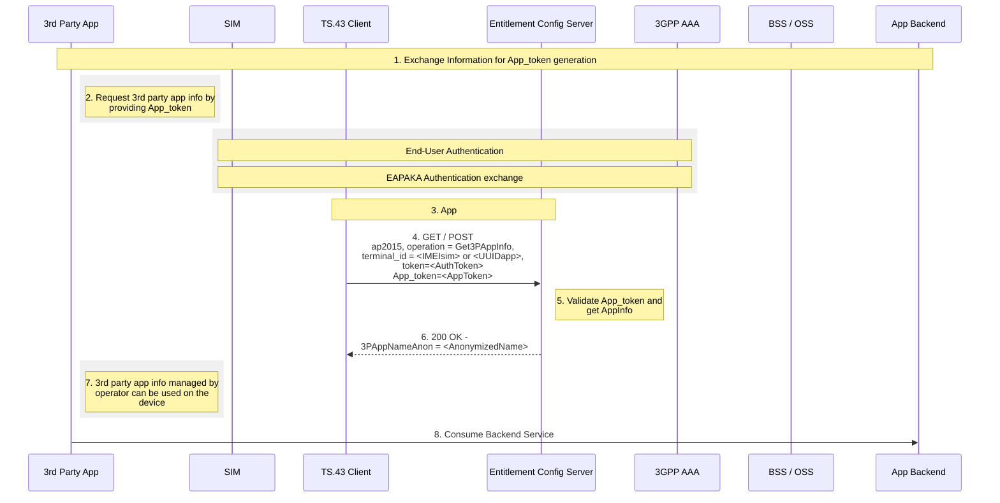
```mermaid
sequenceDiagram
    participant 3PApp as 3rd Party App
    participant SIM as SIM
    participant TS43 as TS.43 Client
    participant ECS as Entitlement Config Server
    participant AAA as 3GPP AAA
    participant BSS as BSS / OSS
    participant Backend as App Backend

    Note over 3PApp, Backend: 1. Exchange Information for App_token generation
    
    rect rgb(240, 240, 240)
    Note right of 3PApp: 2. Request 3rd party app info by<br/>providing App_token
    end

    rect rgb(240, 240, 240)
    Note over SIM, AAA: End-User Authentication
    Note over SIM, AAA: EAPAKA Authentication exchange
    end
    
    Note over TS43, ECS: 3. App
    
    TS43->>ECS: 4. GET / POST<br/>ap2015, operation = Get3PAppInfo,<br/>terminal_id = <IMEIsim> or <UUIDapp>,<br/>token=<AuthToken><br/>App_token=<AppToken>
    
    Note right of ECS: 5. Validate App_token and<br/>get AppInfo
    
    ECS-->>TS43: 6. 200 OK -<br/>3PAppNameAnon = <AnonymizedName>
    
    rect rgb(240, 240, 240)
    Note right of 3PApp: 7. 3rd party app info managed by<br/>operator can be used on the<br/>device
    end
    
    3PApp->>Backend: 8. Consume Backend Service
```

*Figure 66: Obtaining app information managed by the operator by using App token*


TS.43 v12.0
Page 229 of 248

GSM Association
Non-confidential
Official Document TS.43 - Service Entitlement Configuration


# 15 SatMode Entitlement and Provisioning

The following describes the use case of Satellite Mode (SatMode) Entitlement and Provisioning, where the application requires entitlement and PLMN List to attach to the network. It is identified by the appID "**appID=ap2016**". The client should only fetch SatMode configurations if the deviceType and OS Version is capable. The full flowchart diagrams can be found in section 15.4.

The following sections describe the different configuration parameters associated with the SatMode entitlement as well as the expected behaviour of the client based on the entitlement configuration document received by the client.

## 15.1 SatMode Entitlement Parameters

Parameters for the SatMode entitlement provide the overall status of the service to the client, as well as the different sub-status associated with the activation procedure of the service.

The SatMode entitlement uses the `EntitlementStatus` parameter, and also includes information associated with the web views presented to users by the SatMode client during activation and management of the service, as described in the following.

### 15.1.1 SatMode Entitlement Status

*   Parameter Name: `EntitlementStatus`
*   Presence: Mandatory

This parameter indicates the overall status of the SatMode entitlement, stating if the service can be offered on the device, and if it can be activated or not by the end-user.

The different values for the SatMode entitlement status are provided in Table 136.

<table>
  <thead>
    <tr>
        <th>EntitlementStatus<br/>(Mandatory)</th>
        <th>Integer</th>
        <th>0 - DISABLED</th>
        <th>SatMode allowed, but not yet provisioned and activated on the network. Device is redirected to webview using ServiceFlow_URL</th>
    </tr>
    <tr>
        <th colspan="2"></th>
        <th>1 - ENABLED</th>
        <th>SatMode service allowed, provisioned and activated on the network</th>
    </tr>
    <tr>
        <th colspan="2"></th>
        <th>2 - INCOMPATIBLE</th>
        <th>SatMode cannot be offered for network or device</th>
    </tr>
    <tr>
        <th colspan="2"></th>
        <th>3 - PROVISIONING</th>
        <th>SatMode is being provisioned on the network</th>
    </tr>
  </thead>
  <tbody>
    <tr>
        <td>SatMode Entitlement parameter</td>
        <td>Type</td>
        <td>Values</td>
        <td>Description</td>
    </tr>
  </tbody>
</table>
<center>Table 136. Entitlement Parameter - SatMode Overall Status</center>

### 15.1.2 SatMode Entitlement Request Example

Table 137 presents an example for the entitlement request for a SatMode application.


TS.43 v12.0
Page 230 of 248

GSM Association
Non-confidential
Official Document TS.43 - Service Entitlement Configuration


```http
GET ? terminal_id = 013787006099922&
token = es7w1erXjh%2FEC%2FP8BV44SBmVipg&
terminal_vendor = TVENDOR&
terminal_model = TMODEL&
terminal_sw_version = TSWVERS&
entitlement_version = ENTVERS&
app = ap2016&
vers = 1 HTTP/1.1

Host: entitlement.telco.net:9014
User-Agent: PRD-TS43 TVENDOR/TMODEL SatMode/TSWVERS OS-Android/8.0
Accept: text/html,application/xhtml+xml,application/xml;q=0.9,*/*;q=0.8
Accept-Language: en-US,en;q=0.5
Accept-Encoding: gzip, deflate
Connection: keep-alive
```

Table 137. Example of a SatMode Entitlement Request

### 15.1.3 SatMode Entitlement Response Example

Table 138 presents an example for the entitlement response in XML format for a SatMode application.

```xml
<?xml version="1.0"?>
<wap-provisioningdoc version="1.1">
    <characteristic type="VERS">
        <parm name="version" value="X"/>
        <parm name="validity" value="Y"/>
    </characteristic>
    <characteristic type="TOKEN">
        <parm name="token" value="U"/>
    </characteristic>
    <characteristic type="APPLICATION">
        <parm name="AppID" value="ap2016"/>
        <parm name="EntitlementStatus" value="0"/>
        <parm name="ServiceFlow_URL"
value="https://www.MNO.org/serviceActivation"/>
        <parm name="ServiceFlow_UserData" value="UserData"/>
    </characteristic>
</wap-provisioningdoc>
```

Table 138. Example of a SatMode Entitlement Response in XML format

Table 139 presents an example for the entitlement response in JSON format for a SatMode application.

```json
{
    "Vers" : {
        "version" : "1",
        "validity" : "172800"
    },
    "Token" : {
        "token" : "ASH127AHHA88SF"
    },
    "ap2016" : {
        "EntitlementStatus" : "0",
        "ServiceFlow_URL" : "https://www.MNO.org/serviceActivation",
        "ServiceFlow_UserData" : "UserData"
    }
}
```

Table 139. Example of a SatMode Entitlement Response


TS.43 v12.0
Page 231 of 248

GSM Association Non-confidential
Official Document TS.43 - Service Entitlement Configuration


### 15.1.4 SatMode Activation Web Views Parameters

*   Parameter Names: `ServiceFlow_URL` and `ServiceFlow_UserData`
*   Presence: Conditional

During the activation procedure of the SatMode service, end-users can be presented with web views specific to the Service Provider. SatMode web views allow end-users to change user-specific attributes of the SatMode service, like the acceptance of the service’s Terms and Conditions (T&C) and list plan selection for end-user to choose from.

The entitlement parameters associated with the SatMode service’s web views are described in Table 140.

<table>
  <thead>
    <tr>
        <th>SatMode Entitlement parameter</th>
        <th></th>
        <th>Type</th>
        <th></th>
        <th>Values</th>
        <th></th>
        <th>Description</th>
        <th></th>
    </tr>
    <tr>
        <th></th>
        <th>Not present</th>
        <th>Method to `ServiceFlow_URL` is HTTP GET request with query parameters from `ServiceFlow_UserData`.</th>
        <th colspan="3"></th>
    </tr>
    <tr>
        <th></th>
        <th>Json</th>
        <th>Method to `ServiceFlow_URL` is HTTP POST request with JSON content from `ServiceFlow_UserData`.</th>
        <th colspan="3"></th>
    </tr>
    <tr>
        <th></th>
        <th>XML</th>
        <th>Method to `ServiceFlow_URL` is HTTP POST request with XML content from `ServiceFlow_UserData`.</th>
        <th colspan="3"></th>
    </tr>
  </thead>
  <tbody>
    <tr>
        <td>ServiceFlow_URL<br/>(Conditional)</td>
        <td>String</td>
        <td>URL to a Service Provider site or portal</td>
        <td>The URL of web views to be used by client to present the user with SatMode service activation and service management options, which may include agreeing to the T&amp;C of the SatMode service.</td>
        <td colspan="4"></td>
    </tr>
    <tr>
        <td>ServiceFlow_UserData<br/>(Conditional)</td>
        <td>String</td>
        <td>Parameters or content to insert when invoking URL provided in the `ServiceFlow_URL` parameter</td>
        <td>User data associated with the HTTP web request towards the ServiceFlow URL. It can contain user-specific attributes to ease the flow of SatMode service activation and management.<br/>See below for details on the content.</td>
        <td colspan="4"></td>
    </tr>
    <tr>
        <td rowspan="4">ServiceFlow_ContentsType<br/>(Conditional)</td>
        <td rowspan="4">String</td>
        <td colspan="2">Specifies content and HTTP method to use when reaching out to the web server specified in `ServiceFlow_URL`.</td>
        <td colspan="4"></td>
    </tr>
  </tbody>
</table>

**Table 140. Entitlement Parameters - SatMode Web Views Information**

The content of the `ServiceFlow_UserData` parameter is defined by the requirements of the Service Provider’s SatMode web views. In a typical case, the web view is presented when SatMode service is activated by the end-user. At such time the client connects the user to the `ServiceFlow_URL` and includes the `ServiceFlow_UserData` in the HTTP web request.


TS.43 v12.0 Page 232 of 248

GSM Association
Non-confidential
Official Document TS.43 - Service Entitlement Configuration


In order to improve user experience, this parameter should include user and service-specific information that would allow the SatMode’s web views to identify the requestor and be aware of the latest SatMode entitlement status values.

An example of the `ServiceFlow_UserData` string is:

> "imsi=XXXXXXXXX&amp;msisdn=XXXXXXXX&amp;tnc=X&amp;prov=X&amp;device_id=XXXXXXXX&amp;entitlement_name=SatMode"

This example contains elements associated with the device and user identities as well as service-related information like the current T&C and provisioning status of the SatMode service. Note the use of "&amp;" is required to allow the '&' character to be used in a string value within an XML document.

### 15.1.5 SatMode Message for Incompatible Status
* Parameter Name: `MessageForIncompatible`
* Presence: Mandatory

When the status for the SatMode entitlement is INCOMPATIBLE (see Table 136) and the end-user tries to activate SatMode, the client should show a message to the end-user indicating why activation was refused.

This entitlement parameter provides the content of that message, as decided by the Service Provider. Table 141 describes this SatMode entitlement parameter.

<table>
  <thead>
    <tr>
        <th>SatMode Entitlement parameter</th>
        <th></th>
        <th>Type</th>
        <th></th>
        <th>Description</th>
        <th></th>
    </tr>
  </thead>
  <tbody>
    <tr>
        <td>MessageForIncompatible (Mandatory)</td>
        <td>String</td>
        <td>A message to be displayed to the end-user when activation fails due to an incompatible SatMode Entitlement Status</td>
        <td colspan="3"></td>
    </tr>
  </tbody>
</table>
Table 141. Entitlement Parameter - SatMode Message for Incompatible Status

### 15.2 SatMode Config Parameters
`PLMNAllowed` parameter is conditional upon EntitlementStatus = 1-ENABLED and client shall use this to connect to the appropriate PLMN.

`PLMNBarred` parameter is optional and can be present in any of the SatMode entitlement status.

The parameter structures are as below:

<table>
  <thead>
    <tr>
        <th>SatMode Config parameter</th>
        <th></th>
        <th>Type</th>
        <th></th>
        <th>Values</th>
        <th></th>
        <th>Description</th>
        <th></th>
    </tr>
  </thead>
  <tbody>
    <tr>
        <td>PLMNAllowed (Conditional)</td>
        <td>LIST of Objects</td>
        <td>multi-parameter value - see Table 143 for details</td>
        <td>Top level, list of allowed PLMNs where the service can be used.</td>
        <td colspan="4"></td>
    </tr>
  </tbody>
</table>


TS.43 v12.0
Page 233 of 248

GSM Association
Non-confidential
Official Document TS.43 - Service Entitlement Configuration


<table>
  <thead>
    <tr>
        <th>SatMode Config parameter</th>
        <th></th>
        <th>Type</th>
        <th></th>
        <th>Values</th>
        <th></th>
        <th>Description</th>
        <th></th>
    </tr>
  </thead>
  <tbody>
    <tr>
        <td>PLMNBarred<br/>(Optional)</td>
        <td>LIST of Objects</td>
        <td>multi-parameter value - see Table 143 for details</td>
        <td>Top level, list of barred PLMNs where the service can’t be used.</td>
        <td colspan="4"></td>
    </tr>
  </tbody>
</table>
Table 142. SatModeConfig- Parameters

<table>
  <thead>
    <tr>
        <th>PLMNAllowed / PLMNBarred Parameter</th>
        <th></th>
        <th>Type</th>
        <th></th>
        <th>Values</th>
        <th></th>
        <th>Description</th>
        <th></th>
    </tr>
  </thead>
  <tbody>
    <tr>
        <td>PLMN<br/>(Conditional)</td>
        <td>String</td>
        <td>PLMN ID</td>
        <td>allowed PLMN-ID where the service can be used or is barred.</td>
        <td colspan="4"></td>
    </tr>
    <tr>
        <td>DataPlanType<br/>(Optional)</td>
        <td rowspan="2">String</td>
        <td>Metered</td>
        <td>The data plan is of the metered type</td>
        <td colspan="4"></td>
    </tr>
    <tr>
        <td></td>
        <td>Unmetered</td>
        <td>The data plan is of the un-metered type</td>
        <td colspan="4"></td>
    </tr>
    <tr>
        <td>AllowedServicesInfo<br/>(Optional)</td>
        <td>Array</td>
        <td>Array of AllowedServices – See Table 144 for details</td>
        <td>Array of allowed services, in addition to carrier messaging, that are allowed over satellite<br/><br/>Note: If Parameter “AllowedServicesInfo” is not present, it is assumed that carrier messaging is supported by default</td>
        <td colspan="4"></td>
    </tr>
  </tbody>
</table>
Table 143. PLMNAllowed & PLMNBarred- Parameters

<table>
  <thead>
    <tr>
        <th>AllowedServices</th>
        <th></th>
        <th>Type</th>
        <th></th>
        <th>Values</th>
        <th></th>
        <th>Description</th>
        <th></th>
    </tr>
  </thead>
  <tbody>
    <tr>
        <td>ServiceType</td>
        <td rowspan="2">String</td>
        <td>data</td>
        <td>Data is supported</td>
        <td colspan="4"></td>
    </tr>
    <tr>
        <td></td>
        <td>voice</td>
        <td>Voice is supported</td>
        <td colspan="4"></td>
    </tr>
    <tr>
        <td>ServicePolicy</td>
        <td rowspan="2">String</td>
        <td>Constrained</td>
        <td>The data rate available for the satellite connection is bandwidth limited</td>
        <td colspan="4"></td>
    </tr>
    <tr>
        <td></td>
        <td>Unconstrained</td>
        <td>The data rate available for the satellite connection is not bandwidth limited</td>
        <td colspan="4"></td>
    </tr>
  </tbody>
</table>
Table 144. AllowedServices- Parameters

### 15.2.1 SatMode Config Request example
Table 145 presents an example for the SatModeConfig use case.

```
GET ? terminal_id = 013787006099922&
token = es7w1erXjh%2FEC%2FP8BV44SBmVipg&
terminal_vendor = TVENDOR&
terminal_model = TMODEL&
```


TS.43 v12.0
Page 234 of 248

GSM Association Non-confidential
Official Document TS.43 - Service Entitlement Configuration


```
terminal_sw_version = TSWVERS&
entitlement_version = ENTVERS&
app = ap2016&
vers = 1 HTTP/1.1

Host: entitlement.telco.net:9014
User-Agent: PRD-TS43 TVENDOR/TMODEL SatMode/TSWVERS OS-Android/8.0
Accept: text/html,application/xhtml+xml,application/xml;q=0.9,*/*;q=0.8
Accept-Language: en-US,en;q=0.5
Accept-Encoding: gzip, deflate
Connection: keep-alive
```

*Table 145. Example of a SatModeConfig Request*

### 15.2.2 SatModeConfig Response Example

Table 146 presents an example for the SatModeConfig use case response in XML format.

```xml
<?xml version="1.0"?>
<wap-provisioningdoc version="1.1">
    <characteristic type="VERS">
        <parm name="version" value="1"/>
        <parm name="validity" value="172800"/>
    </characteristic>
    <characteristic type="TOKEN">
        <parm name="token" value="ASH127AHHA88SF"/>
    </characteristic>
    <characteristic type="APPLICATION">
        <parm name="AppID" value="ap2016"/>
        <parm name="EntitlementStatus" value="1"/>
        <characteristic type="PLMNAllowed">
            <parm name="PLMN" value="31026"/>
            <parm name="DataPlanType" value="metered"/>
        </characteristic>
        <characteristic type="PLMNAllowed">
            <parm name="PLMN" value="302820"/>
            <parm name="DataPlanType" value="unmetered"/>
            <characteristic type="AllowedServicesInfo">
                <characteristic type="AllowedServices">
                    <parm name="ServiceType" value="data"/>
                    <parm name="ServicePolicy" value="constrained"/>
                </characteristic>
                <characteristic type="AllowedServices">
                    <parm name="ServiceType" value="voice"/>
                    <parm name="ServicePolicy" value="unconstrained"/>
                </characteristic>
            </characteristic>
        </characteristic>
        <characteristic type="PLMNBarred">
            <parm name="PLMN" value="31017"/>
        </characteristic>
        <characteristic type="PLMNBarred">
            <parm name="PLMN" value="302020"/>
        </characteristic>
    </characteristic>
</wap-provisioningdoc>
```

*Table 146. Example of a SatModeConfig Response*

Table 147 presents an example for the SatModeConfig use case response in JSON format.


TS.43 v12.0 Page 235 of 248

GSM Association
Non-confidential
Official Document TS.43 - Service Entitlement Configuration


```json
{
    "Vers": {
        "version": "1",
        "validity": "172800"
    },
    "Token": {
        "token": "ASH127AHHA88SF"
    },
    "ap2016": {
        "PLMNAllowed": [
            {
                "PLMN": "31026",
                "DataPlanType": "unmetered"
            },
            {
                "PLMN": "302820",
                "DataPlanType": "metered",
                "AllowedServicesInfo": [{
                    "AllowedServices": {
                        "ServiceType": "data",
                        "ServicePolicy": "constrained"
                    }
                }, {
                    "AllowedServices": {
                        "ServiceType": "voice",
                        "ServicePolicy": "unconstrained"
                    }
                }]
            }
        ],
        "PLMNBarred": [
            {"PLMN": "31017"},
            {"PLMN": "302020"}
        ]
    }
}
```
Table 147. Example of a SatModeConfig Response

### 15.3 SatMode Config retrieval frequency
Client may refresh the service Config at a regular interval or one of the scenarios listed below (list is not exhaustive):

* At a pre-defined regular interval, like 1 day or 7 days
* Upon Device power cycle.
* SIM Swap.
* Airplane mode disabled.
* Notification received from the Service Provider.
* Software version update

### 15.4 SatMode Client Considerations around Web View Callbacks
During the activation procedure of the SatMode service, end-users can be presented with web views specific to the Service Provider (hosted by a SatMode portal web server). To support this feature, the SatMode entitlement parameters `ServiceFlow_URL` and `ServiceFlow_UserData` associated with the invocation of SatMode service’s web views by the SatMode client are defined in section 15.1.4.

At the completion of the web service flow by the SatMode portal web server, the web page shall invoke a specific JavaScript (JS) callback function associated with the SatMode client.


TS.43 v12.0
Page 236 of 248

GSM Association
Non-confidential
Official Document TS.43 - Service Entitlement Configuration


The callback functions shall provide the overall state of the web flow to the SatMode client and indicate that the SatMode web view on the device needs to be closed.

The object associated with the callback functions is `SatModeWebServiceFlow` and two different callback functions are defined to reflect the state of the web logic.

### 15.4.1 entitlementChanged() Callback function

The `entitlementChanged()` callback function indicates that the SatMode service flow ended properly between the device and SatMode portal web server.

The web view to the end-user should be closed and the SatMode client shall make a request for the latest SatMode entitlement configuration status, via the proper TS.43 entitlement configuration request.

The following call flow presents how the `entitlementChanged()` callback function fits into the typical steps involved with SatMode entitlement configuration. At the end of the SatMode service flow the callback function (step 6) is invoked by the web server and the SatMode client acts accordingly by requesting for the latest SatMode entitlement configuration.


TS.43 v12.0
Page 237 of 248

GSM Association
Non-confidential
Official Document TS.43 - Service Entitlement Configuration


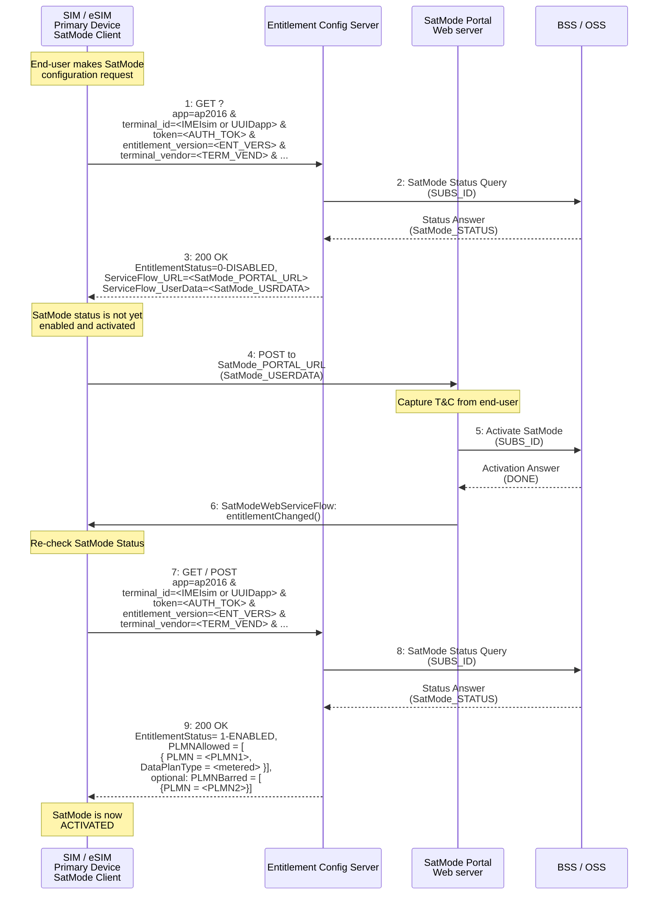
```mermaid
sequenceDiagram
    participant SD as SIM / eSIM<br/>Primary Device<br/>SatMode Client
    participant ECS as Entitlement Config Server
    participant SP as SatMode Portal<br/>Web server
    participant BSS as BSS / OSS

    Note over SD: End-user makes SatMode<br/>configuration request
    SD->>ECS: 1: GET ?<br/>app=ap2016 &<br/>terminal_id=<IMEIsim or UUIDapp> &<br/>token=<AUTH_TOK> &<br/>entitlement_version=<ENT_VERS> &<br/>terminal_vendor=<TERM_VEND> & ...
    ECS->>BSS: 2: SatMode Status Query<br/>(SUBS_ID)
    BSS-->>ECS: Status Answer<br/>(SatMode_STATUS)
    ECS-->>SD: 3: 200 OK<br/>EntitlementStatus=0-DISABLED,<br/>ServiceFlow_URL=<SatMode_PORTAL_URL><br/>ServiceFlow_UserData=<SatMode_USRDATA>

    Note over SD: SatMode status is not yet<br/>enabled and activated
    SD->>SP: 4: POST to<br/>SatMode_PORTAL_URL<br/>(SatMode_USERDATA)
    Note over SP: Capture T&C from end-user
    SP->>BSS: 5: Activate SatMode<br/>(SUBS_ID)
    BSS-->>SP: Activation Answer<br/>(DONE)
    SP->>SD: 6: SatModeWebServiceFlow:<br/>entitlementChanged()

    Note over SD: Re-check SatMode Status
    SD->>ECS: 7: GET / POST<br/>app=ap2016 &<br/>terminal_id=<IMEIsim or UUIDapp> &<br/>token=<AUTH_TOK> &<br/>entitlement_version=<ENT_VERS> &<br/>terminal_vendor=<TERM_VEND> & ...
    ECS->>BSS: 8: SatMode Status Query<br/>(SUBS_ID)
    BSS-->>ECS: Status Answer<br/>(SatMode_STATUS)
    ECS-->>SD: 9: 200 OK<br/>EntitlementStatus= 1-ENABLED,<br/>PLMNAllowed = [<br/>{ PLMN = <PLMN1>,<br/>DataPlanType = <metered> }],<br/>optional: PLMNBarred = [<br/>{PLMN = <PLMN2>}]
    Note over SD: SatMode is now<br/>ACTIVATED
```

Figure 67. SatMode Entitlement Configuration Flow with entitlementChanged() Callback

### 15.4.2 dismissFlow() callback function

The `dismissFlow()` callback function indicates that the SatMode service flow ends prematurely, either caused by user action (DISMISS button for example) or by an error in the web sheet logic or from the network side.

As a result of the dismissal of the service flow, the SatMode entitlement status has not been updated by the SatMode portal.


TS.43 v12.0
Page 238 of 248

GSM Association
Non-confidential
Official Document TS.43 - Service Entitlement Configuration


The web view to the end-user should be closed and the SatMode client should not make a request for the latest SatMode entitlement configuration status.

The call flow in Figure 68 presents how the `dismissFlow()` callback function fits into the typical steps involved with SatMode Entitlement Configuration. Due to an error or user action the callback function (step 6) is invoked by the web server and the SatMode client acts accordingly.

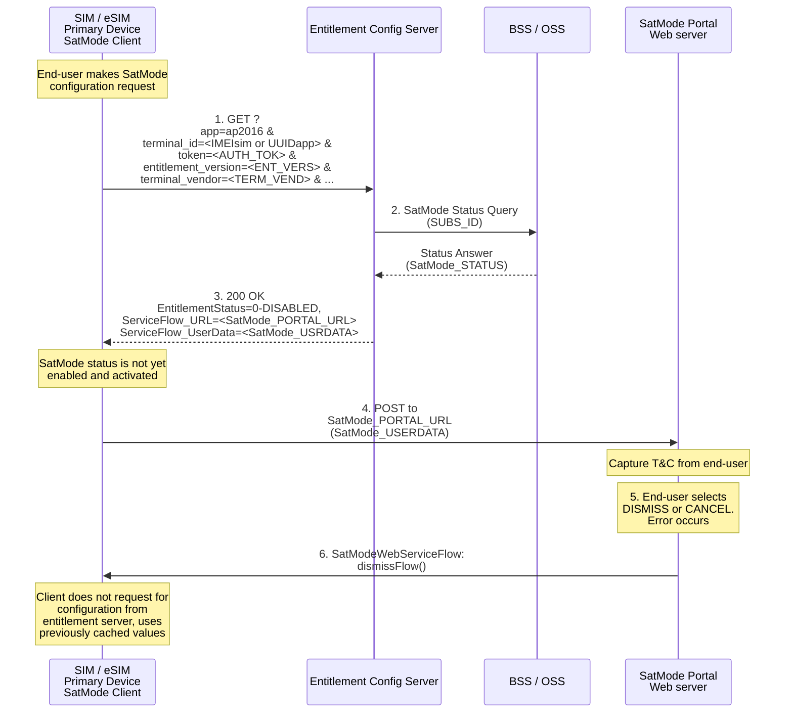
```mermaid
sequenceDiagram
    participant SD as SIM / eSIM <br/> Primary Device <br/> SatMode Client
    participant ECS as Entitlement Config Server
    participant BSS as BSS / OSS
    participant SPW as SatMode Portal <br/> Web server

    Note over SD: End-user makes SatMode <br/> configuration request
    
    SD->>ECS: 1. GET ? <br/> app=ap2016 & <br/> terminal_id=<IMEIsim or UUIDapp> & <br/> token=<AUTH_TOK> & <br/> entitlement_version=<ENT_VERS> & <br/> terminal_vendor=<TERM_VEND> & ...
    
    ECS->>BSS: 2. SatMode Status Query <br/> (SUBS_ID)
    BSS-->>ECS: Status Answer <br/> (SatMode_STATUS)
    
    ECS-->>SD: 3. 200 OK <br/> EntitlementStatus=0-DISABLED, <br/> ServiceFlow_URL=<SatMode_PORTAL_URL> <br/> ServiceFlow_UserData=<SatMode_USRDATA>
    
    Note over SD: SatMode status is not yet <br/> enabled and activated
    
    SD->>SPW: 4. POST to <br/> SatMode_PORTAL_URL <br/> (SatMode_USERDATA)
    
    Note over SPW: Capture T&C from end-user
    Note over SPW: 5. End-user selects <br/> DISMISS or CANCEL. <br/> Error occurs
    
    SPW->>SD: 6. SatModeWebServiceFlow: <br/> dismissFlow()
    
    Note over SD: Client does not request for <br/> configuration from <br/> entitlement server, uses <br/> previously cached values
```

Figure 68. SatMode Entitlement Configuration Flow with dismissFlow() Callback


TS.43 v12.0
Page 239 of 248

GSM Association
Non-confidential
Official Document TS.43 - Service Entitlement Configuration


# Annex A Feature mapping

## A.1 Feature and procedure lists

This section is dedicated to help a new reader finding what is the status of the different operations & parameters among features.

The features considered are the entitlement configuration use-cases identified by their appID: **VoWiFi** (ap2004), **Voice over Cellular** (ap2003), **SMSoIP** (ap2005), **ODSA for Companion** (ap2006), **ODSA for Primary** (ap2009), **Data Plan Information** (ap2010), **ODSA for Server Initiated Request** (ap2011), **Direct Carrier Billing** (ap2012), **Private User Identity** (ap2013), **Device and User Information** (ap2014), **Device App Authentication with OperatorToken** (ap2015) and **SatMode Entitlement** (ap2016).

The procedures considered are:

*   authenticate the Subscriber Identity
*   check the compliance of the device & user subscription with the requested service.
*   get the entitlement configuration document.
*   manage the user subscription.
*   get the user consent.
*   update the configuration document from the network.

For each feature, the procedures status may be: Mandatory (**M**), Optional (**O**), Conditional (**C**) or Not Applicable (**N/A**).

The procedures are detailed in operations.

In each case, the mapping references the related section for the Service Provider’s Entitlement Configuration Server and the client.


TS.43 v12.0
Page 240 of 248

GSM Association
Non-confidential
Official Document TS.43 - Service Entitlement Configuration


## A.2 VoWiFi feature

<table>
  <thead>
    <tr>
        <th>Procedure</th>
        <th>Operation</th>
        <th colspan="2">Entitlement Client</th>
        <th colspan="2">SP Entitlement Server</th>
    </tr>
  </thead>
  <tbody>
    <tr>
        <td rowspan="2">Authenticate the Subscriber Identity</td>
        <td>Embedded EAP-AKA authentication</td>
        <td>M</td>
        <td>2.8.1</td>
        <td>M</td>
        <td>2.8.1</td>
    </tr>
    <tr>
        <td>Fast authentication</td>
        <td>M</td>
        <td>2.8.5</td>
        <td>M</td>
        <td>2.8.5</td>
    </tr>
    <tr>
        <td>Get the entitlement configuration document</td>
        <td>HTTP GET</td>
        <td>M<br/>M</td>
        <td>2.9<br/>3.2</td>
        <td>M</td>
        <td>3.1</td>
    </tr>
    <tr>
        <td>Get the user consent</td>
        <td>Display webviews</td>
        <td>O</td>
        <td>3.4</td>
        <td>M</td>
        <td>3.1.4</td>
    </tr>
    <tr>
        <td>Update the entitlement configuration from network</td>
        <td>Push notification</td>
        <td>O</td>
        <td>2.6.2</td>
        <td>O</td>
        <td>2.6.2</td>
    </tr>
  </tbody>
</table>
Table 148. Features & operations mapping for VoWiFi.

## A.3 Voice over Cellular feature

<table>
  <thead>
    <tr>
        <th>Procedure</th>
        <th>Operation</th>
        <th colspan="2">Entitlement Client</th>
        <th colspan="2">SP Entitlement Server</th>
    </tr>
  </thead>
  <tbody>
    <tr>
        <td rowspan="2">Authenticate the Subscriber Identity</td>
        <td>Embedded EAP-AKA authentication</td>
        <td>M</td>
        <td>2.8.1</td>
        <td>M</td>
        <td>2.8.1</td>
    </tr>
    <tr>
        <td>Fast authentication</td>
        <td>M</td>
        <td>2.8.5</td>
        <td>M</td>
        <td>2.8.5</td>
    </tr>
    <tr>
        <td>Get the entitlement configuration document</td>
        <td>HTTP GET</td>
        <td>M</td>
        <td>2.9</td>
        <td>M</td>
        <td>4.1</td>
    </tr>
    <tr>
        <td>Update the entitlement configuration from network</td>
        <td>Push notification</td>
        <td>O</td>
        <td>2.6.2</td>
        <td>O</td>
        <td>2.6.2</td>
    </tr>
  </tbody>
</table>
Table 149. Features & operations mapping for Voice over Cellular

## A.4 SMSoIP feature

<table>
  <thead>
    <tr>
        <th>Procedure</th>
        <th>Operation</th>
        <th colspan="2">Entitlement Client</th>
        <th colspan="2">SP Entitlement Server</th>
    </tr>
  </thead>
  <tbody>
    <tr>
        <td rowspan="2">Authenticate the Subscriber Identity</td>
        <td>Embedded EAP-AKA authentication</td>
        <td>M</td>
        <td>2.8.1</td>
        <td>M</td>
        <td>2.8.1</td>
    </tr>
    <tr>
        <td>Fast authentication</td>
        <td>M</td>
        <td>2.8.5</td>
        <td>M</td>
        <td>2.8.5</td>
    </tr>
    <tr>
        <td>Get the entitlement configuration document</td>
        <td>HTTP GET</td>
        <td>M</td>
        <td>5.2</td>
        <td>M</td>
        <td>5.1</td>
    </tr>
    <tr>
        <td>Update the entitlement configuration from network</td>
        <td>Push notification</td>
        <td>O</td>
        <td>2.6.2</td>
        <td>O</td>
        <td>2.6.2</td>
    </tr>
  </tbody>
</table>
Table 150. Features & operations mapping for SMSoIP.


TS.43 v12.0
Page 241 of 248

GSM Association
Non-confidential
Official Document TS.43 - Service Entitlement Configuration


## A.5 Companion ODSA feature

<table>
  <thead>
    <tr>
        <th>Procedure</th>
        <th>Operation</th>
        <th colspan="2">Entitlement Client</th>
        <th colspan="2">SP Entitlement Server</th>
    </tr>
  </thead>
  <tbody>
    <tr>
        <td rowspan="3">Authenticate the Subscriber Identity</td>
        <td>Embedded EAP-AKA authentication</td>
        <td>O</td>
        <td>2.8.1</td>
        <td>O</td>
        <td>2.8.1</td>
    </tr>
    <tr>
        <td>Fast authentication</td>
        <td>M</td>
        <td>2.8.5</td>
        <td>M</td>
        <td>2.8.5</td>
    </tr>
    <tr>
        <td>OAuth2.0/OIDC authentication</td>
        <td>O</td>
        <td>2.8.2</td>
        <td>O</td>
        <td>2.8.2</td>
    </tr>
    <tr>
        <td>Check the compliance of the device and user subscription with the requested service</td>
        <td>CheckEligibility</td>
        <td>M</td>
        <td>6.2</td>
        <td>M<br/>M</td>
        <td>6.5.1<br/>6.5.2</td>
    </tr>
    <tr>
        <td>Get the entitlement configuration document</td>
        <td>AcquireConfiguration</td>
        <td>M</td>
        <td>6.2</td>
        <td>M<br/>M</td>
        <td>6.5.1<br/>6.5.5</td>
    </tr>
    <tr>
        <td>Get user consent</td>
        <td>Display WebView</td>
        <td>O</td>
        <td>6.7</td>
        <td>O</td>
        <td>6.7</td>
    </tr>
    <tr>
        <td rowspan="2">Manage subscription</td>
        <td>ManageSubscription,</td>
        <td></td>
        <td>6.2</td>
        <td>M<br/>M</td>
        <td>6.5.1<br/>6.4.2</td>
    </tr>
    <tr>
        <td>Display WebView</td>
        <td>O</td>
        <td>6.7</td>
        <td>O</td>
        <td>6.7</td>
    </tr>
    <tr>
        <td>Change the service status from client</td>
        <td>ManageService</td>
        <td>O</td>
        <td>6.2</td>
        <td>M<br/>M</td>
        <td>6.5.1<br/>6.5.4</td>
    </tr>
    <tr>
        <td rowspan="2">Update the entitlement configuration from network</td>
        <td>Push notification</td>
        <td>C1</td>
        <td>2.6</td>
        <td>C1</td>
        <td>2.6</td>
    </tr>
    <tr>
        <td>Polling</td>
        <td>C1</td>
        <td>7.3</td>
        <td colspan="2"></td>
    </tr>
  </tbody>
</table>
<center>Table 151. Features & operations mapping for Companion ODSA</center>

C1: IF *Push notification* IS NOT SUPPORTED THEN *POLLING* IS M


TS.43 v12.0
Page 242 of 248

GSM Association
Non-confidential
Official Document TS.43 - Service Entitlement Configuration


## A.6 Primary ODSA feature

<table>
  <thead>
    <tr>
        <th>Procedure</th>
        <th>Operation</th>
        <th colspan="2">Entitlement Client</th>
        <th colspan="2">SP Entitlement Server</th>
    </tr>
  </thead>
  <tbody>
    <tr>
        <td rowspan="4">Authenticate the Subscriber Identity</td>
        <td>Embedded EAP-AKA authentication</td>
        <td>O</td>
        <td>2.8.1</td>
        <td>O</td>
        <td>2.8.1</td>
    </tr>
    <tr>
        <td>Fast authentication</td>
        <td>M</td>
        <td>2.8.5</td>
        <td>M</td>
        <td>2.8.5</td>
    </tr>
    <tr>
        <td>OAuth2.0/OIDC authentication</td>
        <td>O</td>
        <td>2.8.2</td>
        <td>O</td>
        <td>2.8.2</td>
    </tr>
    <tr>
        <td>Use a temporary token for specific operation (AcquireTemporaryToken)</td>
        <td>O<br/>O</td>
        <td>6.1,<br/>6.2<br/>6.5.7</td>
        <td>O<br/>O</td>
        <td>6.2<br/>6.5.7</td>
    </tr>
    <tr>
        <td>Check the compliance of the device and user subscription with the requested service</td>
        <td>CheckEligibility</td>
        <td>M</td>
        <td>6.2</td>
        <td>M<br/>M</td>
        <td>6.5.1<br/>6.5.2</td>
    </tr>
    <tr>
        <td>Get the entitlement configuration document</td>
        <td>AcquireConfiguration</td>
        <td>M</td>
        <td>6.2</td>
        <td>M<br/>M</td>
        <td>6.5.1<br/>6.5.5</td>
    </tr>
    <tr>
        <td>Get user consent</td>
        <td>Display WebView</td>
        <td>O</td>
        <td>6.7</td>
        <td>O</td>
        <td>6.7</td>
    </tr>
    <tr>
        <td rowspan="5">Manage user subscription.</td>
        <td>ManageSubscription,</td>
        <td>M</td>
        <td>6.5.3</td>
        <td>M</td>
        <td>6.5.3</td>
    </tr>
    <tr>
        <td>Display WebView</td>
        <td>O</td>
        <td>6.7</td>
        <td>O</td>
        <td>6.7</td>
    </tr>
    <tr>
        <td>Subscription transfer (=ManageSubscription with `old_terminal_iccid`)</td>
        <td>M<br/>O</td>
        <td>6.5.3<br/>8.3</td>
        <td>M<br/>O</td>
        <td>6.5.3<br/>8.3</td>
    </tr>
    <tr>
        <td>Subscription transfer using a temporary token</td>
        <td>O</td>
        <td>6.5.7</td>
        <td>O</td>
        <td>6.5.7</td>
    </tr>
    <tr>
        <td>New eSIM subscription</td>
        <td>M<br/>O</td>
        <td>6.5.3<br/>8.1</td>
        <td>M<br/>O</td>
        <td>6.5.3<br/>8.1</td>
    </tr>
    <tr>
        <td>Change the service status</td>
        <td>ManageService</td>
        <td>O</td>
        <td>6.2</td>
        <td>M<br/>M</td>
        <td>6.5.1<br/>6.5.4</td>
    </tr>
    <tr>
        <td rowspan="2">Update the entitlement configuration from network</td>
        <td>Push notification</td>
        <td>C1</td>
        <td>2.6</td>
        <td>C1</td>
        <td>2.6</td>
    </tr>
    <tr>
        <td>Polling</td>
        <td>C1</td>
        <td>7.3</td>
        <td colspan="2"></td>
    </tr>
  </tbody>
</table>
<center>Table 152. Features & operations mapping for Primary ODSA</center>

C1: IF *Push notification* IS NOT SUPPORTED THEN *POLLING* IS M


TS.43 v12.0
Page 243 of 248

GSM Association
Non-confidential
Official Document TS.43 - Service Entitlement Configuration


### A.7 Data Plan and Data Boost Information feature

<table>
  <thead>
    <tr>
        <th>Procedure</th>
        <th>Operation</th>
        <th></th>
        <th></th>
        <th></th>
        <th></th>
    </tr>
  </thead>
  <tbody>
    <tr>
        <td>Procedure</td>
        <td>Operation</td>
        <td colspan="2">Entitlement Client</td>
        <td colspan="2">SP Entitlement Server</td>
    </tr>
    <tr>
        <td rowspan="2">Authenticate the Subscriber Identity</td>
        <td>Embedded EAP-AKA authentication</td>
        <td>O</td>
        <td>2.8.1</td>
        <td>M</td>
        <td>2.8.1</td>
    </tr>
    <tr>
        <td>Fast authentication</td>
        <td>M</td>
        <td>2.8.5</td>
        <td>M</td>
        <td>2.8.5</td>
    </tr>
    <tr>
        <td rowspan="2">Get the entitlement configuration document</td>
        <td rowspan="2">HTTP GET</td>
        <td rowspan="2">M</td>
        <td rowspan="2">9.1</td>
        <td>M</td>
        <td>6.5.1</td>
    </tr>
    <tr>
        <td>M</td>
        <td>9.1</td>
    </tr>
    <tr>
        <td rowspan="2">Get the real-time data boost configuration document</td>
        <td rowspan="2">HTTP GET with boost_type</td>
        <td rowspan="2">M</td>
        <td rowspan="2">9.8</td>
        <td rowspan="2">M</td>
        <td>9.9</td>
    </tr>
    <tr>
        <td>9.10</td>
    </tr>
    <tr>
        <td>Get the user consent</td>
        <td>Display webviews</td>
        <td>O</td>
        <td>9.11</td>
        <td>O</td>
        <td>9.11</td>
    </tr>
  </tbody>
</table>
<center>Table 153. Features & operations mapping for Data Plan Information</center>

### A.8 Server Initiated ODSA feature

<table>
  <thead>
    <tr>
        <th>Procedure</th>
        <th>Operation</th>
        <th></th>
        <th></th>
        <th></th>
        <th></th>
    </tr>
  </thead>
  <tbody>
    <tr>
        <td>Procedure</td>
        <td>Operation</td>
        <td colspan="2">Entitlement Client</td>
        <td colspan="2">SP Entitlement Server</td>
    </tr>
    <tr>
        <td rowspan="2">Authenticate the Subscriber Identity</td>
        <td>Fast authentication</td>
        <td>M</td>
        <td>2.8.5</td>
        <td>M</td>
        <td>2.8.5</td>
    </tr>
    <tr>
        <td>Server to server authentication</td>
        <td>M</td>
        <td>2.8.3</td>
        <td>M</td>
        <td>2.8.3</td>
    </tr>
    <tr>
        <td rowspan="2">Check the compliance of the device and user subscription with the requested service</td>
        <td rowspan="2">CheckEligibility</td>
        <td>M</td>
        <td>6.2</td>
        <td>M</td>
        <td>6.5.2</td>
    </tr>
    <tr>
        <td>M</td>
        <td>10.1</td>
        <td>M</td>
        <td>10.1</td>
    </tr>
    <tr>
        <td>Get the entitlement configuration document</td>
        <td>AcquireConfiguration</td>
        <td>M</td>
        <td>6.5.6</td>
        <td>M</td>
        <td>6.5.6</td>
    </tr>
    <tr>
        <td>Manage user subscription</td>
        <td>ManageSubscription</td>
        <td>M</td>
        <td>6.5.3</td>
        <td>M</td>
        <td>6.5.3</td>
    </tr>
    <tr>
        <td rowspan="2">Update the entitlement configuration from network</td>
        <td>Push notification</td>
        <td>C1</td>
        <td>2.6</td>
        <td>C1</td>
        <td>2.6</td>
    </tr>
    <tr>
        <td>Polling</td>
        <td>C1</td>
        <td>7.3</td>
        <td colspan="2"></td>
    </tr>
  </tbody>
</table>
<center>Table 154. Features & operations mapping for Server Initiated ODSA</center>

C1: IF *Push notification* IS NOT SUPPORTED THEN *POLLING* IS *M*


TS.43 v12.0
Page 244 of 248

GSM Association
Non-confidential
Official Document TS.43 - Service Entitlement Configuration


### A.9 Direct Carrier Billing Entitlement feature

<table>
  <thead>
    <tr>
        <th>Procedure</th>
        <th>Operation</th>
        <th colspan="2">Entitlement Client</th>
        <th colspan="2">SP Entitlement Server</th>
    </tr>
  </thead>
  <tbody>
    <tr>
        <td rowspan="3">Authenticate the Subscriber Identity</td>
        <td>Embedded EAP-AKA authentication</td>
        <td>O</td>
        <td>2.8.1</td>
        <td>O</td>
        <td>2.8.1</td>
    </tr>
    <tr>
        <td>Fast authentication</td>
        <td>M</td>
        <td>2.8.5</td>
        <td>M</td>
        <td>2.8.5</td>
    </tr>
    <tr>
        <td>OAuth2.0/OIDC authentication</td>
        <td>O</td>
        <td>2.8.2</td>
        <td>O</td>
        <td>2.8.2</td>
    </tr>
    <tr>
        <td>Get the entitlement configuration document</td>
        <td>HTTP GET</td>
        <td>M</td>
        <td>11,<br/>11.4.1</td>
        <td>M</td>
        <td>11,<br/>11.4.1</td>
    </tr>
    <tr>
        <td>Update the entitlement configuration from network</td>
        <td>Push notification</td>
        <td>O</td>
        <td>11.4.1</td>
        <td>O</td>
        <td>11.4.1</td>
    </tr>
    <tr>
        <td>Get user consent</td>
        <td>Display WebView</td>
        <td>O</td>
        <td>11.6,<br/>11.4.2</td>
        <td>O</td>
        <td>11.6,<br/>11.4.2</td>
    </tr>
  </tbody>
</table>
Table 155. Features & operations mapping for Direct Carrier Billing

### A.10 Private User Identity feature

<table>
  <thead>
    <tr>
        <th>Procedure</th>
        <th>Operation</th>
        <th colspan="2">Entitlement Client</th>
        <th colspan="2">SP Entitlement Server</th>
    </tr>
  </thead>
  <tbody>
    <tr>
        <td rowspan="2">Authenticate the Subscriber Identity</td>
        <td>Embedded EAP-AKA authentication</td>
        <td>M</td>
        <td>2.8.1</td>
        <td>M</td>
        <td>2.8.1</td>
    </tr>
    <tr>
        <td>Fast authentication</td>
        <td>M</td>
        <td>2.8.5</td>
        <td>M</td>
        <td>2.8.5</td>
    </tr>
    <tr>
        <td>Get the entitlement configuration document</td>
        <td>HTTP GET or POST</td>
        <td>M</td>
        <td>12,<br/>12.1,<br/>12.2,<br/>12.4</td>
        <td>M</td>
        <td>12,<br/>12.1,<br/>12.2,<br/>12.4</td>
    </tr>
    <tr>
        <td>Update the entitlement configuration from network</td>
        <td>Push notification</td>
        <td>O</td>
        <td>12.2</td>
        <td>O</td>
        <td>12.2</td>
    </tr>
  </tbody>
</table>
Table 156. Features & operations mapping for Private User Identity

### A.11 User and Device Information feature

<table>
  <thead>
    <tr>
        <th>Procedure</th>
        <th>Operation</th>
        <th colspan="2">Entitlement Client</th>
        <th colspan="2">SP Entitlement Server</th>
    </tr>
  </thead>
  <tbody>
    <tr>
        <td rowspan="3">Authenticate the Subscriber Identity</td>
        <td>Embedded EAP-AKA authentication</td>
        <td>O</td>
        <td>2.8.1</td>
        <td>M</td>
        <td>2.8.1</td>
    </tr>
    <tr>
        <td>Fast authentication</td>
        <td>M</td>
        <td>2.8.5</td>
        <td>M</td>
        <td>2.8.5</td>
    </tr>
    <tr>
        <td>Use a temporary token for getPhoneNumber operation (AcquireTemporaryToken)</td>
        <td>M<br/>M</td>
        <td>6.1,<br/>6.2<br/>6.5.7</td>
        <td>M<br/>M</td>
        <td>6.2<br/>6.5.7</td>
    </tr>
    <tr>
        <td rowspan="2">Get the entitlement configuration document</td>
        <td>GetPhoneNumber</td>
        <td>M</td>
        <td>13.1.1.1,<br/>13.1.2,<br/>6.5.8</td>
        <td>M</td>
        <td>13.1.1,<br/>13.1.2,<br/>6.5.8</td>
    </tr>
    <tr>
        <td>GetSubscriberInfo</td>
        <td>M</td>
        <td>13.2.1,<br/>6.5.11</td>
        <td>M</td>
        <td>13.2.1,<br/>6.5.11</td>
    </tr>
  </tbody>
</table>
Table 157. Features & operations mapping for User and Device Information


TS.43 v12.0
Page 245 of 248

GSM Association
Non-confidential
Official Document TS.43 - Service Entitlement Configuration


### A.12 Device App authentication features

<table>
  <thead>
    <tr>
        <th>Authenticate the Subscriber Identity</th>
        <th>Embedded EAP-AKA authentication</th>
        <th>M</th>
        <th>2.8.1</th>
        <th>M</th>
        <th>2.8.1</th>
    </tr>
    <tr>
        <th></th>
        <th>Fast authentication</th>
        <th>O</th>
        <th>2.8.5</th>
        <th>O</th>
        <th>2.8.5</th>
    </tr>
    <tr>
        <th></th>
        <th>Use a temporary token for<br/>AcquireOperatorToken operation<br/>(AcquireTemporaryToken)</th>
        <th>M<br/>M</th>
        <th>6.1,<br/>6.2<br/>6.5.7</th>
        <th>M<br/>M</th>
        <th>6.2<br/>6.5.7<br/>6.6.6</th>
    </tr>
    <tr>
        <th></th>
        <th>TemporaryToken Error Handling</th>
        <th>O</th>
        <th>2.8.6</th>
        <th>O</th>
        <th>2.8.6</th>
    </tr>
    <tr>
        <th></th>
        <th>AcquireOperatorToken</th>
        <th>M</th>
        <th>14.1.1<br/>14.1.2</th>
        <th>M</th>
        <th>14.1.1<br/>14.1.2</th>
    </tr>
    <tr>
        <th>Consuming Operator Token</th>
        <th>ValidateOperatorToken</th>
        <th>M</th>
        <th>14.1.6<br/>14.1.6.1</th>
        <th>M</th>
        <th>14.1.6<br/>14.1.6.1</th>
    </tr>
    <tr>
        <th></th>
        <th>GetSubscriberDeviceInfo</th>
        <th>M</th>
        <th>14.1.6<br/>14.1.6.2</th>
        <th>M</th>
        <th>14.1.6<br/>14.1.6.2</th>
    </tr>
    <tr>
        <th></th>
        <th>VerifyPhoneNumber</th>
        <th>M</th>
        <th>14.1.6<br/>14.1.7</th>
        <th>M</th>
        <th>14.1.6<br/>14.1.7</th>
    </tr>
    <tr>
        <th>Consuming App token</th>
        <th>Get3PAppInfo</th>
        <th>M</th>
        <th>14.2<br/>14.2.1</th>
        <th>M</th>
        <th>14.2<br/>14.2.1</th>
    </tr>
  </thead>
  <tbody>
    <tr>
        <td>Procedure</td>
        <td>Operation</td>
        <td colspan="2">Entitlement Client</td>
        <td colspan="2">SP Entitlement Server</td>
    </tr>
  </tbody>
</table>
Table 158. Features & operations mapping for App Authentication with OperatorToken

### A.13 SatMode Entitlement feature

<table>
  <thead>
    <tr>
        <th>Authenticate the Subscriber Identity</th>
        <th>Embedded EAP-AKA authentication</th>
        <th>M</th>
        <th>2.8.1</th>
        <th>M</th>
        <th>2.8.1</th>
    </tr>
    <tr>
        <th></th>
        <th>Fast authentication</th>
        <th>O</th>
        <th>2.8.5</th>
        <th>O</th>
        <th>2.8.5</th>
    </tr>
    <tr>
        <th>Get SatMode Entitlement configuration</th>
        <th>HTTP GET</th>
        <th>M</th>
        <th>2.9<br/>15.2</th>
        <th>M</th>
        <th>6.5.2<br/>15.2</th>
    </tr>
    <tr>
        <th>JS Callbacks for Webview</th>
        <th>entitlementChanged()<br/>dismissFlow()</th>
        <th>M</th>
        <th>15.4</th>
        <th>M</th>
        <th>15.4</th>
    </tr>
  </thead>
  <tbody>
    <tr>
        <td>Procedure</td>
        <td>Operation</td>
        <td colspan="2">Entitlement Client</td>
        <td colspan="2">SP Entitlement Server</td>
    </tr>
  </tbody>
</table>
Table 159. Features & operations mapping for Phone Number Information


TS.43 v12.0
Page 246 of 248

GSM Association Non-confidential
Official Document TS.43 - Service Entitlement Configuration


# Annex B Document Management

## B.1 Document History

<table>
  <thead>
    <tr>
        <th>Version</th>
        <th></th>
        <th>Date</th>
        <th></th>
        <th>Brief Description of Change</th>
        <th></th>
        <th>Approval Authority</th>
        <th></th>
        <th>Editor / Company</th>
        <th></th>
    </tr>
  </thead>
  <tbody>
    <tr>
        <td>1.0</td>
        <td>July 2018</td>
        <td>First version</td>
        <td>TG#11</td>
        <td>J. Sicard / HPE</td>
        <td colspan="5"></td>
    </tr>
    <tr>
        <td>2.0</td>
        <td>October 2018</td>
        <td>Updated with changes detailed in CR1002</td>
        <td>TSG</td>
        <td>J. Sicard / HPE</td>
        <td colspan="5"></td>
    </tr>
    <tr>
        <td>3.0</td>
        <td>Not Published</td>
        <td>Added eSIM devices configuration and restructuring the document.</td>
        <td>TSG</td>
        <td>J. Sicard / HPE</td>
        <td colspan="5"></td>
    </tr>
    <tr>
        <td>4.0</td>
        <td>December 2019</td>
        <td>Adding Companion devices configuration.<br/>CR1003</td>
        <td>TSG#38</td>
        <td>J. Sicard / HPE</td>
        <td colspan="5"></td>
    </tr>
    <tr>
        <td>5.0</td>
        <td>April 2020</td>
        <td>Changed title, Chapter 6 reflects generic ODSA operations and parameters, Companion ODSA call flows are in separate Chapter 7, new Chapter 8 presents Primary ODSA call flows, clarifications added for POST content encoding and UserData response parameter, new logout callback function.<br/>CR1004 &amp; CR1005</td>
        <td>TSG39j</td>
        <td>J. Sicard / HPE</td>
        <td colspan="5"></td>
    </tr>
    <tr>
        <td>6.0</td>
        <td>January 2021</td>
        <td>Chapter 6 reflects JS callback functions, poll and push mechanisms defined for delayed profile delivery in chapter 7, use case data plan information added in chapter 9, server initiated ODSA use case added in chapter 10, OID error processing, entitlement version handling, user agent format, obtaining identifiers with web sheet<br/>**CR1020** (CRs1006, 1007, 1008, 1011, 1012, 1013, 1014, 1015, 1016 &amp; 1017)</td>
        <td>TSG#42<br/>ISAG#6</td>
        <td>F. Schmitt / DT</td>
        <td colspan="5"></td>
    </tr>
    <tr>
        <td>6.1</td>
        <td>April 2021</td>
        <td>Adding CR numbers to V6.0 version history<br/>CR1024</td>
        <td>TSG (email)</td>
        <td>Paul Gosden / GSMA</td>
        <td colspan="5"></td>
    </tr>
    <tr>
        <td>7.0</td>
        <td>Not Published</td>
        <td>Changes the same as for V8.0</td>
        <td></td>
        <td>Paul Gosden / GSMA</td>
        <td colspan="5"></td>
    </tr>
    <tr>
        <td>8.0</td>
        <td>January 2022</td>
        <td>Added new use cases VoNR entitlement and primary ODSA via EAP-AKA.<br/>Enhanced companion &amp; primary ODSA procedures, AppID handling, token management, error &amp; eligibility handling.<br/>**CR1040** (CR1009, CR1018, CR1019, CR1021, CR1022, CR1023, CR1024, CR1025, CR1026, CR1027, CR1028,</td>
        <td>TSG#46<br/>ISAG#13</td>
        <td>Florian Schmitt / DT</td>
        <td colspan="5"></td>
    </tr>
  </tbody>
</table>


TS.43 v12.0 Page 247 of 248

GSM Association Non-confidential
Official Document TS.43 - Service Entitlement Configuration


<table>
  <thead>
    <tr>
        <th>Version</th>
        <th></th>
        <th>Date</th>
        <th></th>
        <th>Brief Description of Change</th>
        <th></th>
        <th>Approval Authority</th>
        <th></th>
        <th>Editor / Company</th>
        <th></th>
    </tr>
  </thead>
  <tbody>
    <tr>
        <td></td>
        <td rowspan="2"></td>
        <td>CR1029, CR1030, CR1031, CR1032, CR1033, CR1034, CR1043)</td>
        <td></td>
        <td></td>
        <td colspan="5"></td>
    </tr>
    <tr>
        <td>9.0</td>
        <td>December 2022</td>
        <td>Added new use cases Direct Carrier Billing (Chapter 11) and Private User Identity (Chapter 12). Added temporary token &amp; MSISDN retrieval functionality, enhanced auth mechanism, subscription transfer, discovery &amp; JS callbacks. Added Annex B Feature Mapping.<br/>**CR1060** (CR1035, CR1042, CR1044, CR1045, CR1046, CR1047, CR1048, CR1049, CR1051, CR1052, CR1055, CR1056, CR1057)</td>
        <td>TSG#50<br/>ISAG#26</td>
        <td>Florian Schmitt / DT</td>
        <td colspan="4"></td>
    </tr>
    <tr>
        <td>10.0</td>
        <td>December 2023</td>
        <td>**CR1080** (CR1061, CR1062, CR1063, CR1064, CR1065, CR1066, CR1067, CR1068, CR1069, CR1070, CR1071, CR1073, CR1074, CR1077)</td>
        <td>TSG#54<br/>ISAG#37</td>
        <td>Kay Fritz / Vodafone</td>
        <td colspan="5"></td>
    </tr>
    <tr>
        <td>10.1</td>
        <td>March 2024</td>
        <td>**CR1088 v02** Non-Substantive Change.</td>
        <td>TSG via email</td>
        <td>Kay Fritz / Vodafone</td>
        <td colspan="5"></td>
    </tr>
    <tr>
        <td>11.0</td>
        <td>April 2024</td>
        <td>**CR1090** (CR1076, CR1078, CR1081, CR1082, CR1084, CR1085, CR1086, CR1087)</td>
        <td>TSG#55<br/>ISAG#40</td>
        <td>Kay Fritz / Vodafone</td>
        <td colspan="5"></td>
    </tr>
    <tr>
        <td>12.0</td>
        <td>February 2025</td>
        <td>**CR1120** (CR1091, CR1092, CR1093, CR1094, CR1095, CR1096, CR1097, CR1098, CR1099, CR1100, CR1103, CR1104, CR1105)</td>
        <td>TSG#58<br/>ISAG#48</td>
        <td>Kay Fritz / Vodafone</td>
        <td colspan="5"></td>
    </tr>
  </tbody>
</table>

**(*) Document History Version** (in table above) is used as a reference for a configuration parameter in this document, so it requires to follow a specific pattern. This version number is expected to be defined as the following ABNF rule: 1\*DIGIT”.”1\*DIGIT. Some valid values could be: 6.0 ; 6.1 ; 10.0 or 11.10

## B.2 Other Information

<table>
  <thead>
    <tr>
        <th>Type</th>
        <th></th>
        <th>Description</th>
        <th></th>
    </tr>
  </thead>
  <tbody>
    <tr>
        <td>Document Owner</td>
        <td>Terminal Steering Group (TSG)</td>
        <td colspan="2"></td>
    </tr>
    <tr>
        <td>Editor / Company</td>
        <td>Kay Fritz / Vodafone</td>
        <td colspan="2"></td>
    </tr>
  </tbody>
</table>

It is our intention to provide a quality product for your use. If you find any errors or omissions, please contact us with your comments. You may notify us at prd@gsma.com

Your comments or suggestions & questions are always welcome.


TS.43 v12.0 Page 248 of 248