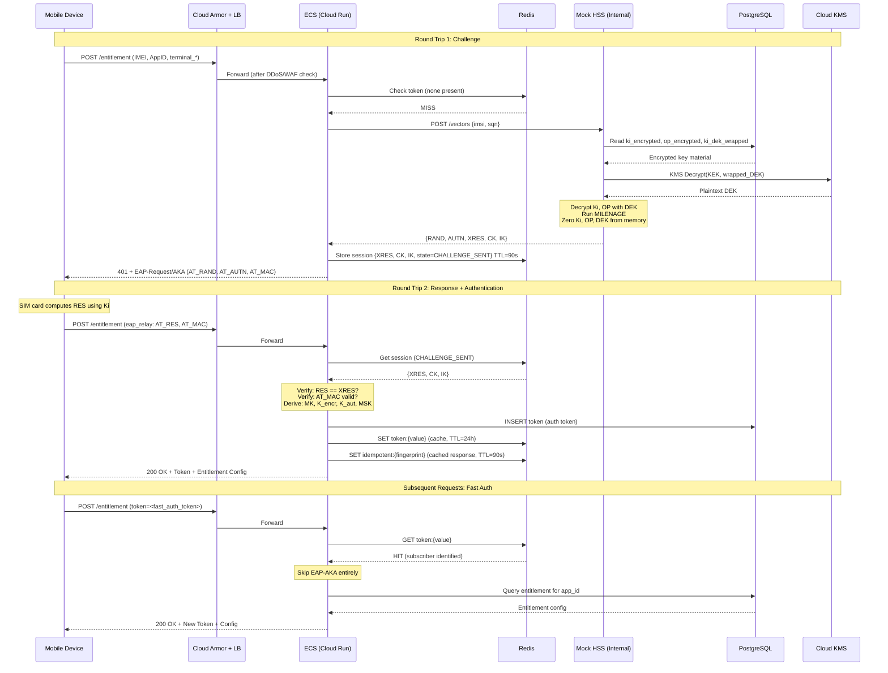
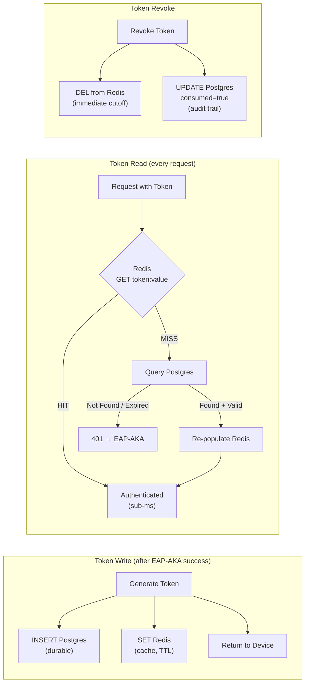
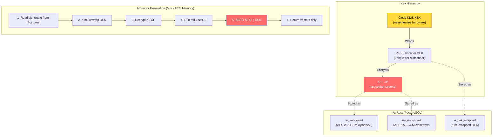
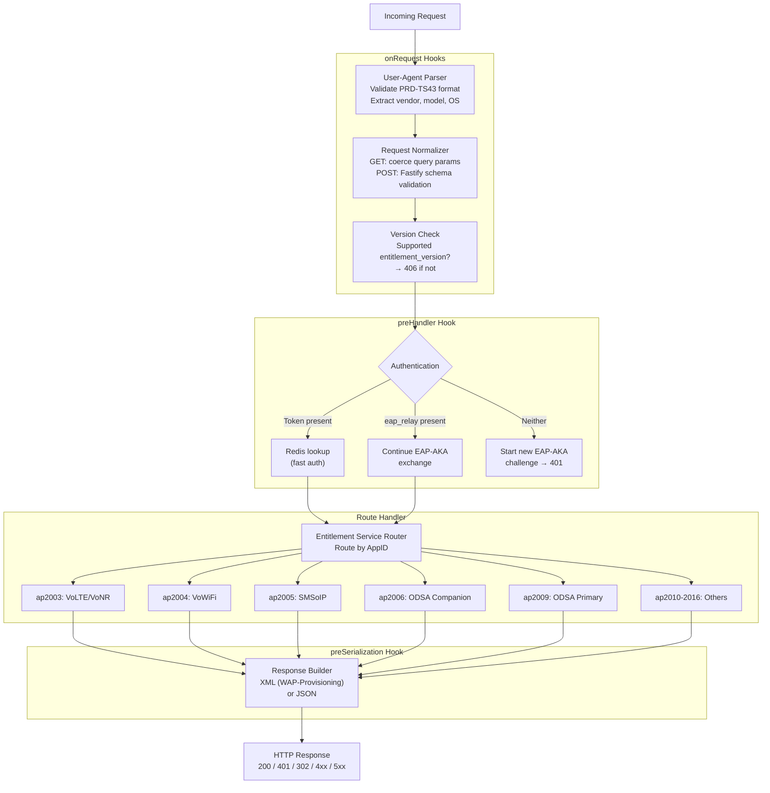

# Architecture Diagrams

## System Architecture (GCP Deployment)

## EAP-AKA Authentication Flow

## Token Management: Write-Through Cache

## Ki Security: Envelope Encryption

## Request Processing Pipeline (Fastify Hooks)

### Phase 1: Foundation

The skeleton that everything else builds on. Nothing works without this.

| # | Task | What It Delivers |
|---|------|------------------|
| 1 | Project scaffolding | `package.json`, `tsconfig.json`, Docker Compose (Postgres + Redis containers), project directory structure |
| 2 | Fastify app with hooks and plugin structure | `src/server/app.ts` — the core Fastify instance with lifecycle hooks wired up, plugin encapsulation for each future service handler |
| 3 | OpenTelemetry SDK initialization | `src/config/tracing.ts` + `src/config/metrics.ts` — tracing and metrics SDK bootstrapped **before** Fastify starts so auto-instrumentation patches `http`, `pg`, and `ioredis` from the first request |
| 4 | Pino logger with Cloud Logging | `src/config/logger.ts` — structured JSON logging with severity mapping (`info` → `INFO`, `error` → `ERROR`) and trace ID correlation so every log line links to its Cloud Trace span |
| 5 | Request parser (GET + POST normalization) | `src/server/middleware/requestParser.ts` — `onRequest` hook that coerces GET query params into the same `EntitlementRequest` shape that POST JSON bodies already have via Fastify schema validation |
| 6 | User-Agent parser | `src/server/middleware/userAgent.ts` — validates and extracts fields from the `PRD-TS43/<version> (<vendor>; <model>; <type>; <OS>)` header format defined by TS.43 |
| 7 | Version negotiation | `src/server/middleware/versionCheck.ts` — compares `entitlement_version` against `SUPPORTED_VERSIONS` config, returns 406 Not Acceptable if unsupported |
| 8 | PostgreSQL schema + Drizzle setup | `src/db/schema.ts` + `src/db/migrations/` — Drizzle ORM schema definitions for `subscribers`, `devices`, `entitlements`, `tokens`, `audit_log` tables; initial migration files |
| 9 | Health check / readiness endpoints | `/health` returns 200 only after the `onReady` hook completes (Postgres pool warmed with `SELECT 1`, Redis warmed with `PING`) — Cloud Run's startup probe gates traffic on this |

**Exit criteria:** `docker compose up` starts ECS + Postgres + Redis, the `/health` endpoint returns 200, and a `POST /entitlement` with invalid input returns a structured 400 from Fastify/Ajv schema validation.

---

### Phase 2: Mock HSS Service

A standalone internal service that holds subscriber secrets and runs the MILENAGE algorithm. This is the piece that makes authentication possible — without it, the ECS has no way to generate AKA challenges.

| # | Task | What It Delivers |
|---|------|------------------|
| 1 | MILENAGE implementation | `mock-hss/src/milenage.ts` — TypeScript implementation of f1, f1*, f2345, f5* per 3GPP TS 35.206. Only crypto primitive is AES-128-ECB via Node.js `crypto` (OpenSSL). All XOR, rotation, and OPc derivation is our code; all actual encryption is delegated. |
| 2 | Unit tests against 3GPP test vectors | Tests against every official test set from 3GPP TS 35.207 / TS 35.208. Known Ki, OP, RAND, SQN, AMF inputs with expected outputs for every function. **Must pass before proceeding** — if these pass, the implementation is provably correct. |
| 3 | Envelope encryption | `mock-hss/src/kms.ts` — `KeyManager` interface with two implementations: `CloudKmsKeyManager` (production, calls Cloud KMS to unwrap DEKs) and `LocalKeyManager` (dev, symmetric key from `LOCAL_KEK_HEX` env var). Per-subscriber DEKs limit blast radius. |
| 4 | Mock HSS Fastify server | `mock-hss/src/index.ts` — single `POST /vectors` endpoint. Receives `{imsi, sqn}`, reads encrypted Ki/OP from Postgres, unwraps DEK via KMS, decrypts Ki/OP, runs MILENAGE, zeros key material from memory, returns `{rand, autn, xres, ck, ik}`. |
| 5 | Docker container (internal network) | `mock-hss/Dockerfile` — separate container on Docker Compose's internal network. Not exposed to the host. The ECS reaches it via Docker service name (`http://mock-hss:3001`). |

**Exit criteria:** `POST /vectors` with a known test IMSI returns vectors that match 3GPP test vector outputs. Ki never appears in any response or log.

---

### Phase 3: EAP-AKA Authentication

The most complex phase. This wires together the EAP-AKA protocol over HTTP — the core authentication mechanism that proves a device has a valid SIM.

| # | Task | What It Delivers |
|---|------|------------------|
| 1 | EAP packet codec | `src/auth/eapAkaCodec.ts` — encode/decode EAP-AKA packets per RFC 4187. Handles AT_RAND, AT_AUTN, AT_RES, AT_AUTS, AT_MAC, AT_IV, AT_ENCR_DATA, AT_CHECKCODE attribute types. |
| 2 | EAP-AKA state machine | `src/auth/eapAka.ts` — state transitions: IDLE → CHALLENGE_SENT → SUCCESS/FAILURE/SYNC_FAILURE. Manages the two-round-trip challenge/response exchange embedded in HTTP request/response cycles. |
| 3 | AKA vector HTTP client | `src/auth/eapAkaVectors.ts` — thin HTTP client that calls `${HSS_URL}/vectors` with `{imsi, sqn}` and parses the vector response. This is the **only integration point** with the HSS — swapping mock for real is a config change. |
| 4 | Key derivation | MK = SHA1(Identity \| IK \| CK), then derive K_encr (16 bytes), K_aut (16 bytes), MSK (64 bytes), EMSK (64 bytes) per RFC 4187 Section 7. |
| 5 | AT_MAC computation and verification | HMAC-SHA1 with K_aut over the EAP packet to authenticate messages in both directions. |
| 6 | Session storage in Redis | `eap_session:{session_id}` → Hash containing subscriber_id, IMEI, state, RAND, XRES, CK, IK, MK, K_aut, K_encr. TTL: 90 seconds. |
| 7 | Response idempotency cache | `src/auth/eapIdempotency.ts` — on successful EAP-AKA completion, cache the complete HTTP response in Redis keyed by SHA-256(session_id + eap_relay). Retries within 90s replay the cached response verbatim. |
| 8 | Integration test: full handshake | End-to-end test: POST (initial) → 401 challenge → POST (EAP-Response with AT_RES) → 200 OK with token. Exercises ECS → mock HSS → Redis → response chain. |
| 9 | Integration test: retry idempotency | Simulate dropped response: send the same EAP-Response twice, verify the second request returns the cached response with the same token. |

**Exit criteria:** A simulated device can complete a full EAP-AKA handshake over HTTP and receive a valid auth token. Retried requests after dropped responses return the cached response.

---

### Phase 4: Token Management & Fast Auth

Once EAP-AKA issues a token, subsequent requests skip the expensive multi-round-trip authentication entirely.

| # | Task | What It Delivers |
|---|------|------------------|
| 1 | Auth token issuance | On successful EAP-AKA, generate a cryptographically random token, write-through to both Postgres (durable) and Redis (cache with TTL matching expiry). |
| 2 | Token validation middleware | `preHandler` hook: check Redis first (sub-ms), fall back to Postgres on cache miss, re-populate Redis on Postgres hit. Expired or missing → 401 → new EAP-AKA challenge. |
| 3 | Fast-auth token flow | When a valid token is presented, skip EAP-AKA entirely. Look up subscriber from token, query entitlements, return config directly. |
| 4 | Token expiry and rotation | Each successful response issues a new token and revokes the old one (DEL from Redis, mark `consumed=true` in Postgres). Rolling expiry: tokens refresh on every use. |
| 5 | Token persistence across restarts | Postgres is the source of truth. If Redis restarts, tokens are rehydrated from Postgres on first use — no mass re-authentication required. |

**Exit criteria:** A device that authenticated via EAP-AKA can make subsequent requests using only its fast-auth token with no EAP-AKA round-trips. Tokens survive Redis restarts via Postgres fallback.

---

### Phase 5: Core Entitlement Services

The first real business logic. These three services are the simplest and most common entitlement checks — they follow the same pattern and validate the full response pipeline.

| # | Task | What It Delivers |
|---|------|------------------|
| 1 | Response builder (dual format) | `src/protocol/responseBuilder.ts`, `xmlBuilder.ts`, `jsonBuilder.ts` — takes a typed `ServiceEntitlementResponse` object and serializes to XML (WAP-Provisioning) or JSON based on `accept_content_type`. Both consume the same structure. |
| 2 | VoWiFi handler (ap2004) | `src/services/vowifi.ts` — look up subscriber entitlement, return EntitlementStatus, AddrStatus, TC_Status, ProvStatus, P-CSCF addresses. Handle T&C flow (ServiceFlow_URL) and incompatible devices (MessageForIncompatible). |
| 3 | Voice-over-Cellular handler (ap2003) | `src/services/voiceOverCellular.ts` — same pattern as VoWiFi but includes VoLTE_Entitled, VoNR_Entitled, and home vs. roaming entitlement variants. |
| 4 | SMSoIP handler (ap2005) | `src/services/smsOverIp.ts` — minimal: EntitlementStatus + address configuration. Same pattern. |
| 5 | Seed data for test subscribers | `src/mock/subscribers.ts` — three test subscribers (Alice: all enabled, Bob: VoWiFi disabled/needs T&C, Charlie: all incompatible) with Ki encrypted through the envelope encryption path at insert time. |

**Exit criteria:** All three services return correct XML and JSON responses for authenticated subscribers. Alice gets ENABLED with addresses, Bob gets DISABLED with a T&C URL, Charlie gets INCOMPATIBLE with a user message.

---

### Phase 6: ODSA Flows

The most complex business logic. ODSA (On Device Service Activation) involves multi-step flows for eSIM companion and primary device management with branching paths driven by SubscriptionResult codes.

| # | Task | What It Delivers |
|---|------|------------------|
| 1 | ODSA operation router | Route by `operation` field: CheckEligibility, ManageSubscription, ManageService, AcquireConfiguration, AcquireTemporaryToken, AcquirePlan, GetPhoneNumber, VerifyPhoneNumber, GetSubscriberInfo. |
| 2 | Companion device (ap2006) | `src/services/odsaCompanion.ts` — activation, transfer, and deactivation flows. Handles SubscriptionResult codes: CONTINUE_TO_WS (web portal), DOWNLOAD_PROFILE (SM-DP+ activation code), DONE, DELAYED_DOWNLOAD, DELETE_PROFILE_IN_USE, REQUIRES_USER_INPUT. |
| 3 | Primary device (ap2009) | `src/services/odsaPrimary.ts` — same operations as companion but for the device's own subscription. Additional plan acquisition flow (AcquirePlan) with available subscription plan listing. |
| 4 | Temporary token issuance and validation | `src/auth/temporaryToken.ts` — scoped tokens with `scope` and `operation_targets` fields, delegated to third parties for specific operations. One-time use (`consumed` flag). |
| 5 | SubscriptionResult handling | State machine for multi-step flows: portal redirect (302), delayed download (poll/push), user input dialog (MSG), profile deletion prerequisites. |
| 6 | Mock SM-DP+ | `src/mock/smdpPlus.ts` — returns canned eSIM activation codes and profile metadata for DOWNLOAD_PROFILE results. |

**Exit criteria:** A companion device can complete a CheckEligibility → ManageSubscription → DOWNLOAD_PROFILE flow end-to-end. Temporary tokens work for delegated operations. All SubscriptionResult code paths are exercised.

---

### Phase 7: Extended Services

Lower-priority services that round out the TS.43 specification. Some get full implementations, others get correct-format stubs.

| # | Task | What It Delivers |
|---|------|------------------|
| 1 | Data Plan Information (ap2010) | `src/services/dataPlan.ts` — returns DataPlanInfo (AccessType, DataPlanType), DataUsageInfo (allowance, used bytes, billing cycle), DataBoostInfo (boost eligibility, QoS parameters). |
| 2 | Server-Initiated ODSA (ap2011) | `src/services/serverOdsa.ts` — enterprise/MDM flow using server-to-server OAuth 2.0 with JWT client assertion. Three-tier token model: OAuth Access Token → Auth Token (scoped to enterprise_id) → per-device operations. |
| 3 | Direct Carrier Billing (ap2012) | `src/services/directCarrierBilling.ts` — entitlement check for mobile payment. Implements the EntitlementStatus × TC_Status state matrix (INCOMPATIBLE, DISABLED + T&C websheet, ENABLED + can purchase). |
| 4 | Remaining services (ap2013–ap2016) | Stubs with correct response format: Private User Identity (ap2013), Device and User Info (ap2014), App Authentication (ap2015), SatMode (ap2016). Return valid XML/JSON structures with sensible default values. |

**Exit criteria:** All 13 AppIDs (ap2003–ap2016) return a valid response in both XML and JSON format. No unhandled AppID routes to a 501 Not Implemented.

---

### Phase 8: Observability

Instrument the system so it's monitorable and debuggable in production.

| # | Task | What It Delivers |
|---|------|------------------|
| 1 | Custom application metrics | Counters and histograms exported to Cloud Monitoring: `ecs/eap_aka/attempts` (by result), `ecs/eap_aka/latency` (by phase), `ecs/token/cache_hit_ratio`, `ecs/token/validations` (by source: redis_hit, postgres_fallback, expired, invalid), `ecs/entitlement/requests` (by app_id, operation, status_code), `ecs/hss/call_latency`, `ecs/db/pool_utilization`, `ecs/idempotency/cache_hits`. |
| 2 | Custom spans for business logic | Named spans for EAP-AKA phases (challenge generation, response verification, key derivation), entitlement service routing, and token management operations — visible in Cloud Trace alongside auto-instrumented HTTP/DB/Redis spans. |
| 3 | Cloud Monitoring dashboard | Single-pane overview: request rate by app_id, error rate by status_code, EAP-AKA latency (p50/p95/p99), EAP-AKA success/failure rate, token cache hit %, HSS call latency, DB pool utilization, Cloud Run instance count, idempotency cache hit rate. |
| 4 | Alerting policies | Cloud Monitoring alerts: high error rate (5xx > 1% over 5min → page), auth latency spike (p99 > 5s → warn), HSS degradation (p99 > 3s → warn), DB pool saturation (> 80% → warn), token cache miss spike (< 80% hit rate → warn), EAP-AKA failure spike (success < 95% → page), instance ceiling (> 80 of 100 max → warn). |
| 5 | Trace-log correlation verification | End-to-end check: click a trace in Cloud Trace, verify correlated Pino logs appear inline via the `logging.googleapis.com/trace` and `logging.googleapis.com/spanId` fields attached to every log line. |

**Exit criteria:** Dashboard shows live metrics for all SLIs. Alerting policies fire correctly when thresholds are breached (test with synthetic load). A single trace shows the full request path from HTTP → Redis → HSS → Postgres → response with correlated logs.

---

### Phase 9: Testing & Hardening

The final pass to ensure the system is correct, resilient, and production-ready.

| # | Task | What It Delivers |
|---|------|------------------|
| 1 | Unit tests for codec/crypto | Full coverage of `eapAkaCodec.ts` (encode/decode round-trips, malformed packet handling), key derivation (known-answer tests), `xmlBuilder.ts` and `jsonBuilder.ts` (output matches spec examples). |
| 2 | Integration tests for each entitlement flow | Per-AppID tests: authenticated request → correct response shape and values for each EntitlementStatus scenario (ENABLED, DISABLED, INCOMPATIBLE, PROVISIONING). |
| 3 | Load testing | Simulated device traffic against Docker Compose environment. Verify: connection pool doesn't exhaust under concurrency, Redis session TTLs behave correctly under load, idempotency cache handles concurrent retries. |
| 4 | Error handling audit | Every HTTP status code from the spec (200, 302, 400, 401, 403, 405, 406, 500, 501, 503, 511) is returned in the correct scenario. Verify `Retry-After` header on 503. Verify structured error bodies. |
| 5 | Logging and audit trail completeness | Every request creates an audit log entry. Sensitive fields (Ki, OP, DEK, full token values) never appear in any log at any level. Token values are redacted to last 8 characters. |

**Exit criteria:** All tests pass. Load test shows no connection exhaustion or session corruption. Every spec HTTP status code is covered. Audit log is complete and contains no sensitive material.
