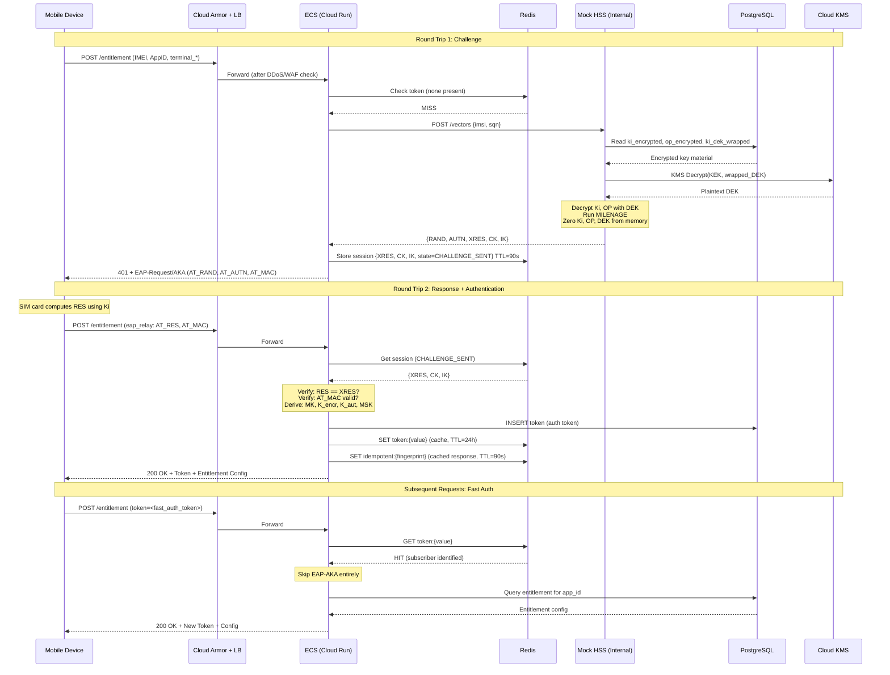
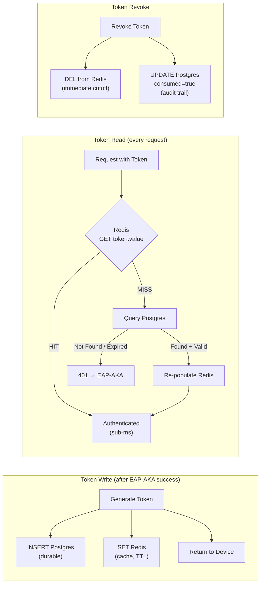
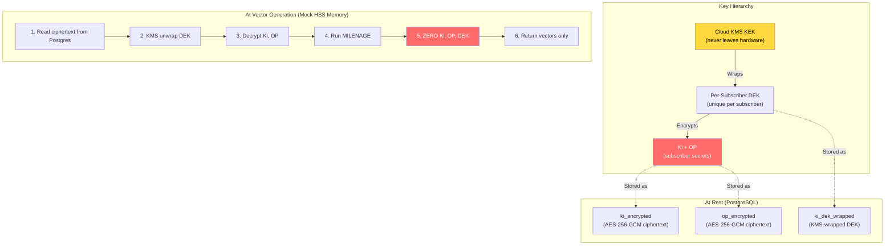
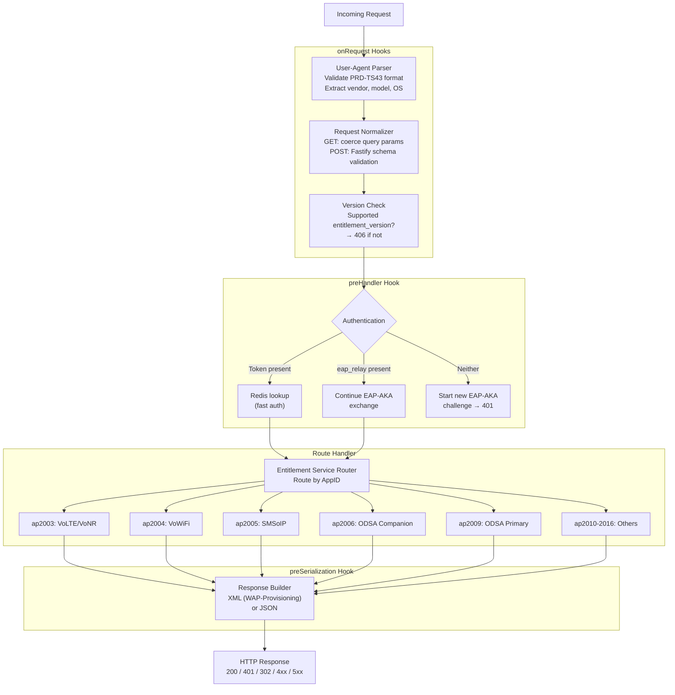

# Architecture Diagrams

## System Architecture (GCP Deployment)


## EAP-AKA Authentication Flow



## Token Management: Write-Through Cache



## Ki Security: Envelope Encryption



## Request Processing Pipeline (Fastify Hooks)



## Implementation Phases

```mermaid
gantt
    title Implementation Roadmap
    dateFormat X
    axisFormat %s

    section Foundation
    Phase 1: Scaffolding, Fastify, OpenTelemetry, Pino, Drizzle    :p1, 0, 1

    section Authentication
    Phase 2: Mock HSS + MILENAGE + 3GPP Test Vectors               :p2, after p1, 1
    Phase 3: EAP-AKA State Machine + Idempotency                   :p3, after p2, 1

    section Core Services
    Phase 4: Token Management + Fast Auth                           :p4, after p3, 1
    Phase 5: VoWiFi, VoLTE, SMSoIP Handlers                        :p5, after p4, 1

    section Advanced
    Phase 6: ODSA Flows (Companion + Primary)                       :p6, after p5, 1
    Phase 7: Extended Services (ap2010-2016)                        :p7, after p6, 1

    section Operations
    Phase 8: Observability (Metrics, Dashboards, Alerts)            :p8, after p7, 1
    Phase 9: Testing and Hardening                                  :p9, after p8, 1
```
