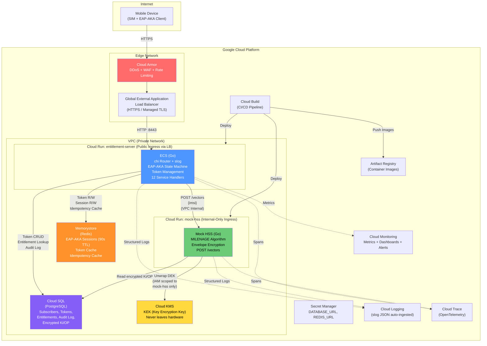
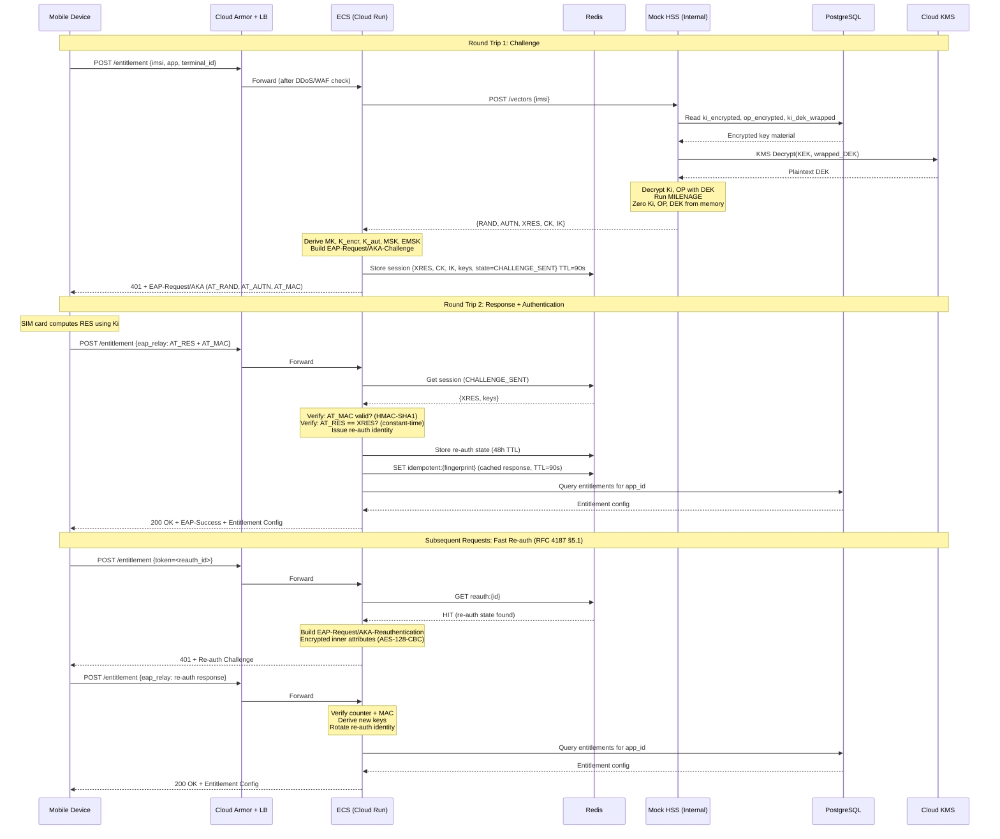
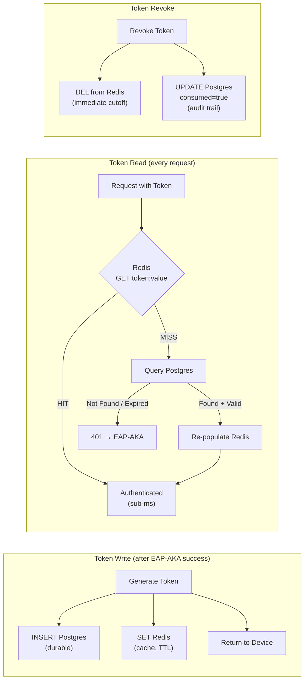
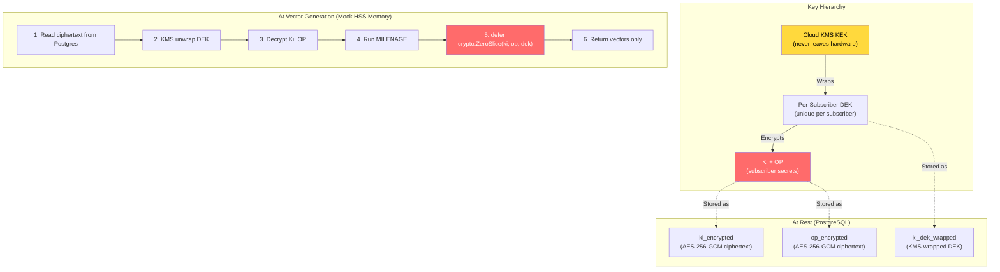
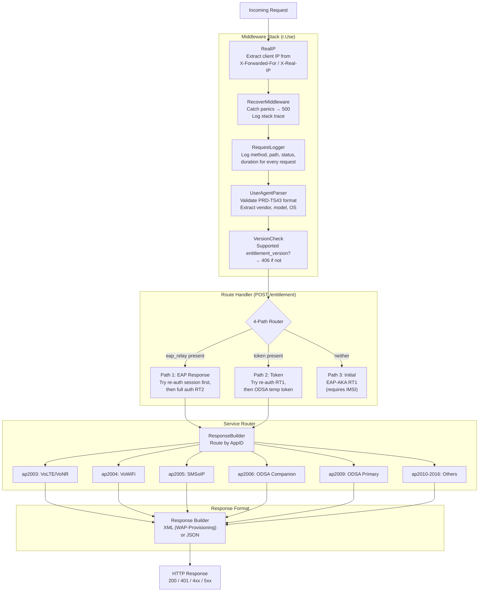
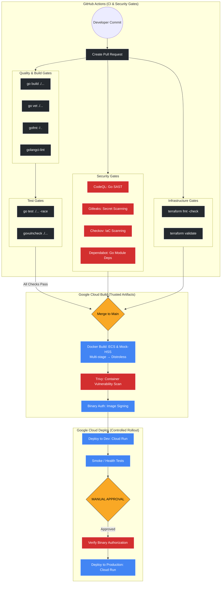

# Architecture Diagrams

## System Architecture (GCP Deployment)



## EAP-AKA Authentication Flow



## Token Management: Write-Through Cache



## Ki Security: Envelope Encryption



## Request Processing Pipeline (chi Middleware)



## Project Structure

```
cmd/
  ecs/main.go                    # ECS server entry point
  mock-hss/main.go               # Mock HSS entry point
internal/
  config/                        # Config struct + EAP-AKA constants
  crypto/                        # MILENAGE, AES-256-GCM envelope, KMS
  eapaka/                        # EAP-AKA protocol stack
    codec.go                     # EAP packet binary encode/decode
    keys.go                      # MK derivation, FIPS 186-2 PRF
    encryption.go                # AES-128-CBC for AT_ENCR_DATA
    orchestrator.go              # Full auth state machine (RT1/RT2)
    reauth.go                    # Fast re-auth (RFC 4187 §5.1)
    session.go                   # Redis EAP session CRUD (90s TTL)
    reauth_session.go            # Redis re-auth session (90s TTL)
    reauth_store.go              # Redis re-auth state (48h TTL)
    idempotency.go               # Response replay cache (90s TTL)
    vectors.go                   # HTTP client to mock-hss
  db/                            # pgx/v5 pool, queries, models, migrate, seed
  token/                         # Token generation/validation, Redis cache
  protocol/                      # TS.43 JSON + XML builders, status codes
  services/                      # 12 telecom service handlers
  server/                        # chi router, middleware, routes, audit
sql/schema.sql                   # DDL for 5 tables
Dockerfile.ecs                   # Multi-stage → distroless
Dockerfile.mock-hss
docker-compose.yml
Makefile
```

## CI/CD Pipeline Architecture


