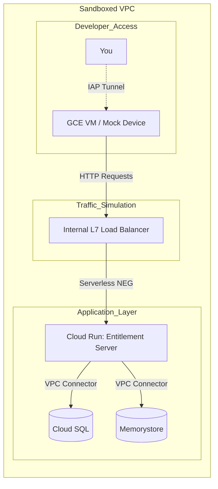

# Summary

Sandboxed Architecture Summary
   1. VPC: Create with a "Private Google Access" enabled subnet. Private Google Access allows Cloud Run services and VMs to reach Google APIs (like Artifact Registry to pull images, or Secret Manager to fetch DB credentials), databases, etc. without a public internet connection.
   2. Internal Load Balancer: Replaces Global External Application Load Balancer and receives traffic on a private internal IP.
   3. Cloud Run (ECS): Sits behind a Serverless NEG. Uses a VPC Connector to reach the DB.
   4. Database/Redis: Hosted on private IPs (Cloud SQL Auth Proxy or Direct IP).
   5. Test VM: Acts as the device, sending traffic to the ILB within the VPC.

# Details
To deploy in a strictly sandboxed, private GCP environment with no external connectivity, you need to replicate the "public internet" ingress pattern using strictly internal GCP networking components.

# Diff between dev and staging/prod environments
  Here is the architectural plan to simulate devices and replace the Global Load Balancer (GLB) + Cloud Armor setup.

1) **Replace the Global Load Balancer with internal application LB**

  Since we cannot use an External GLB, we need to move the ingress point inside the VPC.

  The Solution: Regional Internal Application Load Balancer (L7 ILB)
  This is the direct private equivalent of the External HTTP(S) Load Balancer.

   * How it works: It provides a private IP address within your VPC subnet. It understands HTTP/HTTPS, path routing, and headers just like the external version.
   * Connecting to Cloud Run: You will create a Serverless Network Endpoint Group (NEG). The Internal LB sends traffic to this NEG, which routes it privately to your Cloud Run service
     without the traffic ever touching the public internet.
   * Certificates: You can use self-signed certificates or internal managed certificates since this is a dev environment.

  2. **Simulating the "Devices" (Traffic Sources)**

  Since real devices cannot reach this environment over the internet, we need to generate traffic from inside the VPC.

  **Option A: The "Mock Device" VM (Compute Engine)**

  This is the most flexible approach for a Dev environment.
   * Setup: Deploy a small Linux VM (Compute Engine) in the same VPC.
   * Role: This VM acts as the "User Equipment" (UE).
   * Usage: You deploy your integration test scripts (npm run test:integration) or load testing tools (like k6 or Locust) onto this VM.
   * Workflow: The VM runs a script -> Sends HTTP requests to the Internal LB IP -> ECS Service.

  **Option B: Cloud Run Jobs (Serverless Simulation)**

  If we want to run automated batch simulations without managing a VM.
   * Setup: Containerize your test scripts.
   * Role: A scheduled or manually triggered job that runs strictly to generate traffic.
   * Connectivity: Configure the Job with "Direct VPC Egress" to allow it to talk to the Internal LB IP address.

  3. **Developer Access (How you connect)**

  Since there is no public IP, you cannot simply curl the endpoint from your laptop.

  The Solution: Identity-Aware Proxy (IAP) TCP Tunneling
   * Context: You don't need a VPN or a Bastion host with a public IP.
   * How it works: You enable IAP on the "Mock Device" VM (Option A above).
   * Usage: You run a command like gcloud compute ssh mock-device --tunnel-through-iap.
   * Result: You get a secure SSH shell into the VPC. From inside that shell, you can curl your Internal LB or run your tests manually. You can even set up port forwarding to access the
     Swagger UI/API from your local browser (e.g., gcloud compute ssh -- -L 8080:INTERNAL_LB_IP:80).

  4. **Supporting Services (The "Plumbing")**

  To make this work in a sandbox with no internet access, you need these specific configurations:

   * Private Google Access (PGA): We must enable this on the VPC Subnet. This allows Cloud Run services and VMs to reach Google APIs (like Artifact Registry to pull images, or Secret Manager to fetch DB credentials) without a public internet connection.
   * VPC Firewall Rules:
       * Allow Internal: Allow traffic from the Proxy-Only Subnet (required for Internal LB) to your Serverless NEG.
       * Allow IAP: Allow ingress from the IAP IP range (35.235.240.0/20) to your Mock Device VM on port 22 (SSH).

**Summary Architecture Diagram**

**Deployment Plan Updates**

  To implement this, we will need to modify your Terraform plan:
   1. Remove: google_compute_global_forwarding_rule, google_compute_target_http_proxy, google_compute_url_map (The External LB components).
   2. Remove: google_compute_security_policy (Cloud Armor).
   3. Add: google_compute_region_network_endpoint_group (Serverless NEG).
   4. Add: google_compute_region_backend_service + google_compute_region_url_map + google_compute_forwarding_rule (The Internal LB components).
   5. Add: A "Proxy-only subnet" (Required for Envoy-based Internal LBs).

---
# Execution of the plan
 > yes it aligns with my sandbox environment constraints. So create a new directory named terraform-devenv, adapt the existing terraform modules and align them with this plan and create a
   new set of terraform modules in the newly created directory. Do not alter or delete anything in the existing terraform directory.
✦ I'll start by clarifying the concepts and answering your planning questions, then I will proceed to create the development environment configuration as requested.

  1. Concepts & Planning

  Is VPC Connector the same as Private Google Access (PGA)?
  No. They serve opposite directions of connectivity, and in a sandbox environment, you typically need both:
   * VPC Connector (Serverless VPC Access): Allows your Cloud Run service to reach resources inside your VPC (like your private Cloud SQL and Redis). Without this, Cloud Run cannot "see"
     into the private network.
   * Private Google Access (PGA): Allows resources inside your VPC (like the simulation VM we'll create) to reach Google APIs (like Artifact Registry to pull images, or Secret Manager)
     without having a public IP address or internet access.

  How to replace Global Load Balancer (GLB)?
  In a private sandbox, you should use an Internal Application Load Balancer (L7 ILB).
   * Why: It sits entirely inside your VPC (specifically in a "proxy-only" subnet). It provides a private IP address that is only accessible from within the VPC. It supports standard
     HTTP/HTTPS features just like the external GLB.

  How to simulate devices?
  Since you have no external connectivity, you cannot use your laptop or public internet tools.
   * Solution: We will provision a "Jump Host" (Compute Engine VM) inside the specific terraform-devenv VPC.
   * Access: You will access this VM using IAP (Identity-Aware Proxy). This allows you to SSH into the VM safely from the Google Cloud Console or gcloud CLI without the VM needing a public
     IP address.
   * Simulation: Once SSH'd into the VM, you can run curl, h2load, or your integration tests against the Internal Load Balancer's private IP.

  ---

  2. Implementation: terraform-devenv

  I will now create the isolated development environment configuration. This involves copying the existing modules and adapting them for a "private-only" architecture.

  Changes I am making in `terraform-devenv`:
   1. Networking: Adding a proxy-only-subnet (required for Internal LB) and an IAP Firewall rule (to allow you to SSH into the simulation VM).
   2. Load Balancer: rewriting the module to use google_compute_region_backend_service (Internal) instead of the global external one.
   3. Cloud Run: Restricting ingress to internal-and-cloud-load-balancing.
   4. Cloud Armor: Removing this entirely (not supported/needed on Internal LBs).
   5. Simulation: Adding a standard Compute Engine VM ("device-simulator") with no public IP.

  I'll start by creating the directory and duplicating the existing configuration.

---
# IAM roles 

 To initialize this specific terraform-devenv environment, your user account (or the CI/CD service account running Terraform) requires the following permissions.

  In a sandbox environment where you might not have roles/owner, you will need to request these specific roles:

  1. Core Infrastructure & Networking
   * `roles/serviceusage.serviceUsageAdmin`: To enable necessary APIs (Cloud Run, SQL, Redis, IAP, etc.).
   * `roles/compute.networkAdmin`: To create the VPC, Subnets (including the "proxy-only" subnet), Firewalls, and the Internal Load Balancer components.
   * `roles/servicenetworking.networksAdmin`: Critical. Required to create the "Private Services Access" peering connection for Cloud SQL and Redis.
   * `roles/vpcaccess.admin`: To create the Serverless VPC Connector that allows Cloud Run to talk to the private network.

  2. Compute & Deployment
   * `roles/run.admin`: To deploy the Cloud Run services (ECS and Mock HSS).
   * `roles/compute.instanceAdmin.v1`: To create the "device-simulator" VM.
   * `roles/iam.serviceAccountUser`: Critical. This allows Terraform to attach Service Accounts to the Cloud Run services and the VM. Without this, deployment will fail with a permission
     error when trying to assign identity.

  3. Identity & Security
   * `roles/iam.serviceAccountAdmin`: To create the new Service Accounts (ecs-runner, simulator-sa, etc.).
   * `roles/resourcemanager.projectIamAdmin`: To grant permissions to those new service accounts (e.g., giving the ECS service account permission to read Secrets).
   * `roles/secretmanager.admin`: To create secrets and manage versions.
   * `roles/cloudkms.admin`: To create the Key Ring and Crypto Keys.

  4. Data Services
   * `roles/cloudsql.admin`: To create the Postgres instance, database, and users.
   * `roles/redis.admin`: To create the Memorystore Redis instance.
   * `roles/artifactregistry.admin`: To create the Docker repository.

  5. Terraform State Access
   * `roles/storage.objectAdmin`: Read/Write access to the GCS bucket defined in your backend "gcs" block (REPLACE_WITH_YOUR_TERRAFORM_STATE_BUCKET).

  ---

  "One-Liner" for Administrators
  If you need to request these from a platform administrator, you can provide this list of predefined roles:

    1 roles/serviceusage.serviceUsageAdmin
    2 roles/compute.networkAdmin
    3 roles/servicenetworking.networksAdmin
    4 roles/vpcaccess.admin
    5 roles/run.admin
    6 roles/compute.instanceAdmin.v1
    7 roles/iam.serviceAccountUser
    8 roles/iam.serviceAccountAdmin
    9 roles/resourcemanager.projectIamAdmin
   10 roles/secretmanager.admin
   11 roles/cloudkms.admin
   12 roles/cloudsql.admin
   13 roles/redis.admin
   14 roles/artifactregistry.admin
   15 roles/storage.objectAdmin

   ---
   # Diff between dev and staging/prod environments

  ┌───────────────────┬─────────────────────────────────────────────┬────────────────────────────────────────────────────────────────────────────────┐
  │      Aspect       │           terraform/ (production)           │                           terraform-devenv/ (devenv)                           │
  ├───────────────────┼─────────────────────────────────────────────┼────────────────────────────────────────────────────────────────────────────────┤
  │ Load Balancer     │ External ALB (global, HTTPS, Cloud Armor)   │ Internal regional ILB (HTTP only, no Cloud Armor)                              │
  ├───────────────────┼─────────────────────────────────────────────┼────────────────────────────────────────────────────────────────────────────────┤
  │ Cloud Armor       │ Full WAF + DDoS protection                  │ Removed entirely (not supported on ILB)                                        │
  ├───────────────────┼─────────────────────────────────────────────┼────────────────────────────────────────────────────────────────────────────────┤
  │ TLS               │ Google-managed certs + self-signed fallback │ None (internal HTTP)                                                           │
  ├───────────────────┼─────────────────────────────────────────────┼────────────────────────────────────────────────────────────────────────────────┤
  │ Cloud Run ingress │ External traffic allowed                    │ INGRESS_TRAFFIC_INTERNAL_LOAD_BALANCER only                                    │
  ├───────────────────┼─────────────────────────────────────────────┼────────────────────────────────────────────────────────────────────────────────┤
  │ Networking        │ Standard VPC + private services             │ Adds proxy-only subnet (required for regional managed ILB) + IAP firewall rule │
  ├───────────────────┼─────────────────────────────────────────────┼────────────────────────────────────────────────────────────────────────────────┤
  │ Secrets           │ Default replication                         │ User-managed replication across two Canadian regions (Montreal + Toronto)      │
  ├───────────────────┼─────────────────────────────────────────────┼────────────────────────────────────────────────────────────────────────────────┤
  │ Testing           │ N/A                                         │ Device simulator VM (e2-micro, Debian, IAP SSH access, no public IP)           │
  ├───────────────────┼─────────────────────────────────────────────┼────────────────────────────────────────────────────────────────────────────────┤
  │ State prefix      │ terraform/state                             │ terraform/devenv-state                                                         │
  └───────────────────┴─────────────────────────────────────────────┴────────────────────────────────────────────────────────────────────────────────┘