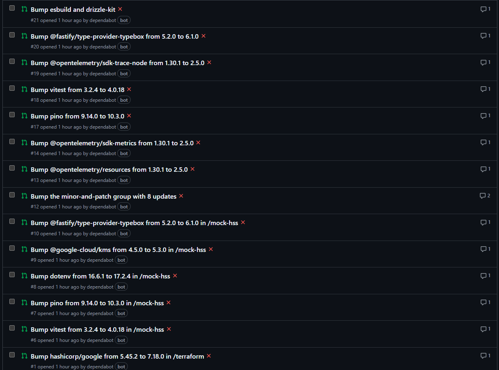

# Bulk Dependency Upgrade Plan

## Context

Dependabot opened 22 PRs after the CI/CD pipeline was set up. We merged 6 safe ones (actions/checkout, actions/setup-node, dotenv, @types/node, drizzle-orm mock-hss). The remaining 14 PRs are all major version bumps that need code changes. Since nothing is deployed yet, we can update everything at once on main, then close all remaining Dependabot PRs.

---

## Step 1: OpenTelemetry v2 Upgrade (root project)

The OTel JS SDK unified on v2. Experimental packages jumped from 0.57.x → 0.211.x, stable from 1.x → 2.x. The `Resource` class was replaced with a `resourceFromAttributes()` function.

**`package.json`** — update versions:
```
@opentelemetry/exporter-metrics-otlp-http: ^0.57.1 → ^0.211.0
@opentelemetry/exporter-trace-otlp-http:   ^0.57.1 → ^0.211.0
@opentelemetry/instrumentation-http:       ^0.57.1 → ^0.211.0
@opentelemetry/instrumentation-ioredis:    ^0.47.1 → ^0.59.0
@opentelemetry/instrumentation-pg:         ^0.51.1 → ^0.63.0
@opentelemetry/resources:                  ^1.30.1 → ^2.5.0
@opentelemetry/sdk-metrics:                ^1.30.1 → ^2.5.0
@opentelemetry/sdk-node:                   ^0.57.1 → ^0.211.0
@opentelemetry/sdk-trace-node:             ^1.30.1 → ^2.5.0
@opentelemetry/semantic-conventions:       ^1.28.0 → ^1.39.0
```

**`src/config/tracing.ts`** — change Resource creation:
```typescript
// Line 6: import { Resource } → import { resourceFromAttributes }
// Line 11: new Resource({...}) → resourceFromAttributes({...})
```

**`src/config/metrics.ts`** — same Resource change:
```typescript
// Line 3: import { Resource } → import { resourceFromAttributes }
// Line 8: new Resource({...}) → resourceFromAttributes({...})
```

Everything else (NodeSDK constructor, MeterProvider, ATTR_SERVICE_NAME, instrumentations) is unchanged.

---

## Step 2: TypeBox v1 + @fastify/type-provider-typebox v6 (both projects)

TypeBox rebranded from `@sinclair/typebox` v0.34 to `typebox` v1. The type-provider-typebox v6 requires TypeBox v1. Core APIs (`Type.Object`, `Type.String`, `Type.Literal`, `Static<>`) are unchanged. No removed types are used in this project.

**`package.json`** (root):
```
Remove: "@sinclair/typebox": "^0.34.14"
Add:    "typebox": "^1.0.0"
Update: "@fastify/type-provider-typebox": "^5.1.0" → "^6.1.0"
```

**`mock-hss/package.json`**:
```
Remove: "@sinclair/typebox": "^0.34.14"
Add:    "typebox": "^1.0.0"
Update: "@fastify/type-provider-typebox": "^5.1.0" → "^6.1.0"
```

**3 import path changes:**
- `src/protocol/requestSchemas.ts:1` — `from '@sinclair/typebox'` → `from 'typebox'`
- `src/protocol/requestTypes.ts:1` — `from '@sinclair/typebox'` → `from 'typebox'`
- `mock-hss/src/index.ts:2` — `from '@sinclair/typebox'` → `from 'typebox'`

---

## Step 3: Pino v10 (both projects)

Only breaking change: drops Node 18 support. Both projects already require Node >=20. All APIs (`pino.stdTimeFunctions.isoTime`, `formatters.level()`, `mixin()`) are unchanged.

**`package.json`**: `"pino": "^9.6.0"` → `"^10.0.0"`
**`mock-hss/package.json`**: `"pino": "^9.6.0"` → `"^10.0.0"`

No code changes needed.

---

## Step 4: Vitest v4 (both projects)

Core test APIs (`describe`, `it`, `expect`, `beforeAll`, `afterAll`, `globalSetup`) work the same. Main breaking change: hooks returning non-undefined values are treated as teardown functions. Need to verify our hooks don't accidentally return values.

**`package.json`**: `"vitest": "^3.0.4"` → `"^4.0.0"`
**`mock-hss/package.json`**: `"vitest": "^3.0.4"` → `"^4.0.0"`

No code changes expected — our hooks and configs use standard patterns.

---

## Step 5: @google-cloud/kms v5 (mock-hss only)

Lazy-loaded in `mock-hss/src/kms.ts`. Only uses `KeyManagementServiceClient` constructor and `decrypt()`. Google Cloud client library v5 should be API-compatible for this basic usage.

**`mock-hss/package.json`**: `"@google-cloud/kms": "^4.5.0"` → `"^5.0.0"`

No code changes expected.

---

## Step 6: Terraform hashicorp/google v7

Update provider version constraint. 50 Google resources are used across 12 modules. Key risks:
- Cloud Run ingress enums — verify `INGRESS_TRAFFIC_INTERNAL_ONLY` and `INGRESS_TRAFFIC_INTERNAL_LOAD_BALANCER` are still valid
- Cloud SQL `require_ssl` may be deprecated in favor of `ssl_mode`
- Stricter schema validation at plan time

**`terraform/main.tf`** line 12: `version = "~> 5.0"` → `version = "~> 7.0"`

After updating, run `terraform init -backend=false && terraform validate` to catch any issues. Fix any deprecation warnings.

---

## Step 7: Other minor upgrades

Update remaining deps that Dependabot flagged:

**Root `package.json`**:
- `drizzle-orm`: `^0.38.4` → `^0.45.0` (already merged for mock-hss via PR #5)
- `drizzle-kit`: `^0.30.4` → `^0.31.0`

**`mock-hss/package.json`**:
- `dotenv`: already merged via PR #8 or similar — verify

---

## Step 8: Install, build, test

1. `npm install` — resolve dependency tree for root
2. `cd mock-hss && npm install` — resolve dependency tree for mock-hss
3. `npm run build` — TypeScript compilation (catches OTel Resource type error fix)
4. `cd mock-hss && npm run build` — mock-hss TypeScript compilation
5. `npm run lint && cd mock-hss && npm run lint` — ESLint passes
6. `npm run test:unit` — unit tests pass
7. `docker compose up -d && npm run test:integration` — integration tests pass
8. `cd terraform && terraform init -backend=false && terraform validate` — Terraform validates

---

## Step 9: Close superseded Dependabot PRs

After committing all updates to main, close remaining Dependabot PRs since they're now superseded:
PRs #1, #6, #7, #8, #9, #10, #12, #13, #14, #17, #18, #19, #20, #21

---

## Files Modified

**Root project (6 files):**
- `package.json` — all version bumps
- `src/config/tracing.ts` — `Resource` → `resourceFromAttributes`
- `src/config/metrics.ts` — `Resource` → `resourceFromAttributes`
- `src/protocol/requestSchemas.ts` — `@sinclair/typebox` → `typebox`
- `src/protocol/requestTypes.ts` — `@sinclair/typebox` → `typebox`
- `package-lock.json` — regenerated by npm install

**mock-hss (3 files):**
- `mock-hss/package.json` — all version bumps
- `mock-hss/src/index.ts` — `@sinclair/typebox` → `typebox`
- `mock-hss/package-lock.json` — regenerated by npm install

**Terraform (1 file):**
- `terraform/main.tf` — provider version constraint

---

## Verification

1. `npm run build` — both projects compile
2. `npm run lint` — both projects lint clean
3. `npm run test:unit` — unit tests pass without DB
4. `npm run test:integration` — integration tests pass with Docker services
5. `terraform init -backend=false && terraform validate` — Terraform validates with new provider
6. Push to main, verify all CI jobs pass


## Dependabot PRs


## post implementation

● All 14 PRs closed.

● All tasks complete. Here's a summary of everything that was done:

  Bulk Dependency Upgrade — Complete

  Packages Upgraded (14 major bumps)

  Root project:
  ┌────────────────────────────────┬────────────┬─────────────┐
  │            Package             │    From    │     To      │
  ├────────────────────────────────┼────────────┼─────────────┤
  │ @opentelemetry/* (10 pkgs)     │ v0.57/v1.x │ v0.211/v2.5 │
  ├────────────────────────────────┼────────────┼─────────────┤
  │ @sinclair/typebox → typebox    │ v0.34      │ v1.0        │
  ├────────────────────────────────┼────────────┼─────────────┤
  │ @fastify/type-provider-typebox │ v5.1       │ v6.1        │
  ├────────────────────────────────┼────────────┼─────────────┤
  │ pino                           │ v9.6       │ v10.0       │
  ├────────────────────────────────┼────────────┼─────────────┤
  │ vitest                         │ v3.0       │ v4.0        │
  ├────────────────────────────────┼────────────┼─────────────┤
  │ drizzle-orm                    │ v0.38      │ v0.45       │
  ├────────────────────────────────┼────────────┼─────────────┤
  │ drizzle-kit                    │ v0.30      │ v0.31       │
  └────────────────────────────────┴────────────┴─────────────┘
  mock-hss:
  ┌────────────────────────────────┬───────┬───────┐
  │            Package             │ From  │  To   │
  ├────────────────────────────────┼───────┼───────┤
  │ @sinclair/typebox → typebox    │ v0.34 │ v1.0  │
  ├────────────────────────────────┼───────┼───────┤
  │ @fastify/type-provider-typebox │ v5.1  │ v6.1  │
  ├────────────────────────────────┼───────┼───────┤
  │ @google-cloud/kms              │ v4.5  │ v5.0  │
  ├────────────────────────────────┼───────┼───────┤
  │ pino                           │ v9.6  │ v10.0 │
  ├────────────────────────────────┼───────┼───────┤
  │ vitest                         │ v3.0  │ v4.0  │
  ├────────────────────────────────┼───────┼───────┤
  │ drizzle-orm                    │ v0.38 │ v0.45 │
  └────────────────────────────────┴───────┴───────┘
  Terraform:
  ┌──────────────────┬────────┬──────────────────┐
  │     Provider     │  From  │        To        │
  ├──────────────────┼────────┼──────────────────┤
  │ hashicorp/google │ ~> 5.0 │ ~> 7.0 (v7.18.0) │
  └──────────────────┴────────┴──────────────────┘
  Code Changes

  - src/config/tracing.ts — Resource → resourceFromAttributes (OTel v2 API)
  - src/config/metrics.ts — Resource → resourceFromAttributes (OTel v2 API)
  - src/protocol/requestSchemas.ts — @sinclair/typebox → typebox
  - src/protocol/requestTypes.ts — @sinclair/typebox → typebox
  - mock-hss/src/index.ts — @sinclair/typebox → typebox
  - terraform/modules/database/main.tf — require_ssl = true → ssl_mode = "ENCRYPTED_ONLY" (deprecated in provider v7)

  Verification

  - Both projects build cleanly
  - Lint passes (only pre-existing warnings)
  - 182 unit tests pass
  - 36 mock-hss tests pass
  - 28 integration tests pass
  - Terraform validates successfully

  Dependabot PRs

  - All 14 open Dependabot PRs closed as superseded
